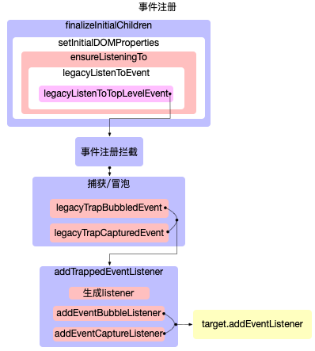
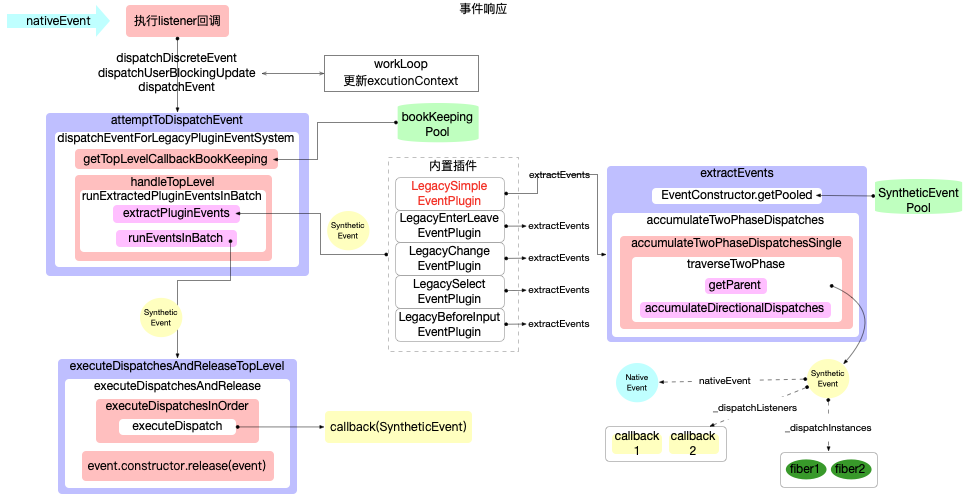
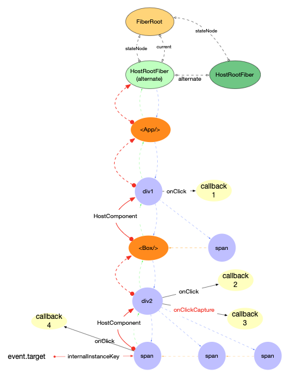
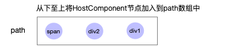
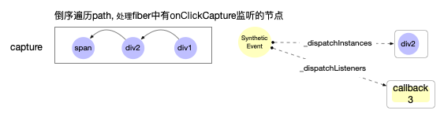
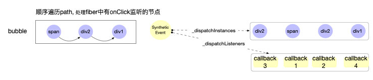

# 合成事件

> `SyntheticEvent`是原生事件的跨浏览器包装器, 拥有和浏览器原生事件相同的接口(`stopPropagation`,`preventDefault`), 抹平不同浏览器 api 的差异, 兼容性好.

## 事件优先级

`DOMEventProperties.js`中, 定义了各种事件的优先级

```js
export type EventPriority = 0 | 1 | 2;

export const DiscreteEvent: EventPriority = 0;
export const UserBlockingEvent: EventPriority = 1;
export const ContinuousEvent: EventPriority = 2;
```

| 优先级              | 事件类型                                                                                                                                                                                                                                                                               |
| ------------------- | -------------------------------------------------------------------------------------------------------------------------------------------------------------------------------------------------------------------------------------------------------------------------------------- |
| `DiscreteEvent`     | blur,cancel,click,close,contextMenu,copy,cut,auxClick,doubleClick,dragEnd,dragStart,drop,focus,input,invalid,keyDown,keyPress,keyUp,mouseDown,mouseUp,paste,pause,play,pointerCancel,pointerDown,pointerUp,rateChange,reset,seeked,submit,touchCancel,touchEnd,touchStart,volumeChange |
| `UserBlockingEvent` | drag,dragEnter,dragExit,dragLeave,dragOver,mouseMove,mouseOut,mouseOver,pointerMove,pointerOut,pointerOver,scroll,toggle,touchMove,wheel                                                                                                                                               |
| `ContinuousEvent`   | abort,animationEnd,animationIteration,animationStart,canPlay,canPlayThrough,durationChange,emptied,encryptedended,error,gotPointerCapture,load,loadedData,loadedMetadata,loadStart,lostPointerCapture,playing,progress,seeking,stalled,suspend,timeUpdate,transitionEnd,waiting        |

## 事件注册

在[首次 render](../03-render-process)中, 已经介绍, dom 事件的绑定是在`completeWork`阶段.

`completeWork`

```js
// ...省略部分无关代码
function completeWork(
  current: Fiber | null,
  workInProgress: Fiber,
  renderExpirationTime: ExpirationTime,
): Fiber | null {
  const newProps = workInProgress.pendingProps;
  switch (workInProgress.tag) {
    case HostComponent: {
      const rootContainerInstance = getRootHostContainer();
      const type = workInProgress.type;
      const currentHostContext = getHostContext();
      const instance = createInstance(
        type,
        newProps,
        rootContainerInstance,
        currentHostContext,
        workInProgress,
      );
      appendAllChildren(instance, workInProgress, false, false);
      workInProgress.stateNode = instance;
      if (
        // 完成dom实例的属性设置
        finalizeInitialChildren(
          instance,
          type,
          newProps,
          rootContainerInstance,
          currentHostContext,
        )
      ) {
        markUpdate(workInProgress);
      }
      return null;
    }
  }
}
```

在`finalizeInitialChildren`函数中, 最终完成`dom`对象的属性设置(包括事件注册).

```js
// ...省略部分无关代码
export function finalizeInitialChildren(
  domElement: Instance,
  type: string,
  props: Props,
  rootContainerInstance: Container,
  hostContext: HostContext,
): boolean {
  setInitialProperties(domElement, type, props, rootContainerInstance);
  return shouldAutoFocusHostComponent(type, props);
}

// 设置初始化属性
export function setInitialProperties(
  domElement: Element,
  tag: string,
  rawProps: Object,
  rootContainerElement: Element | Document,
): void {
  const isCustomComponentTag = isCustomComponent(tag, rawProps);
  let props: Object;
  switch (tag) {
    default:
      props = rawProps;
  }
  setInitialDOMProperties(
    tag,
    domElement,
    rootContainerElement,
    props,
    isCustomComponentTag,
  );
}

// 设置初始化dom属性
function setInitialDOMProperties(
  tag: string,
  domElement: Element,
  rootContainerElement: Element | Document,
  nextProps: Object,
  isCustomComponentTag: boolean,
): void {
  for (const propKey in nextProps) {
    // 注册事件监听
    if (registrationNameModules.hasOwnProperty(propKey)) {
      if (nextProp != null) {
        ensureListeningTo(rootContainerElement, propKey);
      }
    }
  }
}
```

跟踪`finalizeInitialChildren`调用栈, 核心逻辑可以用流程图表示:



其中`ensureListeningTo`完成事件的注册

`ensureListeningTo`

```js
function ensureListeningTo(
  rootContainerInstance: Element | Node,
  registrationName: string,
): void {
  // Legacy plugin event system path
  const isDocumentOrFragment =
    rootContainerInstance.nodeType === DOCUMENT_NODE ||
    rootContainerInstance.nodeType === DOCUMENT_FRAGMENT_NODE;
  const doc = isDocumentOrFragment
    ? rootContainerInstance
    : rootContainerInstance.ownerDocument; // 最后返回rootContainerInstance.ownerDocument
  // 第二个参数`doc`比较重要, 通过上两步的运算,doc = document
  // 最后会将事件监听注册到document对象之上
  legacyListenToEvent(registrationName, ((doc: any): Document));
}
```

注意点:

1. 把`document`对象传入后续的处理逻辑当中

- 最后会将事件监听注册到`document`对象之上

`legacyListenToEvent`

```js
export function legacyListenToEvent(
  registrationName: string,
  mountAt: Document | Element,
): void {
  const listenerMap = getListenerMapForElement(mountAt); // 会返回mountAt对象为key的map对象

  // 如registrationName=onClick或onClickCapture, 最后dependencies=[click]
  const dependencies = registrationNameDependencies[registrationName];

  for (let i = 0; i < dependencies.length; i++) {
    const dependency = dependencies[i];
    legacyListenToTopLevelEvent(dependency, mountAt, listenerMap);
  }
}

export function legacyListenToTopLevelEvent(
  topLevelType: DOMTopLevelEventType,
  mountAt: Document | Element,
  listenerMap: ElementListenerMap,
): void {
  // 如果listenerMap中已有这个事件名, 跳过注册
  // 保证了在一个dom对象上对于相同的事件不会重复注册, 提升了性能
  if (!listenerMap.has(topLevelType)) {
    switch (topLevelType) {
      // 共有3种情况
      case '1xx':
        // TOP_INVALID,TOP_SUBMIT,TOP_RESET 会在特定的dom对象上注册监听,不用在document上面重复监听,这里会跳过注册
        break;
      case '2xx':
        // TOP_SCROLL,TOP_FOCUS,TOP_BLUR 会在捕获阶段监听
        legacyTrapCapturedEvent(TOP_SCROLL, mountAt, listenerMap);
        break;
      case '3xx':
        // 其他情况, 除了媒事件之外, 都会在冒泡阶段监听
        legacyTrapBubbledEvent(topLevelType, mountAt, listenerMap);
    }
  }
}
```

注意点:

1. `legacyListenToTopLevelEvent`函数内置决定了不同事件的注册阶段不相同

- `scroll`,`focus`,`blur`会在捕获阶段监听
- 其他除了媒事件之外, 都会在冒泡阶段监听

2. `react`应用外界无法决定原生事件的注册阶段

- 如`onClick`,`onClickCapture`等只能是在原生事件冒泡阶段监听

```js
export function legacyTrapCapturedEvent(
  topLevelType: DOMTopLevelEventType,
  element: Document | Element,
  listenerMap: ElementListenerMap,
): void {
  //1. 注册事件
  const listener = addTrappedEventListener(
    element,
    topLevelType,
    PLUGIN_EVENT_SYSTEM,
    true,
  );
  // 2. 更新`listenerMap`
  listenerMap.set(topLevelType, { passive: undefined, listener });
}
```

核心步骤:

1. 注册事件
2. 更新`listenerMap`

- 保证同一个 dom 节点(这里是 document 对象), 同种事件(如: click), 如果多次调用, 只会注册一次监听.

`addTrappedEventListener`

```js
export function addTrappedEventListener(
  targetContainer: EventTarget,
  topLevelType: DOMTopLevelEventType,
  eventSystemFlags: EventSystemFlags,
  capture: boolean,
  isDeferredListenerForLegacyFBSupport?: boolean,
  passive?: boolean,
  priority?: EventPriority,
): any => void {
  // 1. 确定listener函数
  // 1.1 获取事件的优先级(如topLevelType=click, 则返回DiscreteEvent)
  const eventPriority =
    priority === undefined
      ? getEventPriorityForPluginSystem(topLevelType)
      : priority;
  let listener;
  let listenerWrapper;
  // 1.2 根据优先级设置listenerWrapper
  switch (eventPriority) {
    case DiscreteEvent:
      listenerWrapper = dispatchDiscreteEvent;
      break;
    case UserBlockingEvent:
      listenerWrapper = dispatchUserBlockingUpdate;
      break;
    case ContinuousEvent:
    default:
      listenerWrapper = dispatchEvent;
      break;
  }
  // 1.3 设置listener
  listener = listenerWrapper.bind(
    null,
    topLevelType,
    eventSystemFlags,
    targetContainer,
  );
  const rawEventName = getRawEventName(topLevelType); // 返回事件名称 如: click等
  let unsubscribeListener;
  // 2. 注册事件
  unsubscribeListener = addEventBubbleListener(
    targetContainer,
    rawEventName,
    listener,
  );
  return unsubscribeListener;
}

export function addEventBubbleListener(
  target: EventTarget,
  eventType: string,
  listener: Function,
): Function {
  target.addEventListener(eventType, listener, false);
  return listener;
}
```

核心步骤:

1. 生成`listener`函数
2. 把`listener`函数注册到`target`对象(这里的`target`也就是`document`对象)之上

到这里整个事件监听的注册阶段就完成了.

## 事件触发

### listener 函数

在`addTrappedEventListener`中, 根据事件优先级不同, 最后注册的`listener`函数, 有三种情况

1. `dispatchDiscreteEvent`
2. `dispatchUserBlockingUpdate`
3. `dispatchEvent`

`DiscreteEvent`:

```js
function dispatchDiscreteEvent(
  topLevelType,
  eventSystemFlags,
  container,
  nativeEvent,
) {
  if (
    !enableLegacyFBSupport ||
    // If we have Legacy FB support, it means we've already
    // flushed for this event and we don't need to do it again.
    (eventSystemFlags & LEGACY_FB_SUPPORT) === 0
  ) {
    flushDiscreteUpdatesIfNeeded(nativeEvent.timeStamp);
  }
  discreteUpdates(
    dispatchEvent,
    topLevelType,
    eventSystemFlags,
    container,
    nativeEvent,
  );
}

export function discreteUpdates<A, B, C, D, R>(
  fn: (A, B, C) => R,
  a: A,
  b: B,
  c: C,
  d: D,
): R {
  // 设置workloop的执行环境
  const prevExecutionContext = executionContext;
  executionContext |= DiscreteEventContext;
  try {
    // Should this
    return runWithPriority(UserBlockingPriority, fn.bind(null, a, b, c, d));
  } finally {
    executionContext = prevExecutionContext;
    if (executionContext === NoContext) {
      // Flush the immediate callbacks that were scheduled during this batch
      flushSyncCallbackQueue();
    }
  }
}
```

`UserBlockingEvent`:

```js
function dispatchUserBlockingUpdate(
  topLevelType,
  eventSystemFlags,
  container,
  nativeEvent,
) {
  runWithPriority(
    UserBlockingPriority,
    dispatchEvent.bind(
      null,
      topLevelType,
      eventSystemFlags,
      container,
      nativeEvent,
    ),
  );
}
```

`ContinuousEvent`:

```js
export function dispatchEvent(
  topLevelType: DOMTopLevelEventType,
  eventSystemFlags: EventSystemFlags,
  targetContainer: EventTarget,
  nativeEvent: AnyNativeEvent,
): void {

  const blockedOn = attemptToDispatchEvent(
    topLevelType,
    eventSystemFlags,
    targetContainer,
    nativeEvent,
  );
```

`dispatchDiscreteEvent`和`UserBlockingEvent`在执行`dispatchEvent`会用`runWithPriority(UserBlockingPriority, fn.bind(null, a, b, c, d))`进行包装.
改变调度器`Scheduler`中当前上下文的优先级`currentPriorityLevel=UserBlockingPriority`(在调度原理中会详细说明, 不影响本处对合成事件的分析).

### 派发事件

所有可能的`listener`函数, 最终都会调用`dispatchEvent`, 然后执行`attemptToDispatchEvent`.

跟踪`listener`函数, 从原生事件响到 callback 执行完毕, 可以得到流程图如下(后面逐步解释):



`attemptToDispatchEvent`

```js
// Attempt dispatching an event. Returns a SuspenseInstance or Container if it's blocked.
export function attemptToDispatchEvent(
  topLevelType: DOMTopLevelEventType,
  eventSystemFlags: EventSystemFlags,
  targetContainer: EventTarget,
  nativeEvent: AnyNativeEvent,
): null | Container | SuspenseInstance {
  // 获取nativeEvent对应的dom对象
  const nativeEventTarget = getEventTarget(nativeEvent);
  // 获取dom对象最近的HostComponent或者HostText类型的Fiber实例
  let targetInst = getClosestInstanceFromNode(nativeEventTarget);
  // 对目标Fiber实例进行判断, 是否阻断本次dispatchEvent
  if (targetInst !== null) {
    //...
  }
  // 派发事件
  dispatchEventForLegacyPluginEventSystem(
    topLevelType,
    eventSystemFlags,
    nativeEvent,
    targetInst,
  );
  // We're not blocked on anything.
  return null;
}
```

```js
export function dispatchEventForLegacyPluginEventSystem(
  topLevelType: DOMTopLevelEventType,
  eventSystemFlags: EventSystemFlags,
  nativeEvent: AnyNativeEvent,
  targetInst: null | Fiber,
): void {
  // 获取一个记账簿(bookKeeping)对象, 维护一个bookKeeping缓存池
  const bookKeeping = getTopLevelCallbackBookKeeping(
    topLevelType,
    nativeEvent,
    targetInst,
    eventSystemFlags,
  );

  try {
    // 1. 设置workloop的执行环境
    // 2. 执行 handleTopLevel(bookKeeping)
    batchedEventUpdates(handleTopLevel, bookKeeping);
  } finally {
    // 重置bookKeeping对象
    releaseTopLevelCallbackBookKeeping(bookKeeping);
  }
}

// Used to store ancestor hierarchy in top level callback
function getTopLevelCallbackBookKeeping(
  topLevelType: DOMTopLevelEventType,
  nativeEvent: AnyNativeEvent,
  targetInst: Fiber | null,
  eventSystemFlags: EventSystemFlags,
): BookKeepingInstance {
  if (callbackBookkeepingPool.length) {
    const instance = callbackBookkeepingPool.pop();
    instance.topLevelType = topLevelType;
    instance.eventSystemFlags = eventSystemFlags;
    instance.nativeEvent = nativeEvent;
    instance.targetInst = targetInst;
    return instance;
  }
  return {
    topLevelType,
    eventSystemFlags,
    nativeEvent,
    targetInst,
    ancestors: [],
  };
}

export function batchedEventUpdates<A, R>(fn: A => R, a: A): R {
  // 设置workloop的执环境
  const prevExecutionContext = executionContext;
  executionContext |= EventContext;
  try {
    return fn(a);
  } finally {
    executionContext = prevExecutionContext;
    if (executionContext === NoContext) {
      // Flush the immediate callbacks that were scheduled during this batch
      flushSyncCallbackQueue();
    }
  }
}
```

`handleTopLevel`

```js
function handleTopLevel(bookKeeping: BookKeepingInstance) {
  let targetInst = bookKeeping.targetInst;

  // Loop through the hierarchy, in case there's any nested components.
  // It's important that we build the array of ancestors before calling any
  // event handlers, because event handlers can modify the DOM, leading to
  // inconsistencies with ReactMount's node cache. See #1105.
  // 查找ancestor
  let ancestor = targetInst;
  do {
    if (!ancestor) {
      const ancestors = bookKeeping.ancestors;
      ((ancestors: any): Array<Fiber | null>).push(ancestor);
      break;
    }
    const root = findRootContainerNode(ancestor);
    if (!root) {
      break;
    }
    const tag = ancestor.tag;
    if (tag === HostComponent || tag === HostText) {
      bookKeeping.ancestors.push(ancestor);
    }
    ancestor = getClosestInstanceFromNode(root);
  } while (ancestor);

  for (let i = 0; i < bookKeeping.ancestors.length; i++) {
    targetInst = bookKeeping.ancestors[i];
    const eventTarget = getEventTarget(bookKeeping.nativeEvent);
    const topLevelType = ((bookKeeping.topLevelType: any): DOMTopLevelEventType);
    const nativeEvent = ((bookKeeping.nativeEvent: any): AnyNativeEvent);
    let eventSystemFlags = bookKeeping.eventSystemFlags;

    // If this is the first ancestor, we mark it on the system flags
    if (i === 0) {
      eventSystemFlags |= IS_FIRST_ANCESTOR;
    }
    // 调用插件, 进行事件合成
    runExtractedPluginEventsInBatch(
      topLevelType,
      targetInst,
      nativeEvent,
      eventTarget,
      eventSystemFlags,
    );
  }
}
```

```js
function runExtractedPluginEventsInBatch(
  topLevelType: TopLevelType,
  targetInst: null | Fiber,
  nativeEvent: AnyNativeEvent,
  nativeEventTarget: null | EventTarget,
  eventSystemFlags: EventSystemFlags,
) {
  // 1. 构造合成事件
  const events = extractPluginEvents(
    topLevelType,
    targetInst,
    nativeEvent,
    nativeEventTarget,
    eventSystemFlags,
  );
  // 2. 执行事件监听函数
  runEventsInBatch(events);
}
```

#### 创建 SyntheticEvent 对象

```js
/**
 * Allows registered plugins an opportunity to extract events from top-level
 * native browser events.
 *
 * @return {*} An accumulation of synthetic events.
 * @internal
 */
function extractPluginEvents(
  topLevelType: TopLevelType,
  targetInst: null | Fiber,
  nativeEvent: AnyNativeEvent,
  nativeEventTarget: null | EventTarget,
  eventSystemFlags: EventSystemFlags,
): Array<ReactSyntheticEvent> | ReactSyntheticEvent | null {
  let events = null;
  for (let i = 0; i < plugins.length; i++) {
    // Not every plugin in the ordering may be loaded at runtime.
    const possiblePlugin: PluginModule<AnyNativeEvent> = plugins[i];
    if (possiblePlugin) {
      // 从插件中提取事件
      const extractedEvents = possiblePlugin.extractEvents(
        topLevelType,
        targetInst,
        nativeEvent,
        nativeEventTarget,
        eventSystemFlags,
      );
      if (extractedEvents) {
        // 组合累积events
        events = accumulateInto(events, extractedEvents);
      }
    }
  }
  return events;
}
```

内置插件之一: `LegacySimpleEventPlugin.js`

```js

const SimpleEventPlugin: PluginModule<MouseEvent> = {
  // simpleEventPluginEventTypes gets populated from
  // the DOMEventProperties module.
  eventTypes: simpleEventPluginEventTypes,
  extractEvents: function(
    topLevelType: TopLevelType,
    targetInst: null | Fiber,
    nativeEvent: MouseEvent,
    nativeEventTarget: null | EventTarget,
  ): null | ReactSyntheticEvent {
    const dispatchConfig = topLevelEventsToDispatchConfig.get(topLevelType);
    if (!dispatchConfig) {
      return null;
    }
    let EventConstructor;
    // 根据事件名称,设置EventConstructor
    switch (topLevelType) {
        // 所有可能的取值有:
        EventConstructor = SyntheticKeyboardEvent;
        EventConstructor = SyntheticFocusEvent;
        EventConstructor = SyntheticMouseEvent;
        EventConstructor = SyntheticDragEvent;
        EventConstructor = SyntheticTouchEvent;
        EventConstructor = SyntheticAnimationEvent;
        EventConstructor = SyntheticTransitionEvent;
        EventConstructor = SyntheticUIEvent;
        EventConstructor = SyntheticWheelEvent;
        EventConstructor = SyntheticClipboardEvent;
        EventConstructor = SyntheticPointerEvent;
        EventConstructor = SyntheticEvent;
    }
    // 构造一个合成事件. 从缓存池中获取一个SyntheticEvent对象
    const event = EventConstructor.getPooled(
      dispatchConfig,
      targetInst,
      nativeEvent,
      nativeEventTarget,
    );
    // 收集(捕获,冒泡)两个阶段中的dipatchListeners和dispatchInstance
    accumulateTwoPhaseDispatches(event);
    return event;
  },
};

export default SimpleEventPlugin;

```

```js
export function accumulateTwoPhaseDispatches(
  events: ReactSyntheticEvent | Array<ReactSyntheticEvent>,
): void {
  forEachAccumulated(events, accumulateTwoPhaseDispatchesSingle);
}

function accumulateTwoPhaseDispatchesSingle(event) {
  if (event && event.dispatchConfig.phasedRegistrationNames) {
    traverseTwoPhase(event._targetInst, accumulateDirectionalDispatches, event);
  }
}

/**
 * 模拟两个阶段captured,bubbled
 * */
function traverseTwoPhase(
  inst: Object,
  fn: Function,
  arg: ReactSyntheticEvent,
) {
  // 收集从当前fiber节点和所有tag=HostComponent的父节点
  const path = [];
  while (inst) {
    path.push(inst);
    inst = getParent(inst);
  }
  let i;
  for (i = path.length; i-- > 0; ) {
    // 从上至下收集captured监听
    fn(path[i], 'captured', arg);
  }
  for (i = 0; i < path.length; i++) {
    // 从下至上收集bubbled监听
    fn(path[i], 'bubbled', arg);
  }
}

/**
 * 根据phase收集需要执行派发的监听函数和实例
 * @param {Fiber} inst
 * @param {*} phase
 * @param {*} event
 */
function accumulateDirectionalDispatches(inst, phase, event) {
  // 获取Fiber对象上当前阶段(capture,bubble)的监听函数. 如(onClick, onClickCapture等)
  const listener = listenerAtPhase(inst, event, phase);
  if (listener) {
    // 如果存在listener, 更新_dispatchListeners和_dispatchInstances
    event._dispatchListeners = accumulateInto(
      event._dispatchListeners,
      listener,
    );
    event._dispatchInstances = accumulateInto(event._dispatchInstances, inst);
  }
}
```

假设有如下的`fiber`结构, 其中有注册`onClick`和`onClickCapture`事件.
当点击`span`元素的时候,浏览器原生事件`event.target[internalInstanceKey]`指向 span 这个 fiber 节点.



为了在内部模拟`capture`和`bubble`特性.主要做了 3 步操作

1. 收集从当前 fiber 节点和所有 tag=HostComponent 的父节点到`path`数组当中

- 如上图中的红色曲线路径
  最终得到`path`如下



2. 收集捕获阶段的回调. 倒序遍历`path`数组, 如果该 fiber 节点含有属性`onClickCapture`, 则将该回调函数加入到`SyntheticEvent._dispatchListeners`数组中, 同时将该节点加入到`SyntheticEvent._dispatchInstances`



3. 收集冒泡阶段的回调. 顺序遍历`path`数组, 如果该 fiber 节点含有属性`onClick`, 则将该回调函数加入到`SyntheticEvent._dispatchListeners`数组中



#### 执行 callback 回调

```js
export function runEventsInBatch(
  events: Array<ReactSyntheticEvent> | ReactSyntheticEvent | null,
) {
  if (events !== null) {
    eventQueue = accumulateInto(eventQueue, events);
  }

  // Set `eventQueue` to null before processing it so that we can tell if more
  // events get enqueued while processing.
  const processingEventQueue = eventQueue;
  eventQueue = null;

  if (!processingEventQueue) {
    return;
  }

  forEachAccumulated(processingEventQueue, executeDispatchesAndReleaseTopLevel);
}

const executeDispatchesAndReleaseTopLevel = function(e) {
  return executeDispatchesAndRelease(e);
};

/**
 * Dispatches an event and releases it back into the pool, unless persistent.
 *
 * @param {?object} event Synthetic event to be dispatched.
 * @private
 */
const executeDispatchesAndRelease = function(event: ReactSyntheticEvent) {
  if (event) {
    executeDispatchesInOrder(event);

    if (!event.isPersistent()) {
      // 如果event没有持久化, 则重置该ReactSyntheticEvent对象
      event.constructor.release(event);
    }
  }
};
```

```js
/**
 * Standard/simple iteration through an event's collected dispatches.
 */
export function executeDispatchesInOrder(event) {
  const dispatchListeners = event._dispatchListeners;
  const dispatchInstances = event._dispatchInstances;
  if (Array.isArray(dispatchListeners)) {
    for (let i = 0; i < dispatchListeners.length; i++) {
      if (event.isPropagationStopped()) {
        break;
      }
      // Listeners and Instances are two parallel arrays that are always in sync.
      executeDispatch(event, dispatchListeners[i], dispatchInstances[i]);
    }
  } else if (dispatchListeners) {
    executeDispatch(event, dispatchListeners, dispatchInstances);
  }
  event._dispatchListeners = null;
  event._dispatchInstances = null;
}

/**
 * Dispatch the event to the listener.
 * @param {SyntheticEvent} event SyntheticEvent to handle
 * @param {function} listener Application-level callback
 * @param {*} inst Internal component instance
 */
export function executeDispatch(event, listener, inst) {
  const type = event.type || 'unknown-event';
  event.currentTarget = getNodeFromInstance(inst);
  // 调用listener函数, 并且捕获异常
  invokeGuardedCallbackAndCatchFirstError(type, listener, undefined, event);
  event.currentTarget = null;
}
```

## 总结

> `SyntheticEvent`是原生事件的跨浏览器包装器, 拥有和浏览器原生事件相同的接口(`stopPropagation`,`preventDefault`), 抹平不同浏览器 api 的差异, 兼容性好.

1. 事件注册
   - 通过`ensureListeningTo`函数, 将事件监听注册到`document`对象之上, 并且在冒泡阶段进行监听.
   - 不是所有事件都注册到`document`上, 也有直接注册到相应的`dom`对象之上的
     1. `form`表单上的`submit`,`reset`事件
     2. `video`,`audio`等媒体事件
     3. 其他情况
2. 事件触发
   1. 创建一个`SyntheticEvent`对象, 并将`nativeEvent`包装到`SyntheticEvent`对象中
   2. 收集所有 fiber 节点中对本事件进行监听的回调函数(以 click 事件为例)
      - 以`nativeEvent.target`节点为起点, 向上查找所有`tag=HostComponent`的 fiber 节点加入到一个数组中记为`path`
      - 收集捕获阶段的回调. 倒序遍历`path`数组, 如果该 fiber 节点含有属性`onClickCapture`, 则将该回调函数加入到`SyntheticEvent._dispatchListeners`数组中
      - 收集冒泡阶段的回调. 顺序遍历`path`数组, 如果该 fiber 节点含有属性`onClick`, 则将该回调函数加入到`SyntheticEvent._dispatchListeners`数组中
   3. 执行回调函数
      - 顺序执行`SyntheticEvent._dispatchListeners`数组中的回调函数,将`SyntheticEvent`作为参数,传入被执行的回调函数中.
      - 任何回调函数中调用了`event.stopPropagation()`则停止遍历, 这样就模拟出捕获和冒泡机制
3. 性能优化
   1. 事件注册优化
      - 同一个 dom 对象上的同种事件只会被注册一次.(如在多个节点上设置了`onClick`, 不会重复注册`document`对象上 click 事件监听)
   2. 对象缓存
      - `bookKeeping`记账簿缓存池: bookKeeping 用于生成`SyntheticEvent`对象
      - `SyntheticEvent`缓存池: SyntheticEvent 对象会被维护到一个缓存池中, 当回调函数执行完后, 会重置`SyntheticEvent`对象(清空 nativeEvent 等属性), 放回缓存池. 如要持续使用该事件, 需要调用`event.persist()`阻止被回收.
      - 在频繁触发事件回调时(如 scroll, 媒体事件等)能避免频繁创建`SyntheticEvent`,减少对象创建, 节省内存开销, 提升性能
