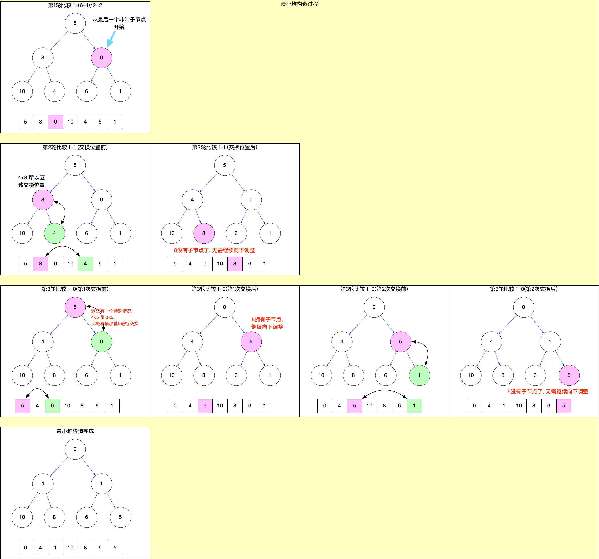
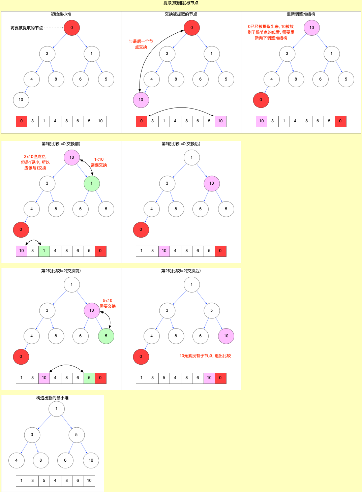

# React 算法之堆排序

## 概念

二叉堆是一种特殊的堆, 二叉堆是[完全二叉树](https://zh.wikipedia.org/wiki/%E4%BA%8C%E5%8F%89%E6%A0%91#%E5%AE%8C%E5%85%A8%E4%BA%8C%E5%8F%89%E6%A0%91)或者近似完全二叉树.

堆排序是利用二叉堆的特性, 对根节点(最大或最小)进行循环提取, 从而达到排序目的(堆排序本质上是一种选择排序), 时间复杂度为`O(nlog n)`.

## 特性

1. 父节点的值>=子节点的值(最大堆), 父节点的值<=子节点的值(最小堆). 每个节点的左子树和右子树都是一个二叉堆.
2. 假设一个数组`[k0, k1, k2, ...kn]`下标从 0 开始. 则`ki <= k2i+1,ki <= k2i+2` 或者 `ki >= k2i+1,ki >= k2i+2` (i = 0,1,2,3 .. n/2)

## 基本使用

假设现在有一个乱序数组, [5,8,0,10,4,6,1], 现在将其构造成一个最小堆

1. 构造二叉堆
   - 需要从最后一个非叶子节点开始, 向下调整堆结构



2. 插入节点, 重新向上调整堆(`sift-up`)
   - 将新元素插入到数组末尾之后, 要重新调整数组结构, 保证数组任然是最小(或最大)堆.


3. 提取或删除根节点(顶端节点), 重新向下调整堆(`sift-down`)
   - 对于最大堆, 提取的是最大值. 对于最小堆, 提取的是最小值.
   - 顶点被提取之后, 要重新调整数组结构, 保证数组任然是最小(或最大)堆.



4. 排序过程

利用二叉堆的特性, 排序就是循环提取根节点的过程. 循环执行步骤 3, 直到将所有的节点都提取完成, 被提取的节点构成的数组就是一个有序数组.

注意:

- 如需升序排序, 应该构造最大堆. 因为最大的元素最先被提取出来, 被放置到了数组的最后, 最终数组中最后一个元素为最大元素.
- 如需降序排序, 应该构造最小堆. 因为最小的元素最先被提取出来, 被放置到了数组的最后, 最终数组中最后一个元素为最小元素.
- 堆排序是一种不稳定排序(对于相同大小的元素, 在排序之后有可能和排序前的先后次序被打乱).

## 代码演示

将乱序数组`[5,8,0,10,4,6,1]`降序排列

步骤:

1. 构造最小堆
2. 循环提取根节点, 直到全部提取完

```js
const minHeapSort = arr => {
  // 1. 构造最小堆
  buildMinHeap(arr);
  // 2. 循环提取根节点arr[0], 直到全部提取完
  for (let i = arr.length - 1; i > 0; i--) {
    let tmp = arr[0];
    arr[0] = arr[i];
    arr[i] = tmp;
    siftDown(arr, 0, i - 1);
  }
};

// 把整个数组构造成最小堆
const buildMinHeap = arr => {
  const startIndex = Math.floor((arr.length - 1) / 2);
  for (let i = startIndex; i >= 0; i--) {
    siftDown(arr, i, arr.length - 1);
  }
};

// 从startIndex索引开始, 向下调整最小堆
const siftDown = (arr, startIndex, endIndex) => {
  const leftChildIndx = 2 * startIndex + 1;
  const rightChildIndx = 2 * startIndex + 2;
  let swapIndex = startIndex;
  let tmpNode = arr[startIndex];
  if (leftChildIndx <= endIndex) {
    if (arr[leftChildIndx] < tmpNode) {
      // 待定是否交换, 因为right子节点有可能更小
      tmpNode = arr[leftChildIndx];
      swapIndex = leftChildIndx;
    }
  }
  if (rightChildIndx <= endIndex) {
    if (arr[rightChildIndx] < tmpNode) {
      // 比left节点更小, 替换swapIndex
      tmpNode = arr[rightChildIndx];
      swapIndex = rightChildIndx;
    }
  }
  if (swapIndex !== startIndex) {
    // 1.交换节点
    arr[swapIndex] = arr[startIndex];
    arr[startIndex] = tmpNode;

    // 2. 递归调用, 继续向下调整
    siftDown(arr, swapIndex, endIndex);
  }
};
```

测试:

```js
var arr1 = [5, 8, 0, 10, 4, 6, 1];
minHeapSort(arr1);
console.log(arr1); // [10, 8, 6, 5,4, 1, 0]

var arr2 = [5];
minHeapSort(arr2);
console.log(arr2); // [ 5 ]

var arr3 = [5, 1];
minHeapSort(arr3);
console.log(arr3); //[ 5, 1 ]
```

## React 当中的使用场景

对于二叉堆的应用是在`scheduler`包中, 有 2 个数组[`taskQueue`和`timerQueue`](https://github.com/facebook/react/blob/v17.0.1/packages/scheduler/src/Scheduler.js#L63-L64), 它们都是以`最小堆`的形式进行存储, 这样就能保证以`O(1)`的时间复杂度, 取到数组顶端的对象(优先级最高的 task).

具体的调用过程被封装到了[`SchedulerMinHeap.js`](https://github.com/facebook/react/blob/v17.0.1/packages/scheduler/src/SchedulerMinHeap.js#L41-L87), 其中有 2 个函数`siftUp`,`siftDown`分别对应向上调整和向下调整.

```js
type Heap = Array<Node>;
type Node = {|
  id: number,
  sortIndex: number,
|};

// 添加新节点, 添加之后, 需要调用`siftUp`函数向上调整堆.
export function push(heap: Heap, node: Node): void {
  const index = heap.length;
  heap.push(node);
  siftUp(heap, node, index);
}

// 查看堆的顶点, 也就是优先级最高的`task`或`timer`
export function peek(heap: Heap): Node | null {
  const first = heap[0];
  return first === undefined ? null : first;
}

// 将堆的顶点提取出来, 并删除顶点之后, 需要调用`siftDown`函数向下调整堆.
export function pop(heap: Heap): Node | null {
  const first = heap[0];
  if (first !== undefined) {
    const last = heap.pop();
    if (last !== first) {
      heap[0] = last;
      siftDown(heap, last, 0);
    }
    return first;
  } else {
    return null;
  }
}

// 当插入节点之后, 需要向上调整堆结构, 保证数组是一个最小堆.
function siftUp(heap, node, i) {
  let index = i;
  while (true) {
    const parentIndex = (index - 1) >>> 1;
    const parent = heap[parentIndex];
    if (parent !== undefined && compare(parent, node) > 0) {
      // The parent is larger. Swap positions.
      heap[parentIndex] = node;
      heap[index] = parent;
      index = parentIndex;
    } else {
      // The parent is smaller. Exit.
      return;
    }
  }
}

// 向下调整堆结构, 保证数组是一个最小堆.
function siftDown(heap, node, i) {
  let index = i;
  const length = heap.length;
  while (index < length) {
    const leftIndex = (index + 1) * 2 - 1;
    const left = heap[leftIndex];
    const rightIndex = leftIndex + 1;
    const right = heap[rightIndex];

    // If the left or right node is smaller, swap with the smaller of those.
    if (left !== undefined && compare(left, node) < 0) {
      if (right !== undefined && compare(right, left) < 0) {
        heap[index] = right;
        heap[rightIndex] = node;
        index = rightIndex;
      } else {
        heap[index] = left;
        heap[leftIndex] = node;
        index = leftIndex;
      }
    } else if (right !== undefined && compare(right, node) < 0) {
      heap[index] = right;
      heap[rightIndex] = node;
      index = rightIndex;
    } else {
      // Neither child is smaller. Exit.
      return;
    }
  }
}
```

- `peek`函数: 查看堆的顶点, 也就是优先级最高的`task`或`timer`.
- `pop`函数: 将堆的顶点提取出来, 并删除顶点之后, 需要调用`siftDown`函数向下调整堆.
- `push`函数: 添加新节点, 添加之后, 需要调用`siftUp`函数向上调整堆.
- `siftDown`函数: 向下调整堆结构, 保证数组是一个最小堆.
- `siftUp`函数: 当插入节点之后, 需要向上调整堆结构, 保证数组是一个最小堆.

## 总结

本节介绍了`堆排序`的基本使用, 并说明了`堆排序`在`react`源码中的应用. 在阅读`scheduler`包的源码时, 会更加清晰的理解作者的思路.
