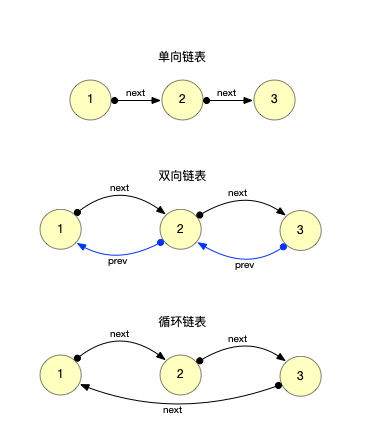
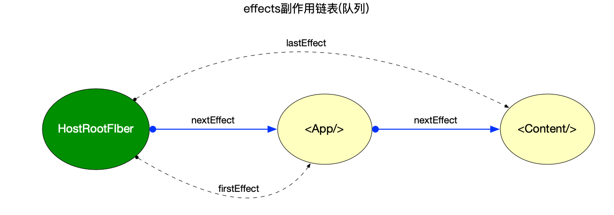
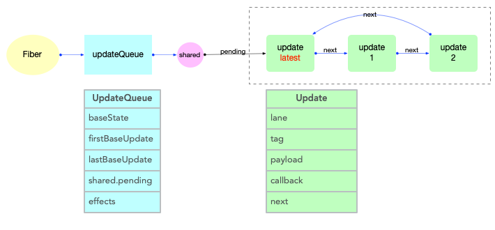
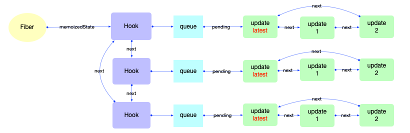
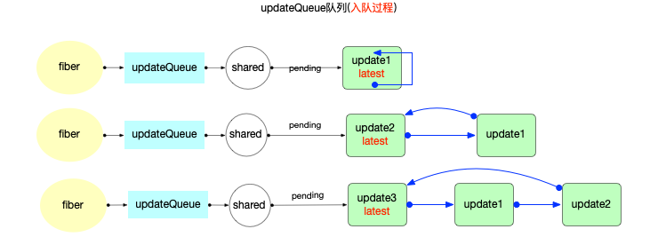
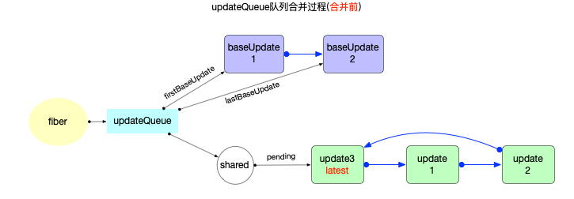
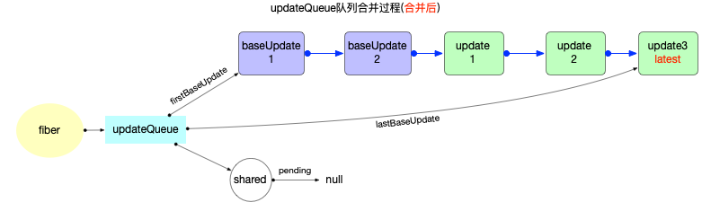
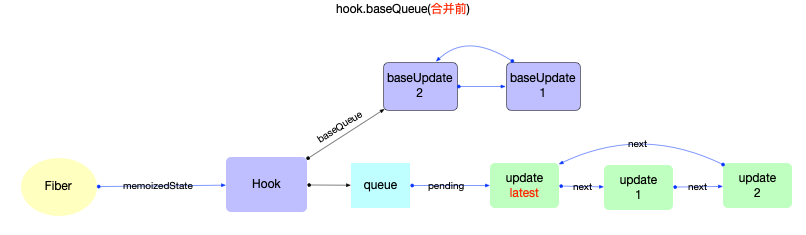
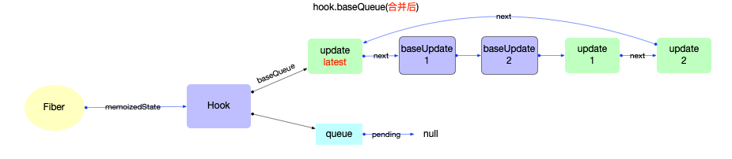

# React 算法之链表操作

## 概念

来自 wiki 上的解释: 链表（Linked list）是一种常见的基础数据结构, 是一种线性表, 但是并不会按线性的顺序存储数据, 而是在每一个节点里存到下一个节点的指针(Pointer).由于不必须按顺序存储，链表在插入的时候可以达到 O(1)的复杂度, 但是查找一个节点或者访问特定编号的节点则需要 O(n)的时间.

1. 单向链表: 每个节点包含两个域, 一个信息域和一个指针域. 这个指针指向列表中的下一个节点, 而最后一个节点则指向一个空值.
2. 双向链表: 每个节点有两个连接, 一个指向前一个节点(第一个节点指向空值), 而另一个指向下一个节点(最后一个节点指向空值).
3. 循环链表: 在单向链表的基础上, 首节点和末节点被连接在一起.



## 基本使用

1. 节点插入, 时间复杂度`O(1)`
2. 节点查找, 时间复杂度`O(n)`
3. 节点删除, 时间复杂度`O(1)`
4. 反转链表, 时间复杂度`O(n)`

```js
// 定义Node节点类型
function Node(name) {
  this.name = name;
  this.next = null;
}

// 链表
function LinkedList() {
  this.head = new Node('head');

  // 查找node节点的前一个节点
  this.findPrevious = function(node) {
    let currentNode = this.head;
    while (currentNode && currentNode.next !== node) {
      currentNode = currentNode.next;
    }
    return currentNode;
  };

  // 在node后插入新节点newElement
  this.insert = function(name, node) {
    const newNode = new Node(name);
    newNode.next = node.next;
    node.next = newNode;
  };

  // 删除节点
  this.remove = function(node) {
    const previousNode = this.findPrevious(node);
    if (previousNode) {
      previousNode.next = node.next;
    }
  };

  // 反转链表
  this.reverse = function() {
    let prev = null;
    let current = this.head;
    while (current) {
      const tempNode = current.next;
      // 重新设置next指针, 使其指向前一个节点
      current.next = prev;
      // 游标后移
      prev = current;
      current = tempNode;
    }
    // 重新设置head节点
    this.head = prev;
  };
}
```

## React 当中的使用场景

在 react 中, 链表的使用非常高频, 主要集中在`fiber`和`hook`对象的属性中.

### fiber 对象

在[react 高频对象](../main/object-structure.md#Fiber)中对`fiber`对象的属性做了说明, 这里列举出 4 个链表属性.

1. `effect`链表(链式队列): 存储有副作用的子节点, 构成该队列的元素是`fiber`对象

   - `fiber.nextEffect`: 单向链表, 指向下一个有副作用的 fiber 节点.
   - `fiber.firstEffect`: 指向副作用链表中的第一个 fiber 节点.
   - `fiber.lastEffect`: 指向副作用链表中的最后一个 fiber 节点.

   

   注意: 此处只表示出链表的结构示意图, 在`fiber 树构造`章节中会对上图的结构进行详细解读.

2. `updateQueue`链表(链式队列): 存储将要更新的状态, 构成该队列的元素是`update`对象

   - `fiber.updateQueue.pending`: 存储`state`更新的队列(链式队列), `class`类型节点的`state`改动之后, 都会创建一个`update`对象添加到这个队列中. 由于此队列是一个环形队列, 为了方便添加新元素和快速拿到队首元素, 所以`pending`指针指向了队列中最后一个元素.

   

   注意: 此处只表示出链表的结构示意图, 在`状态组件(class 与 function)`章节中会对上图的结构进行详细解读.

### Hook 对象

在[react 高频对象](../main/object-structure.md#Hook)中对`Hook`对象的属性做了说明, `Hook`对象具备`.next`属性, 所以`Hook`对象本身就是链表中的一个节点.

此外`hook.queue.pending`也构成了一个链表, 将`hook`链表与`hook.queue.pending`链表同时表示在图中, 得到的结构如下:



注意: 此处只表示出链表的结构示意图, 在`hook 原理`章节中会对上图的结构进行详细解读.

### 链表合并

在`react`中, 发起更新之后, 会通过`链表合并`的方式把等待(`pending`状态)更新的队列(`updateQueue`)合并到基础队列(`class`组件:`fiber.updateQueue.firstBaseUpdate`;`function`组件: `hook.baseQueue`), 最后通过遍历`baseQueue`筛选出优先级足够的`update`对象, 组合成最终的组件状态(`state`). 这个过程发生在`reconciler`阶段, 分别涉及到`class`组件和`function`组件.

具体场景:

1. `class`组件中

   - 在`class`组件中调用`setState`, 会创建`update`对象并添加到`fiber.updateQueue.shared.pending`链式队列([源码地址](https://github.com/facebook/react/blob/v17.0.2/packages/react-reconciler/src/ReactUpdateQueue.old.js#L198-L230)).

     ```js
     export function enqueueUpdate<State>(fiber: Fiber, update: Update<State>) {
       const updateQueue = fiber.updateQueue;
       // ...
       const sharedQueue: SharedQueue<State> = (updateQueue: any).shared;
       // 将新的update对象添加到fiber.updateQueue.shared.pending链表上
       const pending = sharedQueue.pending;
       if (pending === null) {
         update.next = update;
       } else {
         update.next = pending.next;
         pending.next = update;
       }
       sharedQueue.pending = update;
     }
     ```

     由于`fiber.updateQueue.shared.pending`是一个环形链表, 所以`fiber.updateQueue.shared.pending`永远指向末尾元素(保证快速添加新元素)

     

   - 在`fiber`树构建阶段(或`reconciler`阶段), 会把`fiber.updateQueue.shared.pending`合并到`fiber.updateQueue.firstBaseUpdate`队列上([源码地址](https://github.com/facebook/react/blob/v17.0.2/packages/react-reconciler/src/ReactUpdateQueue.old.js#L394-L572)).

     ```js
     export function processUpdateQueue<State>(
       workInProgress: Fiber,
       props: any,
       instance: any,
       renderLanes: Lanes,
     ): void {
       // This is always non-null on a ClassComponent or HostRoot
       const queue: UpdateQueue<State> = (workInProgress.updateQueue: any);
       let firstBaseUpdate = queue.firstBaseUpdate;
       let lastBaseUpdate = queue.lastBaseUpdate;
       // Check if there are pending updates. If so, transfer them to the base queue.
       let pendingQueue = queue.shared.pending;
       if (pendingQueue !== null) {
         queue.shared.pending = null;
         // The pending queue is circular. Disconnect the pointer between first
         // and last so that it's non-circular.
         const lastPendingUpdate = pendingQueue;
         const firstPendingUpdate = lastPendingUpdate.next;
         lastPendingUpdate.next = null;
         // Append pending updates to base queue
         if (lastBaseUpdate === null) {
           firstBaseUpdate = firstPendingUpdate;
         } else {
           lastBaseUpdate.next = firstPendingUpdate;
         }
         lastBaseUpdate = lastPendingUpdate;
       }
     }
     ```

     

     

2. `function`组件中
   - 在`function`组件中使用`Hook`对象(`useState`), 并改变`Hook`对象的值(内部会调用`dispatchAction`), 此时也会创建`update(hook)`对象并添加到`hook.queue.pending`链式队列([源码地址](https://github.com/facebook/react/blob/v17.0.2/packages/react-reconciler/src/ReactFiberHooks.old.js#L1645-L1682)).
   - `hook.queue.pending`也是一个环形链表(与`fiber.updateQueue.shared.pending`的结构很相似)

     ```js
     function dispatchAction<S, A>(
       fiber: Fiber,
       queue: UpdateQueue<S, A>,
       action: A,
     ) {
       // ... 省略部分代码
       const pending = queue.pending;
       if (pending === null) {
         // This is the first update. Create a circular list.
         update.next = update;
       } else {
         update.next = pending.next;
         pending.next = update;
       }
       queue.pending = update;
     }
     ```

   - 在`fiber`树构建阶段(或`reconciler`阶段), 会将`hook.queue.pending`合并到`hook.baseQueue`队列上([源码地址](https://github.com/facebook/react/blob/v17.0.2/packages/react-reconciler/src/ReactFiberHooks.old.js#L672-L694)).

        ```js
          function updateReducer<S, I, A>(
            reducer: (S, A) => S,
            initialArg: I,
            init?: I => S,
          ): [S, Dispatch<A>] {
            // ... 省略部分代码
            if (pendingQueue !== null) {
              if (baseQueue !== null) {
                // 在这里进行队列的合并
                const baseFirst = baseQueue.next;
                const pendingFirst = pendingQueue.next;
                baseQueue.next = pendingFirst;
                pendingQueue.next = baseFirst;
              }
              current.baseQueue = baseQueue = pendingQueue;
              queue.pending = null;
            }
          }
        ```

        

        

## 总结

本节主要介绍了`链表`的概念和它在`react`源码中的使用情况. `react`中主要的数据结构都和链表有关, 使用非常高频. 源码中`链表合并`, `环形链表拆解`, `链表遍历`的代码篇幅很多, 所以深入理解链表的使用, 对理解`react原理`大有益处.

## 参考资料

- [链表](https://zh.wikipedia.org/wiki/%E9%93%BE%E8%A1%A8)
