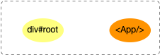
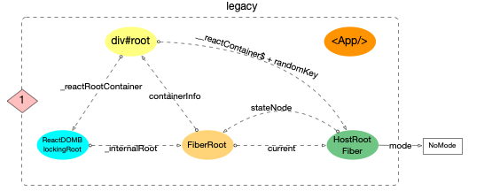
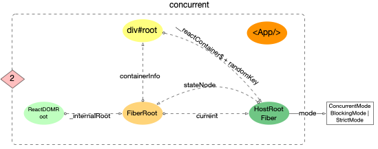
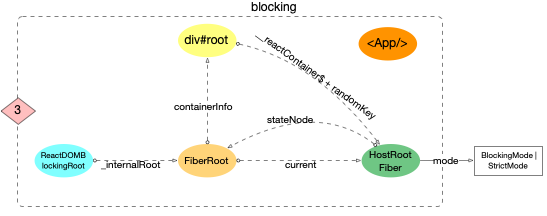

---
nav:
  title: 原理解析

title: 启动过程
order: 1
---

# React 应用的启动过程

在前文[`reconciler 运作流程`](./reconciler-workflow.md)把`reconciler`的流程归结成 4 个步骤.

本章节主要讲解`react`应用程序的启动过程, 位于`react-dom`包, 衔接`reconciler 运作流程`中的[`输入`](./reconciler-workflow.md#输入)步骤.

在正式分析源码之前, 先了解一下`react`应用的`启动模式`:

在当前稳定版`react@17.0.2`源码中, 有 3 种启动方式. 先引出官网上对于[这 3 种模式的介绍](https://zh-hans.reactjs.org/docs/concurrent-mode-adoption.html#why-so-many-modes), 其基本说明如下:

1. `legacy` 模式: `ReactDOM.render(<App />, rootNode)`. 这是当前 React app 使用的方式. 这个模式可能不支持[这些新功能(concurrent 支持的所有功能)](https://zh-hans.reactjs.org/docs/concurrent-mode-patterns.html#the-three-steps).

   ```js
   // LegacyRoot
   ReactDOM.render(<App />, document.getElementById('root'), dom => {}); // 支持callback回调, 参数是一个dom对象
   ```

2. [Blocking 模式](https://zh-hans.reactjs.org/docs/concurrent-mode-adoption.html#migration-step-blocking-mode): `ReactDOM.createBlockingRoot(rootNode).render(<App />)`. 目前正在实验中, 它仅提供了 `concurrent` 模式的小部分功能, 作为迁移到 `concurrent` 模式的第一个步骤.

   ```js
   // BolckingRoot
   // 1. 创建ReactDOMRoot对象
   const reactDOMBolckingRoot = ReactDOM.createBlockingRoot(
     document.getElementById('root'),
   );
   // 2. 调用render
   reactDOMBolckingRoot.render(<App />); // 不支持回调
   ```

3. [Concurrent 模式](https://zh-hans.reactjs.org/docs/concurrent-mode-adoption.html#enabling-concurrent-mode): `ReactDOM.createRoot(rootNode).render(<App />)`. 目前在实验中, 未来稳定之后，打算作为 React 的默认开发模式. 这个模式开启了所有的新功能.

   ```js
   // ConcurrentRoot
   // 1. 创建ReactDOMRoot对象
   const reactDOMRoot = ReactDOM.createRoot(document.getElementById('root'));
   // 2. 调用render
   reactDOMRoot.render(<App />); // 不支持回调
   ```

注意: 虽然`17.0.2`的源码中有[`createRoot`和`createBlockingRoot`方法](https://github.com/facebook/react/blob/v17.0.2/packages/react-dom/src/client/ReactDOM.js#L202)(如果自行构建, [会默认构建`experimental`版本](https://github.com/facebook/react/blob/v17.0.2/scripts/rollup/build.js#L30-L35)), 但是稳定版的构建入口[排除掉了这两个 api](https://github.com/facebook/react/blob/v17.0.2/packages/react-dom/index.stable.js), 所以实际在`npm i react-dom`安装`17.0.2`稳定版后, 不能使用该 api.如果要想体验非`legacy`模式, 需要[显示安装 alpha 版本](https://github.com/reactwg/react-18/discussions/9)(或自行构建).

## 启动流程

在调用入口函数之前,`reactElement(<App/>)`和 DOM 对象`div#root`之间没有关联, 用图片表示如下:



### 创建全局对象 {#create-global-obj}

无论`Legacy, Concurrent或Blocking`模式, react 在初始化时, 都会创建 3 个全局对象

1. [`ReactDOM(Blocking)Root`对象](https://github.com/facebook/react/blob/v17.0.2/packages/react-dom/src/client/ReactDOMRoot.js#L62-L72)

- 属于`react-dom`包, 该对象[暴露有`render,unmount`方法](https://github.com/facebook/react/blob/v17.0.2/packages/react-dom/src/client/ReactDOMRoot.js#L62-L104), 通过调用该实例的`render`方法, 可以引导 react 应用的启动.

2. [`fiberRoot`对象](https://github.com/facebook/react/blob/v17.0.2/packages/react-reconciler/src/ReactFiberRoot.old.js#L83-L103)

   - 属于`react-reconciler`包, 作为`react-reconciler`在运行过程中的全局上下文, 保存 fiber 构建过程中所依赖的全局状态.
   - 其大部分实例变量用来存储`fiber 构造循环`(详见[`两大工作循环`](./workloop.md))过程的各种状态.react 应用内部, 可以根据这些实例变量的值, 控制执行逻辑.

3. [`HostRootFiber`对象](https://github.com/facebook/react/blob/v17.0.2/packages/react-reconciler/src/ReactFiber.old.js#L431-L449)
   - 属于`react-reconciler`包, 这是 react 应用中的第一个 Fiber 对象, 是 Fiber 树的根节点, 节点的类型是`HostRoot`.

这 3 个对象是 react 体系得以运行的基本保障, 一经创建大多数场景不会再销毁(除非卸载整个应用`root.unmount()`).

这一过程是从`react-dom`包发起, 内部调用了`react-reconciler`包, 核心流程图如下(其中红色标注了 3 个对象的创建时机).


下面逐一解释这 3 个对象的创建过程.

### 创建 ReactDOM(Blocking)Root 对象

由于 3 种模式启动的 api 有所不同, 所以从源码上追踪, 也对应了 3 种方式. 最终都 new 一个`ReactDOMRoot`或`ReactDOMBlockingRoot`的实例, 需要创建过程中`RootTag`参数, 3 种模式各不相同. 该`RootTag`的类型决定了整个 react 应用是否支持[可中断渲染(后文有解释)](#可中断渲染).

下面根据 3 种 mode 下的启动函数逐一分析.

#### legacy 模式

`legacy`模式表面上是直接调用`ReactDOM.render`, 跟踪`ReactDOM.render`后续调用`legacyRenderSubtreeIntoContainer`([源码链接](https://github.com/facebook/react/blob/v17.0.2/packages/react-dom/src/client/ReactDOMLegacy.js#L175-L222))

```js
function legacyRenderSubtreeIntoContainer(
  parentComponent: ?React$Component<any, any>,
  children: ReactNodeList,
  container: Container,
  forceHydrate: boolean,
  callback: ?Function,
) {
  let root: RootType = (container._reactRootContainer: any);
  let fiberRoot;
  if (!root) {
    // 初次调用, root还未初始化, 会进入此分支
    //1. 创建ReactDOMRoot对象, 初始化react应用环境
    root = container._reactRootContainer = legacyCreateRootFromDOMContainer(
      container,
      forceHydrate,
    );
    fiberRoot = root._internalRoot;
    if (typeof callback === 'function') {
      const originalCallback = callback;
      callback = function() {
        // instance最终指向 children(入参: 如<App/>)生成的dom节点
        const instance = getPublicRootInstance(fiberRoot);
        originalCallback.call(instance);
      };
    }
    // 2. 更新容器
    unbatchedUpdates(() => {
      updateContainer(children, fiberRoot, parentComponent, callback);
    });
  } else {
    // root已经初始化, 二次调用render会进入
    // 1. 获取ReactDOMRoot对象
    fiberRoot = root._internalRoot;
    if (typeof callback === 'function') {
      const originalCallback = callback;
      callback = function() {
        const instance = getPublicRootInstance(fiberRoot);
        originalCallback.call(instance);
      };
    }
    // 2. 调用更新
    updateContainer(children, fiberRoot, parentComponent, callback);
  }
  return getPublicRootInstance(fiberRoot);
}
```

继续跟踪`legacyCreateRootFromDOMContainer`. 最后调用`new ReactDOMBlockingRoot(container, LegacyRoot, options);`

```js
function legacyCreateRootFromDOMContainer(
  container: Container,
  forceHydrate: boolean,
): RootType {
  const shouldHydrate =
    forceHydrate || shouldHydrateDueToLegacyHeuristic(container);
  return createLegacyRoot(
    container,
    shouldHydrate
      ? {
          hydrate: true,
        }
      : undefined,
  );
}

export function createLegacyRoot(
  container: Container,
  options?: RootOptions,
): RootType {
  return new ReactDOMBlockingRoot(container, LegacyRoot, options); // 注意这里的LegacyRoot是固定的, 并不是外界传入的
}
```

通过以上分析,`legacy`模式下调用`ReactDOM.render`有 2 个核心步骤:

1. 创建`ReactDOMBlockingRoot`实例(在 Concurrent 模式和 Blocking 模式中详细分析该类), 初始化 react 应用环境.
2. 调用`updateContainer`进行更新.

#### Concurrent 模式和 Blocking 模式

`Concurrent`模式和`Blocking`模式从调用方式上直接可以看出

1. 分别调用`ReactDOM.createRoot`和`ReactDOM.createBlockingRoot`创建`ReactDOMRoot`和`ReactDOMBlockingRoot`实例
2. 调用`ReactDOMRoot`和`ReactDOMBlockingRoot`实例的`render`方法

```js
export function createRoot(
  container: Container,
  options?: RootOptions,
): RootType {
  return new ReactDOMRoot(container, options);
}

export function createBlockingRoot(
  container: Container,
  options?: RootOptions,
): RootType {
  return new ReactDOMBlockingRoot(container, BlockingRoot, options); // 注意第2个参数BlockingRoot是固定写死的
}
```

继续查看`ReactDOMRoot`和`ReactDOMBlockingRoot`对象

```js
function ReactDOMRoot(container: Container, options: void | RootOptions) {
  // 创建一个fiberRoot对象, 并将其挂载到this._internalRoot之上
  this._internalRoot = createRootImpl(container, ConcurrentRoot, options);
}
function ReactDOMBlockingRoot(
  container: Container,
  tag: RootTag,
  options: void | RootOptions,
) {
  // 创建一个fiberRoot对象, 并将其挂载到this._internalRoot之上
  this._internalRoot = createRootImpl(container, tag, options);
}

ReactDOMRoot.prototype.render = ReactDOMBlockingRoot.prototype.render = function(
  children: ReactNodeList,
): void {
  const root = this._internalRoot;
  // 执行更新
  updateContainer(children, root, null, null);
};

ReactDOMRoot.prototype.unmount = ReactDOMBlockingRoot.prototype.unmount = function(): void {
  const root = this._internalRoot;
  const container = root.containerInfo;
  // 执行更新
  updateContainer(null, root, null, () => {
    unmarkContainerAsRoot(container);
  });
};
```

`ReactDOMRoot`和`ReactDOMBlockingRoot`有相同的特性

1. 调用`createRootImpl`创建`fiberRoot`对象, 并将其挂载到`this._internalRoot`上.
2. 原型上有`render`和`umount`方法, 且内部都会调用`updateContainer`进行更新.

### 创建 fiberRoot 对象 {#create-root-impl}

无论哪种模式下, 在`ReactDOM(Blocking)Root`的创建过程中, 都会调用一个相同的函数`createRootImpl`, 查看后续的函数调用, 最后会创建`fiberRoot 对象`(在这个过程中, 特别注意`RootTag`的传递过程):

```js
// 注意: 3种模式下的tag是各不相同(分别是ConcurrentRoot,BlockingRoot,LegacyRoot).
this._internalRoot = createRootImpl(container, tag, options);
```

```js
function createRootImpl(
  container: Container,
  tag: RootTag,
  options: void | RootOptions,
) {
  // ... 省略部分源码(有关hydrate服务端渲染等, 暂时用不上)
  // 1. 创建fiberRoot
  const root = createContainer(container, tag, hydrate, hydrationCallbacks); // 注意RootTag的传递
  // 2. 标记dom对象, 把dom和fiber对象关联起来
  markContainerAsRoot(root.current, container);
  // ...省略部分无关代码
  return root;
}
```

```js
export function createContainer(
  containerInfo: Container,
  tag: RootTag,
  hydrate: boolean,
  hydrationCallbacks: null | SuspenseHydrationCallbacks,
): OpaqueRoot {
  // 创建fiberRoot对象
  return createFiberRoot(containerInfo, tag, hydrate, hydrationCallbacks); // 注意RootTag的传递
}
```

### 创建 HostRootFiber 对象

在`createFiberRoot`中, 创建了`react`应用的首个`fiber`对象, 称为`HostRootFiber(fiber.tag = HostRoot)`

```js
export function createFiberRoot(
  containerInfo: any,
  tag: RootTag,
  hydrate: boolean,
  hydrationCallbacks: null | SuspenseHydrationCallbacks,
): FiberRoot {
  // 创建fiberRoot对象, 注意RootTag的传递
  const root: FiberRoot = (new FiberRootNode(containerInfo, tag, hydrate): any);

  // 1. 这里创建了`react`应用的首个`fiber`对象, 称为`HostRootFiber`
  const uninitializedFiber = createHostRootFiber(tag);
  root.current = uninitializedFiber;
  uninitializedFiber.stateNode = root;
  // 2. 初始化HostRootFiber的updateQueue
  initializeUpdateQueue(uninitializedFiber);

  return root;
}
```

在创建`HostRootFiber`时, 其中`fiber.mode`属性, 会与 3 种`RootTag`(`ConcurrentRoot`,`BlockingRoot`,`LegacyRoot`)关联起来.

```js
export function createHostRootFiber(tag: RootTag): Fiber {
  let mode;
  if (tag === ConcurrentRoot) {
    mode = ConcurrentMode | BlockingMode | StrictMode;
  } else if (tag === BlockingRoot) {
    mode = BlockingMode | StrictMode;
  } else {
    mode = NoMode;
  }
  return createFiber(HostRoot, null, null, mode); // 注意这里设置的mode属性是由RootTag决定的
}
```

注意:`fiber`树中所有节点的`mode`都会和`HostRootFiber.mode`一致(新建的 fiber 节点, 其 mode 来源于父节点),所以**HostRootFiber.mode**非常重要, 它决定了以后整个 fiber 树构建过程.

运行到这里, 3 个对象创建成功, `react`应用的初始化完毕.

将此刻内存中各个对象的引用情况表示出来:

1. legacy



2. concurrent



3. blocking



注意:

1. 3 种模式下,`HostRootFiber.mode`是不一致的
2. legacy 下, `div#root`和`ReactDOMBlockingRoot`之间通过`_reactRootContainer`关联. 其他模式是没有关联的
3. 此时`reactElement(<App/>)`还是独立在外的, 还没有和目前创建的 3 个全局对象关联起来

## 调用更新入口

1. legacy
   回到`legacyRenderSubtreeIntoContainer`函数中有:

```js
// 2. 更新容器
unbatchedUpdates(() => {
  updateContainer(children, fiberRoot, parentComponent, callback);
});
```

2. concurrent 和 blocking
   在`ReactDOM(Blocking)Root`原型上有`render`方法

```js
ReactDOMRoot.prototype.render = ReactDOMBlockingRoot.prototype.render = function(
  children: ReactNodeList,
): void {
  const root = this._internalRoot;
  // 执行更新
  updateContainer(children, root, null, null);
};
```

相同点:

1. 3 种模式在调用更新时都会执行`updateContainer`. `updateContainer`函数串联了`react-dom`与`react-reconciler`, 之后的逻辑进入了`react-reconciler`包.

不同点:

1. `legacy`下的更新会先调用`unbatchedUpdates`, 更改执行上下文为`LegacyUnbatchedContext`, 之后调用`updateContainer`进行更新.

2. `concurrent`和`blocking`不会更改执行上下文, 直接调用`updateContainer`进行更新.

继续跟踪[`updateContainer`函数](https://github.com/facebook/react/blob/v17.0.2/packages/react-reconciler/src/ReactFiberReconciler.old.js#L250-L321)

```js
export function updateContainer(
  element: ReactNodeList,
  container: OpaqueRoot,
  parentComponent: ?React$Component<any, any>,
  callback: ?Function,
): Lane {
  const current = container.current;
  // 1. 获取当前时间戳, 计算本次更新的优先级
  const eventTime = requestEventTime();
  const lane = requestUpdateLane(current);

  // 2. 设置fiber.updateQueue
  const update = createUpdate(eventTime, lane);
  update.payload = { element };
  callback = callback === undefined ? null : callback;
  if (callback !== null) {
    update.callback = callback;
  }
  enqueueUpdate(current, update);

  // 3. 进入reconcier运作流程中的`输入`环节
  scheduleUpdateOnFiber(current, lane, eventTime);
  return lane;
}
```

`updateContainer`函数位于`react-reconciler`包中, 它串联了`react-dom`与`react-reconciler`. 此处暂时不深入分析`updateContainer`函数的具体功能, 需要关注其最后调用了`scheduleUpdateOnFiber`.

在前文[`reconciler 运作流程`](./reconciler-workflow.md)中, 重点分析过`scheduleUpdateOnFiber`是`输入`阶段的入口函数.

所以到此为止, 通过调用`react-dom`包的`api`(如: `ReactDOM.render`), `react`内部经过一系列运转, 完成了初始化, 并且进入了`reconciler 运作流程`的第一个阶段.

## 思考

### 可中断渲染

react 中最广为人知的可中断渲染(render 可以中断, 部分生命周期函数有可能执行多次, `UNSAFE_componentWillMount`,`UNSAFE_componentWillReceiveProps`)只有在`HostRootFiber.mode === ConcurrentRoot | BlockingRoot`才会开启. 如果使用的是`legacy`, 即通过`ReactDOM.render(<App/>, dom)`这种方式启动时`HostRootFiber.mode = NoMode`, 这种情况下无论是首次 render 还是后续 update 都只会进入同步工作循环, `reconciliation`没有机会中断, 所以生命周期函数只会调用一次.

对于`可中断渲染`的宣传最早来自[2017 年 Lin Clark 的演讲](http://conf2017.reactjs.org/speakers/lin). 演讲中阐述了未来 react 会应用 fiber 架构, `reconciliation可中断`等(13:15 秒). 在[`v16.1.0`](https://github.com/facebook/react/blob/master/CHANGELOG.md#1610-november-9-2017)中应用了 fiber.

在最新稳定版[`v17.0.2`](https://github.com/facebook/react/blob/main/CHANGELOG.md#1702-march-22-2021)中, `可中断渲染`虽然实现, 但是并没有在稳定版暴露出 api. 只能[安装 alpha 版本](https://github.com/reactwg/react-18/discussions/9)才能体验该特性.

但是不少开发人员认为稳定版本的`react`已经是可中断渲染(其实是有误区的), 大概率也是受到了各类宣传文章的影响. 前端大环境还是比较浮躁的, 在当下, 更需要静下心来学习.

## 总结

本章节介绍了`react`应用的 3 种启动方式. 分析了启动后创建了 3 个关键对象, 并绘制了对象在内存中的引用关系. 启动过程最后调用`updateContainer`进入`react-reconciler`包,进而调用`schedulerUpdateOnFiber`函数, 与`reconciler运作流程`中的`输入`阶段相衔接.
