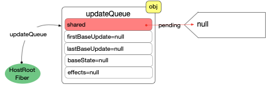

---
nav:
  title: 原理解析

title: 初始化
order: 1
---

# React 应用初始化

## 启动模式

在当前版本`react@16.13.1`中, 有 3 种启动方式. 先引出官网上对于[这 3 种模式的介绍](https://zh-hans.reactjs.org/docs/concurrent-mode-adoption.html#why-so-many-modes)

1. `Legacy`模式

```js
// LegacyRoot
ReactDOM.render(<App />, document.getElementById('root'), dom => {}); // 支持callback回调, 参数是一个dom对象
```

2. [`Concurrent`模式](https://zh-hans.reactjs.org/docs/concurrent-mode-adoption.html#enabling-concurrent-mode)

```js
// ConcurrentRoot
// 1. 创建ReactDOMRoot对象
const reactDOMRoot = ReactDOM.createRoot(document.getElementById('root'));
// 2. 调用render
reactDOMRoot.render(<App />); // 不支持回调
```

3. [`Blocking`模式](https://zh-hans.reactjs.org/docs/concurrent-mode-adoption.html#migration-step-blocking-mode): 做为`Legacy`和`Concurrent`之间的过度

```js
// BolckingRoot
// 1. 创建ReactDOMRoot对象
const reactDOMBolckingRoot = ReactDOM.createBlockingRoot(
  document.getElementById('root'),
);
// 2. 调用render
reactDOMBolckingRoot.render(<App />); // 不支持回调
```

## 初始化流程

在`react`正式调用之前,`reactElement(<App/>`和 DOM 对象`div#root`之间没有关联, 用图片表示如下:


### 创建全局对象

react 在初始化时, 创建了 3 个全局对象

1. `ReactDOM(Blocking)Root`对象
2. `fiberRoot`对象
3. `HostRootFiber` 对象

这 3 个对象是 react 体系得以运行的基本保障, 一经创建大多数场景是不会再销毁(卸载整个应用).

涉及到`react-dom`和`react-reconciler`两个包,核心核心流程图如下(后面逐步解释).


#### 创建 ReactDOM(Blocking)Root 对象

##### legacy 模式

`legacy`模式表面上是直接调用`ReactDOM.render`, 跟踪`ReactDOM.render`实际上调用`legacyRenderSubtreeIntoContainer`

```js
function legacyRenderSubtreeIntoContainer(
  parentComponent: ?React$Component<any, any>,
  children: ReactNodeList,
  container: Container,
  forceHydrate: boolean,
  callback: ?Function,
) {
  let root: RootType = (container._reactRootContainer: any);
  let fiberRoot;
  if (!root) {
    // 初次调用, root还未初始化, 会进入此分支
    //1. 创建ReactDOMRoot对象, 初始化react应用环境
    root = container._reactRootContainer = legacyCreateRootFromDOMContainer(
      container,
      forceHydrate,
    );
    fiberRoot = root._internalRoot;
    if (typeof callback === 'function') {
      const originalCallback = callback;
      callback = function() {
        // instance最终指向 children(入参: 如<App/>)生成的dom节点
        const instance = getPublicRootInstance(fiberRoot);
        originalCallback.call(instance);
      };
    }
    // 2. 更新容器
    unbatchedUpdates(() => {
      updateContainer(children, fiberRoot, parentComponent, callback);
    });
  } else {
    // root已经初始化, 二次调用render会进入
    // 1. 获取ReactDOMRoot对象
    fiberRoot = root._internalRoot;
    if (typeof callback === 'function') {
      const originalCallback = callback;
      callback = function() {
        const instance = getPublicRootInstance(fiberRoot);
        originalCallback.call(instance);
      };
    }
    // 2. 调用更新
    updateContainer(children, fiberRoot, parentComponent, callback);
  }
  return getPublicRootInstance(fiberRoot);
}
```

继续跟踪`legacyCreateRootFromDOMContainer`. 最后调用`new ReactDOMBlockingRoot(container, LegacyRoot, options);`

```js
function legacyCreateRootFromDOMContainer(
  container: Container,
  forceHydrate: boolean,
): RootType {
  const shouldHydrate =
    forceHydrate || shouldHydrateDueToLegacyHeuristic(container);
  return createLegacyRoot(
    container,
    shouldHydrate
      ? {
          hydrate: true,
        }
      : undefined,
  );
}

export function createLegacyRoot(
  container: Container,
  options?: RootOptions,
): RootType {
  return new ReactDOMBlockingRoot(container, LegacyRoot, options); // 注意这里的LegacyRoot是固定的, 并不是外界传入的
}
```

通过以上分析,`legacy`模式下调用`ReactDOM.render`有 2 个核心步骤:

1. 创建`ReactDOMBlockingRoot`实例(在 Concurrent 模式和 Blocking 模式中详细分析该类), 初始化 react 应用环境
2. 调用`updateContainer`进行更新

##### Concurrent 模式和 Blocking 模式

`Concurrent`模式和`Blocking`模式从调用方式上直接可以看出

1. 分别调用`ReactDOM.createRoot`和`ReactDOM.createBlockingRoot`创建`ReactDOMRoot`和`ReactDOMBlockingRoot`实例
2. 调用`ReactDOMRoot`和`ReactDOMBlockingRoot`实例的`render`方法

```js
export function createRoot(
  container: Container,
  options?: RootOptions,
): RootType {
  return new ReactDOMRoot(container, options);
}

export function createBlockingRoot(
  container: Container,
  options?: RootOptions,
): RootType {
  return new ReactDOMBlockingRoot(container, BlockingRoot, options); // 注意这里的BlockingRoot是固定的, 并不是外界传入的
}
```

继续查看`ReactDOMRoot`和`ReactDOMBlockingRoot`对象

```js
function ReactDOMRoot(container: Container, options: void | RootOptions) {
  // 创建一个fiberRoot对象, 并将其挂载到this._internalRoot之上
  this._internalRoot = createRootImpl(container, ConcurrentRoot, options);
}
function ReactDOMBlockingRoot(
  container: Container,
  tag: RootTag,
  options: void | RootOptions,
) {
  // 创建一个fiberRoot对象, 并将其挂载到this._internalRoot之上
  this._internalRoot = createRootImpl(container, tag, options);
}

ReactDOMRoot.prototype.render = ReactDOMBlockingRoot.prototype.render = function(
  children: ReactNodeList,
): void {
  const root = this._internalRoot;
  // 执行更新
  updateContainer(children, root, null, null);
};

ReactDOMRoot.prototype.unmount = ReactDOMBlockingRoot.prototype.unmount = function(): void {
  const root = this._internalRoot;
  const container = root.containerInfo;
  // 执行更新
  updateContainer(null, root, null, () => {
    unmarkContainerAsRoot(container);
  });
};
```

`ReactDOMRoot`和`ReactDOMBlockingRoot`有相同的特性

1. 调用`createRootImpl`创建`fiberRoot`对象(后面详细说明), 并将其挂载到`this._internalRoot`上
2. 原型上有`render`和`umount`方法
   - 内部都会执行`updateContainer`进行更新

---

到这里可以说明, 3 种模式虽然调用的入口函数不同, 但是其核心步骤都是一致的.

#### 创建 fiberRoot 对象

`ReactDOM(Blocking)Root`的创建过程中, 都有相同的调用:

```js
// 注意: 3种模式下的tag是各不相同(分别是ConcurrentRoot,BlockingRoot,LegacyRoot).
this._internalRoot = createRootImpl(container, tag, options);
```

```js
function createRootImpl(
  container: Container,
  tag: RootTag,
  options: void | RootOptions,
) {
  // Tag is either LegacyRoot or Concurrent Root
  const hydrate = options != null && options.hydrate === true;
  const hydrationCallbacks =
    (options != null && options.hydrationOptions) || null;
  // 1. 创建fiberRoot
  const root = createContainer(container, tag, hydrate, hydrationCallbacks);
  // 2. 标记dom对象, 把dom和fiber对象关联起来
  markContainerAsRoot(root.current, container);
  // ...省略部分无关代码
  return root;
}
```

```js
export function createContainer(
  containerInfo: Container,
  tag: RootTag,
  hydrate: boolean,
  hydrationCallbacks: null | SuspenseHydrationCallbacks,
): OpaqueRoot {
  return createFiberRoot(containerInfo, tag, hydrate, hydrationCallbacks);
}
```

#### 创建 HostRootFiber 对象

在`createFiberRoot`中, 创建了`react`应用的首个`fiber`对象, 称为`HostRootFiber(fiber.tag = HostRoot)`

```js
export function createFiberRoot(
  containerInfo: any,
  tag: RootTag,
  hydrate: boolean,
  hydrationCallbacks: null | SuspenseHydrationCallbacks,
): FiberRoot {
  const root: FiberRoot = (new FiberRootNode(containerInfo, tag, hydrate): any);
  if (enableSuspenseCallback) {
    root.hydrationCallbacks = hydrationCallbacks;
  }
  // 1. 这里创建了`react`应用的首个`fiber`对象, 称为`HostRootFiber`
  const uninitializedFiber = createHostRootFiber(tag);
  root.current = uninitializedFiber;
  uninitializedFiber.stateNode = root;
  // 2. 初始化HostRootFiber的updateQueue
  initializeUpdateQueue(uninitializedFiber);

  return root;
}
```

在创建`HostRootFiber`时, 其中`fiber.mode`属性, 会与 3 种`RootTag`(`ConcurrentRoot`,`BlockingRoot`,`LegacyRoot`)关联起来.

```js
export function createHostRootFiber(tag: RootTag): Fiber {
  let mode;
  if (tag === ConcurrentRoot) {
    mode = ConcurrentMode | BlockingMode | StrictMode;
  } else if (tag === BlockingRoot) {
    mode = BlockingMode | StrictMode;
  } else {
    mode = NoMode;
  }
  return createFiber(HostRoot, null, null, mode); // 注意这里设置的mode属性是由RootTag决定的
}
```

注意:`fiber`树中所节点的`mode`都会和`HostRootFiber.mode`一致(新建的 fiber 节点, 其 mode 来源于父节点)

将此刻内存中各个对象的引用情况表示出来:

1. lagacy


2. concurrent


3. blocking


注意:

1. 3 种模式下,`HostRootFiber.mode`是不一致的
2. legacy 下, `div#root`和`ReactDOMBlockingRoot`之间通过`_reactRootContainer`关联. 其他模式是没有关联的
3. 此时`reactElement(<App/>)`还是独立在外的, 还没有和目前创建的 3 个全局对象关联起来

同时`HostRootFiber.updateQueue`也已经初始化完成了.



运行到这里, `react`应用的初始化已经完成了.

## 调用更新入口

1. lagacy
   回到`legacyRenderSubtreeIntoContainer`函数中有:

```js
// 2. 更新容器
unbatchedUpdates(() => {
  updateContainer(children, fiberRoot, parentComponent, callback);
});
```

2. concurrent 和 blocking
   在`ReactDOM(Blocking)Root`原型上有`render`方法

```js
ReactDOMRoot.prototype.render = ReactDOMBlockingRoot.prototype.render = function(
  children: ReactNodeList,
): void {
  const root = this._internalRoot;
  // 执行更新
  updateContainer(children, root, null, null);
};
```

相同点:

1. 3 种模式在调用更新时都会执行`updateContainer`,由`updateContainer`来引导更新
   不同点:
1. `legacy`下的更新会先调用`unbatchedUpdates`, 更改执行上下文为`LegacyUnbatchedContext`
1. `concurrent`和`blocking`不会更改执行上下文

这里明确了`react`应用的初始化完成之后便可以通过调用`updateContainer`执行更新, 对于`updateContainer`的深入分析, 在[首次 render](./03-render-process.md)和[更新机制](./06-update-process.md)中详细讨论.
