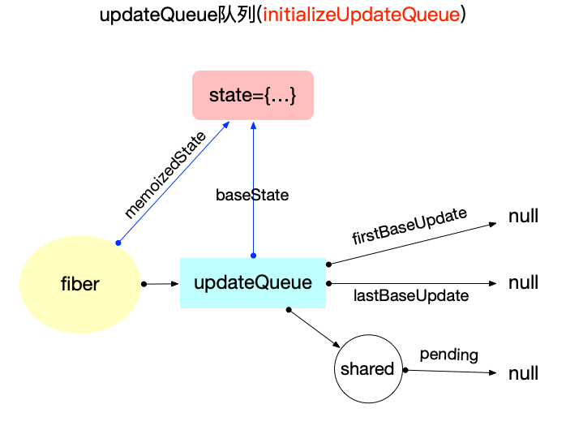

# 状态组件

## 概念

1. 组件

在 react 开发中所说的组件, 实际上指代的是[`ReactElement`对象](https://github.com/facebook/react/blob/v17.0.2/packages/react/src/ReactElement.js#L126-L146).
其数据结构如下:

```ts
  export type ReactElement = {|
    // 用于辨别ReactElement对象
    $$typeof: any,
    // 内部属性
    type: any, // 表明其种类
    key: any,
    ref: any,
    props: any
  |};
```

其中`type`属性决定了`ReactElement`的种类, 在`v17.0.2`中, [定义了 20 种](https://github.com/facebook/react/blob/v17.0.2/packages/shared/ReactSymbols.js#L16-L37)内部类型.

2. 状态组件

首先引入官网上对[状态组件的解释](https://zh-hans.reactjs.org/docs/faq-state.html), 官网上主要讲解了`class`组件内部用于维护状态的`props`和`state`属性. 从`v16.8`以后, 增加了`Hook`功能, 使得`function`组件也拥有维护局部状态的能力.

除此之外, [Context Api](https://zh-hans.reactjs.org/docs/context.html#api)定义了`Context.Provider`和`Context.Consumer`2 种组件, 其中`Context.Provider`也可以维护局部状态, 供给`Context.Consumer`使用.

广义上讲, 我们可以将`class`,`function`和`Context.Provider`这 3 类型的组件都归类为状态组件. 如果严格来讲, 只有`class`组件具备自身管理局部数据的能力, 其余两种都需要依赖其他条件(`function`需要依靠`Hook`来维护状态, `Context.Provider`需要依靠外部传入`value`属性来维护状态).

注意: 本文只讨论`class`和`function`组件, 有关`Context`组件的状态管理单独在`Context原理`章节中讨论.

## 状态管理

组件的状态管理, 需要从`fiber视角`来解释. 具体来讲, [fiber 数据结构](https://github.com/facebook/react/blob/v17.0.2/packages/react-reconciler/src/ReactInternalTypes.js#L47-L174)中, 有关局部状态的属性主要有 4 个(其余属性可以回顾[React 应用中的高频对象](./object-structure.md#Fiber)中的`Fiber 对象`小节中的介绍):

```ts
export type Fiber = {|
  pendingProps: any,
  memoizedProps: any,
  updateQueue: mixed,
  memoizedState: any,
|};
```

1. `fiber.pendingProps`: 输入属性, 从`ReactElement`对象传入的 props. 它和`fiber.memoizedProps`比较可以得出属性是否变动.
2. `fiber.memoizedProps`: 上一次生成子节点时用到的属性, 生成子节点之后保持在内存中. 向下生成子节点之前叫做`pendingProps`, 生成子节点之后会把`pendingProps`赋值给`memoizedProps`用于下一次比较.`pendingProps`和`memoizedProps`比较可以得出属性是否变动.
3. `fiber.updateQueue`: 存储`update更新对象`的队列, 每一次发起更新, 都需要在该队列上创建一个`update对象`.
4. `fiber.memoizedState`: 上一次生成子节点之后保持在内存中的局部状态.

所以对于一个具体的`fiber`, 其局部状态都挂载到了这 4 个属性上, 要想实现数据的持久化, 只需保持这些属性的引用即可.

其核心的实现, 我们在`fiber树构造`等文章已经介绍过, 那就是双缓冲技术(可以回顾[double buffering](./fibertree-prepare.md#双缓冲技术)). 源码在[createWorkInProgress 函数中](https://github.com/facebook/react/blob/v17.0.2/packages/react-reconciler/src/ReactFiber.old.js#L254-L355), 展示了新旧`fiber`的属性过度:

```js
// 只保留了与状态管理相关的属性
export function createWorkInProgress(current: Fiber, pendingProps: any): Fiber {
  let workInProgress = current.alternate;
  if (workInProgress === null) {
    // ... 省略部分代码
    workInProgress.stateNode = current.stateNode;
  } else {
    workInProgress.pendingProps = pendingProps;
    // ... 省略部分代码
  }
  workInProgress.memoizedProps = current.memoizedProps;
  workInProgress.memoizedState = current.memoizedState;
  workInProgress.updateQueue = current.updateQueue;
  // ... 省略部分代码
  return workInProgress;
}
```

## 内部原理

`fiber`是一个内部结构(外部无感知), 对于开发者来讲, 能编程控制的只有`ReactElement`对象. 下文以`fiber树构造`为主线, 分析这 2 种状态组件的内部实现.

注意: 因为单个`fiber`的构造仅仅只是`fiber树构造`中的一部分, 下文默认读者对`fiber树构造`过程已经有所理解, 具体可回顾前文[fiber 树构造(初次创建)](./fibertree-prepare.md).

先从`fiber`的构造函数入手, 可以看到[在源码中](https://github.com/facebook/react/blob/v17.0.2/packages/react-reconciler/src/ReactFiber.old.js#L116-L141)与状态管理相关的属性, 只有`pendingProps`是直接初始化而来(从`ReactElement`对象传过来的), 其余均为`null`

```js
function FiberNode(
  tag: WorkTag,
  pendingProps: mixed,
  key: null | string,
  mode: TypeOfMode,
) {
  // props相关
  this.pendingProps = pendingProps; // pendingProps是从`ReactElement`对象传过来的
  this.memoizedProps = null;

  // state相关
  this.updateQueue = null;
  this.memoizedState = null;
}
```

其中`props`相关的`pendingProps`和`memoizedProps`属性, 没有复杂的计算, 事实上就是`ReactElement`对象中的`props`属性透给了`fiber`对象. 所以,下面重点分析`updateQueue`向`memoizedState`的转换.

### class 组件

假设有如下结构:

```js
class App extends React.Component {
  state = {
    count: 0,
  };
  changeState = () => {
    this.setState({ count: ++this.state.count });
  };

  // render调用之前: this.state是fiber.updateQueue的合并
  render() {
    return <button onClick={this.changeState}>{this.state.count}</button>;
  }
  // render调用之后: this.state被挂载到fiber.memoizedState
}
```

在`beginWork`阶段, 当遍历到`fiber(<App/>)`, `class App`是一个`ReactElement`对象, 初次构造时, 还未实例化. 此时源码对应[updateClassComponent](https://github.com/facebook/react/blob/v17.0.2/packages/react-reconciler/src/ReactFiberBeginWork.old.js#L854-L945), 其中与初次构造相关代码如下:

```js
function updateClassComponent(
  current: Fiber | null,
  workInProgress: Fiber,
  Component: any,
  nextProps: any,
  renderLanes: Lanes,
) {
  const instance = workInProgress.stateNode; // 初次构造时 instance=null
  let shouldUpdate;
  if (instance === null) {
    constructClassInstance(workInProgress, Component, nextProps); // 1. 实例化class
    mountClassInstance(workInProgress, Component, nextProps, renderLanes); // 2. 初次构造: 合并updateQueue, 得到最终的state
    shouldUpdate = true;
  } else if (current === null) {
    // concurrent模式暂时不讨论
  } else {
    // 2. 对比更新: 合并updateQueue, 得到最终的state
    shouldUpdate = updateClassInstance(
      current,
      workInProgress,
      Component,
      nextProps,
      renderLanes,
    );
  }
  const nextUnitOfWork = finishClassComponent(
    current,
    workInProgress,
    Component,
    shouldUpdate,
    hasContext,
    renderLanes,
  );
  return nextUnitOfWork;
}

function finishClassComponent(
  current: Fiber | null,
  workInProgress: Fiber,
  Component: any,
  shouldUpdate: boolean,
  hasContext: boolean,
  renderLanes: Lanes,
) {
  const instance = workInProgress.stateNode;
  nextChildren = instance.render(); // 3. 调用render, 返回下级 ReactElement
  reconcileChildren(current, workInProgress, nextChildren, renderLanes); // 4. 调用调和函数, 返回下级fiber
  workInProgress.memoizedState = instance.state; // 5. 将state保存到fiber.memoizedState
  return workInProgress.child;
}
```

逻辑非常清晰:

1. 初始化`Class`实例记为`instance`, 且`workInProgress.stateNode = instance`, 以便在更新阶段直接读取`instance`(无需再次实例化)
2. 合并`updateQueue`, 得到最终的`state`. (包括`初次构造`和`对比更新`)
3. 调用`render`函数, 返回下级`ReactElement`
4. 调用调和函数, 返回下级`fiber`
5. 将最终的`state`保存到`fiber.memoizedState`

本节讨论的重点是`第1, 2`步(其余`第3,4`骤在前文`fiber树构造`系列中已有详细解读). 进一步跟进代码(只保留与`state`相关部分):

```js
function constructClassInstance(
  workInProgress: Fiber,
  ctor: any,
  props: any,
): any {
  // 1. 实例化class
  const instance = new ctor(props, context);
  // 2. 初始化 workInProgress.memoizedState = instance.state || null
  const state = (workInProgress.memoizedState =
    instance.state !== null && instance.state !== undefined
      ? instance.state
      : null);
  // 3. class适配器: 设置workInProgress.stateNode = instance, 拓展 instance.updater = classComponentUpdater;
  adoptClassInstance(workInProgress, instance);
  return instance;
}

function mountClassInstance(
  workInProgress: Fiber,
  ctor: any,
  newProps: any,
  renderLanes: Lanes,
): void {
  const instance = workInProgress.stateNode;
  instance.state = workInProgress.memoizedState;
  // 1. 初始化updateQueue
  initializeUpdateQueue(workInProgress);
  // 2. 根据优先级, 挑出合适的update对象, 并合并其state到memoizedState中
  processUpdateQueue(workInProgress, newProps, instance, renderLanes);
  // 3. 将步骤2中得到的memoizedState, 设置到instance.state上
  instance.state = workInProgress.memoizedState;

  const getDerivedStateFromProps = ctor.getDerivedStateFromProps;
  if (typeof getDerivedStateFromProps === 'function') {
    applyDerivedStateFromProps(
      workInProgress,
      ctor,
      getDerivedStateFromProps,
      newProps,
    );
    // 4. 调用getDerivedStateFromProps方法, 设置最终的state
    instance.state = workInProgress.memoizedState;
  }
}

function updateClassInstance(
  current: Fiber,
  workInProgress: Fiber,
  ctor: any,
  newProps: any,
  renderLanes: Lanes,
): boolean {
  const instance = workInProgress.stateNode;
  // 1. 克隆current中的updateQueue到workInProgress
  cloneUpdateQueue(current, workInProgress);

  const oldState = workInProgress.memoizedState;
  let newState = (instance.state = oldState);
  // 2. 根据优先级, 挑出合适的update对象, 并合并其state到memoizedState中
  processUpdateQueue(workInProgress, newProps, instance, renderLanes);
  newState = workInProgress.memoizedState;

  if (typeof getDerivedStateFromProps === 'function') {
    applyDerivedStateFromProps(
      workInProgress,
      ctor,
      getDerivedStateFromProps,
      newProps,
    );
    // 3. 调用getDerivedStateFromProps方法, 设置最终的state
    newState = workInProgress.memoizedState;
  }

  // 4. 设置instance的最终状态
  instance.props = newProps;
  instance.state = newState;
  instance.context = nextContext;

  return shouldUpdate;
}
```

由于主杆逻辑十分清晰, 函数功能都在注释中解释了, 那么就直奔主题研究`initializeUpdateQueue`和`processUpdateQueue`函数.

首先, 我们要明确`Update对象`是一个环形链表(详见算法部分[React 算法之链表操作](../algorithm/linkedlist.md)), 其[数据结构](https://github.com/facebook/react/blob/v17.0.2/packages/react-reconciler/src/ReactUpdateQueue.old.js#L106-L129):

```js
export type Update<State> = {|
  eventTime: number,
  lane: Lane,

  tag: 0 | 1 | 2 | 3,
  payload: any,
  callback: (() => mixed) | null,

  next: Update<State> | null,
|};

type SharedQueue<State> = {|
  pending: Update<State> | null,
|};

export type UpdateQueue<State> = {|
  baseState: State,
  firstBaseUpdate: Update<State> | null,
  lastBaseUpdate: Update<State> | null,
  shared: SharedQueue<State>,
  effects: Array<Update<State>> | null,
|};
```

而`UpdateQueue对象`事实上是管理`Update`这个环形链表, 通过定义`firstBaseUpdate, lastBaseUpdate`等指针来截取合适的`Update链表区间`, 最终合并这个区间, 得到`memoizedState`. 这个步骤相对有点复杂, 接下来将对其进行图解.

[initializeUpdateQueue(workInProgress)](https://github.com/facebook/react/blob/v17.0.2/packages/react-reconciler/src/ReactUpdateQueue.old.js#L152-L163)之后`workInProgress.updateQueue.shared.pending = null`, 之后进入[processUpdateQueue](https://github.com/facebook/react/blob/v17.0.2/packages/react-reconciler/src/ReactUpdateQueue.old.js#L394-L414)

1. 初次构造

- 执行[initializeUpdateQueue(workInProgress)](https://github.com/facebook/react/blob/v17.0.2/packages/react-reconciler/src/ReactUpdateQueue.old.js#L152-L163):

  ```js
  export function initializeUpdateQueue<State>(fiber: Fiber): void {
    const queue: UpdateQueue<State> = {
      baseState: fiber.memoizedState,
      firstBaseUpdate: null,
      lastBaseUpdate: null,
      shared: {
        pending: null,
      },
      effects: null,
    };
    fiber.updateQueue = queue;
  }
  ```

  与之相关的内存结构如下所示:

  

- 执行[processUpdateQueue](https://github.com/facebook/react/blob/v17.0.2/packages/react-reconciler/src/ReactUpdateQueue.old.js#L394-L414):

  ```js
  export function processUpdateQueue<State>(
    workInProgress: Fiber,
    props: any,
    instance: any,
    renderLanes: Lanes,
  ): void {
    const queue: UpdateQueue<State> = (workInProgress.updateQueue: any);
    hasForceUpdate = false;
    // 定义base队列的first/lastBaseUpdate指针
    let firstBaseUpdate = queue.firstBaseUpdate;
    let lastBaseUpdate = queue.lastBaseUpdate;
    let pendingQueue = queue.shared.pending;
    if (pendingQueue !== null) {
      // 初次构造 pendingQueue = null, 不进入此逻辑
    }
    if (firstBaseUpdate !== null) {
      // 初次构造 firstBaseUpdate = null, 不进入此逻辑
    }
  }
  ```

  初次构造时`processUpdateQueue`没有任何逻辑, 故内存结构也没有变化.

```js
export function processUpdateQueue<State>(
  workInProgress: Fiber,
  props: any,
  instance: any,
  renderLanes: Lanes,
): void {
  const queue: UpdateQueue<State> = (workInProgress.updateQueue: any);

  hasForceUpdate = false;
  // 定义base队列的first/lastBaseUpdate指针
  let firstBaseUpdate = queue.firstBaseUpdate;
  let lastBaseUpdate = queue.lastBaseUpdate;

  // 1. 将pending队列转移到base队列(first/lastBaseUpdate)
  let pendingQueue = queue.shared.pending;
  if (pendingQueue !== null) {
    queue.shared.pending = null;
    const lastPendingUpdate = pendingQueue;
    const firstPendingUpdate = lastPendingUpdate.next;
    lastPendingUpdate.next = null;
    if (lastBaseUpdate === null) {
      firstBaseUpdate = firstPendingUpdate;
    } else {
      lastBaseUpdate.next = firstPendingUpdate;
    }
    lastBaseUpdate = lastPendingUpdate;
    // ...省略concurrent模式下的特殊case
  }

  // 2. 遍历base队列, 过滤出满足优先级的update对象, 合并最终的值到queue.baseState对象中
  if (firstBaseUpdate !== null) {
    let newState = queue.baseState;
    let newLanes = NoLanes;

    let newBaseState = null;
    let newFirstBaseUpdate = null;
    let newLastBaseUpdate = null;

    let update = firstBaseUpdate;
    do {
      const updateLane = update.lane;
      const updateEventTime = update.eventTime;
      // 2.1 优先级过滤
      if (!isSubsetOfLanes(renderLanes, updateLane)) {
        // 优先级不够: 将Update对象添加到newBase队列中
        const clone: Update<State> = {
          eventTime: updateEventTime,
          lane: updateLane,

          tag: update.tag,
          payload: update.payload,
          callback: update.callback,

          next: null,
        };
        if (newLastBaseUpdate === null) {
          newFirstBaseUpdate = newLastBaseUpdate = clone;
          newBaseState = newState;
        } else {
          newLastBaseUpdate = newLastBaseUpdate.next = clone;
        }
        // Update the remaining priority in the queue.
        newLanes = mergeLanes(newLanes, updateLane);
      } else {
        // 优先级足够: 准备进行状态合并
        if (newLastBaseUpdate !== null) {
          // 虽然优先级足够, 但是只要前面有优先级不够的update对象, 就要添加到newBase队列
          const clone: Update<State> = {
            eventTime: updateEventTime,
            // 因为优先级足够, 所以在添加到newBase队列是设置最高优先级, 以保证下一次渲染时肯定不会被跳过
            lane: NoLane,

            tag: update.tag,
            payload: update.payload,
            callback: update.callback,

            next: null,
          };
          newLastBaseUpdate = newLastBaseUpdate.next = clone;
        }
        // 2.2 状态合并
        newState = getStateFromUpdate(
          workInProgress,
          queue,
          update,
          newState,
          props,
          instance,
        );

        // [本节不讨论]: 收集回调函数, push到updateQueue.effects队列中, 等待commit阶段的回调处理
        const callback = update.callback;
        if (callback !== null) {
          workInProgress.flags |= Callback;
          const effects = queue.effects;
          if (effects === null) {
            queue.effects = [update];
          } else {
            effects.push(update);
          }
        }
      }
      update = update.next;
      if (update === null) {
        pendingQueue = queue.shared.pending;
        if (pendingQueue === null) {
          break;
        } else {
          // ...省略concurrent模式下的特殊case
        }
      }
    } while (true);

    if (newLastBaseUpdate === null) {
      newBaseState = newState;
    }

    // 3. 重新设置updateQueue的属性
    queue.baseState = ((newBaseState: any): State);
    queue.firstBaseUpdate = newFirstBaseUpdate;
    queue.lastBaseUpdate = newLastBaseUpdate;

    // Set the remaining expiration time to be whatever is remaining in the queue.
    // This should be fine because the only two other things that contribute to
    // expiration time are props and context. We're already in the middle of the
    // begin phase by the time we start processing the queue, so we've already
    // dealt with the props. Context in components that specify
    // shouldComponentUpdate is tricky; but we'll have to account for
    // that regardless.
    markSkippedUpdateLanes(newLanes);
    workInProgress.lanes = newLanes;
    workInProgress.memoizedState = newState;
  }
}
```
