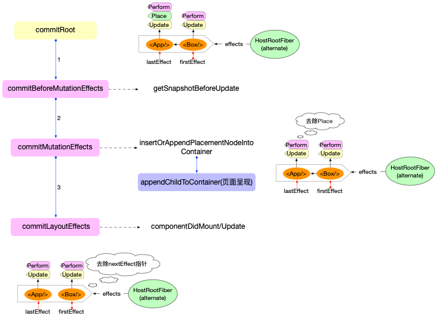
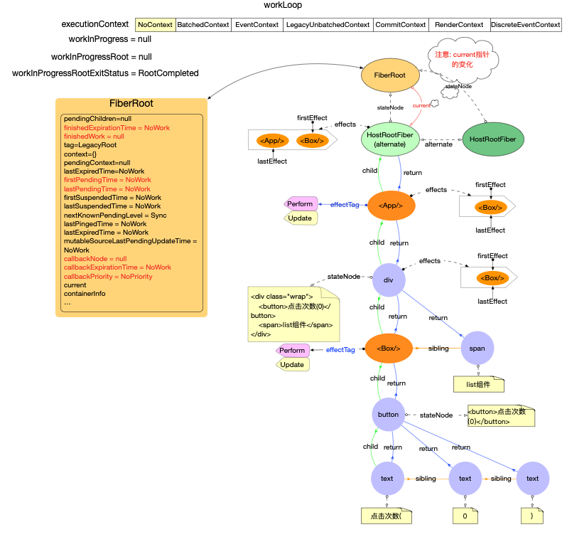

# fiber 树渲染

在 fiber 树构建中已经分析, 无论是否是首次 render, 都会在内存中构造最新的 fiber 树.

## 内存结构

在 fiber 树提交渲染之前, 也就是`commitRoot`执行之前. 内存中有两棵 fiber 树, `current`和`workInProgress`指针分别指向这两棵树.

1. `current`
   - 代表当前正在使用的 fiber 树, 此 fiber 树上所有节点与当前页面上的 dom 节点相互引用
   - 如果是首次 render, `current=null`, 此刻页面还未渲染
2. `workInProgress`
   - 代表即将更新到页面的 fiber 树, 此刻该 fiber 树已经构造完成, 等待最后的渲染

## 副作用队列

在 beginWork 和 completeWork 阶段, 所有有副作用的 fiber 节点都被打上了标记. 并且全部收集到了`HostRootFiber`节点的副作用队列里面.

在后续同步更新到 DOM 的实现中, 副作用队列起到关键作用.

## 分步渲染

分析渲染实现类`commitRootImpl`的源码:

```js
// ... 函数中省略了与首次render无关代码, 先关心主流程
function commitRootImpl(root, renderPriorityLevel) {
  // 设置局部变量
  const finishedWork = root.finishedWork;
  const expirationTime = root.finishedExpirationTime;
  // 更新FiberRoot对象上的属性
  root.finishedWork = null;
  root.finishedExpirationTime = NoWork;
  root.callbackNode = null;
  root.callbackExpirationTime = NoWork;
  root.callbackPriority = NoPriority;

  // Get the list of effects.
  let firstEffect = finishedWork.firstEffect;

  if (firstEffect !== null) {
    // Reset this to null before calling lifecycles
    ReactCurrentOwner.current = null;

    // commit阶段分为3个阶段
    // 1. before mutaion.  调用getSnapshotBeforeUpdate
    nextEffect = firstEffect;
    do {
       commitBeforeMutationEffects();
    } while (nextEffect !== null);

    // 2. mutation. 调用渲染器, 更新到最新的Fiber状态
    nextEffect = firstEffect;
    do {
       commitMutationEffects(root, renderPriorityLevel);
    } while (nextEffect !== null
    );

    // FiberRoot的current指向finishedWork
    // 在layout阶段之前, current指向的是HostRootFiber. 影响的生命周期函数: componentWillUnmount
    // 在layout阶段, current指向的是RootFiber.alternate. 影响的生命周期函数: componentDidMount/Update
    root.current = finishedWork;

    // 3. layout
    nextEffect = firstEffect;
    do {
      commitLayoutEffects(root, expirationTime);
    } while (nextEffect !== null);

    nextEffect = null;

    executionContext = prevExecutionContext;
  }

  const rootDidHavePassiveEffects = rootDoesHavePassiveEffects;

  if (rootDoesHavePassiveEffects) {
    // ...
  } else {
    // 设置effect链表中各个对象的nextEffect指针为null. 辅助垃圾回收
    nextEffect = firstEffect;
    while (nextEffect !== null) {
      const nextNextEffect = nextEffect.nextEffect;
      nextEffect.nextEffect = null;
      nextEffect = nextNextEffect;
    }
  }

  // Always call this before exiting `commitRoot`, to ensure that any
  // additional work on this root is scheduled.
  ensureRootIsScheduled(root);// 确保任何额外的改动都会被安排调度
  // If layout work was scheduled, flush it now.
  flushSyncCallbackQueue();// 如果layout阶段有调度更新, 在这里进行刷新
```

可以知道 commit 分为 3 个阶段:

1. dom 变化之前, `commitBeforeMutationEffects`

- 调用`getSnapshotBeforeUpdate`(非初次 render)

2. 同步 fiber 更新到 dom 上, `commitMutationEffects`

- 调用`componentWillUnmount`(非初次 render)
- 调用渲染器, 把`stateNode`更新到`FiberRoot.containerInfo`节点之上. 此时浏览器会渲染出页面
- 本阶段执行完成之后, `FiberRoot.current = HostRootFiber.alternate`, `FiberRoot.current`指针指向了`HostRootFiber.alternate`

3. dom 变化之后, `commitLayoutEffects`

- 调用`componentDidMount/Update`

主要流程如下图表示:

注意当 3 个阶段都执行完成之后, 为了辅助垃圾回收, 会去除`effects`队列中所有`effect`的`nextEffect`指针



### DOM 变化之前

执行`commitBeforeMutationEffects`

```js
// ... 函数中省略了与首次render无关代码, 先关心主流程
function commitBeforeMutationEffects() {
  while (nextEffect !== null) {
    const effectTag = nextEffect.effectTag;
    if ((effectTag & Snapshot) !== NoEffect) {
      const current = nextEffect.alternate;
      commitBeforeMutationEffectOnFiber(current, nextEffect); // 如果current.effectTag中有Snapshot标记, 则执行生命周期函数getSnapshotBeforeUpdate
    }
    nextEffect = nextEffect.nextEffect;
  }
}
```

### 同步 DOM

执行`commitMutationEffects`

```js
// ... 函数中省略了与首次render无关代码, 先关心主流程
function commitMutationEffects(root: FiberRoot, renderPriorityLevel) {
  // TODO: Should probably move the bulk of this function to commitWork.
  while (nextEffect !== null) {
    const effectTag = nextEffect.effectTag;
    // The following switch statement is only concerned about placement,
    // updates, and deletions. To avoid needing to add a case for every possible
    // bitmap value, we remove the secondary effects from the effect tag and
    // switch on that value.
    const primaryEffectTag =
      effectTag & (Placement | Update | Deletion | Hydrating);
    switch (primaryEffectTag) {
      case Placement: {
        commitPlacement(nextEffect);
        // Clear the "placement" from effect tag so that we know that this is
        // inserted, before any life-cycles like componentDidMount gets called.
        // TODO: findDOMNode doesn't rely on this any more but isMounted does
        // and isMounted is deprecated anyway so we should be able to kill this.
        nextEffect.effectTag &= ~Placement;
        break;
      }
      case PlacementAndUpdate: {
        // Placement
        commitPlacement(nextEffect);
        // Clear the "placement" from effect tag so that we know that this is
        // inserted, before any life-cycles like componentDidMount gets called.
        nextEffect.effectTag &= ~Placement; //commitPlacement执行完成之后, 去除了Placement. 在componentDidMount之前可以判断该节点是否已经插入

        // Update
        const current = nextEffect.alternate;
        commitWork(current, nextEffect);
        break;
      }
      case Update: {
        const current = nextEffect.alternate;
        commitWork(current, nextEffect);
        break;
      }

      // ...
    }
    nextEffect = nextEffect.nextEffect;
  }
}
```

```js
// ... 函数中省略了与首次render无关代码, 先关心主流程
function commitPlacement(finishedWork: Fiber): void {
  const parentFiber = getHostParentFiber(finishedWork);

  // Note: these two variables *must* always be updated together.
  let parent;
  let isContainer;
  const parentStateNode = parentFiber.stateNode;
  switch (parentFiber.tag) {
    case HostRoot:
      parent = parentStateNode.containerInfo;
      isContainer = true;
      break;
    // ...
  }

  const before = getHostSibling(finishedWork);
  insertOrAppendPlacementNodeIntoContainer(finishedWork, before, parent);
}
```

```js
// ... 函数中省略了无关代码, 先关心主流程
function insertOrAppendPlacementNodeIntoContainer(
  node: Fiber,
  before: ?Instance,
  parent: Container,
): void {
  // ...
  appendChildToContainer(parent, stateNode);
}
```

```js
export function appendChildToContainer(
  container: Container,
  child: Instance | TextInstance,
): void {
  let parentNode;
  if (container.nodeType === COMMENT_NODE) {
    parentNode = (container.parentNode: any);
    parentNode.insertBefore(child, container);
  } else {
    parentNode = container;
    parentNode.appendChild(child);
  }
}
```

### DOM 变化之后

执行`commitLayoutEffects`

```js
// ... 函数中省略了无关代码, 先关心主流程
function commitLayoutEffects(
  root: FiberRoot,
  committedExpirationTime: ExpirationTime,
) {
  while (nextEffect !== null) {
    const effectTag = nextEffect.effectTag;

    if (effectTag & (Update | Callback)) {
      const current = nextEffect.alternate;
      commitLayoutEffectOnFiber(
        root,
        current,
        nextEffect,
        committedExpirationTime,
      );
    }
    nextEffect = nextEffect.nextEffect;
  }
}
```

```js
function commitLifeCycles(
  finishedRoot: FiberRoot,
  current: Fiber | null,
  finishedWork: Fiber,
  committedExpirationTime: ExpirationTime,
): void {
  switch (finishedWork.tag) {
    case ClassComponent: {
      const instance = finishedWork.stateNode;
      if (finishedWork.effectTag & Update) {
        if (current === null) {
           instance.componentDidMount();
        } else {
          const prevProps =
            finishedWork.elementType === finishedWork.type
              ? current.memoizedProps
              : resolveDefaultProps(finishedWork.type, current.memoizedProps);
          const prevState = current.memoizedState;
          instance.componentDidUpdate(
              prevProps,
              prevState,
              instance.__reactInternalSnapshotBeforeUpdate,
            );
        }
      }
  }
}
```

### ensureRootIsScheduled

在`commitRoot`的最后会执行`ensureRootIsScheduled`确保`FiberRoot`已经被调度, 由于没有新的任务, 所以会退出.执行完`commitRoot`之后, 首次 render 过程就已经全部完成了.

当前工作空间的主要变量的状态如下:



初次 render 结束之后, 除了`HostRootFiber`节点有`alternate`属性之外, 其余的`Fiber`节点均无`alternate`.

最终完成`ReactDOM.render`函数.

```js
ReactDOM.render(<App />, document.getElementById('root')); // 执行结束
```
