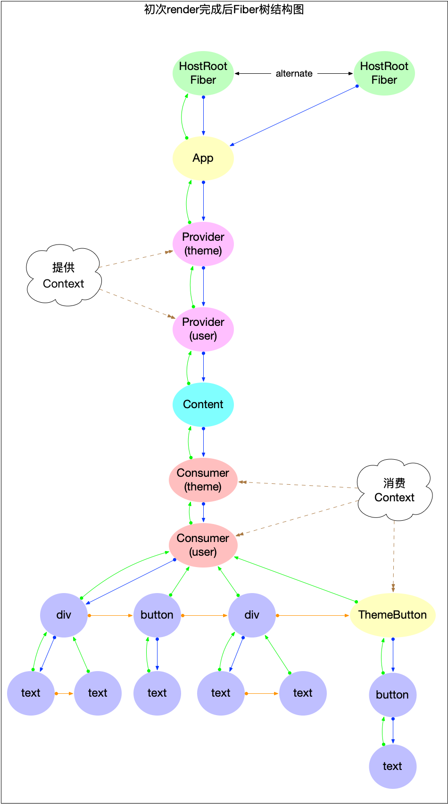
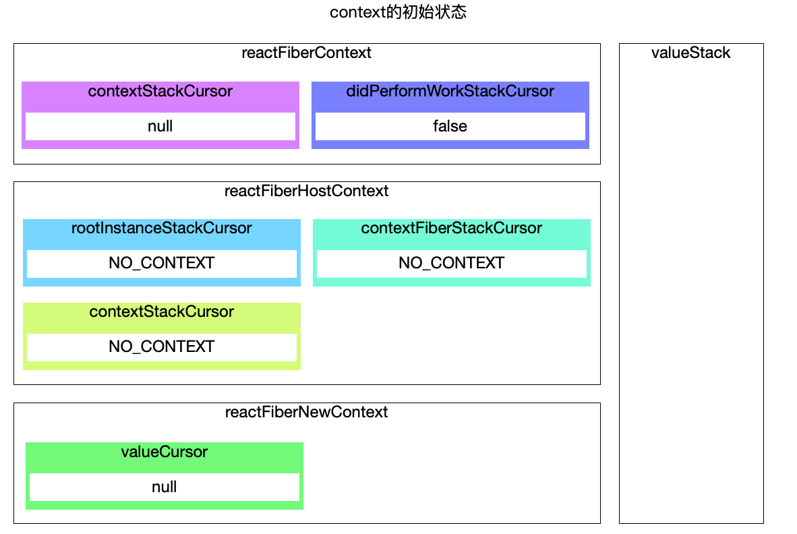
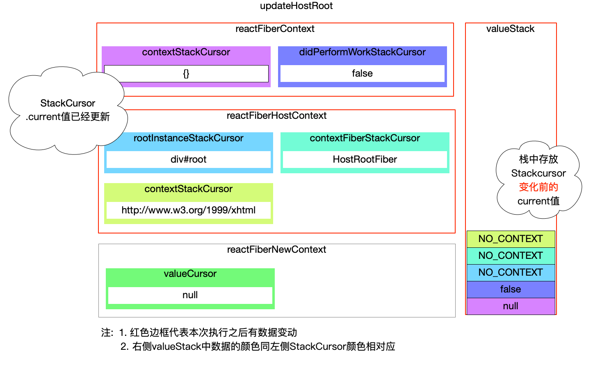
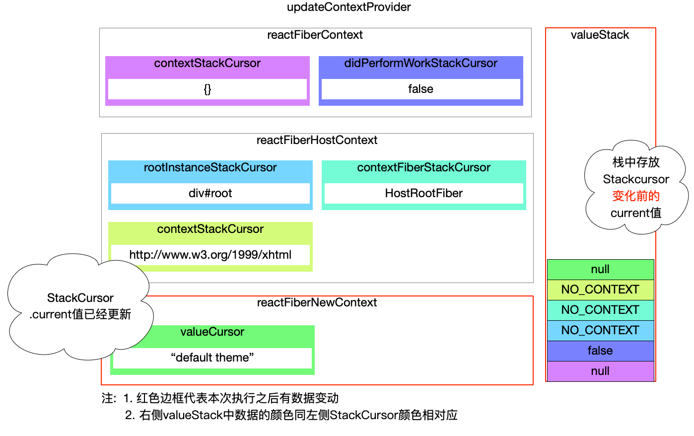
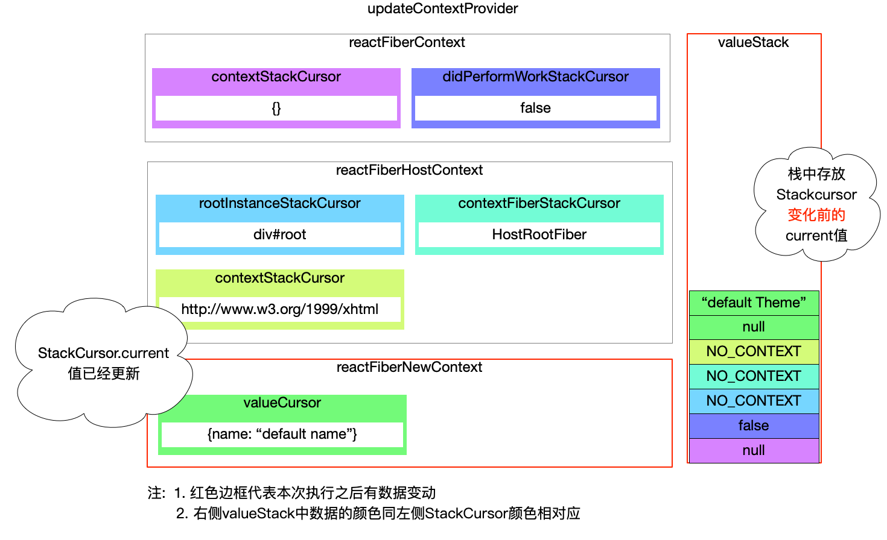
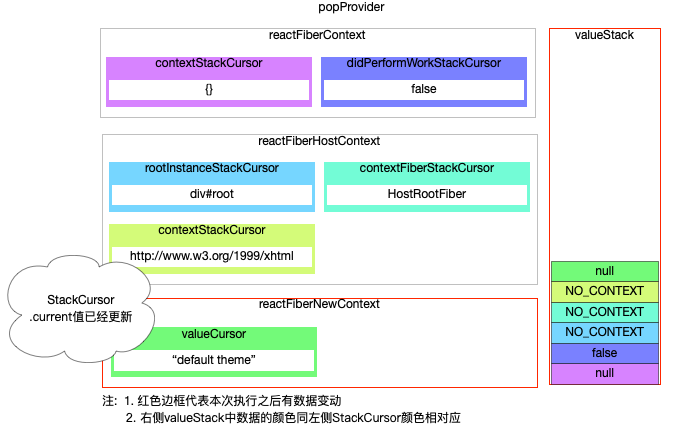
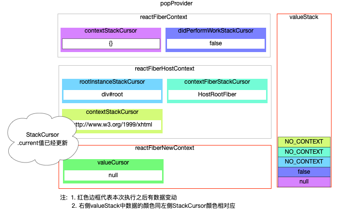
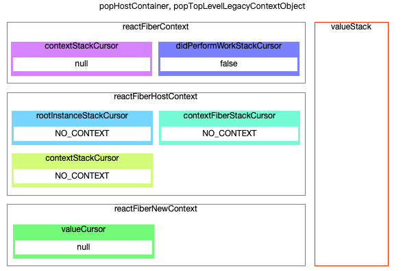
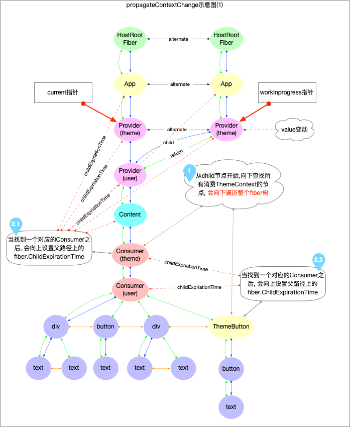

# React Context 机制

在前文中已经分析了[fiber 构建(新增节点)](./render.md)和[fiber 构建(更新节点)](./update.md). react 应用在 fiber 树的构建过程中, 同时也伴随对`context`的使用和管理.

本节重点分析`context`是如何运作的.

## 数据结构

在跟踪 context 源码运行之前, 先了解一下和`context api`有关的数据结构和全局变量.

### 文件分布

在`react-reconciler`包中, 重点关注有 context 命名的 3 个文件.

1. [ReactFiberContext.js](https://github.com/facebook/react/blob/v16.13.1/packages/react-reconciler/src/ReactFiberContext.js). 从其中的函数可以看出, 该文件主要是处理`fiber`和`context`之间的关系.

2. [ReactFiberNewContext.js](https://github.com/facebook/react/blob/v16.13.1/packages/react-reconciler/src/ReactFiberNewContext.js). 该文件是处理最新的 context(通过`React.createContext`进行创建),不涉及[过时的 context](https://zh-hans.reactjs.org/docs/context.html#legacy-api). 其中的部分函数只在`concurrent`模式才会调用(可以先忽略, 不妨碍对 context 流程的分析).

3. [ReactFiberHostContext.js](https://github.com/facebook/react/blob/v16.13.1/packages/react-reconciler/src/ReactFiberHostContext.js). 该文件虽然以`context`命名, 但是和 react 中的`context api`没有关系, 主要是为了维护 DOM 节点的[Namespaces](https://infra.spec.whatwg.org/#namespaces)和 fiber 的对应关系.
   - 维护的`namespace`会在[创建 dom 节点](https://github.com/facebook/react/blob/v16.13.1/packages/react-dom/src/client/ReactDOMComponent.js#L384)的时候使用.
   - 大多数情况下都是`html namespace`.
   - 特殊情况: 比如引用了一个`svg`组件, 那么`svg`组件的所有子节点都必须是`svg namespace`.

这 3 个文件中, 真正和`react context`有关的只有前两个, 由于在 fiber 树的构建过程中对于这 3 个文件的使用方式非常相近(后文会体现, 都通过`valueStack`进行管理), 所以放在一起进行说明.

### 全局变量

上述 3 个文件都有一个共同的特点, 就是在文件开始定义了一些`StackCursor`类型的全局变量.

`ReactFiberContext.js`中:

```js
export const emptyContextObject = {};

// A cursor to the current merged context object on the stack.
// 管理当前合并后的context, 主要是涉及对过时context的兼容
let contextStackCursor: StackCursor<Object> = createCursor(emptyContextObject);
// A cursor to a boolean indicating whether the context has changed.
// 管理context是否改变
let didPerformWorkStackCursor: StackCursor<boolean> = createCursor(false);
// Keep track of the previous context object that was on the stack.
// We use this to get access to the parent context after we have already
// pushed the next context provider, and now need to merge their contexts.
let previousContext: Object = emptyContextObject;
```

`ReactFiberNewContext.js`中:

```js
// 管理 React.CreateContext()创建出来的context
const valueCursor: StackCursor<mixed> = createCursor(null);
```

`ReactFiberHostContext.js`中:

```js
const NO_CONTEXT: NoContextT = ({}: any);
// 管理namespaces
let contextStackCursor: StackCursor<HostContext | NoContextT> = createCursor(
  NO_CONTEXT,
);
// 管理fiber节点
let contextFiberStackCursor: StackCursor<Fiber | NoContextT> = createCursor(
  NO_CONTEXT,
);
// 管理根节点实例(dom对象)
let rootInstanceStackCursor: StackCursor<Container | NoContextT> = createCursor(
  NO_CONTEXT,
);
```

另外在[`ReactFiberStack.js`](https://github.com/facebook/react/blob/v16.13.1/packages/react-reconciler/src/ReactFiberStack.js#L12)中, 定义了`StackCursor`, 并且维护了一个栈`valueStack`:

```js
export type StackCursor<T> = {| current: T |};

const valueStack: Array<any> = [];

let index = -1;

function createCursor<T>(defaultValue: T): StackCursor<T> {
  return {
    current: defaultValue,
  };
}

function pop<T>(cursor: StackCursor<T>, fiber: Fiber): void {
  if (index < 0) {
    return;
  }
  // 先还原`cursor.current`为旧值
  cursor.current = valueStack[index];
  // 再将旧值出栈
  valueStack[index] = null;
  index--;
}

function push<T>(cursor: StackCursor<T>, value: T, fiber: Fiber): void {
  index++;
  // 先将旧值`cursor.current`入栈
  valueStack[index] = cursor.current;
  // 再更新`cursor.current`为新值
  cursor.current = value;
}
```

这些全局的`StackCursor`和`valueStack`是`react context`得以实现的基本保证.

### context 对象

[context 的数据结构](https://github.com/facebook/react/blob/v16.13.1/packages/react/src/ReactContext.js#L35).

```js
export function createContext<T>(
  defaultValue: T,
  calculateChangedBits: ?(a: T, b: T) => number,
): ReactContext<T> {
  if (calculateChangedBits === undefined) {
    calculateChangedBits = null;
  }
  const context: ReactContext<T> = {
    $$typeof: REACT_CONTEXT_TYPE,
    _calculateChangedBits: calculateChangedBits,
    _currentValue: defaultValue,
    _currentValue2: defaultValue,
    _threadCount: 0,
    Provider: (null: any),
    Consumer: (null: any),
  };

  context.Provider = {
    $$typeof: REACT_PROVIDER_TYPE,
    _context: context,
  };

  context.Consumer = context;
  return context;
}
```

可以看出`context.Provider`和`context.Consumer`都是 reactElement 对象. 在 fiber 树构建之后, 会对应不同的 fiber 节点.

## 演示示例

示例代码(`context 的嵌套消费`)如下:

```jsx
import React from 'react';
// Theme context
const ThemeContext = React.createContext('default theme');

// User context
const UserContext = React.createContext({
  name: 'default name',
});

class App extends React.Component {
  state = {};
  changeUser = () => {
    this.setState({
      user: { name: `user ${Math.ceil(Math.random() * 100)}` },
    });
  };
  changeTheme = () => {
    this.setState({
      theme: `theme ${Math.ceil(Math.random() * 100)}`,
    });
  };
  render() {
    const {
      user = { name: 'initial user' },
      theme = 'initial theme',
    } = this.state;

    // 提供初始 context 值的 App 组件
    return (
      <ThemeContext.Provider value={theme}>
        <UserContext.Provider value={user}>
          <Content
            onChangeUser={this.changeUser}
            onChangeTheme={this.changeTheme}
          />
        </UserContext.Provider>
      </ThemeContext.Provider>
    );
  }
}

class ThemedButton extends React.Component {
  static contextType = ThemeContext;
  render() {
    let theme = this.context;
    return <button onClick={this.props.onClick}>{theme}</button>;
  }
}

// 一个组件嵌套消费多个 context
function Content(props) {
  return (
    <ThemeContext.Consumer>
      {theme => (
        <UserContext.Consumer>
          {user => (
            <>
              <div>user: {JSON.stringify(user)}</div>
              <button onClick={props.onChangeUser}>{user.name}</button>
              <div>theme: {theme}</div>
              <ThemedButton onClick={props.onChangeTheme} />
            </>
          )}
        </UserContext.Consumer>
      )}
    </ThemeContext.Consumer>
  );
}

export default App;
```

### context 初始值

`ThemeContext`和`UserContext`的初始情况如下:

```js
// 伪代码 表示 ThemeContext 的初始情况
ThemeContext = {
  $$typeof: REACT_CONTEXT_TYPE,
  _calculateChangedBits: calculateChangedBits,
  _currentValue: 'default theme', // 注意此时的_currentValue是初始值
  _currentValue2: 'default theme',
  _threadCount: 0,
  Provider: {
    $$typeof: REACT_PROVIDER_TYPE,
    _context: ThemeContext,
  },
  Consumer: ThemeContext,
};

// 伪代码 表示 UserContext 的初始情况
UserContext = {
  $$typeof: REACT_CONTEXT_TYPE,
  _calculateChangedBits: calculateChangedBits,
  _currentValue: 'default user', // 注意此时的_currentValue是初始值
  _currentValue2: 'default user',
  _threadCount: 0,
  Provider: {
    $$typeof: REACT_PROVIDER_TYPE,
    _context: UserContext,
  },
  Consumer: UserContext,
};
```

### fiber 树结构

初次 render 过后的 fiber 树结构图如下:



从 fiber 树的构造过程可以提取出来以下 7 个重要的 fiber 节点与`context`有关, 后文逐一分析这些过程:

1. `HostRootFiber`对应`updateHostRoot`
2. `ThemeContext.Provider`对应`updateContextProvider`, 提供`ThemeContext`
3. `UserContext.Provider`对应`updateContextProvider`, 提供`UserContext`
4. `Content`对应`mountIndeterminateComponent`(初次 render)和`updateFunctionComponent`(update)
5. `ThemeContext.Consumer`对应`updateContext`, 消费`ThemeContext`
6. `UserContext.Consumer`对应`updateContext`, 消费`UserContext`
7. `ThemedButton`对应`updateClassComponent`, 消费`ThemeContext`

其余节点(如 div,button 等`HostComponent`类型的节点)和`context`没有关系, 其所有属性都通过父组件的`props`传入, 这类组件没有生产和控制`props`的能力, 也不会感知到`props`属性的来源, 只需要按照`props`进行更新就行.

## 调用过程

下文将从 react 应用启动开始, 逐一分析 context 的使用过程

### 初始内存状态

根据前文的学习, react 启动必然会进入`updateContainer`之后开启调度(可参见[React 应用初始化](./bootstrap.md#调用更新入口))

`updateContainer`

```js
// ... 函数中省略了与context无关代码
export function updateContainer(
  element: ReactNodeList,
  container: OpaqueRoot,
  parentComponent: ?React$Component<any, any>,
  callback: ?Function,
): ExpirationTime {
  const current = container.current; // current指向的是HostRootFiber(Fiber树的根节点)
  // 获取当前parentComponent上关联的context, 执行后返回emptyContextObject, 是一个{}
  const context = getContextForSubtree(parentComponent);
  if (container.context === null) {
    // 设置FiberRoot.context
    container.context = context;
  }
  // 调度和更新current(HostRootFiber)对象
  scheduleUpdateOnFiber(current, expirationTime);
  return expirationTime;
}
```

在进入 fiber 构建之前, 内存中`StackCursor`和`valueStack`的状态如下:



### 使用 context

每一个 fiber 节点的创建, 都会经过`beginWork`和`completeWork`两个阶段, 其中同时伴随`context`的使用和消费

### [beginWork](https://github.com/facebook/react/blob/v16.13.1/packages/react-reconciler/src/ReactFiberBeginWork.js#L2874)阶段

1. `HostRootFiber`与[updateHostRoot](https://github.com/facebook/react/blob/v16.13.1/packages/react-reconciler/src/ReactFiberBeginWork.js#L987)

```js
// 省略和context无关的代码
function updateHostRoot(current, workInProgress, renderExpirationTime) {
  pushHostRootContext(workInProgress);
  //...
}

function pushHostRootContext(workInProgress) {
  const root = (workInProgress.stateNode: FiberRoot);
  if (root.pendingContext) {
    pushTopLevelContextObject(
      workInProgress,
      root.pendingContext,
      root.pendingContext !== root.context,
    );
  } else if (root.context) {
    // Should always be set
    pushTopLevelContextObject(workInProgress, root.context, false);
  }
  pushHostContainer(workInProgress, root.containerInfo);
}
```

可以看到在`updateHostRoot`函数开始时调用`pushHostRootContext`, 可以继续跟踪该函数, 最后是对相关的`StackCursor`进行入栈操作.

执行完成之后`StackCursor`和`valueStack`的变化如下(其中红色边框的表示有变化的部分):



注意:

- `StackCursor.current`属性已经更新, 旧的值被压入到`valueStack`栈中
- 在`reactFiberHostContext.js`文件中定义的`rootInstanceStackCursor`,`contextFiberStackCursor`,`contextStackCursor`这 3 个`StackCursor`是维护 DOM 节点的[Namespaces](https://infra.spec.whatwg.org/#namespaces)与`fiber`节点之间的对应关系, 和`react context`没有直接联系. 因为它们也被纳入了`valueStack`栈中统一管理, 为了展示`valueStack`的真实 1 情况, 所以在此处一并列举出来. 不会影响对`react context`的分析.

2. `ThemeContext.Provider`与[`updateContextProvider`](https://github.com/facebook/react/blob/v16.13.1/packages/react-reconciler/src/ReactFiberBeginWork.js#L2610)

在`beginWork`阶段,`ThemeContext.Provider`类型的组件会进入`updateContextProvider`函数进行`fiber`子节点构建.

```js
// 省略和context无关的代码
function updateContextProvider(
  current: Fiber | null,
  workInProgress: Fiber,
  renderExpirationTime: ExpirationTime,
) {
  const providerType: ReactProviderType<any> = workInProgress.type;
  const context: ReactContext<any> = providerType._context;

  const newProps = workInProgress.pendingProps;
  const oldProps = workInProgress.memoizedProps;

  const newValue = newProps.value; // newValue就是传入的新值 "initial theme"

  pushProvider(workInProgress, newValue);

  if (oldProps !== null) {
    // context更新后会进入, 在后文会详细解释
    // 为了突出重点, 省略这部分代码
  }
}
```

进入`updateContextProvider`函数之后, 调用`pushProvider(workInProgress, newValue)`

```js
export function pushProvider<T>(providerFiber: Fiber, nextValue: T): void {
  const context: ReactContext<T> = providerFiber.type._context;
  push(valueCursor, context._currentValue, providerFiber);
  context._currentValue = nextValue;
}
```

执行完成之后`StackCursor`和`valueStack`的变化如下:



这次变动的是`reactFiberNewContext.js`中的`valueCursor`. 执行之后`valueCursor.current="default theme"`, `ThemeContext._currentValue="initial theme"`

注意: `valueCursor`中保存的是`ThemeContext._currentValue`的默认值(`default theme`). 而当前的`ThemeContext._currentValue`已经变成最新值`initial theme`供给子组件消费.

记录`ThemeContext`值的变化:


3. `UserContext.Provider`与[`updateContextProvider`](https://github.com/facebook/react/blob/v16.13.1/packages/react-reconciler/src/ReactFiberBeginWork.js#L2610)

这一步和第 2 步是一样的, 示例代码中连续嵌套了 2 个`Provider`. 执行完成之后`StackCursor`和`valueStack`的变化如下:



注意: `valueCursor`中保存的是`UserContext._currentValue`的默认值(`{name: 'default name'}`). 而当前的`UserContext._currentValue`已经变成最新值`{name: 'initial name'}`供给子组件消费.

记录`UserContext`值的变化:


4. `Content`与[`mountIndeterminateComponent`](https://github.com/facebook/react/blob/v16.13.1/packages/react-reconciler/src/ReactFiberBeginWork.js#L1306)

由于`Content`是函数组件, 在首次 render 时由于类型还未确立, 会进入`mountIndeterminateComponent`.

```js
// 省略和context无关的代码
function mountIndeterminateComponent(
  _current,
  workInProgress,
  Component,
  renderExpirationTime,
) {
  const props = workInProgress.pendingProps;
  let context;
  if (!disableLegacyContext) {
    // 默认是会进入这个if分支
    const unmaskedContext = getUnmaskedContext(
      workInProgress,
      Component,
      false,
    );
    // 此处的context只有使用过时的context api时才会有值, 其余情况都为空{}
    context = getMaskedContext(workInProgress, unmaskedContext);
  }
  prepareToReadContext(workInProgress, renderExpirationTime);
}
```

其中`getMaskedContext`是为了兼容`过时的context api`, 最终返回`workInProgress.contextTypes`的所有属性组成的一个 context 对象,在本例中会返回`{}`.

`prepareToReadContext`, 重置和更新公用的全局变量, 为接下来调用`readContext`做准备.

```js
export function prepareToReadContext(
  workInProgress: Fiber,
  renderExpirationTime: ExpirationTime,
): void {
  currentlyRenderingFiber = workInProgress;
  lastContextDependency = null;
  lastContextWithAllBitsObserved = null;

  const dependencies = workInProgress.dependencies;
  if (dependencies !== null) {
    // 在context更新阶段才会进入
    const firstContext = dependencies.firstContext;
    if (firstContext !== null) {
      if (dependencies.expirationTime >= renderExpirationTime) {
        // 如果dependencies有更新,表明此节点依赖的context有更新, 把当前节点标记成需要更改
        markWorkInProgressReceivedUpdate();
      }
      // Reset the work-in-progress list
      dependencies.firstContext = null;
    }
  }
}
```

由于本例中`Content`为函数组件, 该 fiber 节点后面的 render 过程并不会调用`readContext`, 所以`Content`组件并没有消费 context.

5. `ThemeContext.Consumer`与[`updateContextConsumer`](https://github.com/facebook/react/blob/v16.13.1/packages/react-reconciler/src/ReactFiberBeginWork.js#L2673)

```js
// 省略和context无关的代码
function updateContextConsumer(
  current: Fiber | null,
  workInProgress: Fiber,
  renderExpirationTime: ExpirationTime,
) {
  let context: ReactContext<any> = workInProgress.type;
  const newProps = workInProgress.pendingProps;
  const render = newProps.children;
  prepareToReadContext(workInProgress, renderExpirationTime);
  const newValue = readContext(context, newProps.unstable_observedBits);
  // consumer组件的children是一个函数, 调用时传入最新的context的值
  let newChildren = render(newValue);
}
```

`prepareToReadContext`上文已经分析, 直接看`readContext`. **这是 context 消费的重点**

```js
// 设置当前fiber节点的dependencies属性, 为了更新context做准备
// 返回context._currentValue
export function readContext<T>(
  context: ReactContext<T>,
  observedBits: void | number | boolean,
): T {
  if (lastContextWithAllBitsObserved === context) {
    // Nothing to do. We already observe everything in this context.
  } else if (observedBits === false || observedBits === 0) {
    // Do not observe any updates.
  } else {
    let resolvedObservedBits;
    if (
      typeof observedBits !== 'number' ||
      observedBits === MAX_SIGNED_31_BIT_INT
    ) {
      // Observe all updates.
      lastContextWithAllBitsObserved = ((context: any): ReactContext<mixed>);
      resolvedObservedBits = MAX_SIGNED_31_BIT_INT;
    } else {
      resolvedObservedBits = observedBits;
    }

    let contextItem = {
      context: ((context: any): ReactContext<mixed>),
      observedBits: resolvedObservedBits,
      next: null,
    };

    if (lastContextDependency === null) {
      // This is the first dependency for this component. Create a new list.
      lastContextDependency = contextItem;
      // 设置dependencies是为了context的更新做准备
      currentlyRenderingFiber.dependencies = {
        expirationTime: NoWork,
        firstContext: contextItem,
        responders: null,
      };
    } else {
      // Append a new context item.
      lastContextDependency = lastContextDependency.next = contextItem;
    }
  }
  return isPrimaryRenderer ? context._currentValue : context._currentValue2;
}
```

注意:

- `readContext`最终返回的是`context._currentValue`, 不是`context`, `context`对象一直就没有变, 只是`context._currentValue`在变.
- 设置`currentlyRenderingFiber.dependencies`, 是为了[context 的更新](https://github.com/facebook/react/blob/v16.13.1/packages/react-reconciler/src/ReactFiberNewContext.js#L324)做准备, 在后文详细说明.

随后执行`let newChildren = render(newValue);`进行 context 的消费, 参数`newValue`就是`ThemeContext._currentValue="initial theme"`.

6. `UserContext.Consumer`与`updateContextConsumer`
   这一步的运行逻辑和上一步完全一样.

需要注意的是 context 嵌套的使用方式:

```js
// 一个组件嵌套消费多个 context
function Content(props) {
  return (
    <ThemeContext.Consumer>
      {theme => (
        <UserContext.Consumer>
          {user => (

          )}
        </UserContext.Consumer>.
      )}
    </ThemeContext.Consumer>
  );
}
```

无论`Consumer`如何嵌套, 其中每一个独立的`Consumer`(如`ThemeContext.Consumer`或`UserContext.Consumer`)只能消费与之对应的`Provider`所提供的`context`.

7. `ThemedButton`与[`updateClassComponent`](https://github.com/facebook/react/blob/v16.13.1/packages/react-reconciler/src/ReactFiberBeginWork.js#L778)

这一步是为了演示`Class类型`的组件如何消费`context`.

首先从使用上来看:

```js
class ThemedButton extends React.Component {
  // 第1步: 在class实例化之前, 定义一个静态属性 contextType, 并且赋值为需要消费的那一个context
  static contextType = ThemeContext;
  render() {
    // 第2步: 在class实例化之后, 即可消费context
    let theme = this.context;
    return <button onClick={this.props.onClick}>{theme}</button>;
  }
}
```

从源码上来看:

```js
// 省略和context无关的代码
function updateClassComponent(
  current: Fiber | null,
  workInProgress: Fiber,
  Component: any,
  nextProps,
  renderExpirationTime: ExpirationTime,
) {
  let hasContext;
  if (isLegacyContextProvider(Component)) {
    // 这一部分是对过时context api进行兼容
    hasContext = true;
    pushLegacyContextProvider(workInProgress);
  } else {
    hasContext = false;
  }
  prepareToReadContext(workInProgress, renderExpirationTime);

  const instance = workInProgress.stateNode;
  let shouldUpdate;
  if (instance === null) {
    // In the initial pass we might need to construct the instance.
    constructClassInstance(workInProgress, Component, nextProps);
    mountClassInstance(
      workInProgress,
      Component,
      nextProps,
      renderExpirationTime,
    );
    shouldUpdate = true;
  }
}
```

和函数型组件步骤相似, 先调用`prepareToReadContext`(参见上文), 然后在实例化 class(`constructClassInstance`)过程中去消费 context

```js
// 省略和context无关的代码
function constructClassInstance(
  workInProgress: Fiber,
  ctor: any,
  props: any,
): any {
  let isLegacyContextConsumer = false;
  let unmaskedContext = emptyContextObject;
  let context = emptyContextObject;
  const contextType = ctor.contextType;

  if (typeof contextType === 'object' && contextType !== null) {
    // 正常读取需要消费的context
    context = readContext((contextType: any));
  } else if (!disableLegacyContext) {
    unmaskedContext = getUnmaskedContext(workInProgress, ctor, true);
    const contextTypes = ctor.contextTypes;
    isLegacyContextConsumer =
      contextTypes !== null && contextTypes !== undefined;
    // 和function组件一样, 此处的context只有使用过时的context api时才会有值, 其余情况都为空{}
    context = isLegacyContextConsumer
      ? getMaskedContext(workInProgress, unmaskedContext)
      : emptyContextObject;
  }

  // 实例化class组件
  const instance = new ctor(props, context);

  if (isLegacyContextConsumer) {
    cacheContext(workInProgress, unmaskedContext, context);
  }

  return instance;
}
```

可以看到调用`readContext`(参见上文)对当前`Component.contextType`进行消费.

然后`mountClassInstance`过程中, 会将最新的 context 值挂载到 class 实例上. 所以在 class 组件内部, 都可以通过`this.context`获取

```js
// 省略和context无关的代码
function mountClassInstance(
  workInProgress: Fiber,
  ctor: any,
  newProps: any,
  renderExpirationTime: ExpirationTime,
): void {
  const instance = workInProgress.stateNode;
  const contextType = ctor.contextType;
  // 将context的值挂载到class实例之上
  if (typeof contextType === 'object' && contextType !== null) {
    instance.context = readContext(contextType);
  } else if (disableLegacyContext) {
    instance.context = emptyContextObject;
  } else {
    const unmaskedContext = getUnmaskedContext(workInProgress, ctor, true);
    instance.context = getMaskedContext(workInProgress, unmaskedContext);
  }
}
```

对于示例代码中的 7 个和 context 相关的组件都已经逐一分析了, 其中在`UserContext.Provider`组件之后, 内存中的 context 存储就再也没有变化过

可以总结如下:

- 通过`React.createContext`来创建一个 context
- 通过`Context.Provider`控制`context`变化
- 只有 2 类组件可以消费`context`: `Context.Consumer`和`Class`类型组件

### [completeWork](https://github.com/facebook/react/blob/v16.13.1/packages/react-reconciler/src/ReactFiberCompleteWork.js#L636)阶段

上文中介绍了`beginWork`阶段中与`context`相关的组件运行情况, 总的来讲就是将`context`的值入栈保存. `completeWork`阶段执行完成之后, `fiber`节点就构造完成了, 同时伴随着 context 的出栈.

先定位到[`completeWork`](https://github.com/facebook/react/blob/v16.13.1/packages/react-reconciler/src/ReactFiberCompleteWork.js#L636):

```js
// 省略和context无关的代码
// 省略暂时无关的case
function completeWork(
  current: Fiber | null,
  workInProgress: Fiber,
  renderExpirationTime: ExpirationTime,
): Fiber | null {
  const newProps = workInProgress.pendingProps;

  switch (workInProgress.tag) {
    case FunctionComponent:
    case Fragment:
    case ContextConsumer:
      return null;
    case ClassComponent: {
      const Component = workInProgress.type;
      if (isLegacyContextProvider(Component)) {
        // 过时的context api会进入
        popLegacyContext(workInProgress);
      }
      return null;
    }
    case HostRoot: {
      popHostContainer(workInProgress);
      popTopLevelLegacyContextObject(workInProgress);
    }
    case HostComponent: {
      popHostContext(workInProgress);
    }
    case ContextProvider:
      // Pop provider fiber
      popProvider(workInProgress);
      return null;
  }
}
```

可以看到在`beginWork`阶段执行过`push`操作的, 在`completeWork`阶段就会有一个对应的`pop`.

根据示例代码中的组件顺序, 在`completeWork`阶段依次会执行:

1. `ThemedButton`对应`case ClassComponent`
   在新的 context api 中, class 类型的组件只能消费 context, 无法生产和改变 context, 所以在 case 中并没有任何处理. 只对过时的 context 进行操作.

2. `UserContext.Consumer`对应`case ContextConsumer`
   作为消费 context 的组件, 不会有任何操作
3. `ThemeContext.Consumer`对应`case ContextConsumer`
   作为消费 context 的组件, 不会有任何操作
4. `Content`对应`case FunctionComponent`
   作为消费 context 的组件, 不会有任何操作
5. `UserContext.Provider`对应`case ContextProvider`
   作为生产 context 的组件,`beginWork`阶段通过`push`操作暂存到`valueCursor`的值会还原到`UserContext`中来.

`popProvider`:

```js
export function popProvider(providerFiber: Fiber): void {
  const currentValue = valueCursor.current;

  pop(valueCursor, providerFiber);

  const context: ReactContext<any> = providerFiber.type._context;
  if (isPrimaryRenderer) {
    context._currentValue = currentValue;
  } else {
    context._currentValue2 = currentValue;
  }
}
```

`popProvider`执行完成之后`StackCursor`和`valueStack`的变化如下:



`UserContext`值的也回到了默认值`{name: 'default name'}`:


12. `ThemeContext.Provider`对应`case ContextProvider`

`popProvider`执行完成之后`StackCursor`和`valueStack`的变化如下:



`ThemeContext`值的也回到了默认值`'default theme'`:


13. `HostRootFiber`对应`case HostRoot`
    同样也是`valueStack`出栈和`StackCursor`的还原.



此时内存中`valueStack`出栈和`StackCursor`都已经恢复到了初始状态, 与 fiber 树构建之前是完全一样的.

### 更新 context

更新过程同样也要构建新的 fiber 树, 从上至下的构建过程和初次渲染的逻辑是一模一样的.

比如点击 button 之后触发`changeUser`, 导致 user 变化(假设变化后的值`{ name: "user 11"}`):

```js
changeUser = () => {
  this.setState({
    user: { name: `user ${Math.ceil(Math.random() * 100)}` },
  });
};
```

那么`UserContext.Provider`组件中的`value`发生变化, 初次渲染是`{ name: "initial user"}`, 本次是`{ name: "user 11"}`.

之后在`beginWork`和`completWork`阶段对 context 的处理逻辑, 入栈和出栈等逻辑都和初次渲染一样.

需要说明的是如何确定需要更新的节点, 比方说`ThemeContext.Provider`组件中的`value`发生变化, 那么所有消费该`context`(`ThemeContext.Consumer`和`ThemeButton`)的节点必须更新.如何找出这些必须更新的节点, 是`conext`更新阶段一个的重点.

### 生成新的 fiber 树

在上文中`updateContextProvider`函数有一部分逻辑, 是专门在更新阶段中使用的

```js
// 省略和context无关的代码
function updateContextProvider(
  current: Fiber | null,
  workInProgress: Fiber,
  renderExpirationTime: ExpirationTime,
) {
  const providerType: ReactProviderType<any> = workInProgress.type;
  const context: ReactContext<any> = providerType._context;

  const newProps = workInProgress.pendingProps;
  const oldProps = workInProgress.memoizedProps;

  const newValue = newProps.value; // newValue就是传入的新值 "initial theme"

  pushProvider(workInProgress, newValue);

  if (oldProps !== null) {
    const oldValue = oldProps.value;
    const changedBits = calculateChangedBits(context, newValue, oldValue);
    if (changedBits === 0) {
      // 如果context没有变化, 调用bailoutOnAlreadyFinishedWork检测子节点是否需要更新
      if (
        oldProps.children === newProps.children &&
        !hasLegacyContextChanged()
      ) {
        return bailoutOnAlreadyFinishedWork(
          current,
          workInProgress,
          renderExpirationTime,
        );
      }
    } else {
      // 如果context有变动, 标记对此context有依赖的所有fiber节点
      propagateContextChange(
        workInProgress,
        context,
        changedBits,
        renderExpirationTime,
      );
    }
  }
}
```

[`propagateContextChange`](https://github.com/facebook/react/blob/v16.13.1/packages/react-reconciler/src/ReactFiberNewContext.js#L190)源码看似较长, 但是逻辑意图比较清晰, 目的是为了所有消费该`context`的节点能得到更新机会.

```js
// 省略了部分在concurrent模式下才会执行的逻辑, 保留主杆部分
export function propagateContextChange(
  workInProgress: Fiber,
  context: ReactContext<mixed>,
  changedBits: number,
  renderExpirationTime: ExpirationTime,
): void {
  let fiber = workInProgress.child;
  if (fiber !== null) {
    // Set the return pointer of the child to the work-in-progress fiber.
    fiber.return = workInProgress;
  }
  while (fiber !== null) {
    let nextFiber;

    // Visit this fiber.
    const list = fiber.dependencies;
    if (list !== null) {
      nextFiber = fiber.child;

      let dependency = list.firstContext;
      while (dependency !== null) {
        // Check if the context matches.
        if (
          dependency.context === context &&
          (dependency.observedBits & changedBits) !== 0
        ) {
          // Match! Schedule an update on this fiber.

          if (fiber.tag === ClassComponent) {
            // Schedule a force update on the work-in-progress.
            const update = createUpdate(renderExpirationTime, null);
            update.tag = ForceUpdate;
            // TODO: Because we don't have a work-in-progress, this will add the
            // update to the current fiber, too, which means it will persist even if
            // this render is thrown away. Since it's a race condition, not sure it's
            // worth fixing.
            enqueueUpdate(fiber, update);
          }

          if (fiber.expirationTime < renderExpirationTime) {
            fiber.expirationTime = renderExpirationTime;
          }
          let alternate = fiber.alternate;
          if (
            alternate !== null &&
            alternate.expirationTime < renderExpirationTime
          ) {
            alternate.expirationTime = renderExpirationTime;
          }
          // 设置父节点的ChildExpirationTime
          scheduleWorkOnParentPath(fiber.return, renderExpirationTime);
          // Mark the expiration time on the list, too.
          if (list.expirationTime < renderExpirationTime) {
            list.expirationTime = renderExpirationTime;
          }

          // Since we already found a match, we can stop traversing the
          // dependency list.
          break;
        }
        dependency = dependency.next;
      }
    } else if (fiber.tag === ContextProvider) {
      // Don't scan deeper if this is a matching provider
      nextFiber = fiber.type === workInProgress.type ? null : fiber.child;
    } else {
      // Traverse down.
      nextFiber = fiber.child;
    }

    fiber = '下一个需要访问的节点';
  }
}
```

执行过程如图:



1. 进入`propagateContextChange`后, 向下遍历寻找所有消费此`context`的节点.
2. 第 1 步会找到 2 个节点,`ThemeContext.Consumer`和`ThemeButton`
3. 设置 `ThemeContext.Consumer`和`ThemeButton`的`expirationTime`
4. 以`ThemeContext.Consumer`和`ThemeButton`为起点, 向上遍历, 给路径上的父节点设置`childExpirationTime`

设置`childExpirationTime`的目的在[fiber 构建(更新节点)](./update.md#fiber更新的策略)一文中有详细说明, 最终保证了所有消费该`context`的节点能得到更新机会.
