# fiber 树构造(初次创建)

本节的内容完全建立在前文[fiber 树构造(基础准备)](./fibertree-prepare.md)中介绍的基础知识之上, 其中总结了`fiber 树构造`的 2 种情况:

1. 初次创建: 在`React`应用首次启动时, 界面还没有渲染, 此时并不会进入对比过程, 相当于直接构造一棵全新的树.
2. 对比更新: `React`应用启动后, 界面已经渲染. 如果再次发生更新, 创建`新fiber`之前需要和`旧fiber`进行对比. 最后构造的 fiber 树有可能是全新的, 也可能是部分更新的.

本节只讨论`初次创建`这种情况, 为了控制篇幅(本节直击核心源码, 不再介绍基础知识, 可参照[fiber 树构造(基础准备)](./fibertree-prepare.md))并突出`fiber 树构造`过程, 后文会在`Legacy`模式下进行分析(因为只讨论`fiber树构造`原理, `Concurrent`模式与`Legacy`没有区别).

本节示例代码如下([codesandbox 地址](https://codesandbox.io/s/busy-jang-b26hy?file=/src/App.js)):

```js
class App extends React.Component {
  componentDidMount() {
    console.log(`App Mount`);
    console.log(`App 组件对应的fiber节点: `, this._reactInternals);
  }
  render() {
    return (
      <div className="app">
        <header>header</header>
        <Content />
      </div>
    );
  }
}

class Content extends React.Component {
  componentDidMount() {
    console.log(`Content Mount`);
    console.log(`Content 组件对应的fiber节点: `, this._reactInternals);
  }
  render() {
    return (
      <React.Fragment>
        <p>1</p>
        <p>2</p>
      </React.Fragment>
    );
  }
}
export default App;
```

## 启动阶段

在前文[React 应用的启动过程](./bootstrap.md)中分析了 3 种启动模式的差异, 在进入`react-reconciler`包之前(调用`updateContainer`之前), 内存状态图如下:


根据这个结构, 可以在控制台中打出当前页面对应的`fiber`树(用于观察其结构):

```js
document.getElementById('root')._reactRootContainer._internalRoot.current;
```

然后进入`react-reconciler`包调用[updateContainer 函数](https://github.com/facebook/react/blob/v17.0.2/packages/react-reconciler/src/ReactFiberReconciler.old.js#L250-L321):

```js
// ... 省略了部分代码
export function updateContainer(
  element: ReactNodeList,
  container: OpaqueRoot,
  parentComponent: ?React$Component<any, any>,
  callback: ?Function,
): Lane {
  // 获取当前时间戳
  const current = container.current;
  const eventTime = requestEventTime();
  // 1. 创建一个优先级变量(车道模型)
  const lane = requestUpdateLane(current);

  // 2. 根据车道优先级, 创建update对象, 并加入fiber.updateQueue.pending队列
  const update = createUpdate(eventTime, lane);
  update.payload = { element };
  callback = callback === undefined ? null : callback;
  if (callback !== null) {
    update.callback = callback;
  }
  enqueueUpdate(current, update);

  // 3. 进入reconciler运作流程中的`输入`环节
  scheduleUpdateOnFiber(current, lane, eventTime);
  return lane;
}
```

由于`update`对象的创建, 此时的内存结构如下:

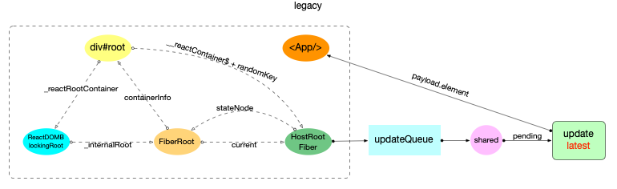

注意: 最初的`ReactElement`对象`<App/>`被挂载到`HostRootFiber.updateQueue.shared.pending.payload.element`中, 后文`fiber树构造`过程中会再次变动.

## 构造阶段

为了突出构造过程,排除干扰,先把内存状态图中的`FiberRoot`和`HostRootFiber`单独提出来(后文在此基础上添加):

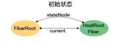

在[scheduleUpdateOnFiber 函数](https://github.com/facebook/react/blob/v17.0.2/packages/react-reconciler/src/ReactFiberWorkLoop.old.js#L517-L619)中:

```js
// ...省略部分代码
export function scheduleUpdateOnFiber(
  fiber: Fiber,
  lane: Lane,
  eventTime: number,
) {
  // 标记优先级
  const root = markUpdateLaneFromFiberToRoot(fiber, lane);
  if (lane === SyncLane) {
    if (
      (executionContext & LegacyUnbatchedContext) !== NoContext &&
      (executionContext & (RenderContext | CommitContext)) === NoContext
    ) {
      // 首次渲染, 直接进行`fiber构造`
      performSyncWorkOnRoot(root);
    }
    // ...
  }
}
```

可以看到, 在`Legacy`模式下且首次渲染时, 有 2 个函数[markUpdateLaneFromFiberToRoot](https://github.com/facebook/react/blob/v17.0.2/packages/react-reconciler/src/ReactFiberWorkLoop.old.js#L625-L667)和[performSyncWorkOnRoot](https://github.com/facebook/react/blob/v17.0.2/packages/react-reconciler/src/ReactFiberWorkLoop.old.js#L965-L1045).

其中`markUpdateLaneFromFiberToRoot(fiber, lane)`函数在`fiber树构造(对比更新)`中才会发挥作用, 因为在`初次创建`时并没有与当前页面所对应的`fiber树`, 所以核心代码并没有执行, 最后直接返回了`FiberRoot`对象.

`performSyncWorkOnRoot`看起来源码很多, `初次创建`中真正用到的就 2 个函数:

```js
function performSyncWorkOnRoot(root) {
  let lanes;
  let exitStatus;
  if (
    root === workInProgressRoot &&
    includesSomeLane(root.expiredLanes, workInProgressRootRenderLanes)
  ) {
    // 初次构造时(因为root=fiberRoot, workInProgressRoot=null), 所以不会进入
  } else {
    // 1. 获取本次render的优先级, 初次构造返回 NoLanes
    lanes = getNextLanes(root, NoLanes);
    // 2. 从root节点开始, 至上而下更新
    exitStatus = renderRootSync(root, lanes);
  }

  // 将最新的fiber树挂载到root.finishedWork节点上
  const finishedWork: Fiber = (root.current.alternate: any);
  root.finishedWork = finishedWork;
  root.finishedLanes = lanes;
  // 进入commit阶段
  commitRoot(root);

  // ...后面的内容本节不讨论
}
```

其中`getNextLanes`返回本次 render 的渲染优先级(详见[fiber 树构造(基础准备)](./fibertree-prepare.md#优先级)中`优先级`相关小节)

[renderRootSync](https://github.com/facebook/react/blob/v17.0.2/packages/react-reconciler/src/ReactFiberWorkLoop.old.js#L1490-L1553)

```js
function renderRootSync(root: FiberRoot, lanes: Lanes) {
  const prevExecutionContext = executionContext;
  executionContext |= RenderContext;
  // 如果fiberRoot变动, 或者update.lane变动, 都会刷新栈帧, 丢弃上一次渲染进度
  if (workInProgressRoot !== root || workInProgressRootRenderLanes !== lanes) {
    // 刷新栈帧, legacy模式下都会进入
    prepareFreshStack(root, lanes);
  }
  do {
    try {
      workLoopSync();
      break;
    } catch (thrownValue) {
      handleError(root, thrownValue);
    }
  } while (true);
  executionContext = prevExecutionContext;
  // 重置全局变量, 表明render结束
  workInProgressRoot = null;
  workInProgressRootRenderLanes = NoLanes;
  return workInProgressRootExitStatus;
}
```

在`renderRootSync`中, 在执行`fiber树构造`前(`workLoopSync`)会先刷新栈帧`prepareFreshStack`(参考[fiber 树构造(基础准备)](./fibertree-prepare.md#栈帧管理)).在这里创建了`HostRootFiber.alternate`, 重置全局变量`workInProgress`和`workInProgressRoot`等.

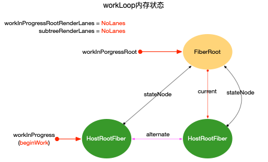

### 循环构造

逻辑来到`workLoopSync`, 虽然本节在`Legacy`模式下进行讨论, 此处还是对比一下`workLoopConcurrent`

```js
function workLoopSync() {
  while (workInProgress !== null) {
    performUnitOfWork(workInProgress);
  }
}

function workLoopConcurrent() {
  // Perform work until Scheduler asks us to yield
  while (workInProgress !== null && !shouldYield()) {
    performUnitOfWork(workInProgress);
  }
}
```

可以看到`workLoopConcurrent`相比于`Sync`, 会多一个停顿机制, 这个机制实现了`时间切片`和`可中断渲染`(参考[React 调度原理](./scheduler.md#时间切片原理))

结合`performUnitOfWork函数`([源码地址](https://github.com/facebook/react/blob/v17.0.2/packages/react-reconciler/src/ReactFiberWorkLoop.old.js#L1642-L1668))

```js
// ... 省略部分无关代码
function performUnitOfWork(unitOfWork: Fiber): void {
  // unitOfWork就是被传入的workInProgress
  const current = unitOfWork.alternate;
  let next;
  next = beginWork(current, unitOfWork, subtreeRenderLanes);
  unitOfWork.memoizedProps = unitOfWork.pendingProps;
  if (next === null) {
    // 如果没有派生出新的节点, 则进入completeWork阶段, 传入的是当前unitOfWork
    completeUnitOfWork(unitOfWork);
  } else {
    workInProgress = next;
  }
}
```

可以明显的看出, 整个`fiber树构造`是一个深度优先遍历(可参考[React 算法之深度优先遍历](../algorithm/dfs.md)), 其中有 2 个重要的变量`workInProgress`和`current`(可参考前文[fiber 树构造(基础准备)](./fibertree-prepare.md#双缓冲技术)中介绍的`双缓冲技术`):

- `workInProgress`和`current`都视为指针
- `workInProgress`指向当前正在构造的`fiber`节点
- `current = workInProgress.alternate`(即`fiber.alternate`), 指向当前页面正在使用的`fiber`节点. 初次构造时, 页面还未渲染, 此时`current = null`.

在深度优先遍历中, 每个`fiber`节点都会经历 2 个阶段:

1. 探寻阶段 `beginWork`
2. 回溯阶段 `completeWork`

这 2 个阶段共同完成了每一个`fiber`节点的创建, 所有`fiber`节点则构成了`fiber树`.

### 探寻阶段 beginWork

`beginWork(current, unitOfWork, subtreeRenderLanes)`([源码地址](https://github.com/facebook/react/blob/v17.0.2/packages/react-reconciler/src/ReactFiberBeginWork.old.js#L3083-L3494))针对所有的 Fiber 类型, 其中的每一个 case 处理一种 Fiber 类型. `updateXXX`函数(如: `updateHostRoot`, `updateClassComponent` 等)的主要逻辑:

1. 根据 `ReactElement`对象创建所有的`fiber`节点, 最终构造出`fiber树形结构`(设置`return`和`sibling`指针)
2. 设置`fiber.flags`(二进制形式变量, 用来标记 `fiber`节点 的`增,删,改`状态, 等待`completeWork阶段处理`)
3. 设置`fiber.stateNode`局部状态(如`Class类型`节点: `fiber.stateNode=new Class()`)

```js
function beginWork(
  current: Fiber | null,
  workInProgress: Fiber,
  renderLanes: Lanes,
): Fiber | null {
  const updateLanes = workInProgress.lanes;
  if (current !== null) {
    // update逻辑, 首次render不会进入
  } else {
    didReceiveUpdate = false;
  }
  // 1. 设置workInProgress优先级为NoLanes(最高优先级)
  workInProgress.lanes = NoLanes;
  // 2. 根据workInProgress节点的类型, 用不同的方法派生出子节点
  switch (
    workInProgress.tag // 只保留了本例使用到的case
  ) {
    case ClassComponent: {
      const Component = workInProgress.type;
      const unresolvedProps = workInProgress.pendingProps;
      const resolvedProps =
        workInProgress.elementType === Component
          ? unresolvedProps
          : resolveDefaultProps(Component, unresolvedProps);
      return updateClassComponent(
        current,
        workInProgress,
        Component,
        resolvedProps,
        renderLanes,
      );
    }
    case HostRoot:
      return updateHostRoot(current, workInProgress, renderLanes);
    case HostComponent:
      return updateHostComponent(current, workInProgress, renderLanes);
    case HostText:
      return updateHostText(current, workInProgress);
    case Fragment:
      return updateFragment(current, workInProgress, renderLanes);
  }
}
```

`updateXXX`函数(如: updateHostRoot, updateClassComponent 等)虽然 case 较多, 但是主要逻辑可以概括为 3 个步骤:

1. 根据`fiber.pendingProps, fiber.updateQueue`等`输入数据`状态, 计算`fiber.memoizedState`作为`输出状态`
2. 获取下级`ReactElement`对象
   1. class 类型的 `fiber` 节点
      - 构建`React.Component`实例
      - 把新实例挂载到`fiber.stateNode`上
      - 执行`render`之前的生命周期函数
      - 执行`render`方法, 获取下级`reactElement`
      - 根据实际情况, 设置`fiber.flags`
   2. function 类型的 `fiber` 节点
      - 执行 function, 获取下级`reactElement`
      - 根据实际情况, 设置`fiber.flags`
   3. HostComponent 类型(如: `div, span, button` 等)的 `fiber` 节点
      - `pendingProps.children`作为下级`reactElement`
      - 如果下级节点是文本节点,则设置下级节点为 null. 准备进入`completeUnitOfWork`阶段
      - 根据实际情况, 设置`fiber.flags`
   4. 其他类型...
3. 根据`ReactElement`对象, 调用`reconcileChildren`生成`Fiber`子节点(只生成`次级子节点`)
   - 根据实际情况, 设置`fiber.flags`

不同的`updateXXX`函数处理的`fiber`节点类型不同, 总的目的是为了向下生成子节点. 在这个过程中把一些需要持久化的数据挂载到`fiber`节点上(如`fiber.stateNode`,`fiber.memoizedState`等); 把`fiber`节点的特殊操作设置到`fiber.flags`(如:`节点ref`,`class组件的生命周期`,`function组件的hook`,`节点删除`等).

这里列出`updateHostRoot`, `updateHostComponent`的代码, 对于其他常用 case 的分析(如`class`类型, `function`类型), 在`状态组件`章节中进行探讨.

`fiber树`的根节点是`HostRootFiber`节点, 所以第一次进入`beginWork`会调用[updateHostRoot(current, workInProgress, renderLanes)](https://github.com/facebook/react/blob/v17.0.2/packages/react-reconciler/src/ReactFiberBeginWork.old.js#L1053-L1122)

```js
// 省略与本节无关代码
function updateHostRoot(current, workInProgress, renderLanes) {
  // 1. 状态计算, 更新整合到 workInProgress.memoizedState中来
  const updateQueue = workInProgress.updateQueue;
  const nextProps = workInProgress.pendingProps;
  const prevState = workInProgress.memoizedState;
  const prevChildren = prevState !== null ? prevState.element : null;
  cloneUpdateQueue(current, workInProgress);
  // 遍历updateQueue.shared.pending, 提取有足够优先级的update对象, 计算出最终的状态 workInProgress.memoizedState
  processUpdateQueue(workInProgress, nextProps, null, renderLanes);
  const nextState = workInProgress.memoizedState;
  // 2. 获取下级`ReactElement`对象
  const nextChildren = nextState.element;
  const root: FiberRoot = workInProgress.stateNode;
  if (root.hydrate && enterHydrationState(workInProgress)) {
    // ...服务端渲染相关, 此处省略
  } else {
    // 3. 根据`ReactElement`对象, 调用`reconcileChildren`生成`Fiber`子节点(只生成`次级子节点`)
    reconcileChildren(current, workInProgress, nextChildren, renderLanes);
  }
  return workInProgress.child;
}
```

普通 DOM 标签类型的节点(如`div`,`span`,`p`),会进入[updateHostComponent](https://github.com/facebook/react/blob/v17.0.2/packages/react-reconciler/src/ReactFiberBeginWork.old.js#L1124-L1157):

```js
// ...省略部分无关代码
function updateHostComponent(
  current: Fiber | null,
  workInProgress: Fiber,
  renderLanes: Lanes,
) {
  // 1. 状态计算, 由于HostComponent是无状态组件, 所以只需要收集 nextProps即可, 它没有 memoizedState
  const type = workInProgress.type;
  const nextProps = workInProgress.pendingProps;
  const prevProps = current !== null ? current.memoizedProps : null;
  // 2. 获取下级`ReactElement`对象
  let nextChildren = nextProps.children;
  const isDirectTextChild = shouldSetTextContent(type, nextProps);

  if (isDirectTextChild) {
    // 如果子节点只有一个文本节点, 不用再创建一个HostText类型的fiber
    nextChildren = null;
  } else if (prevProps !== null && shouldSetTextContent(type, prevProps)) {
    // 特殊操作需要设置fiber.flags
    workInProgress.flags |= ContentReset;
  }
  // 特殊操作需要设置fiber.flags
  markRef(current, workInProgress);
  // 3. 根据`ReactElement`对象, 调用`reconcileChildren`生成`Fiber`子节点(只生成`次级子节点`)
  reconcileChildren(current, workInProgress, nextChildren, renderLanes);
  return workInProgress.child;
}
```

### 回溯阶段 completeWork

`completeUnitOfWork(unitOfWork)`([源码地址](https://github.com/facebook/react/blob/v17.0.2/packages/react-reconciler/src/ReactFiberWorkLoop.old.js#L1670-L1802)), 处理 `beginWork` 阶段已经创建出来的 `fiber` 节点, 核心逻辑:

1. 调用`completeWork`
   - 给`fiber`节点(tag=HostComponent, HostText)创建 DOM 实例, 设置`fiber.stateNode`局部状态(如`tag=HostComponent, HostText`节点: fiber.stateNode 指向这个 DOM 实例).
   - 为 DOM 节点设置属性, 绑定事件(这里先说明有这个步骤, 详细的事件处理流程, 在`合成事件原理`中详细说明).
   - 设置`fiber.flags`标记
2. 把当前 `fiber` 对象的副作用队列(`firstEffect`和`lastEffect`)添加到父节点的副作用队列之后, 更新父节点的`firstEffect`和`lastEffect`指针.
3. 识别`beginWork`阶段设置的`fiber.flags`, 判断当前 `fiber` 是否有副作用(增,删,改), 如果有, 需要将当前 `fiber` 加入到父节点的`effects`队列, 等待`commit`阶段处理.

```js
function completeUnitOfWork(unitOfWork: Fiber): void {
  let completedWork = unitOfWork;
  // 外层循环控制并移动指针(`workInProgress`,`completedWork`等)
  do {
    const current = completedWork.alternate;
    const returnFiber = completedWork.return;
    if ((completedWork.flags & Incomplete) === NoFlags) {
      let next;
      // 1. 处理Fiber节点, 会调用渲染器(调用react-dom包, 关联Fiber节点和dom对象, 绑定事件等)
      next = completeWork(current, completedWork, subtreeRenderLanes); // 处理单个节点
      if (next !== null) {
        // 如果派生出其他的子节点, 则回到`beginWork`阶段进行处理
        workInProgress = next;
        return;
      }
      // 重置子节点的优先级
      resetChildLanes(completedWork);
      if (
        returnFiber !== null &&
        (returnFiber.flags & Incomplete) === NoFlags
      ) {
        // 2. 收集当前Fiber节点以及其子树的副作用effects
        // 2.1 把子节点的副作用队列添加到父节点上
        if (returnFiber.firstEffect === null) {
          returnFiber.firstEffect = completedWork.firstEffect;
        }
        if (completedWork.lastEffect !== null) {
          if (returnFiber.lastEffect !== null) {
            returnFiber.lastEffect.nextEffect = completedWork.firstEffect;
          }
          returnFiber.lastEffect = completedWork.lastEffect;
        }
        // 2.2 如果当前fiber节点有副作用, 将其添加到子节点的副作用队列之后.
        const flags = completedWork.flags;
        if (flags > PerformedWork) {
          // PerformedWork是提供给 React DevTools读取的, 所以略过PerformedWork
          if (returnFiber.lastEffect !== null) {
            returnFiber.lastEffect.nextEffect = completedWork;
          } else {
            returnFiber.firstEffect = completedWork;
          }
          returnFiber.lastEffect = completedWork;
        }
      }
    } else {
      // 异常处理, 本节不讨论
    }

    const siblingFiber = completedWork.sibling;
    if (siblingFiber !== null) {
      // 如果有兄弟节点, 返回之后再次进入`beginWork`阶段
      workInProgress = siblingFiber;
      return;
    }
    // 移动指针, 指向下一个节点
    completedWork = returnFiber;
    workInProgress = completedWork;
  } while (completedWork !== null);
  // 已回溯到根节点, 设置workInProgressRootExitStatus = RootCompleted
  if (workInProgressRootExitStatus === RootIncomplete) {
    workInProgressRootExitStatus = RootCompleted;
  }
}
```

接下来分析`fiber`处理函数[completeWork](https://github.com/facebook/react/blob/v17.0.2/packages/react-reconciler/src/ReactFiberCompleteWork.old.js#L645-L1289)

```js
function completeWork(
  current: Fiber | null,
  workInProgress: Fiber,
  renderLanes: Lanes,
): Fiber | null {
  const newProps = workInProgress.pendingProps;
  switch (workInProgress.tag) {
    case ClassComponent: {
      // Class类型不做处理
      return null;
    }
    case HostRoot: {
      const fiberRoot = (workInProgress.stateNode: FiberRoot);
      if (fiberRoot.pendingContext) {
        fiberRoot.context = fiberRoot.pendingContext;
        fiberRoot.pendingContext = null;
      }
      if (current === null || current.child === null) {
         // 设置fiber.flags标记
         workInProgress.flags |= Snapshot;
      }
      return null;
    }
    case HostComponent: {
      popHostContext(workInProgress);
      const rootContainerInstance = getRootHostContainer();
      const type = workInProgress.type;
      if (current !== null && workInProgress.stateNode != null) {
        // update逻辑, 初次render不会进入
      } else {
        const currentHostContext = getHostContext();
        // 1. 创建DOM对象
        const instance = createInstance(
          type,
          newProps,
          rootContainerInstance,
          currentHostContext,
          workInProgress,
        );
        // 2. 把子树中的DOM对象append到本节点的DOM对象之后
        appendAllChildren(instance, workInProgress, false, false);
        // 设置stateNode属性, 指向DOM对象
        workInProgress.stateNode = instance;
        if (
          // 3. 设置DOM对象的属性, 绑定事件等
          finalizeInitialChildren(
            instance,
            type,
            newProps,
            rootContainerInstance,
            currentHostContext,
          )
        ) {
          // 设置fiber.flags标记(Update)
          markUpdate(workInProgress);
        }
        if (workInProgress.ref !== null) {
          // 设置fiber.flags标记(Ref)
          markRef(workInProgress);
        }
        return null;
    }
  }
}
```

可以看到在满足条件的时候也会设置`fiber.flags`, 所以设置`fiber.flags`并非只在`beginWork`阶段.

## 过程图解

针对本节的示例代码, 将整个`fiber`树构造过程表示出来:

构造前:

在上文已经说明, 进入循环构造前会调用`prepareFreshStack`刷新栈帧, 在进入`fiber树构造`循环之前, 保持这这个初始化状态:

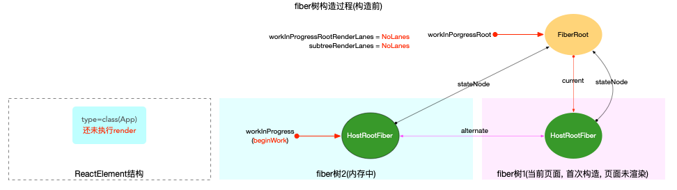

`performUnitOfWork`第 1 次调用(只执行`beginWork`):

- 执行前: `workInProgress`指针指向`HostRootFiber.alternate`对象, 此时`current = workInProgress.alternate`指向`fiberRoot.current`是非空的(初次构造, 只在根节点时, `current`非空).
- 执行过程: 调用`updateHostRoot`
  - 在`reconcileChildren`阶段, 向下构造`次级子节点fiber(<App/>)`, 同时设置子节点(`fiber(<App/>)`)[fiber.flags |= Placement](https://github.com/facebook/react/blob/v17.0.2/packages/react-reconciler/src/ReactChildFiber.old.js#L376-L378)
- 执行后: 返回下级节点`fiber(<App/>)`, 移动`workInProgress`指针指向子节点`fiber(<App/>)`

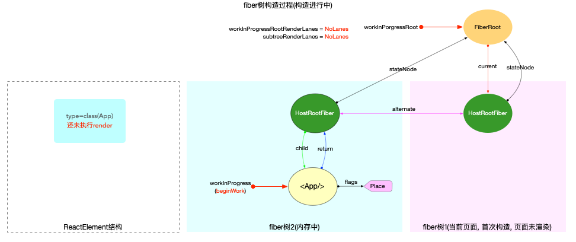

`performUnitOfWork`第 2 次调用(只执行`beginWork`):

- 执行前: `workInProgress`指针指向`fiber(<App/>)`节点, 此时`current = null`
- 执行过程: 调用`updateClassComponent`
  - 本示例中, class 实例存在生命周期函数`componentDidMount`, 所以会设置`fiber(<App/>)`节点[workInProgress.flags |= Update](https://github.com/facebook/react/blob/v17.0.2/packages/react-reconciler/src/ReactFiberClassComponent.old.js#L892-L894)
  - 另外也会为了`React DevTools`能够识别状态组件的执行进度, 会设置[workInProgress.flags |= PerformedWork](https://github.com/facebook/react/blob/v17.0.2/packages/react-reconciler/src/ReactFiberBeginWork.old.js#L379)(在`commit`阶段会排除这个`flag`, 此处只是列出`workInProgress.flags`的设置场景, 不讨论`React DevTools`)
  - 需要注意`classInstance.render()`在本步骤执行后, 虽然返回了`render`方法中所有的`ReactElement`对象, 但是随后`reconcileChildren`只构造`次级子节点`
  - 在`reconcileChildren`阶段, 向下构造`次级子节点div`
- 执行后: 返回下级节点`fiber(div)`, 移动`workInProgress`指针指向子节点`fiber(div)`

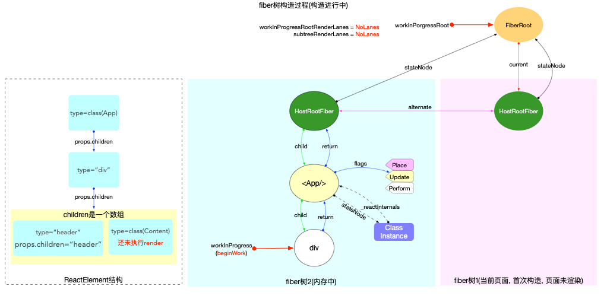

`performUnitOfWork`第 3 次调用(只执行`beginWork`):

- 执行前: `workInProgress`指针指向`fiber(div)`节点, 此时`current = null`
- 执行过程: 调用`updateHostComponent`
  - 在`reconcileChildren`阶段, 向下构造`次级子节点`(本示例中, `div`有 2 个次级子节点)
- 执行后: 返回下级节点`fiber(header)`, 移动`workInProgress`指针指向子节点`fiber(header)`

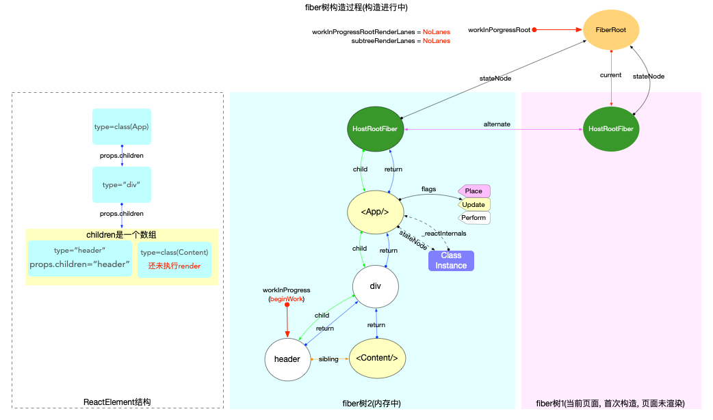

`performUnitOfWork`第 4 次调用(执行`beginWork`和`completeUnitOfWork`):

- `beginWork`执行前: `workInProgress`指针指向`fiber(header)`节点, 此时`current = null`
- `beginWork`执行过程: 调用`updateHostComponent`
  - 本示例中`header`的子节点是一个[直接文本节点](https://github.com/facebook/react/blob/8e5adfbd7e605bda9c5e96c10e015b3dc0df688e/packages/react-dom/src/client/ReactDOMHostConfig.js#L350-L361),设置[nextChildren = null](https://github.com/facebook/react/blob/v17.0.2/packages/react-reconciler/src/ReactFiberBeginWork.old.js#L1147)(直接文本节点并不会被当成具体的`fiber`节点进行处理, 而是在宿主环境(父组件)中通过属性进行设置. 所以无需创建`HostText`类型的 fiber 节点, 同时节省了向下遍历开销.).
  - 由于`nextChildren = null`, 经过`reconcileChildren`阶段处理后, 返回值也是`null`
- `beginWork`执行后: 由于下级节点为`null`, 所以进入`completeUnitOfWork(unitOfWork)`函数, 传入的参数`unitOfWork`实际上就是`workInProgress`(此时指向`fiber(header)`节点)

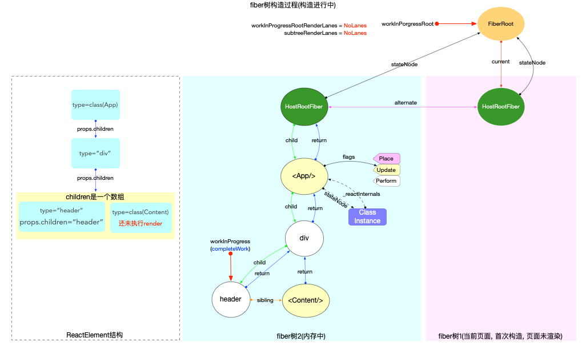

- `completeUnitOfWork`执行前: `workInProgress`指针指向`fiber(header)`节点
- `completeUnitOfWork`执行过程: 以`fiber(header)`为起点, 向上回溯

第 1 次循环:

1. 执行`completeWork`函数
   - 创建`fiber(header)`节点对应的`DOM`实例, 并`append`子节点的`DOM`实例
   - 设置`DOM`属性, 绑定事件等(本示例中, 节点`fiber(header)`没有事件绑定)
2. 上移副作用队列: 由于本节点`fiber(header)`没有副作用(`fiber.flags = 0`), 所以执行之后副作用队列没有实质变化(目前为空).
3. 向上回溯: 由于还有兄弟节点, 把`workInProgress`指针指向下一个兄弟节点`fiber(<Content/>)`, 退出`completeUnitOfWork`.

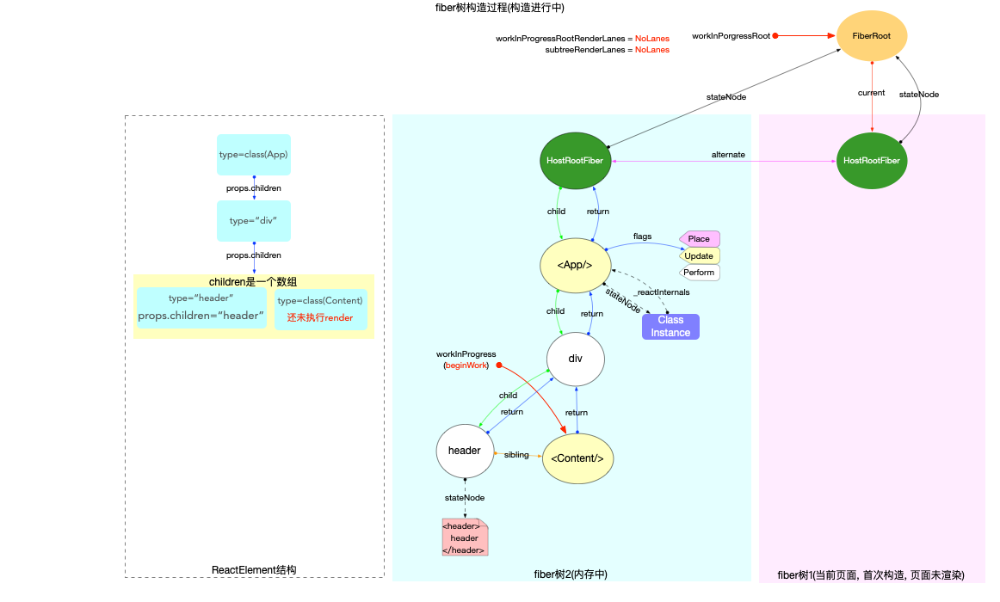

`performUnitOfWork`第 5 次调用(执行`beginWork`):

- 执行前:`workInProgress`指针指向`fiber(<Content/>)`节点.
- 执行过程: 这是一个`class`类型的节点, 与第 2 次调用逻辑一致.
- 执行后: 返回下级节点`fiber(p)`, 移动`workInProgress`指针指向子节点`fiber(p)`

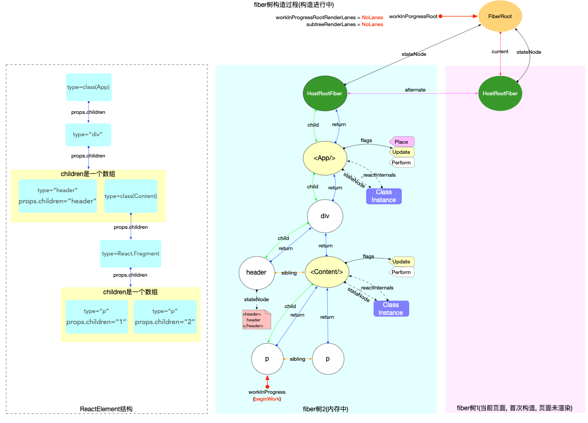

`performUnitOfWork`第 6 次调用(执行`beginWork`和`completeUnitOfWork`):与第 4 次调用中创建`fiber(header)`节点的逻辑一致. 先后会执行`beginWork`和`completeUnitOfWork`, 最后构造 DOM 实例, 并将把`workInProgress`指针指向下一个兄弟节点`fiber(p)`.

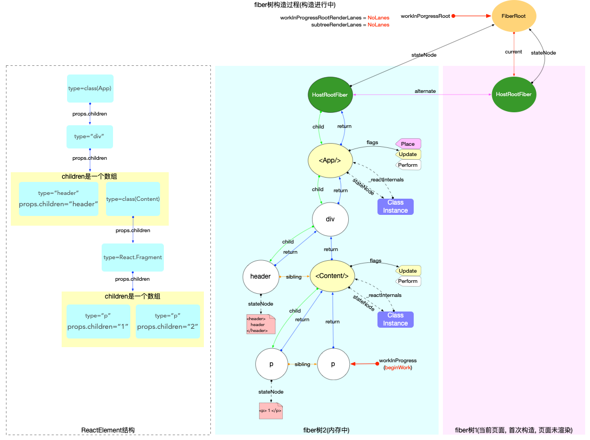

`performUnitOfWork`第 7 次调用(执行`beginWork`和`completeUnitOfWork`):

- `beginWork`执行过程: 与上次调用中创建`fiber(p)`节点的逻辑一致
- `completeUnitOfWork`执行过程: 以`fiber(p)`为起点, 向上回溯

第 1 次循环:

1. 执行`completeWork`函数: 创建`fiber(p)`节点对应的`DOM`实例, 并`append`子树节点的`DOM`实例
2. 上移副作用队列: 由于本节点`fiber(p)`没有副作用, 所以执行之后副作用队列没有实质变化(目前为空).
3. 向上回溯: 由于没有兄弟节点, 把`workInProgress`指针指向父节点`fiber(<Content/>)`


第 2 次循环:

1. 执行`completeWork`函数: class 类型的节点不做处理
2. 上移副作用队列:
   - 本节点`fiber(<Content/>)`的`flags`标志位有改动(`completedWork.flags > PerformedWork`), 将本节点添加到父节点(`fiber(div)`)的副作用队列之后(`firstEffect`和`lastEffect`属性分别指向副作用队列的首部和尾部).
3. 向上回溯: 把`workInProgress`指针指向父节点`fiber(div)`

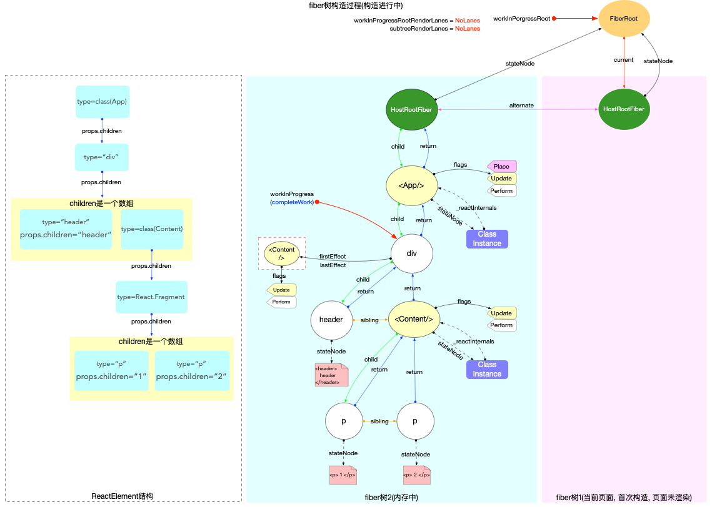

第 3 次循环:

1. 执行`completeWork`函数: 创建`fiber(div)`节点对应的`DOM`实例, 并`append`子树节点的`DOM`实例
2. 上移副作用队列:
   - 本节点`fiber(div)`的副作用队列不为空, 将其拼接到父节点`fiber<App/>`的副作用队列后面.
3. 向上回溯: 把`workInProgress`指针指向父节点`fiber(<App/>)`


第 4 次循环:

1. 执行`completeWork`函数: class 类型的节点不做处理
2. 上移副作用队列:
   - 本节点`fiber(<App/>)`的副作用队列不为空, 将其拼接到父节点`fiber(HostRootFiber)`的副作用队列上.
   - 本节点`fiber(<App/>)`的`flags`标志位有改动(`completedWork.flags > PerformedWork`), 将本节点添加到父节点`fiber(HostRootFiber)`的副作用队列之后.
   - 最后队列的顺序是`子节点在前, 本节点在后`
3. 向上回溯: 把`workInProgress`指针指向父节点`fiber(HostRootFiber)`

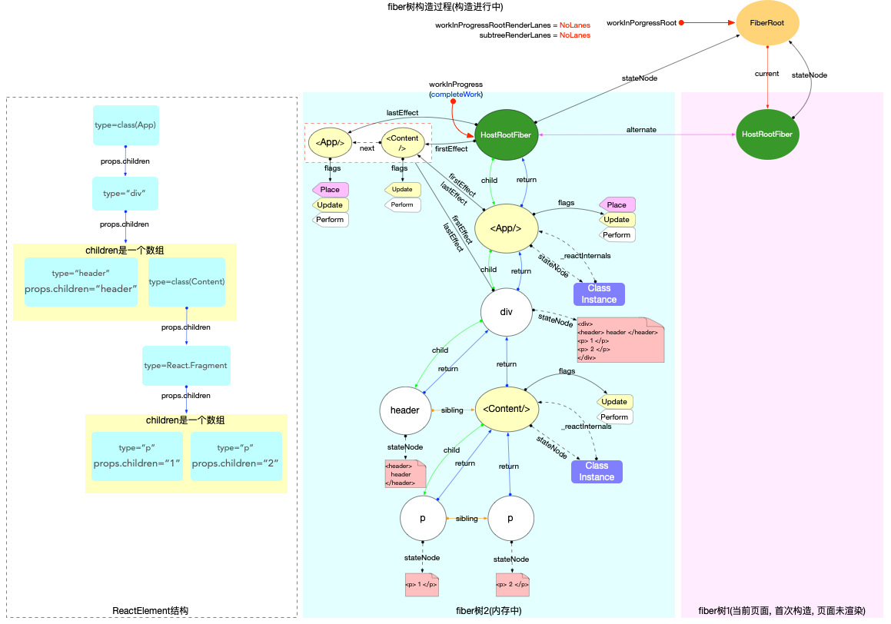

第 5 次循环:

1. 执行`completeWork`函数: 对于`HostRoot`类型的节点, 初次构造时设置[workInProgress.flags |= Snapshot](https://github.com/facebook/react/blob/v17.0.2/packages/react-reconciler/src/ReactFiberCompleteWork.old.js#L693)
2. 向上回溯: 由于父节点为空, 无需进入处理副作用队列的逻辑. 最后设置`workInProgress=null`, 并退出`completeUnitOfWork`

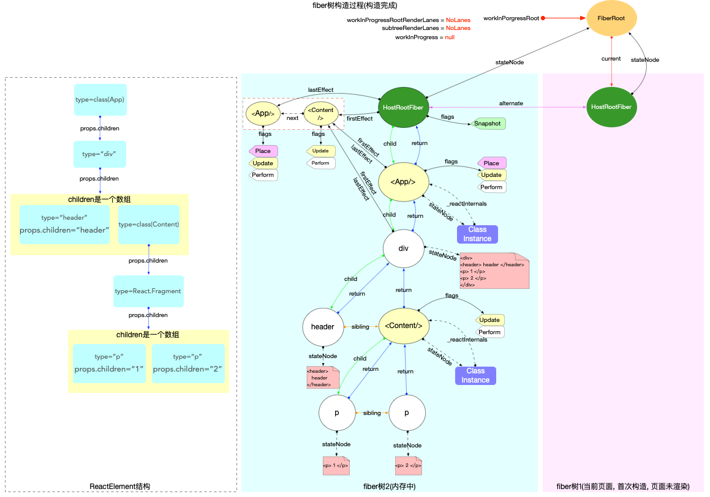

到此整个`fiber树构造循环`已经执行完毕, 拥有一棵完整的`fiber树`, 并且在`fiber树`的根节点上挂载了副作用队列, 副作用队列的顺序是层级越深子节点越靠前.

`renderRootSync`函数退出之前, 会重置`workInProgressRoot = null`, 表明没有正在进行中的`render`. 且把最新的`fiber树`挂载到`fiberRoot.finishedWork`上. 这时整个 fiber 树的内存结构如下(注意`fiberRoot.finishedWork`和`fiberRoot.current`指针,在`commitRoot`阶段会进行处理):

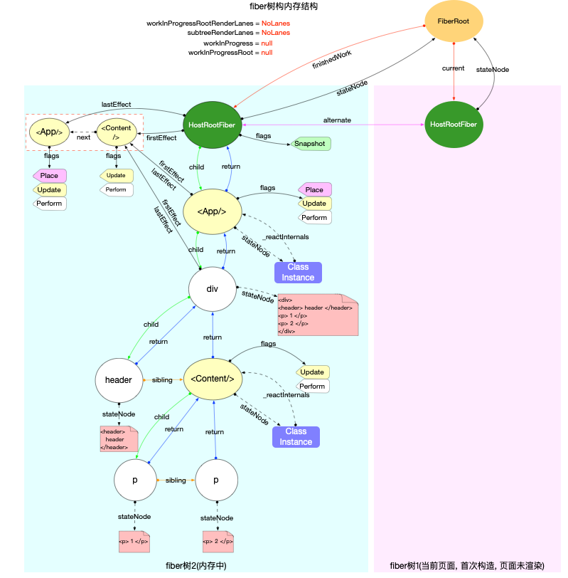

## 总结

本节演示了初次创建`fiber树`的全部过程, 跟踪了创建过程中内存引用的变化情况. `fiber树构造循环`负责构造新的`fiber`树, 构造过程中同时标记`fiber.flags`, 最终把所有被标记的`fiber`节点收集到一个副作用队列中, 这个副作用队列被挂载到根节点上(`HostRootFiber.alternate.firstEffect`). 此时的`fiber树`和与之对应的`DOM节点`都还在内存当中, 等待`commitRoot`阶段进行渲染.
