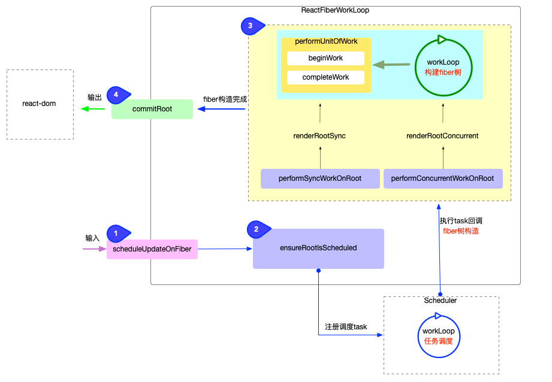
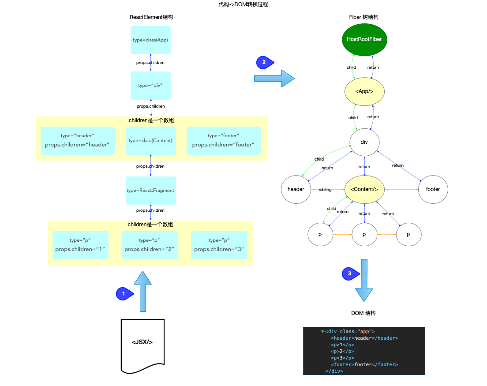
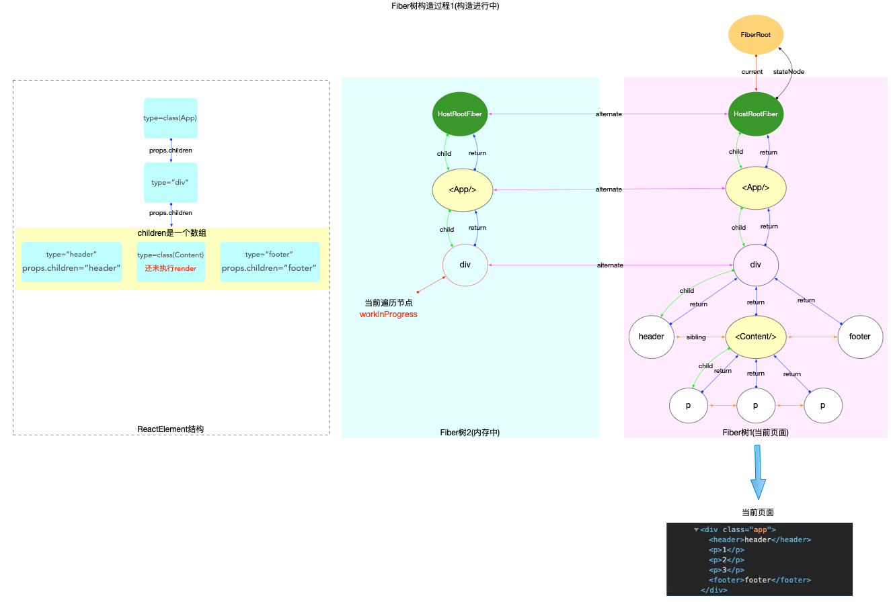
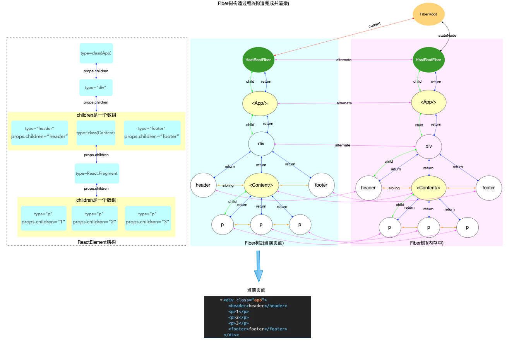

# fiber 树构造(基础准备)

在 React 运行时中, `fiber树构造`位于`react-reconciler`包.

在正式解读`fiber树构造`之前, 再次回顾一下[reconciler 运作流程](./reconciler-workflow.md)的 4 个阶段:



1. 输入阶段: 衔接`react-dom`包, 承接`fiber更新`请求(可以参考[React 应用的启动过程](./bootstrap.md)).
2. 注册调度任务: 与调度中心(`scheduler`包)交互, 注册调度任务`task`, 等待任务回调(可以参考[React 调度原理(scheduler)](./scheduler.md)).
3. 执行任务回调: 在内存中构造出`fiber树`和`DOM`对象, 也是**fiber 树构造的重点内容**.
4. 输出: 与渲染器(`react-dom`)交互, 渲染`DOM`节点.

`fiber树构造`处于上述第 3 个阶段, 可以通过不同的视角来理解`fiber树构造`在`React`运行时中所处的位置:

- 从`scheduler`调度中心的角度来看, 它是任务队列`taskQueue`中的一个具体的任务回调(`task.callback`).
- 从[React 工作循环](./workloop.md)的角度来看, 它属于`fiber树构造循环`.

由于`fiber 树构造`源码量比较大, 本系列根据`React`运行的`内存状态`, 分为 2 种情况来说明:

1. 初次创建: 在`React`应用首次启动时, 界面还没有渲染, 此时并不会进入对比过程, 相当于直接构造一棵全新的树.
2. 对比更新: `React`应用启动后, 界面已经渲染. 如果再次发生更新, 创建`新fiber`节点之后需要和`旧fiber`节点进行对比. 最后构造的 fiber 树有可能是全新的, 也可能是部分更新的.

无论是`初次创建`还是`对比更新`, 基础概念都是通用的, 本节将介绍这些基础知识, 为正式进入`fiber树构造`做准备.

## ReactElement, Fiber, DOM 三者的关系

在[React 应用中的高频对象](./object-structure.md)一文中, 已经介绍了`ReactElement`和`Fiber`对象的数据结构. 这里我们梳理出`ReactElement, Fiber, DOM`这 3 种对象的关系

1. [ReactElement 对象](https://github.com/facebook/react/blob/v17.0.2/packages/react/src/ReactElement.js#L126-L146)(type 定义在[shared 包中](https://github.com/facebook/react/blob/v17.0.2/packages/shared/ReactElementType.js#L15))

   - 所有采用`jsx`语法书写的节点, 都会被编译器转换, 最终会以`React.createElement(...)`的方式, 创建出来一个与之对应的`ReactElement`对象

2. [fiber 对象](https://github.com/facebook/react/blob/v17.0.2/packages/react-reconciler/src/ReactFiber.old.js#L116-L155)(type 类型的定义在[ReactInternalTypes.js](https://github.com/facebook/react/blob/v17.0.2/packages/react-reconciler/src/ReactInternalTypes.js#L47-L174)中)

   - `fiber对象`是通过`ReactElement`对象进行创建的, 多个`fiber对象`构成了一棵`fiber树`, `fiber树`是构造`DOM树`的数据模型, `fiber树`的任何改动, 最后都体现到`DOM树`.

3. [DOM 对象](https://developer.mozilla.org/zh-CN/docs/Web/API/Document_Object_Model): 文档对象模型
   - `DOM`将文档解析为一个由节点和对象（包含属性和方法的对象）组成的结构集合, 也就是常说的`DOM树`.
   - `JavaScript`可以访问和操作存储在 DOM 中的内容, 也就是操作`DOM对象`, 进而触发 UI 渲染.

它们之间的关系反映了我们书写的 JSX 代码到 DOM 节点的转换过程:



注意:

- 开发人员能够控制的是`JSX`, 也就是`ReactElement`对象.
- `fiber树`是通过`ReactElement`生成的, 如果脱离了`ReactElement`,`fiber树`也无从谈起. 所以是`ReactElement`树(不是严格的树结构, 为了方便也称为树)驱动`fiber树`.
- `fiber树`是`DOM树`的数据模型, `fiber树`驱动`DOM树`

开发人员通过编程只能控制`ReactElement`树的结构, `ReactElement树`驱动`fiber树`, `fiber树`再驱动`DOM树`, 最后展现到页面上. 所以`fiber树`的构造过程, 实际上就是`ReactElement`对象到`fiber`对象的转换过程.

## 全局变量

从[React 工作循环](./workloop.md)的角度来看, 整个构造过程被包裹在`fiber树构造循环`中(对应源码位于[ReactFiberWorkLoop.js](https://github.com/facebook/react/blob/v17.0.2/packages/react-reconciler/src/ReactFiberWorkLoop.old.js)).

在`React`运行时, `ReactFiberWorkLoop.js`闭包中的`全局变量`会随着`fiber树构造循环`的进行而变化, 现在查看其中重要的全局变量([源码链接](https://github.com/facebook/react/blob/v17.0.2/packages/react-reconciler/src/ReactFiberWorkLoop.old.js#L247-L367)):

```js
// 当前React的执行栈(执行上下文)
let executionContext: ExecutionContext = NoContext;

// 当前root节点
let workInProgressRoot: FiberRoot | null = null;
// 正在处理中的fiber节点
let workInProgress: Fiber | null = null;
// 正在渲染的车道(复数)
let workInProgressRootRenderLanes: Lanes = NoLanes;

// 包含所有子节点的优先级, 是workInProgressRootRenderLanes的超集
// 大多数情况下: 在工作循环整体层面会使用workInProgressRootRenderLanes, 在begin/complete阶段层面会使用 subtreeRenderLanes
let subtreeRenderLanes: Lanes = NoLanes;
// 一个栈结构: 专门存储当前节点的 subtreeRenderLanes
const subtreeRenderLanesCursor: StackCursor<Lanes> = createCursor(NoLanes);

// fiber构造完后, root节点的状态: completed, errored, suspended等
let workInProgressRootExitStatus: RootExitStatus = RootIncomplete;
// 重大错误
let workInProgressRootFatalError: mixed = null;
// 整个render期间所使用到的所有lanes
let workInProgressRootIncludedLanes: Lanes = NoLanes;
// 在render期间被跳过(由于优先级不够)的lanes: 只包括未处理的updates, 不包括被复用的fiber节点
let workInProgressRootSkippedLanes: Lanes = NoLanes;
// 在render期间被修改过的lanes
let workInProgressRootUpdatedLanes: Lanes = NoLanes;

// 防止无限循环和嵌套更新
const NESTED_UPDATE_LIMIT = 50;
let nestedUpdateCount: number = 0;
let rootWithNestedUpdates: FiberRoot | null = null;

const NESTED_PASSIVE_UPDATE_LIMIT = 50;
let nestedPassiveUpdateCount: number = 0;

// 发起更新的时间
let currentEventTime: number = NoTimestamp;
let currentEventWipLanes: Lanes = NoLanes;
let currentEventPendingLanes: Lanes = NoLanes;
```

在源码中, 大部分变量都带有英文注释(读者可自行查阅), 此处只列举了`fiber树构造循环`中最核心的变量

### 执行上下文

在全局变量中有`executionContext`, 代表`渲染期间`的`执行栈`(或叫做`执行上下文`), 它也是一个二进制表示的变量, 通过位运算进行操作(参考[React 算法之位运算](../algorithm/bitfield.md)). 在源码中一共定义了 8 种执行栈:

```js
type ExecutionContext = number;
export const NoContext = /*             */ 0b0000000;
const BatchedContext = /*               */ 0b0000001;
const EventContext = /*                 */ 0b0000010;
const DiscreteEventContext = /*         */ 0b0000100;
const LegacyUnbatchedContext = /*       */ 0b0001000;
const RenderContext = /*                */ 0b0010000;
const CommitContext = /*                */ 0b0100000;
```

上文回顾了`reconciler 运作流程`的 4 个阶段, 这 4 个阶段只是一个整体划分. 如果具体到每一次更新, 是有差异的. 比如说: `Legacy`模式下的首次更新, 不会经过`调度中心`(第 2 阶段),而是直接进入`fiber树构造`(第 3 阶段).

事实上正是`executionContext`在操控`reconciler 运作流程`(源码体现在[scheduleUpdateOnFiber 函数](https://github.com/facebook/react/blob/v17.0.2/packages/react-reconciler/src/ReactFiberWorkLoop.old.js#L517-L619)).

```js
export function scheduleUpdateOnFiber(
  fiber: Fiber,
  lane: Lane,
  eventTime: number,
) {
  if (lane === SyncLane) {
    // legacy或blocking模式
    if (
      (executionContext & LegacyUnbatchedContext) !== NoContext &&
      (executionContext & (RenderContext | CommitContext)) === NoContext
    ) {
      performSyncWorkOnRoot(root);
    } else {
      // 后续的更新
      // 进入第2阶段, 注册调度任务
      ensureRootIsScheduled(root, eventTime);
      if (executionContext === NoContext) {
        // 如果执行上下文为空, 会取消调度任务, 手动执行回调
        // 进入第3阶段, 进行fiber树构造
        flushSyncCallbackQueue();
      }
    }
  } else {
    // concurrent模式
    // 无论是否初次更新, 都正常进入第2阶段, 注册调度任务
    ensureRootIsScheduled(root, eventTime);
  }
}
```

在 render 过程中, 每一个阶段都会改变`executionContext`(render 之前, 会设置`executionContext |= RenderContext`; commit 之前, 会设置`executionContext |= CommitContext`), 假设在`render`过程中再次发起更新(如在`UNSAFE_componentWillReceiveProps`生命周期中调用`setState`)则可通过`executionContext`来判断当前的`render`状态.

### 双缓冲技术(double buffering)

在全局变量中有`workInProgress`, 还有不少以`workInProgress`来命名的变量. `workInProgress`的应用实际上就是`React`的双缓冲技术(`double buffering`).

在上文我们梳理了`ReactElement, Fiber, DOM三者的关系`, `fiber树`的构造过程, 就是把`ReactElement`转换成`fiber树`的过程. 在这个过程中, 内存里会同时存在 2 棵`fiber树`:

- 其一: 代表当前界面的`fiber`树(已经被展示出来, 挂载到`fiberRoot.current`上). 如果是初次构造(`初始化渲染`), 页面还没有渲染, 此时界面对应的 fiber 树为空(`fiberRoot.current = null`).
- 其二: 正在构造的`fiber`树(即将展示出来, 挂载到`HostRootFiber.alternate`上, 正在构造的节点称为`workInProgress`). 当构造完成之后, 重新渲染页面, 最后切换`fiberRoot.current = workInProgress`, 使得`fiberRoot.current`重新指向代表当前界面的`fiber`树.

此处涉及到 2 个全局对象`fiberRoot`和`HostRootFiber`, 在[React 应用的启动过程](./bootstrap.md)中有详细的说明.

用图来表述`double buffering`的概念如下:

1. 构造过程中, `fiberRoot.current`指向当前界面对应的`fiber`树.



2. 构造完成并渲染, 切换`fiberRoot.current`指针, 使其继续指向当前界面对应的`fiber`树(原来代表界面的 fiber 树, 变成了内存中).



### 优先级 {#lanes}

在全局变量中有不少变量都以 Lanes 命名(如`workInProgressRootRenderLanes`,`subtreeRenderLanes`其作用见上文注释), 它们都与优先级相关.

在前文[React 中的优先级管理](./priority.md)中, 我们介绍了`React`中有 3 套优先级体系, 并了解了它们之间的关联. 现在`fiber树构造`过程中, 将要深入分析车道模型`Lane`的具体应用.

在整个`react-reconciler`包中, `Lane`的应用可以分为 3 个方面:

#### `update`优先级(update.lane) {#update-lane}

在[React 应用中的高频对象](./object-structure.md#Update)一文中, 介绍过`update`对象, 它是一个环形链表. 对于单个`update`对象来讲, `update.lane`代表它的优先级, 称之为`update`优先级.

观察其构造函数([源码链接](https://github.com/facebook/react/blob/v17.0.2/packages/react-reconciler/src/ReactUpdateQueue.old.js#L152-L163)),其优先级是由外界传入.

```js
export function createUpdate(eventTime: number, lane: Lane): Update<*> {
  const update: Update<*> = {
    eventTime,
    lane,
    tag: UpdateState,
    payload: null,
    callback: null,
    next: null,
  };
  return update;
}
```

在`React`体系中, 有 2 种情况会创建`update`对象:

1. 应用初始化: 在`react-reconciler`包中的`updateContainer`函数中([源码](https://github.com/facebook/react/blob/v17.0.2/packages/react-reconciler/src/ReactFiberReconciler.old.js#L250-L321))
   ```js
   export function updateContainer(
     element: ReactNodeList,
     container: OpaqueRoot,
     parentComponent: ?React$Component<any, any>,
     callback: ?Function,
   ): Lane {
     const current = container.current;
     const eventTime = requestEventTime();
     const lane = requestUpdateLane(current); // 根据当前时间, 创建一个update优先级
     const update = createUpdate(eventTime, lane); // lane被用于创建update对象
     update.payload = { element };
     enqueueUpdate(current, update);
     scheduleUpdateOnFiber(current, lane, eventTime);
     return lane;
   }
   ```
2. 发起组件更新: 假设在 class 组件中调用`setState`([源码](https://github.com/facebook/react/blob/v17.0.2/packages/react-reconciler/src/ReactFiberClassComponent.old.js#L193-L288))

```js
const classComponentUpdater = {
  isMounted,
  enqueueSetState(inst, payload, callback) {
    const fiber = getInstance(inst);
    const eventTime = requestEventTime(); // 根据当前时间, 创建一个update优先级
    const lane = requestUpdateLane(fiber); // lane被用于创建update对象
    const update = createUpdate(eventTime, lane);
    update.payload = payload;
    enqueueUpdate(fiber, update);
    scheduleUpdateOnFiber(fiber, lane, eventTime);
  },
};
```

可以看到, 无论是`应用初始化`或者`发起组件更新`, 创建`update.lane`的逻辑都是一样的, 都是根据当前时间, 创建一个 update 优先级.

[requestUpdateLane](https://github.com/facebook/react/blob/v17.0.2/packages/react-reconciler/src/ReactFiberWorkLoop.old.js#L392-L493):

```js
export function requestUpdateLane(fiber: Fiber): Lane {
  // Special cases
  const mode = fiber.mode;
  if ((mode & BlockingMode) === NoMode) {
    // legacy 模式
    return (SyncLane: Lane);
  } else if ((mode & ConcurrentMode) === NoMode) {
    // blocking模式
    return getCurrentPriorityLevel() === ImmediateSchedulerPriority
      ? (SyncLane: Lane)
      : (SyncBatchedLane: Lane);
  }
  // concurrent模式
  if (currentEventWipLanes === NoLanes) {
    currentEventWipLanes = workInProgressRootIncludedLanes;
  }
  const isTransition = requestCurrentTransition() !== NoTransition;
  if (isTransition) {
    // 特殊情况, 处于suspense过程中
    if (currentEventPendingLanes !== NoLanes) {
      currentEventPendingLanes =
        mostRecentlyUpdatedRoot !== null
          ? mostRecentlyUpdatedRoot.pendingLanes
          : NoLanes;
    }
    return findTransitionLane(currentEventWipLanes, currentEventPendingLanes);
  }
  // 正常情况, 获取调度优先级
  const schedulerPriority = getCurrentPriorityLevel();
  let lane;
  if (
    (executionContext & DiscreteEventContext) !== NoContext &&
    schedulerPriority === UserBlockingSchedulerPriority
  ) {
    // executionContext 存在输入事件. 且调度优先级是用户阻塞性质
    lane = findUpdateLane(InputDiscreteLanePriority, currentEventWipLanes);
  } else {
    // 调度优先级转换为车道模型
    const schedulerLanePriority = schedulerPriorityToLanePriority(
      schedulerPriority,
    );
    lane = findUpdateLane(schedulerLanePriority, currentEventWipLanes);
  }
  return lane;
}
```

可以看到`requestUpdateLane`的作用是返回一个合适的 update 优先级.

1. legacy 模式: 返回`SyncLane`
2. blocking 模式: 返回`SyncLane`
3. concurrent 模式:
   - 正常情况下, 根据当前的`调度优先级`来生成一个`lane`.
   - 特殊情况下(处于 suspense 过程中), 会优先选择`TransitionLanes`通道中的空闲通道(如果所有`TransitionLanes`通道都被占用, 就取最高优先级. [源码](https://github.com/facebook/react/blob/v17.0.2/packages/react-reconciler/src/ReactFiberLane.js#L548-L563)).

最后通过`scheduleUpdateOnFiber(current, lane, eventTime);`函数, 把`update.lane`正式带入到了`输入`阶段.

`scheduleUpdateOnFiber`是`输入`阶段的必经函数, 在本系列的文章中已经多次提到, 此处以`update.lane`的视角分析:

```js
export function scheduleUpdateOnFiber(
  fiber: Fiber,
  lane: Lane,
  eventTime: number,
) {
  if (lane === SyncLane) {
    // legacy或blocking模式
    if (
      (executionContext & LegacyUnbatchedContext) !== NoContext &&
      (executionContext & (RenderContext | CommitContext)) === NoContext
    ) {
      performSyncWorkOnRoot(root);
    } else {
      ensureRootIsScheduled(root, eventTime); // 注册回调任务
      if (executionContext === NoContext) {
        flushSyncCallbackQueue(); // 取消schedule调度 ,主动刷新回调队列,
      }
    }
  } else {
    // concurrent模式
    ensureRootIsScheduled(root, eventTime);
  }
}
```

当`lane === SyncLane`也就是 legacy 或 blocking 模式中, 注册完回调任务之后(`ensureRootIsScheduled(root, eventTime)`), 如果执行上下文为空, 会取消 schedule 调度, 主动刷新回调队列`flushSyncCallbackQueue()`.

这里包含了一个热点问题(`setState到底是同步还是异步`)的标准答案:

- 如果逻辑进入`flushSyncCallbackQueue`(`executionContext === NoContext`), 则会主动取消调度, 并刷新回调, 立即进入`fiber树`构造过程. 当执行`setState`下一行代码时, `fiber树`已经重新渲染了, 故`setState`体现为同步.
- 正常情况下, 不会取消`schedule调度`. 由于`schedule调度`是通过`MessageChannel`触发(宏任务), 故体现为异步.

#### `渲染`优先级(renderLanes)

这是一个全局概念, 每一次`render`之前, 首先要确定本次`render`的优先级. 具体对应到源码如下:

```js
// ...省略无关代码
function performSyncWorkOnRoot(root) {
  let lanes;
  let exitStatus;
  // 获取本次`render`的优先级
  lanes = getNextLanes(root, lanes);
  exitStatus = renderRootSync(root, lanes);
}
// ...省略无关代码
function performConcurrentWorkOnRoot(root) {
  // 获取本次`render`的优先级
  let lanes = getNextLanes(
    root,
    root === workInProgressRoot ? workInProgressRootRenderLanes : NoLanes,
  );
  if (lanes === NoLanes) {
    return null;
  }
  let exitStatus = renderRootConcurrent(root, lanes);
}
```

可以看到, 无论是`Legacy`还是`Concurrent`模式, 在正式`render`之前, 都会调用`getNextLanes`获取一个优先级([源码链接](https://github.com/facebook/react/blob/v17.0.2/packages/react-reconciler/src/ReactFiberLane.js#L249-L303)).

```js
// ...省略部分代码
export function getNextLanes(root: FiberRoot, wipLanes: Lanes): Lanes {
  // 1. check是否有等待中的lanes
  const pendingLanes = root.pendingLanes;
  if (pendingLanes === NoLanes) {
    return_highestLanePriority = NoLanePriority;
    return NoLanes;
  }
  let nextLanes = NoLanes;
  let nextLanePriority = NoLanePriority;
  const expiredLanes = root.expiredLanes;
  const suspendedLanes = root.suspendedLanes;
  const pingedLanes = root.pingedLanes;
  // 2. check是否有已过期的lanes
  if (expiredLanes !== NoLanes) {
    nextLanes = expiredLanes;
    nextLanePriority = return_highestLanePriority = SyncLanePriority;
  } else {
    const nonIdlePendingLanes = pendingLanes & NonIdleLanes;
    if (nonIdlePendingLanes !== NoLanes) {
      // 非Idle任务 ...
    } else {
      // Idle任务 ...
    }
  }
  if (nextLanes === NoLanes) {
    return NoLanes;
  }
  return nextLanes;
}
```

`getNextLanes`会根据`fiberRoot`对象上的属性(`expiredLanes`, `suspendedLanes`, `pingedLanes`等), 确定出当前最紧急的`lanes`.

此处返回的`lanes`会作为全局渲染的优先级, 用于`fiber树构造过程`中. 针对`fiber对象`或`update对象`, 只要它们的优先级(如: `fiber.lanes`和`update.lane`)比`渲染优先级`低, 都将会被忽略.


#### `fiber`优先级(fiber.lanes)

在[React 应用中的高频对象](./object-structure.md)一文中, 介绍过`fiber`对象的数据结构. 其中有 2 个属性与优先级相关:

1. `fiber.lanes`: 代表本节点的优先级
2. `fiber.childLanes`: 代表子节点的优先级
   从`FiberNode`的构造函数中可以看出, `fiber.lanes`和`fiber.childLanes`的初始值都为`NoLanes`, 在`fiber树构造`过程中, 使用全局的渲染优先级(`renderLanes`)和`fiber.lanes`判断`fiber`节点是否更新([源码地址](https://github.com/facebook/react/blob/v17.0.2/packages/react-reconciler/src/ReactFiberBeginWork.old.js#L3121-L3296)).
   - 如果全局的渲染优先级`renderLanes`不包括`fiber.lanes`, 证明该`fiber`节点没有更新, 可以复用.
   - 如果不能复用, 进入创建阶段.

```js
function beginWork(
  current: Fiber | null,
  workInProgress: Fiber,
  renderLanes: Lanes,
): Fiber | null {
  const updateLanes = workInProgress.lanes;
  if (current !== null) {
    const oldProps = current.memoizedProps;
    const newProps = workInProgress.pendingProps;
    if (
      oldProps !== newProps ||
      hasLegacyContextChanged() ||
      // Force a re-render if the implementation changed due to hot reload:
      (__DEV__ ? workInProgress.type !== current.type : false)
    ) {
      didReceiveUpdate = true;
    } else if (!includesSomeLane(renderLanes, updateLanes)) {
      didReceiveUpdate = false;
      // 本`fiber`节点的没有更新, 可以复用, 进入bailout逻辑
      return bailoutOnAlreadyFinishedWork(current, workInProgress, renderLanes);
    }
  }
  // 不能复用, 创建新的fiber节点
  workInProgress.lanes = NoLanes; // 重置优先级为 NoLanes
  switch (workInProgress.tag) {
    case ClassComponent: {
      const Component = workInProgress.type;
      const unresolvedProps = workInProgress.pendingProps;
      const resolvedProps =
        workInProgress.elementType === Component
          ? unresolvedProps
          : resolveDefaultProps(Component, unresolvedProps);

      return updateClassComponent(
        current,
        workInProgress,
        Component,
        resolvedProps,
        // 正常情况下渲染优先级会被用于fiber树的构造过程
        renderLanes,
      );
    }
  }
}
```

### 栈帧管理

在`React`源码中, 每一次执行`fiber树`构造(也就是调用`performSyncWorkOnRoot`或者`performConcurrentWorkOnRoot`函数)的过程, 都需要一些全局变量来保存状态. 在上文中已经介绍最核心的全局变量.

如果从单个变量来看, 它们就是一个个的全局变量. 如果将这些全局变量组合起来, 它们代表了当前`fiber树`构造的活动记录. 通过这一组全局变量, 可以还原`fiber树`构造过程(比如时间切片的实现过程(参考[React 调度原理](./scheduler.md#内核)), `fiber树`构造过程被打断之后需要还原进度, 全靠这一组全局变量). 所以每次`fiber树`构造是一个独立的过程, 需要`独立的`一组全局变量, 在`React`内部把这一个独立的过程封装为一个栈帧`stack`(简单来说就是每次构造都需要独立的空间. 对于`栈帧`的深入理解, 请读者自行参考其他资料).

所以在进行`fiber树`构造之前, 如果不需要恢复上一次构造进度, 都会刷新栈帧(源码在[prepareFreshStack 函数](https://github.com/facebook/react/blob/v17.0.2/packages/react-reconciler/src/ReactFiberWorkLoop.old.js#L1301-L1337))

```js
function renderRootConcurrent(root: FiberRoot, lanes: Lanes) {
  const prevExecutionContext = executionContext;
  executionContext |= RenderContext;
  const prevDispatcher = pushDispatcher();
  // 如果fiberRoot变动, 或者update.lane变动, 都会刷新栈帧, 丢弃上一次渲染进度
  if (workInProgressRoot !== root || workInProgressRootRenderLanes !== lanes) {
    resetRenderTimer();
    // 刷新栈帧
    prepareFreshStack(root, lanes);
    startWorkOnPendingInteractions(root, lanes);
  }
}

/**
刷新栈帧: 重置 FiberRoot上的全局属性 和 `fiber树构造`循环过程中的全局变量
*/
function prepareFreshStack(root: FiberRoot, lanes: Lanes) {
  // 重置FiberRoot对象上的属性
  root.finishedWork = null;
  root.finishedLanes = NoLanes;
  const timeoutHandle = root.timeoutHandle;
  if (timeoutHandle !== noTimeout) {
    root.timeoutHandle = noTimeout;
    cancelTimeout(timeoutHandle);
  }
  if (workInProgress !== null) {
    let interruptedWork = workInProgress.return;
    while (interruptedWork !== null) {
      unwindInterruptedWork(interruptedWork);
      interruptedWork = interruptedWork.return;
    }
  }
  // 重置全局变量
  workInProgressRoot = root;
  workInProgress = createWorkInProgress(root.current, null); // 给HostRootFiber对象创建一个alternate, 并将其设置成全局 workInProgress
  workInProgressRootRenderLanes = subtreeRenderLanes = workInProgressRootIncludedLanes = lanes;
  workInProgressRootExitStatus = RootIncomplete;
  workInProgressRootFatalError = null;
  workInProgressRootSkippedLanes = NoLanes;
  workInProgressRootUpdatedLanes = NoLanes;
  workInProgressRootPingedLanes = NoLanes;
}
```

注意其中的`createWorkInProgress(root.current, null)`, 其参数`root.current`即`HostRootFiber`, 作用是给`HostRootFiber`创建一个`alternate`副本.`workInProgress`指针指向这个副本(即`workInProgress = HostRootFiber.alternate`), 在上文`double buffering`中分析过, `HostRootFiber.alternate`是`正在构造的fiber树`的根节点.

## 总结

本节是`fiber树构造`的准备篇, 首先在宏观上从不同的视角(`任务调度循环`, `fiber树构造循环`)介绍了`fiber树构造`在`React`体系中所处的位置, 然后深入`react-reconciler`包分析`fiber树构造`过程中需要使用到的全局变量, 并解读了`双缓冲技术`和`优先级(车道模型)`的使用, 最后解释`栈帧管理`的实现细节. 有了这些基础知识, `fiber树构造`的具体实现过程会更加简单清晰.
