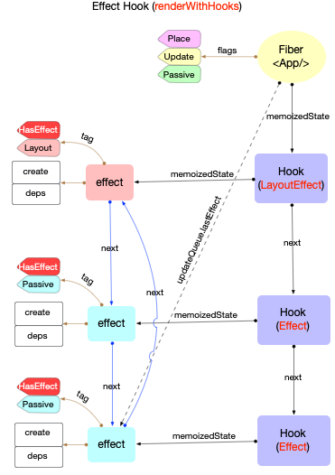
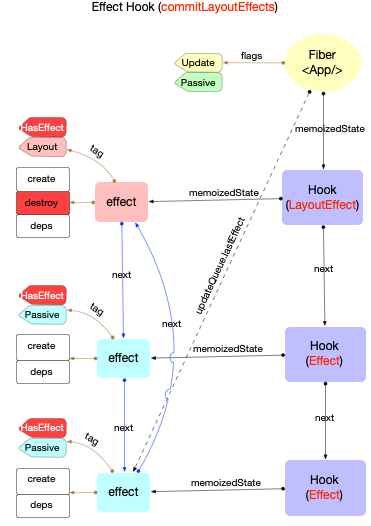
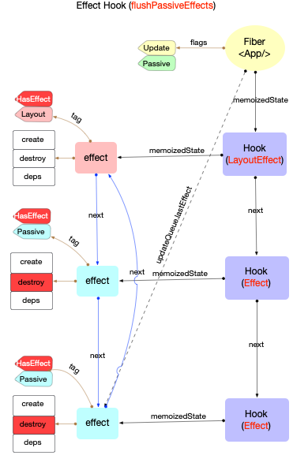

# Hook 原理(副作用 Hook)

本节建立在前文[Hook 原理(概览)](./hook-summary.md)和[Hook 原理(状态 Hook)](./hook-state.md)的基础之上, 重点讨论`useEffect, useLayoutEffect`等标准的`副作用Hook`.

## 创建 Hook

在`fiber`初次构造阶段, `useEffect`对应源码[mountEffect](https://github.com/facebook/react/blob/v17.0.2/packages/react-reconciler/src/ReactFiberHooks.old.js#L1232-L1248), `useLayoutEffect`对应源码[mountLayoutEffect](https://github.com/facebook/react/blob/v17.0.2/packages/react-reconciler/src/ReactFiberHooks.old.js#L1268-L1273)

`mountEffect`:

```js
function mountEffect(
  create: () => (() => void) | void,
  deps: Array<mixed> | void | null,
): void {
  return mountEffectImpl(
    UpdateEffect | PassiveEffect, // fiberFlags
    HookPassive, // hookFlags
    create,
    deps,
  );
}
```

`mountLayoutEffect`:

```js
function mountLayoutEffect(
  create: () => (() => void) | void,
  deps: Array<mixed> | void | null,
): void {
  return mountEffectImpl(
    UpdateEffect, // fiberFlags
    HookLayout, // hookFlags
    create,
    deps,
  );
}
```

可见`mountEffect`和`mountLayoutEffect`内部都直接调用[mountEffectImpl](https://github.com/facebook/react/blob/v17.0.2/packages/react-reconciler/src/ReactFiberHooks.old.js#L1193-L1203), 只是参数不同.

`mountEffectImpl`:

```js
function mountEffectImpl(fiberFlags, hookFlags, create, deps): void {
  // 1. 创建hook
  const hook = mountWorkInProgressHook();
  const nextDeps = deps === undefined ? null : deps;
  // 2. 设置workInProgress的副作用标记
  currentlyRenderingFiber.flags |= fiberFlags; // fiberFlags 被标记到workInProgress
  // 2. 创建Effect, 挂载到hook.memoizedState上
  hook.memoizedState = pushEffect(
    HookHasEffect | hookFlags, // hookFlags用于创建effect
    create,
    undefined,
    nextDeps,
  );
}
```

`mountEffectImpl`逻辑:

1. 创建`hook`
2. 设置`workInProgress`的副作用标记: `flags |= fiberFlags`
3. 创建`effect`(在`pushEffect`中), 挂载到`hook.memoizedState`上, 即 `hook.memoizedState = effect`
   - 注意: `状态Hook`中`hook.memoizedState = state`

### 创建 Effect

[pushEffect](https://github.com/facebook/react/blob/v17.0.2/packages/react-reconciler/src/ReactFiberHooks.old.js#L1150-L1176):

```js
function pushEffect(tag, create, destroy, deps) {
  // 1. 创建effect对象
  const effect: Effect = {
    tag,
    create,
    destroy,
    deps,
    next: (null: any),
  };
  // 2. 把effect对象添加到环形链表末尾
  let componentUpdateQueue: null | FunctionComponentUpdateQueue =
    (currentlyRenderingFiber.updateQueue: any);
  if (componentUpdateQueue === null) {
    // 新建 workInProgress.updateQueue 用于挂载effect对象
    componentUpdateQueue = createFunctionComponentUpdateQueue();
    currentlyRenderingFiber.updateQueue = (componentUpdateQueue: any);
    // updateQueue.lastEffect是一个环形链表
    componentUpdateQueue.lastEffect = effect.next = effect;
  } else {
    const lastEffect = componentUpdateQueue.lastEffect;
    if (lastEffect === null) {
      componentUpdateQueue.lastEffect = effect.next = effect;
    } else {
      const firstEffect = lastEffect.next;
      lastEffect.next = effect;
      effect.next = firstEffect;
      componentUpdateQueue.lastEffect = effect;
    }
  }
  // 3. 返回effect
  return effect;
}
```

`pushEffect`逻辑:

1. 创建`effect`.
2. 把`effect`对象添加到环形链表末尾.
3. 返回`effect`.

`effect`的数据结构:

```js
export type Effect = {|
  tag: HookFlags,
  create: () => (() => void) | void,
  destroy: (() => void) | void,
  deps: Array<mixed> | null,
  next: Effect,
|};
```

- `effect.tag`: 使用位掩码形式, 代表`effect`的类型([源码](https://github.com/facebook/react/blob/v17.0.2/packages/react-reconciler/src/ReactHookEffectTags.js#L12-L19)).

  ```js
  export const NoFlags = /*  */ 0b000;
  export const HasEffect = /* */ 0b001; // 有副作用, 可以被触发
  export const Layout = /*    */ 0b010; // Layout, dom突变后同步触发
  export const Passive = /*   */ 0b100; // Passive, dom突变前异步触发
  ```

- `effect.create`: 实际上就是通过`useEffect()`所传入的函数.
- `effect.deps`: 依赖项, 如果依赖项变动, 会创建新的`effect`.

`renderWithHooks`执行完成后, 我们可以画出`fiber`,`hook`,`effect`三者的引用关系:



现在`workInProgress.flags`被打上了标记, 最后会在`fiber树渲染`阶段的`commitRoot`函数中处理. (这期间的所有过程可以回顾前文`fiber树构造/fiber树渲染`系列, 此处不再赘述)

### useEffect & useLayoutEffect

站在`fiber,hook,effect`的视角, 无需关心这个`hook`是通过`useEffect`还是`useLayoutEffect`创建的. 只需要关心内部`fiber.flags`,`effect.tag`的状态.

所以`useEffect`与`useLayoutEffect`的区别如下:

1. `fiber.flags`不同

- 使用`useEffect`时: `fiber.flags = UpdateEffect | PassiveEffect`.
- 使用`useLayoutEffect`时: `fiber.flags = UpdateEffect`.

2. `effect.tag`不同

- 使用`useEffect`时: `effect.tag = HookHasEffect | HookPassive`.
- 使用`useLayoutEffect`时: `effect.tag = HookHasEffect | HookLayout`.

## 处理 Effect 回调

完成`fiber树构造`后, 逻辑会进入`渲染`阶段. 通过[fiber 树渲染](./fibertree-commit.md)中的介绍, 在`commitRootImpl`函数中, 整个渲染过程被 3 个函数分布实现:

1. [commitBeforeMutationEffects](https://github.com/facebook/react/blob/v17.0.2/packages/react-reconciler/src/ReactFiberWorkLoop.old.js#L2256-L2300)
2. [commitMutationEffects](https://github.com/facebook/react/blob/v17.0.2/packages/react-reconciler/src/ReactFiberWorkLoop.old.js#L2302-L2383)
3. [commitLayoutEffects](https://github.com/facebook/react/blob/v17.0.2/packages/react-reconciler/src/ReactFiberWorkLoop.old.js#L2385-L2432)

这 3 个函数会处理`fiber.flags`, 也会根据情况处理`fiber.updateQueue.lastEffect`

### commitBeforeMutationEffects

第一阶段: dom 变更之前, 处理副作用队列中带有`Passive`标记的`fiber`节点.

```js
function commitBeforeMutationEffects() {
  while (nextEffect !== null) {
    // ...省略无关代码, 只保留Hook相关

    // 处理`Passive`标记
    const flags = nextEffect.flags;
    if ((flags & Passive) !== NoFlags) {
      if (!rootDoesHavePassiveEffects) {
        rootDoesHavePassiveEffects = true;
        scheduleCallback(NormalSchedulerPriority, () => {
          flushPassiveEffects();
          return null;
        });
      }
    }
    nextEffect = nextEffect.nextEffect;
  }
}
```

注意: 由于`flushPassiveEffects`被包裹在`scheduleCallback`回调中, 由`调度中心`来处理, 且参数是`NormalSchedulerPriority`, 故这是一个异步回调(具体原理可以回顾[React 调度原理(scheduler)](./scheduler.md)).

由于`scheduleCallback(NormalSchedulerPriority,callback)`是异步的, `flushPassiveEffects`并不会立即执行. 此处先跳过`flushPassiveEffects`的分析, 继续跟进`commitRoot`.

### commitMutationEffects

第二阶段: dom 变更, 界面得到更新.

```js
function commitMutationEffects(
  root: FiberRoot,
  renderPriorityLevel: ReactPriorityLevel,
) {
  // ...省略无关代码, 只保留Hook相关
  while (nextEffect !== null) {
    const flags = nextEffect.flags;
    const primaryFlags = flags & (Placement | Update | Deletion | Hydrating);
    switch (primaryFlags) {
      case Update: {
        // useEffect,useLayoutEffect都会设置Update标记
        // 更新节点
        const current = nextEffect.alternate;
        commitWork(current, nextEffect);
        break;
      }
    }
    nextEffect = nextEffect.nextEffect;
  }
}

function commitWork(current: Fiber | null, finishedWork: Fiber): void {
  // ...省略无关代码, 只保留Hook相关
  switch (finishedWork.tag) {
    case FunctionComponent:
    case ForwardRef:
    case MemoComponent:
    case SimpleMemoComponent:
    case Block: {
      // 在突变阶段调用销毁函数, 保证所有的effect.destroy函数都会在effect.create之前执行
      commitHookEffectListUnmount(HookLayout | HookHasEffect, finishedWork);
      return;
    }
  }
}

// 依次执行: effect.destroy
function commitHookEffectListUnmount(tag: number, finishedWork: Fiber) {
  const updateQueue: FunctionComponentUpdateQueue | null =
    (finishedWork.updateQueue: any);
  const lastEffect = updateQueue !== null ? updateQueue.lastEffect : null;
  if (lastEffect !== null) {
    const firstEffect = lastEffect.next;
    let effect = firstEffect;
    do {
      if ((effect.tag & tag) === tag) {
        // 根据传入的tag过滤 effect链表.
        const destroy = effect.destroy;
        effect.destroy = undefined;
        if (destroy !== undefined) {
          destroy();
        }
      }
      effect = effect.next;
    } while (effect !== firstEffect);
  }
}
```

调用关系: `commitMutationEffects->commitWork->commitHookEffectListUnmount`.

- 注意在调用`commitHookEffectListUnmount(HookLayout | HookHasEffect, finishedWork)`时, 参数是`HookLayout | HookHasEffect`.
- 而`HookLayout | HookHasEffect`是通过`useLayoutEffect`创建的`effect`. 所以`commitHookEffectListUnmount`函数只能处理由`useLayoutEffect()`创建的`effect`.
- 同步调用`effect.destroy()`.

### commitLayoutEffects

第三阶段: dom 变更后

```js
function commitLayoutEffects(root: FiberRoot, committedLanes: Lanes) {
  // ...省略无关代码, 只保留Hook相关
  while (nextEffect !== null) {
    const flags = nextEffect.flags;
    if (flags & (Update | Callback)) {
      // useEffect,useLayoutEffect都会设置Update标记
      const current = nextEffect.alternate;
      commitLayoutEffectOnFiber(root, current, nextEffect, committedLanes);
    }
    nextEffect = nextEffect.nextEffect;
  }
}

function commitLifeCycles(
  finishedRoot: FiberRoot,
  current: Fiber | null,
  finishedWork: Fiber,
  committedLanes: Lanes,
): void {
  // ...省略无关代码, 只保留Hook相关
  switch (finishedWork.tag) {
    case FunctionComponent:
    case ForwardRef:
    case SimpleMemoComponent:
    case Block: {
      // 在此之前commitMutationEffects函数中, effect.destroy已经被调用, 所以effect.destroy永远不会影响到effect.create
      commitHookEffectListMount(HookLayout | HookHasEffect, finishedWork);

      schedulePassiveEffects(finishedWork);
      return;
    }
  }
}

function commitHookEffectListMount(tag: number, finishedWork: Fiber) {
  const updateQueue: FunctionComponentUpdateQueue | null =
    (finishedWork.updateQueue: any);
  const lastEffect = updateQueue !== null ? updateQueue.lastEffect : null;
  if (lastEffect !== null) {
    const firstEffect = lastEffect.next;
    let effect = firstEffect;
    do {
      if ((effect.tag & tag) === tag) {
        const create = effect.create;
        effect.destroy = create();
      }
      effect = effect.next;
    } while (effect !== firstEffect);
  }
}
```

1. 调用关系: `commitLayoutEffects->commitLayoutEffectOnFiber(commitLifeCycles)->commitHookEffectListMount`.

   - 注意在调用`commitHookEffectListMount(HookLayout | HookHasEffect, finishedWork)`时, 参数是`HookLayout | HookHasEffect`,所以只处理由`useLayoutEffect()`创建的`effect`.
   - 调用`effect.create()`之后, 将返回值赋值到`effect.destroy`.

2. 为`flushPassiveEffects`做准备

   - `commitLifeCycles`中的`schedulePassiveEffects(finishedWork)`, 其形参`finishedWork`实际上指代当前正在被遍历的`有副作用的fiber`
   - `schedulePassiveEffects`比较简单, 就是把带有`Passive`标记的`effect`筛选出来(由`useEffect`创建), 添加到一个全局数组(`pendingPassiveHookEffectsUnmount`和`pendingPassiveHookEffectsMount`).

     ```js
     function schedulePassiveEffects(finishedWork: Fiber) {
       // 1. 获取 fiber.updateQueue
       const updateQueue: FunctionComponentUpdateQueue | null =
         (finishedWork.updateQueue: any);
       // 2. 获取 effect环形队列
       const lastEffect = updateQueue !== null ? updateQueue.lastEffect : null;
       if (lastEffect !== null) {
         const firstEffect = lastEffect.next;
         let effect = firstEffect;
         do {
           const { next, tag } = effect;
           // 3. 筛选出由useEffect()创建的`effect`
           if (
             (tag & HookPassive) !== NoHookEffect &&
             (tag & HookHasEffect) !== NoHookEffect
           ) {
             // 把effect添加到全局数组, 等待`flushPassiveEffects`处理
             enqueuePendingPassiveHookEffectUnmount(finishedWork, effect);
             enqueuePendingPassiveHookEffectMount(finishedWork, effect);
           }
           effect = next;
         } while (effect !== firstEffect);
       }
     }

     export function enqueuePendingPassiveHookEffectUnmount(
       fiber: Fiber,
       effect: HookEffect,
     ): void {
       // unmount effects 数组
       pendingPassiveHookEffectsUnmount.push(effect, fiber);
     }

     export function enqueuePendingPassiveHookEffectMount(
       fiber: Fiber,
       effect: HookEffect,
     ): void {
       // mount effects 数组
       pendingPassiveHookEffectsMount.push(effect, fiber);
     }
     ```

综上`commitMutationEffects`和`commitLayoutEffects`2 个函数, 带有`Layout`标记的`effect`(由`useLayoutEffect`创建), 已经得到了完整的回调处理(`destroy`和`create`已经被调用).

如下图:
其中第一个`effect`拥有`Layout`标记,会执行`effect.destroy(); effect.destroy = effect.create()`



### flushPassiveEffects

在上文`commitBeforeMutationEffects`阶段, 异步调用了`flushPassiveEffects`. 在这期间带有`Passive`标记的`effect`已经被添加到`pendingPassiveHookEffectsUnmount`和`pendingPassiveHookEffectsMount`全局数组中.

接下来`flushPassiveEffects`就可以脱离`fiber节点`, 直接访问`effects`

```js
export function flushPassiveEffects(): boolean {
  // Returns whether passive effects were flushed.
  if (pendingPassiveEffectsRenderPriority !== NoSchedulerPriority) {
    const priorityLevel =
      pendingPassiveEffectsRenderPriority > NormalSchedulerPriority
        ? NormalSchedulerPriority
        : pendingPassiveEffectsRenderPriority;
    pendingPassiveEffectsRenderPriority = NoSchedulerPriority;
    // `runWithPriority`设置Schedule中的调度优先级, 如果在flushPassiveEffectsImpl中处理effect时又发起了新的更新, 那么新的update.lane将会受到这个priorityLevel影响.
    return runWithPriority(priorityLevel, flushPassiveEffectsImpl);
  }
  return false;
}

// ...省略无关代码, 只保留Hook相关
function flushPassiveEffectsImpl() {
  if (rootWithPendingPassiveEffects === null) {
    return false;
  }
  rootWithPendingPassiveEffects = null;
  pendingPassiveEffectsLanes = NoLanes;

  // 1. 执行 effect.destroy()
  const unmountEffects = pendingPassiveHookEffectsUnmount;
  pendingPassiveHookEffectsUnmount = [];
  for (let i = 0; i < unmountEffects.length; i += 2) {
    const effect = ((unmountEffects[i]: any): HookEffect);
    const fiber = ((unmountEffects[i + 1]: any): Fiber);
    const destroy = effect.destroy;
    effect.destroy = undefined;
    if (typeof destroy === 'function') {
      destroy();
    }
  }

  // 2. 执行新 effect.create(), 重新赋值到 effect.destroy
  const mountEffects = pendingPassiveHookEffectsMount;
  pendingPassiveHookEffectsMount = [];
  for (let i = 0; i < mountEffects.length; i += 2) {
    const effect = ((mountEffects[i]: any): HookEffect);
    const fiber = ((mountEffects[i + 1]: any): Fiber);
    effect.destroy = create();
  }
}
```

其核心逻辑:

1. 遍历`pendingPassiveHookEffectsUnmount`中的所有`effect`, 调用`effect.destroy()`.
   - 同时清空`pendingPassiveHookEffectsUnmount`
2. 遍历`pendingPassiveHookEffectsMount`中的所有`effect`, 调用`effect.create()`, 并更新`effect.destroy`.
   - 同时清空`pendingPassiveHookEffectsMount`

所以, 带有`Passive`标记的`effect`, 在`flushPassiveEffects`函数中得到了完整的回调处理.

如下图:
其中拥有`Passive`标记的`effect`, 都会执行`effect.destroy(); effect.destroy = effect.create()`



## 更新 Hook

假设在初次调用之后, 发起更新, 会再次执行`function`, 这时`function`中使用的`useEffect`, `useLayoutEffect`等`api`也会再次执行.

在更新过程中`useEffect`对应源码[updateEffect](https://github.com/facebook/react/blob/v17.0.2/packages/react-reconciler/src/ReactFiberHooks.old.js#L1250-L1266), `useLayoutEffect`对应源码[updateLayoutEffect](https://github.com/facebook/react/blob/v17.0.2/packages/react-reconciler/src/ReactFiberHooks.old.js#L1275-L1280).它们内部都会调用`updateEffectImpl`, 与初次创建时一样, 只是参数不同.

### 更新 Effect

[updateEffectImpl](https://github.com/facebook/react/blob/v17.0.2/packages/react-reconciler/src/ReactFiberHooks.old.js#L1205-L1230):

```js
function updateEffectImpl(fiberFlags, hookFlags, create, deps): void {
  // 1. 获取当前hook
  const hook = updateWorkInProgressHook();
  const nextDeps = deps === undefined ? null : deps;
  let destroy = undefined;
  // 2. 分析依赖
  if (currentHook !== null) {
    const prevEffect = currentHook.memoizedState;
    // 继续使用先前effect.destroy
    destroy = prevEffect.destroy;
    if (nextDeps !== null) {
      const prevDeps = prevEffect.deps;
      // 比较依赖是否变化
      if (areHookInputsEqual(nextDeps, prevDeps)) {
        // 2.1 如果依赖不变, 新建effect(tag不含HookHasEffect)
        pushEffect(hookFlags, create, destroy, nextDeps);
        return;
      }
    }
  }
  // 2.2 如果依赖改变, 更改fiber.flag, 新建effect
  currentlyRenderingFiber.flags |= fiberFlags;

  hook.memoizedState = pushEffect(
    HookHasEffect | hookFlags,
    create,
    destroy,
    nextDeps,
  );
}
```

[updateEffectImpl](https://github.com/facebook/react/blob/v17.0.2/packages/react-reconciler/src/ReactFiberHooks.old.js#L1205-L1230)与[mountEffectImpl](https://github.com/facebook/react/blob/v17.0.2/packages/react-reconciler/src/ReactFiberHooks.old.js#L1193-L1203)逻辑有所不同: - 如果`useEffect/useLayoutEffect`的依赖不变, 新建的`effect`对象不带`HasEffect`标记.

注意: 无论依赖是否变化, 都复用之前的`effect.destroy`. 等待`commitRoot`阶段的调用(上文已经说明).

如下图:

- 图中第 1,2 个`hook`其`deps`没变, 故`effect.tag`中不会包含`HookHasEffect`.
- 图中第 3 个`hook`其`deps`改变, 故`effect.tag`中继续含有`HookHasEffect`.


### 处理 Effect 回调

新的`hook`以及新的`effect`创建完成之后, 余下逻辑与初次渲染完全一致. 处理 Effect 回调时也会根据`effect.tag`进行判断: 只有`effect.tag`包含`HookHasEffect`时才会调用`effect.destroy`和`effect.create()`

## 组件销毁

当`function`组件被销毁时, `fiber`节点必然会被打上`Deletion`标记, 即`fiber.flags |= Deletion`. 带有`Deletion`标记的`fiber`在[commitMutationEffects](https://github.com/facebook/react/blob/v17.0.2/packages/react-reconciler/src/ReactFiberWorkLoop.old.js#L2302-L2383)被处理:

```js
// ...省略无关代码
function commitMutationEffects(
  root: FiberRoot,
  renderPriorityLevel: ReactPriorityLevel,
) {
  while (nextEffect !== null) {
    const primaryFlags = flags & (Placement | Update | Deletion | Hydrating);
    switch (primaryFlags) {
      case Deletion: {
        commitDeletion(root, nextEffect, renderPriorityLevel);
        break;
      }
    }
  }
}
```

在`commitDeletion`函数之后, 继续调用`unmountHostComponents->commitUnmount`, 在[commitUnmount](https://github.com/facebook/react/blob/v17.0.2/packages/react-reconciler/src/ReactFiberCommitWork.old.js#L866-L963)中, 执行`effect.destroy()`, 结束整个闭环.

## 总结

本节分析了`副作用Hook`从创建到销毁的全部过程, 在`react`内部, 依靠`fiber.flags`和`effect.tag`实现了对`effect`的精准识别. 在`commitRoot`阶段, 对不同类型的`effect`进行处理, 先后调用`effect.destroy()`和`effect.create()`.
