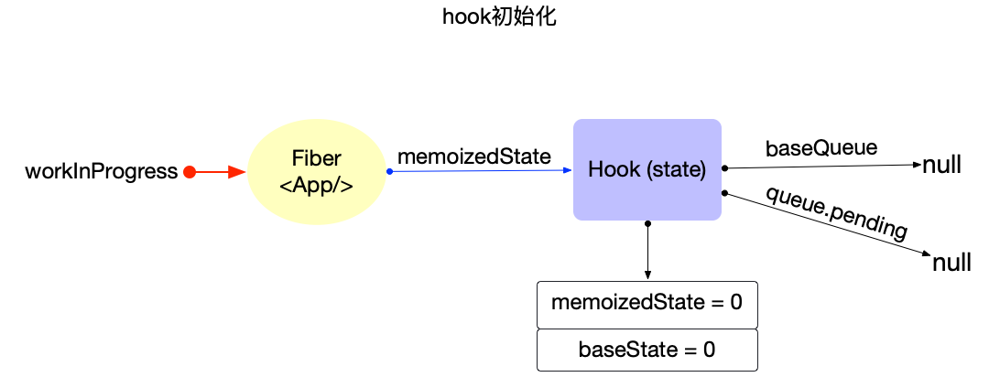
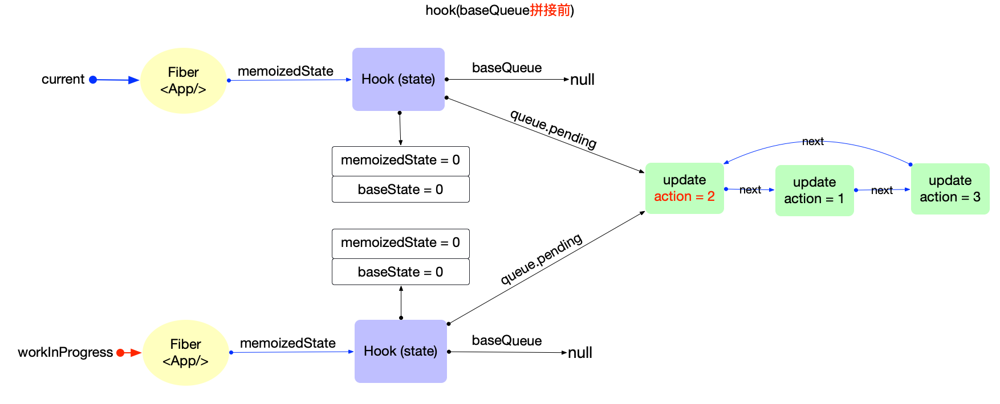
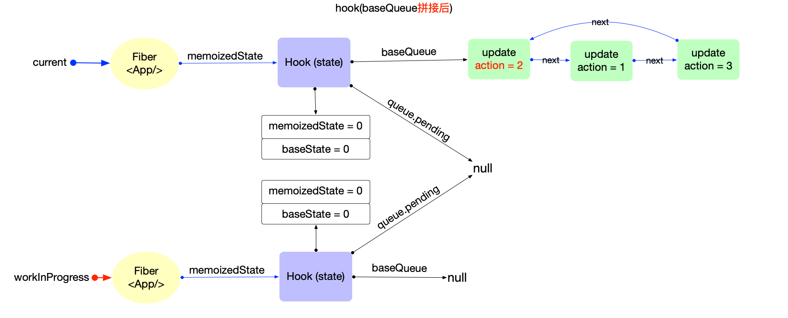
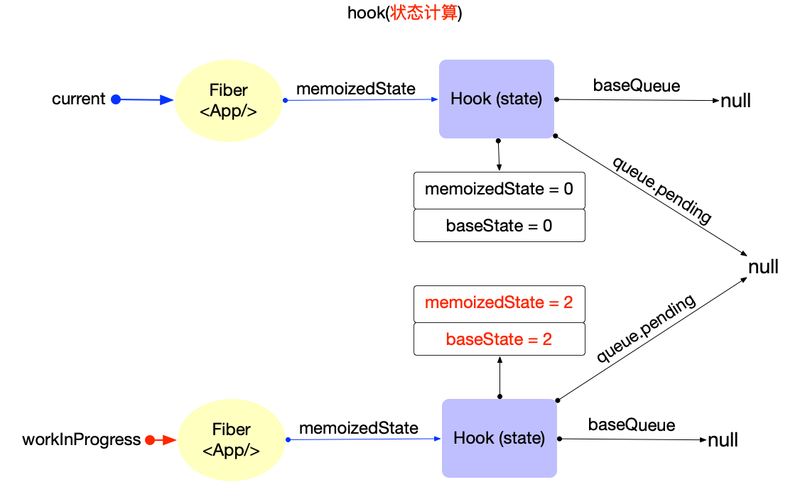
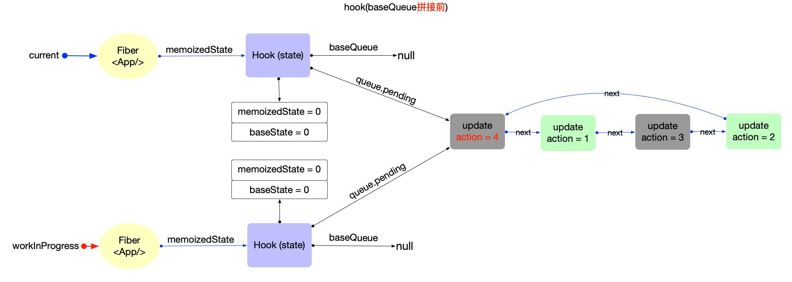
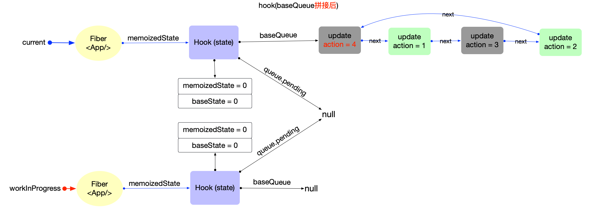
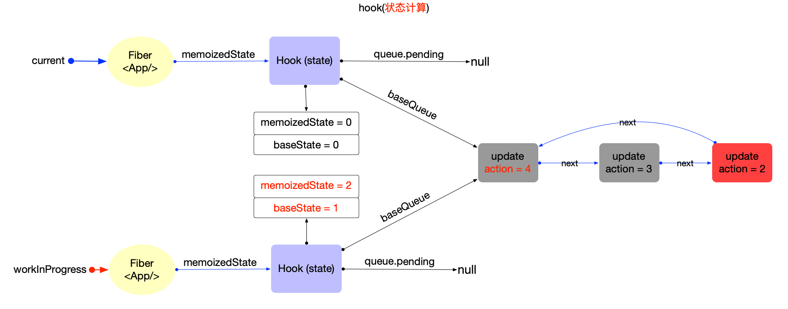
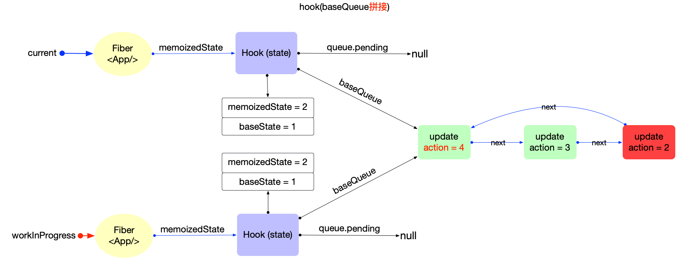
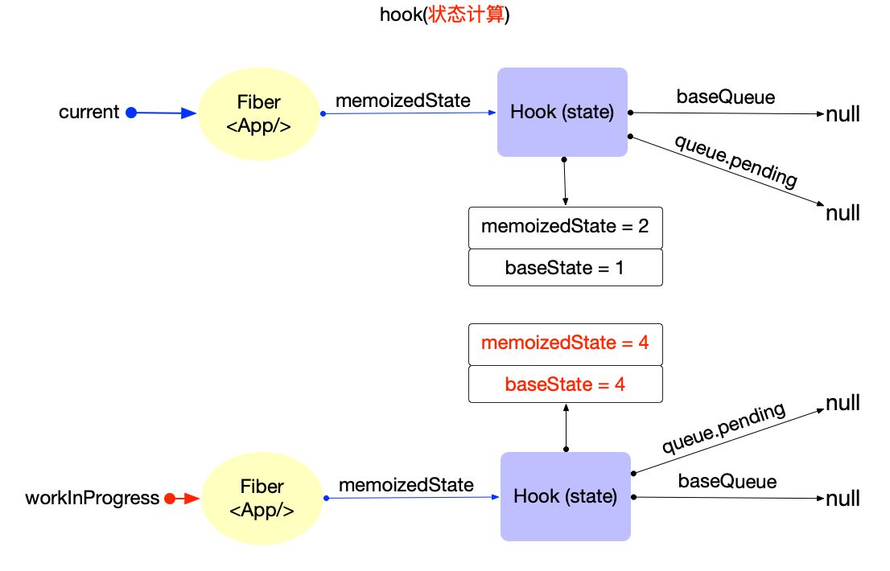

# Hook 原理(状态 Hook)

首先回顾一下前文[Hook 原理(概览)](./hook-summary.md), 其主要内容有:

1. `function`类型的`fiber`节点, 它的处理函数是[updateFunctionComponent](https://github.com/facebook/react/blob/v17.0.2/packages/react-reconciler/src/ReactFiberBeginWork.old.js#L702-L783), 其中再通过[renderWithHooks](https://github.com/facebook/react/blob/v17.0.2/packages/react-reconciler/src/ReactFiberHooks.old.js#L342-L476)调用`function`.
2. 在`function`中, 通过`Hook Api`(如: `useState, useEffect`)创建`Hook`对象.
   - `状态Hook`实现了状态持久化(等同于`class组件`维护`fiber.memoizedState`).
   - `副作用Hook`则实现了维护`fiber.flags`,并提供`副作用回调`(类似于`class组件`的生命周期回调)
3. 多个`Hook`对象构成一个`链表结构`, 并挂载到`fiber.memoizedState`之上.
4. `fiber树`更新阶段, 把`current.memoizedState`链表上的所有`Hook`按照顺序克隆到`workInProgress.memoizedState`上, 实现数据的持久化.

在此基础之上, 本节将深入分析`状态Hook`的特性和实现原理.

## 创建 Hook

在`fiber`初次构造阶段, [useState](https://github.com/facebook/react/blob/v17.0.2/packages/react-reconciler/src/ReactFiberHooks.old.js#L1787)对应源码[mountState](https://github.com/facebook/react/blob/v17.0.2/packages/react-reconciler/src/ReactFiberHooks.old.js#L1113-L1136), [useReducer](https://github.com/facebook/react/blob/v17.0.2/packages/react-reconciler/src/ReactFiberHooks.old.js#L1785)对应源码[mountReducer](https://github.com/facebook/react/blob/v17.0.2/packages/react-reconciler/src/ReactFiberHooks.old.js#L624-L649)

`mountState`:

```js
function mountState<S>(
  initialState: (() => S) | S,
): [S, Dispatch<BasicStateAction<S>>] {
  // 1. 创建hook
  const hook = mountWorkInProgressHook();
  if (typeof initialState === 'function') {
    initialState = initialState();
  }
  // 2. 初始化hook的属性
  // 2.1 设置 hook.memoizedState/hook.baseState
  // 2.2 设置 hook.queue
  hook.memoizedState = hook.baseState = initialState;
  const queue = (hook.queue = {
    pending: null,
    dispatch: null,
    // queue.lastRenderedReducer是内置函数
    lastRenderedReducer: basicStateReducer,
    lastRenderedState: (initialState: any),
  });
  // 2.3 设置 hook.dispatch
  const dispatch: Dispatch<
    BasicStateAction<S>,
  > = (queue.dispatch = (dispatchAction.bind(
    null,
    currentlyRenderingFiber,
    queue,
  ): any));

  // 3. 返回[当前状态, dispatch函数]
  return [hook.memoizedState, dispatch];
}
```

`mountReducer`:

```js
function mountReducer<S, I, A>(
  reducer: (S, A) => S,
  initialArg: I,
  init?: I => S,
): [S, Dispatch<A>] {
  // 1. 创建hook
  const hook = mountWorkInProgressHook();
  let initialState;
  if (init !== undefined) {
    initialState = init(initialArg);
  } else {
    initialState = ((initialArg: any): S);
  }
  // 2. 初始化hook的属性
  // 2.1 设置 hook.memoizedState/hook.baseState
  hook.memoizedState = hook.baseState = initialState;
  // 2.2 设置 hook.queue
  const queue = (hook.queue = {
    pending: null,
    dispatch: null,
    // queue.lastRenderedReducer是由外传入
    lastRenderedReducer: reducer,
    lastRenderedState: (initialState: any),
  });
  // 2.3 设置 hook.dispatch
  const dispatch: Dispatch<A> = (queue.dispatch = (dispatchAction.bind(
    null,
    currentlyRenderingFiber,
    queue,
  ): any));

  // 3. 返回[当前状态, dispatch函数]
  return [hook.memoizedState, dispatch];
}
```

`mountState`和`mountReducer`逻辑简单: 主要负责创建`hook`, 初始化`hook`的属性, 最后返回`[当前状态, dispatch函数]`.

唯一的不同点是`hook.queue.lastRenderedReducer`:

- `mountState`使用的是内置的[basicStateReducer](https://github.com/facebook/react/blob/v17.0.2/packages/react-reconciler/src/ReactFiberHooks.old.js#L619-L622)
  ```js
  function basicStateReducer<S>(state: S, action: BasicStateAction<S>): S {
    return typeof action === 'function' ? action(state) : action;
  }
  ```
- `mountReducer`使用的是外部传入自定义`reducer`

可见`mountState`是`mountReducer`的一种特殊情况, 即`useState`也是`useReducer`的一种特殊情况, 也是最简单的情况.

`useState`可以转换成`useReducer`:

```js
const [state, dispatch] = useState({ count: 0 });

// 等价于
const [state, dispatch] = useReducer(
  function basicStateReducer(state, action) {
    return typeof action === 'function' ? action(state) : action;
  },
  { count: 0 },
);

// 当需要更新state时, 有2种方式
dispatch({ count: 1 }); // 1.直接设置
dispatch(state => ({ count: state.count + 1 })); // 2.通过回调函数设置
```

`useReducer`的[官网示例](https://zh-hans.reactjs.org/docs/hooks-reference.html#usereducer):

```js
const [state, dispatch] = useReducer(
  function reducer(state, action) {
    switch (action.type) {
      case 'increment':
        return { count: state.count + 1 };
      case 'decrement':
        return { count: state.count - 1 };
      default:
        throw new Error();
    }
  },
  { count: 0 },
);

// 当需要更新state时, 只有1种方式
dispatch({ type: 'decrement' });
```

可见, `useState`就是对`useReducer`的基本封装, 内置了一个特殊的`reducer`(后文不再区分`useState, useReducer`, 都以`useState`为例).`创建hook`之后返回值`[hook.memoizedState, dispatch]`中的`dispath`实际上会调用`reducer`函数.

## 状态初始化

在`useState(initialState)`函数内部, 设置`hook.memoizedState = hook.baseState = initialState;`, 初始状态被同时保存到了`hook.baseState`,`hook.memoizedState`中.

1. `hook.memoizedState`: 当前状态
2. `hook.baseState`: `基础`状态, 作为合并`hook.baseQueue`的初始值(下文介绍).

最后返回`[hook.memoizedState, dispatch]`, 所以在`function`中使用的是`hook.memoizedState`.

## 状态更新

有如下代码:[](https://codesandbox.io/s/hook-status-vhlf8?fontsize=14&hidenavigation=1&theme=dark)

```jsx
import React, { useState } from 'react';
export default function App() {
  const [count, dispatch] = useState(0);
  return (
    <button
      onClick={() => {
        dispatch(1);
        dispatch(3);
        dispatch(2);
      }}
    >
      {count}
    </button>
  );
}
```

初次渲染时`count = 0`, 这时`hook`对象的内存状态如下:



点击`button`, 通过`dispatch`函数进行更新, `dispatch`实际就是[dispatchAction](https://github.com/facebook/react/blob/v17.0.2/packages/react-reconciler/src/ReactFiberHooks.old.js#L1645-L1753):

```js
function dispatchAction<S, A>(
  fiber: Fiber,
  queue: UpdateQueue<S, A>,
  action: A,
) {
  // 1. 创建update对象
  const eventTime = requestEventTime();
  const lane = requestUpdateLane(fiber); // Legacy模式返回SyncLane
  const update: Update<S, A> = {
    lane,
    action,
    eagerReducer: null,
    eagerState: null,
    next: (null: any),
  };

  // 2. 将update对象添加到hook.queue.pending队列
  const pending = queue.pending;
  if (pending === null) {
    // 首个update, 创建一个环形链表
    update.next = update;
  } else {
    update.next = pending.next;
    pending.next = update;
  }
  queue.pending = update;

  const alternate = fiber.alternate;
  if (
    fiber === currentlyRenderingFiber ||
    (alternate !== null && alternate === currentlyRenderingFiber)
  ) {
    // 渲染时更新, 做好全局标记
    didScheduleRenderPhaseUpdateDuringThisPass = didScheduleRenderPhaseUpdate = true;
  } else {
    // ...省略性能优化部分, 下文介绍

    // 3. 发起调度更新, 进入`reconciler 运作流程`中的输入阶段.
    scheduleUpdateOnFiber(fiber, lane, eventTime);
  }
}
```

逻辑十分清晰:

1. 创建`update`对象, 其中`update.lane`代表优先级(可回顾[fiber 树构造(基础准备)](./fibertree-prepare.md#update-lane)中的`update优先级`).
2. 将`update`对象添加到`hook.queue.pending`环形链表.
   - `环形链表`的特征: 为了方便添加新元素和快速拿到队首元素(都是`O(1)`), 所以`pending`指针指向了链表中最后一个元素.
   - 链表的使用方式可以参考[React 算法之链表操作](../algorithm/linkedlist.md)
3. 发起调度更新: 调用`scheduleUpdateOnFiber`, 进入`reconciler 运作流程`中的输入阶段.

从调用`scheduleUpdateOnFiber`开始, 进入了`react-reconciler`包, 其中的所有逻辑可回顾[reconciler 运作流程](./reconciler-workflow.md), 本节只讨论`状态Hook`相关逻辑.

注意: 本示例中虽然同时执行了 3 次 dispatch, 会请求 3 次调度, 由于调度中心的[节流优化](./scheduler.md##throttle-debounce), 最后只会执行一次渲染

在`fiber树构造(对比更新)`过程中, 再次调用`function`, 这时[useState](https://github.com/facebook/react/blob/v17.0.2/packages/react-reconciler/src/ReactFiberHooks.old.js#L1808)对应的函数是[updateState](https://github.com/facebook/react/blob/v17.0.2/packages/react-reconciler/src/ReactFiberHooks.old.js#L1138-L1142)

```js
function updateState<S>(
  initialState: (() => S) | S,
): [S, Dispatch<BasicStateAction<S>>] {
  return updateReducer(basicStateReducer, (initialState: any));
}
```

实际调用[updateReducer](https://github.com/facebook/react/blob/v17.0.2/packages/react-reconciler/src/ReactFiberHooks.old.js#L651-L783).

在执行`updateReducer`之前, `hook`相关的内存结构如下:



```js
function updateReducer<S, I, A>(
  reducer: (S, A) => S,
  initialArg: I,
  init?: I => S,
): [S, Dispatch<A>] {
  // 1. 获取workInProgressHook对象
  const hook = updateWorkInProgressHook();
  const queue = hook.queue;
  queue.lastRenderedReducer = reducer;
  const current: Hook = (currentHook: any);
  let baseQueue = current.baseQueue;

  // 2. 链表拼接: 将 hook.queue.pending 拼接到 current.baseQueue
  const pendingQueue = queue.pending;
  if (pendingQueue !== null) {
    if (baseQueue !== null) {
      const baseFirst = baseQueue.next;
      const pendingFirst = pendingQueue.next;
      baseQueue.next = pendingFirst;
      pendingQueue.next = baseFirst;
    }
    current.baseQueue = baseQueue = pendingQueue;
    queue.pending = null;
  }
  // 3. 状态计算
  if (baseQueue !== null) {
    const first = baseQueue.next;
    let newState = current.baseState;

    let newBaseState = null;
    let newBaseQueueFirst = null;
    let newBaseQueueLast = null;
    let update = first;

    do {
      const updateLane = update.lane;
      // 3.1 优先级提取update
      if (!isSubsetOfLanes(renderLanes, updateLane)) {
        // 优先级不够: 加入到baseQueue中, 等待下一次render
        const clone: Update<S, A> = {
          lane: updateLane,
          action: update.action,
          eagerReducer: update.eagerReducer,
          eagerState: update.eagerState,
          next: (null: any),
        };
        if (newBaseQueueLast === null) {
          newBaseQueueFirst = newBaseQueueLast = clone;
          newBaseState = newState;
        } else {
          newBaseQueueLast = newBaseQueueLast.next = clone;
        }
        currentlyRenderingFiber.lanes = mergeLanes(
          currentlyRenderingFiber.lanes,
          updateLane,
        );
        markSkippedUpdateLanes(updateLane);
      } else {
        // 优先级足够: 状态合并
        if (newBaseQueueLast !== null) {
          // 更新baseQueue
          const clone: Update<S, A> = {
            lane: NoLane,
            action: update.action,
            eagerReducer: update.eagerReducer,
            eagerState: update.eagerState,
            next: (null: any),
          };
          newBaseQueueLast = newBaseQueueLast.next = clone;
        }
        if (update.eagerReducer === reducer) {
          // 性能优化: 如果存在 update.eagerReducer, 直接使用update.eagerState.避免重复调用reducer
          newState = ((update.eagerState: any): S);
        } else {
          const action = update.action;
          // 调用reducer获取最新状态
          newState = reducer(newState, action);
        }
      }
      update = update.next;
    } while (update !== null && update !== first);

    // 3.2. 更新属性
    if (newBaseQueueLast === null) {
      newBaseState = newState;
    } else {
      newBaseQueueLast.next = (newBaseQueueFirst: any);
    }
    if (!is(newState, hook.memoizedState)) {
      markWorkInProgressReceivedUpdate();
    }
    // 把计算之后的结果更新到workInProgressHook上
    hook.memoizedState = newState;
    hook.baseState = newBaseState;
    hook.baseQueue = newBaseQueueLast;
    queue.lastRenderedState = newState;
  }

  const dispatch: Dispatch<A> = (queue.dispatch: any);
  return [hook.memoizedState, dispatch];
}
```

`updateReducer`函数, 代码相对较长, 但是逻辑分明:

1. 调用`updateWorkInProgressHook`获取`workInProgressHook`对象
2. 链表拼接: 将 `hook.queue.pending` 拼接到 `current.baseQueue`

   

3. 状态计算

   1. `update`优先级不够: 加入到 baseQueue 中, 等待下一次 render
   2. `update`优先级足够: 状态合并
   3. 更新属性

      

### 性能优化

`dispatchAction`函数中, 在调用`scheduleUpdateOnFiber`之前, 针对`update`对象做了性能优化.

1. `queue.pending`中只包含当前`update`时, 即当前`update`是`queue.pending`中的第一个`update`
2. 直接调用`queue.lastRenderedReducer`,计算出`update`之后的 state, 记为`eagerState`
3. 如果`eagerState`与`currentState`相同, 则直接退出, 不用发起调度更新.
4. 已经被挂载到`queue.pending`上的`update`会在下一次`render`时再次合并.

```js
function dispatchAction<S, A>(
  fiber: Fiber,
  queue: UpdateQueue<S, A>,
  action: A,
) {
  // ...省略无关代码 ...只保留性能优化部分代码:

  // 下面这个if判断, 能保证当前创建的update, 是`queue.pending`中第一个`update`. 为什么? 发起更新之后fiber.lanes会被改动(可以回顾`fiber 树构造(对比更新)`章节), 如果`fiber.lanes && alternate.lanes`没有被改动, 自然就是首个update
  if (
    fiber.lanes === NoLanes &&
    (alternate === null || alternate.lanes === NoLanes)
  ) {
    const lastRenderedReducer = queue.lastRenderedReducer;
    if (lastRenderedReducer !== null) {
      let prevDispatcher;
      const currentState: S = (queue.lastRenderedState: any);
      const eagerState = lastRenderedReducer(currentState, action);
      // 暂存`eagerReducer`和`eagerState`, 如果在render阶段reducer==update.eagerReducer, 则可以直接使用无需再次计算
      update.eagerReducer = lastRenderedReducer;
      update.eagerState = eagerState;
      if (is(eagerState, currentState)) {
        // 快速通道, eagerState与currentState相同, 无需调度更新
        // 注: update已经被添加到了queue.pending, 并没有丢弃. 之后需要更新的时候, 此update还是会起作用
        return;
      }
    }
  }
  // 发起调度更新, 进入`reconciler 运作流程`中的输入阶段.
  scheduleUpdateOnFiber(fiber, lane, eventTime);
}
```

为了验证上述优化, 可以查看这个 demo:[](https://codesandbox.io/s/hook-throttle-58ly5?fontsize=14&hidenavigation=1&theme=dark)

### 异步更新

上述示例都是为在`Legacy`模式下, 所以均为同步更新. 所以`update`对象会被全量合并,`hook.baseQueue`和`hook.baseState`并没有起到实质作用.

虽然在`v17.x`版本中, 并没有`Concurrent`模式的入口, 即将发布的`v18.x`版本将全面进入异步时代, 所以本节提前梳理一下`update`异步合并的逻辑. 同时加深`hook.baseQueue`和`hook.baseState`的理解.

假设有一个`queue.pending`链表, 其中`update`优先级不同, `绿色`表示高优先级, `灰色`表示低优先级, `红色`表示最高优先级.

在执行`updateReducer`之前, `hook.memoizedState`有如下结构(其中`update3, update4`是低优先级):



链表拼接:

- 和同步更新时一致, 直接把`queue.pending`拼接到`current.baseQueue`



状态计算:

- 只会提取`update1, update2`这 2 个高优先级的`update`, 所以最后`memoizedState=2`
- 保留其余低优先级的`update`, 等待下一次`render`
- 从第一个低优先级`update3`开始, 随后的所有`update`都会被添加到`baseQueue`, 由于`update2`已经是高优先级, 会设置`update2.lane=NoLane`将优先级升级到最高(红色表示).
- 而`baseState`代表第一个低优先级`update3`之前的`state`, 在本例中, `baseState=1`



`function`节点被处理完后, 高优先级的`update`, 会率先被使用(`memoizedState=2`). 一段时间后, 低优先级`update3, update4`符合渲染, 这种情况下再次执行`updateReducer`重复之前的步骤.

链表拼接:

- 由于`queue.pending = null`, 故拼接前后没有实质变化



状态计算:

- 现在所有`update.lane`都符合`渲染优先级`, 所以最后的内存结构与同步更新一致(`memoizedState=4,baseState=4`).



> 结论: 尽管`update`链表的优先级不同, 中间的`render`可能有多次, 但最终的更新结果等于`update`链表`按顺序合并`.

## 总结

本节深入分析`状态Hook`即`useState`的内部原理, 从`同步,异步`更新理解了`update`对象的合并方式, 最终结果存储在`hook.memoizedState`供给`function`使用.
