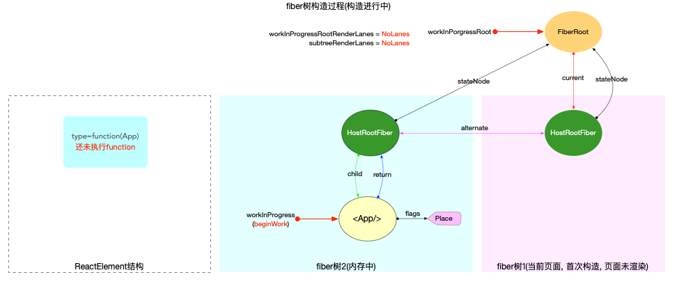
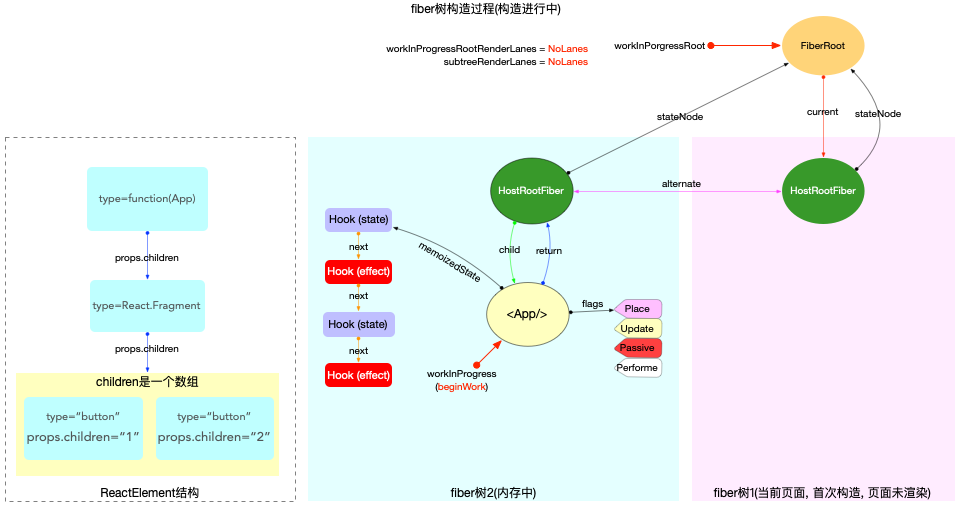
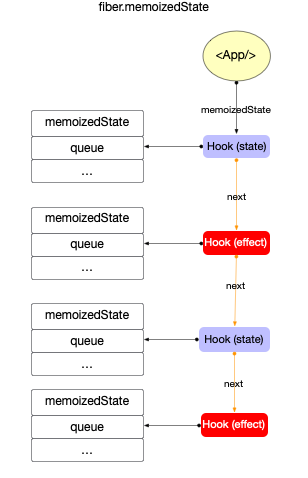
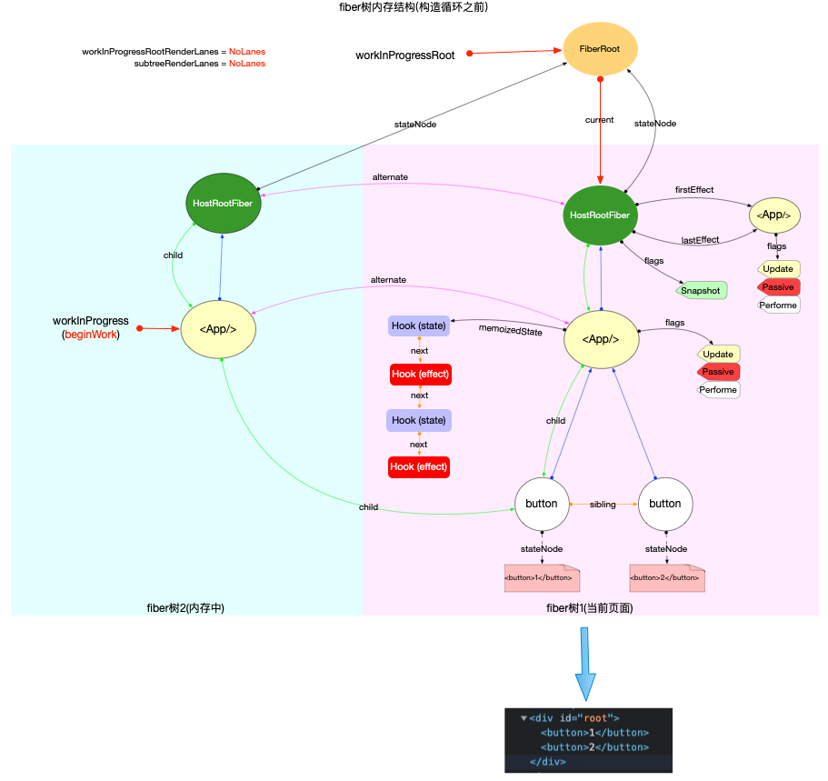
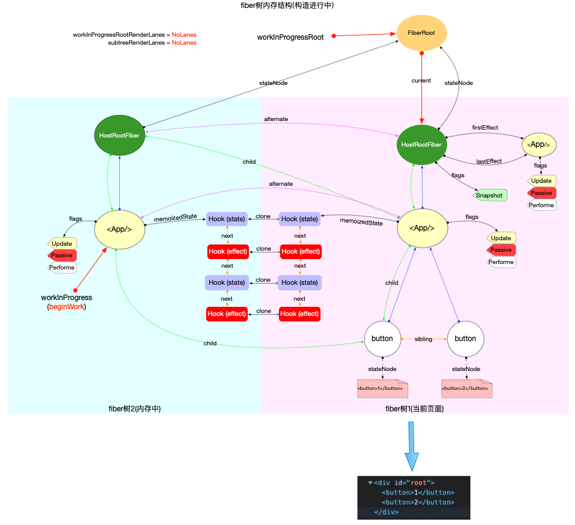
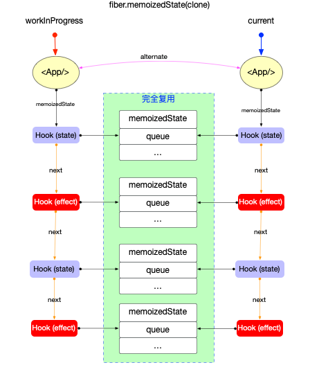

# Hook 原理(概览)

在前文[状态与副作用](./state-effects.md)中, 总结了`class组件, function组件`中通过`api`去改变`fiber节点`的`状态`和`副作用`. 其中对于`function组件`来讲, 其内部则需要依靠`Hook`来实现.

官方文档上专门用了一个版块来介绍[Hook](https://zh-hans.reactjs.org/docs/hooks-intro.html), 这里摘抄了几个比较关心的问题(其他`FAQ`请移步官网):

1. [引入`Hook`的动机?](https://zh-hans.reactjs.org/docs/hooks-intro.html#motivation)

   - 在组件之间复用状态逻辑很难; 复杂组件变得难以理解; 难以理解的 class. 为了解决这些实际开发痛点, 引入了`Hook`.

2. [`Hook` 是什么? 什么时候会用 `Hook`?](https://zh-hans.reactjs.org/docs/hooks-state.html#whats-a-hook)

   - `Hook` 是一个特殊的函数, 它可以让你“钩入” `React` 的特性. 如, `useState` 是允许你在 `React` 函数组件中添加 `state` 的 `Hook`.
   - 如果你在编写函数组件并意识到需要向其添加一些 `state`, 以前的做法是必须将其转化为 `class`. 现在你可以在现有的函数组件中使用 `Hook`.

3. [`Hook` 会因为在渲染时创建函数而变慢吗?](https://zh-hans.reactjs.org/docs/hooks-faq.html#are-hooks-slow-because-of-creating-functions-in-render)
   - 不会. 在现代浏览器中,闭包和类的原始性能只有在极端场景下才会有明显的差别. 除此之外,可以认为 `Hook` 的设计在某些方面更加高效:
     - `Hook` 避免了 `class` 需要的额外开支,像是创建类实例和在构造函数中绑定事件处理器的成本.
     - 符合语言习惯的代码在使用 `Hook` 时不需要很深的组件树嵌套. 这个现象在使用`高阶组件`、`render props`、和 `context` 的代码库中非常普遍. 组件树小了, `React` 的工作量也随之减少.

所以`Hook`是`React`团队在大量实践后的产物, 更优雅的代替`class`, 且性能更高. 故从开发使用者的角度来讲, 应该拥抱`Hook`所带来的便利.

## Hook 与 Fiber

通过官网文档的讲解, 能快速掌握`Hook`的使用. 再结合前文[状态与副作用](./state-effects.md)的介绍, 我们知道使用`Hook`最终也是为了控制`fiber节点`的`状态`和`副作用`. 从`fiber`视角, 状态和副作用相关的属性如下(这里不再解释单个属性的意义, 可以回顾[状态与副作用](./state-effects.md)):

```js
export type Fiber = {|
  // 1. fiber节点自身状态相关
  pendingProps: any,
  memoizedProps: any,
  updateQueue: mixed,
  memoizedState: any,

  // 2. fiber节点副作用(Effect)相关
  flags: Flags,
  nextEffect: Fiber | null,
  firstEffect: Fiber | null,
  lastEffect: Fiber | null,
|};
```

使用`Hook`的任意一个`api`, 最后都是为了控制上述这几个`fiber属性`.

## Hook 数据结构

在[ReactFiberHooks](https://github.com/facebook/react/blob/v17.0.2/packages/react-reconciler/src/ReactFiberHooks.old.js#L95-L140)中, 定义了`Hook`的数据结构:

```js
type Update<S, A> = {|
  lane: Lane,
  action: A,
  eagerReducer: ((S, A) => S) | null,
  eagerState: S | null,
  next: Update<S, A>,
  priority?: ReactPriorityLevel,
|};

type UpdateQueue<S, A> = {|
  pending: Update<S, A> | null,
  dispatch: (A => mixed) | null,
  lastRenderedReducer: ((S, A) => S) | null,
  lastRenderedState: S | null,
|};

export type Hook = {|
  memoizedState: any, // 当前状态
  baseState: any, // 基状态
  baseQueue: Update<any, any> | null, // 基队列
  queue: UpdateQueue<any, any> | null, // 更新队列
  next: Hook | null, // next指针
|};
```

从定义来看, `Hook`对象共有 5 个属性(有关这些属性的应用, 将在`Hook 原理(状态)`章节中具体分析.):

1. `hook.memoizedState`: 保持在内存中的局部状态.
2. `hook.baseState`: `hook.baseQueue`中所有`update`对象合并之后的状态.
3. `hook.baseQueue`: 存储`update对象`的环形链表, 只包括高于本次渲染优先级的`update对象`.
4. `hook.queue`: 存储`update对象`的环形链表, 包括所有优先级的`update对象`.
5. `hook.next`: `next`指针, 指向链表中的下一个`hook`.

所以`Hook`是一个链表, 单个`Hook`拥有自己的状态`hook.memoizedState`和自己的更新队列`hook.queue`(有关 Hook 状态的分析, 在`Hook原理(状态)`章节中解读).


注意: 其中`hook.queue`与`fiber.updateQueue`虽然都是`update环形链表`, 尽管`update对象`的数据结构与处理方式都高度相似, 但是这 2 个队列中的`update对象`是完全独立的. `hook.queue`只作用于`hook对象`的状态维护, 切勿与`fiber.updateQueue`混淆.

## Hook 分类

在`v17.0.2`中, 共定义了[14 种 Hook](https://github.com/facebook/react/blob/v17.0.2/packages/react-reconciler/src/ReactFiberHooks.old.js#L111-L125)

```js
export type HookType =
  | 'useState'
  | 'useReducer'
  | 'useContext'
  | 'useRef'
  | 'useEffect'
  | 'useLayoutEffect'
  | 'useCallback'
  | 'useMemo'
  | 'useImperativeHandle'
  | 'useDebugValue'
  | 'useDeferredValue'
  | 'useTransition'
  | 'useMutableSource'
  | 'useOpaqueIdentifier';
```

官网上已经将其分为了 2 个类别, 状态`Hook`(`State Hook`), 和副作用`Hook`(`Effect Hook`).

这里我们可以结合前文[状态与副作用](./state-effects.md), 从`fiber`的视角去理解`状态Hook`与`副作用Hook`的区别.

### 状态 Hook

狭义上讲, `useState, useReducer`可以在`function组件`添加内部的`state`, 且`useState`实际上是`useReducer`的简易封装, 是一个最特殊(简单)的`useReducer`. 所以将`useState, useReducer`称为`状态Hook`.

广义上讲, 只要能实现数据持久化`且没有副作用`的`Hook`, 均可以视为`状态Hook`, 所以还包括`useContext, useRef, useCallback, useMemo`等. 这类`Hook`内部没有使用`useState/useReduer`, 但是它们也能实现多次`render`时, 保持其初始值不变(即数据持久化)且没有任何`副作用`.

得益于[双缓冲技术(double buffering)](./fibertree-prepare.md#双缓冲技术), 在多次`render`时, 以`fiber`为载体, 保证复用同一个`Hook`对象, 进而实现数据持久化. 具体实现细节, 在`Hook原理(状态)`章节中讨论.

### 副作用 Hook

回到`fiber`视角, `状态Hook`实现了状态持久化(等同于`class组件`维护`fiber.memoizedState`), 那么`副作用Hook`则会修改`fiber.flags`. (通过前文`fiber树构造`系列的解读, 我们知道在`performUnitOfWork->completeWork`阶段, 所有存在副作用的`fiber`节点, 都会被添加到父节点的`副作用队列`后, 最后在`commitRoot`阶段处理这些`副作用节点`.)

另外, `副作用Hook`还提供了`副作用回调`(类似于`class组件`的生命周期回调), 比如:

```js
// 使用useEffect时, 需要传入一个副作用回调函数.
// 在fiber树构造完成之后, commitRoot阶段会处理这些副作用回调
useEffect(() => {
  console.log('这是一个副作用回调函数');
}, []);
```

在`react`内部, `useEffect`就是最标准的`副作用Hook`. 其他比如`useLayoutEffect`以及`自定义Hook`, 如果要实现`副作用`, 必须直接或间接的调用`useEffect`.

有关`useEffect`具体实现细节, 在`Hook原理(副作用)`章节中讨论.

### 组合 Hook

虽然官网并无`组合Hook`的说法, 但事实上大多数`Hook`(包括自定义`Hook`)都是由上述 2 种 `Hook`组合而成, 同时拥有这 2 种 Hook 的特性.

- 在`react`内部有`useDeferredValue, useTransition, useMutableSource, useOpaqueIdentifier`等.
- 平时开发中, `自定义Hook`大部分都是组合 Hook.

比如官网上的[自定义 Hook](https://zh-hans.reactjs.org/docs/hooks-custom.html#extracting-a-custom-hook)例子:

```js
import { useState, useEffect } from 'react';

function useFriendStatus(friendID) {
  // 1. 调用useState, 创建一个状态Hook
  const [isOnline, setIsOnline] = useState(null);

  // 2. 调用useEffect, 创建一个副作用Hook
  useEffect(() => {
    function handleStatusChange(status) {
      setIsOnline(status.isOnline);
    }
    ChatAPI.subscribeToFriendStatus(friendID, handleStatusChange);
    return () => {
      ChatAPI.unsubscribeFromFriendStatus(friendID, handleStatusChange);
    };
  });
  return isOnline;
}
```

## 调用 function 前

在调用`function`之前, `react`内部还需要提前做一些准备工作.

### 处理函数

从`fiber树构造`的视角来看, 不同的`fiber`类型, 只需要调用不同的`处理函数`返回`fiber子节点`. 所以在[performUnitOfWork->beginWork](https://github.com/facebook/react/blob/v17.0.2/packages/react-reconciler/src/ReactFiberBeginWork.old.js#L3340-L3354)函数中, 调用了多种`处理函数`. 从调用方来讲, 无需关心`处理函数`的内部实现(比如`updateFunctionComponent`内部使用了`Hook对象`, `updateClassComponent`内部使用了`class实例`).

本节讨论`Hook`, 所以列出其中的[updateFunctionComponent](https://github.com/facebook/react/blob/v17.0.2/packages/react-reconciler/src/ReactFiberBeginWork.old.js#L702-L783)函数:

```js
// 只保留FunctionComponent相关:
function beginWork(
  current: Fiber | null,
  workInProgress: Fiber,
  renderLanes: Lanes,
): Fiber | null {
  const updateLanes = workInProgress.lanes;
  switch (workInProgress.tag) {
    case FunctionComponent: {
      const Component = workInProgress.type;
      const unresolvedProps = workInProgress.pendingProps;
      const resolvedProps =
        workInProgress.elementType === Component
          ? unresolvedProps
          : resolveDefaultProps(Component, unresolvedProps);
      return updateFunctionComponent(
        current,
        workInProgress,
        Component,
        resolvedProps,
        renderLanes,
      );
    }
  }
}

function updateFunctionComponent(
  current,
  workInProgress,
  Component,
  nextProps: any,
  renderLanes,
) {
  // ...省略无关代码
  let context;
  let nextChildren;
  prepareToReadContext(workInProgress, renderLanes);

  // 进入Hooks相关逻辑, 最后返回下级ReactElement对象
  nextChildren = renderWithHooks(
    current,
    workInProgress,
    Component,
    nextProps,
    context,
    renderLanes,
  );
  // 进入reconcile函数, 生成下级fiber节点
  reconcileChildren(current, workInProgress, nextChildren, renderLanes);
  // 返回下级fiber节点
  return workInProgress.child;
}
```

在`updateFunctionComponent`函数中调用了[renderWithHooks](https://github.com/facebook/react/blob/v17.0.2/packages/react-reconciler/src/ReactFiberHooks.old.js#L342-L476)(位于[ReactFiberHooks](https://github.com/facebook/react/blob/v17.0.2/packages/react-reconciler/src/ReactFiberHooks.old.js)) , 至此`Fiber`与`Hook`产生了关联.

### 全局变量

在分析`renderWithHooks`函数前, 有必要理解[ReactFiberHooks](https://github.com/facebook/react/blob/v17.0.2/packages/react-reconciler/src/ReactFiberHooks.old.js)头部定义的全局变量(源码中均有英文注释):

```js
// 渲染优先级
let renderLanes: Lanes = NoLanes;

// 当前正在构造的fiber, 等同于 workInProgress, 为了和当前hook区分, 所以将其改名
let currentlyRenderingFiber: Fiber = (null: any);

// Hooks被存储在fiber.memoizedState 链表上
let currentHook: Hook | null = null; // currentHook = fiber(current).memoizedState

let workInProgressHook: Hook | null = null; // workInProgressHook = fiber(workInProgress).memoizedState

// 在function的执行过程中, 是否再次发起了更新. 只有function被完全执行之后才会重置.
// 当render异常时, 通过该变量可以决定是否清除render过程中的更新.
let didScheduleRenderPhaseUpdate: boolean = false;

// 在本次function的执行过程中, 是否再次发起了更新. 每一次调用function都会被重置
let didScheduleRenderPhaseUpdateDuringThisPass: boolean = false;

// 在本次function的执行过程中, 重新发起更新的最大次数
const RE_RENDER_LIMIT = 25;
```

每个变量的解释, 可以对照源码中的英文注释, 其中最重要的有:

1. `currentlyRenderingFiber`: 当前正在构造的 fiber, 等同于 workInProgress
2. `currentHook 与 workInProgressHook`: 分别指向`current.memoizedState`和`workInProgress.memoizedState`

注: 有关`current`和`workInProgress`的区别, 请回顾[双缓冲技术(double buffering)](./fibertree-prepare.md#双缓冲技术)

### renderWithHooks 函数

[renderWithHooks](https://github.com/facebook/react/blob/v17.0.2/packages/react-reconciler/src/ReactFiberHooks.old.js#L342-L476)源码看似较长, 但是去除 dev 后保留主杆, 逻辑十分清晰. 以调用`function`为分界点, 逻辑被分为 3 个部分:

```js
// ...省略无关代码
export function renderWithHooks<Props, SecondArg>(
  current: Fiber | null,
  workInProgress: Fiber,
  Component: (p: Props, arg: SecondArg) => any,
  props: Props,
  secondArg: SecondArg,
  nextRenderLanes: Lanes,
): any {
  // --------------- 1. 设置全局变量 -------------------
  renderLanes = nextRenderLanes; // 当前渲染优先级
  currentlyRenderingFiber = workInProgress; // 当前fiber节点, 也就是function组件对应的fiber节点

  // 清除当前fiber的遗留状态
  workInProgress.memoizedState = null;
  workInProgress.updateQueue = null;
  workInProgress.lanes = NoLanes;

  // --------------- 2. 调用function,生成子级ReactElement对象 -------------------
  // 指定dispatcher, 区分mount和update
  ReactCurrentDispatcher.current =
    current === null || current.memoizedState === null
      ? HooksDispatcherOnMount
      : HooksDispatcherOnUpdate;
  // 执行function函数, 其中进行分析Hooks的使用
  let children = Component(props, secondArg);

  // --------------- 3. 重置全局变量,并返回 -------------------
  // 执行function之后, 还原被修改的全局变量, 不影响下一次调用
  renderLanes = NoLanes;
  currentlyRenderingFiber = (null: any);

  currentHook = null;
  workInProgressHook = null;
  didScheduleRenderPhaseUpdate = false;

  return children;
}
```

1. 调用`function`前: 设置全局变量, 标记`渲染优先级`和当前`fiber`, 清除当前`fiber`的遗留状态.
2. 调用`function`: 构造出`Hooks`链表, 最后生成子级`ReactElement`对象(`children`).
3. 调用`function`后: 重置全局变量, 返回`children`.
   - 为了保证不同的`function`节点在调用时`renderWithHooks`互不影响, 所以退出时重置全局变量.

## 调用 function

### Hooks 构造

在`function`中, 如果使用了`Hook api`(如: `useEffect`, `useState`), 就会创建一个与之对应的`Hook`对象, 接下来重点分析这个创建过程.

有如下 demo:
[](https://codesandbox.io/s/hook-summary-wb7zz?fontsize=14&hidenavigation=1&theme=dark)

```jsx
import { useState, useEffect } from 'react';
export default function App() {
  // 1. useState
  const [a, setA] = useState(1);
  // 2. useEffect
  useEffect(() => {
    console.log(`effect 1 created`);
  });
  // 3. useState
  const [b] = useState(2);
  // 4. useEffect
  useEffect(() => {
    console.log(`effect 2 created`);
  });
  return (
    <>
      <button onClick={() => setA(a + 1)}>{a}</button>
      <button>{b}</button>
    </>
  );
}
```

在`function`组件中, 同时使用了`状态Hook`和`副作用Hook`.

初次渲染时, 逻辑执行到`performUnitOfWork->beginWork->updateFunctionComponent->renderWithHooks`前, 内存结构如下(本节重点是`Hook`, 有关`fiber树构造`过程可回顾前文):



当执行`renderWithHooks`时, 开始调用`function`. 本例中, 在`function`内部, 共使用了 4 次`Hook api`, 依次调用`useState, useEffect, useState, useEffect`.

而`useState, useEffect`在`fiber`初次构造时分别对应[mountState](https://github.com/facebook/react/blob/v17.0.2/packages/react-reconciler/src/ReactFiberHooks.old.js#L1113-L1136)和[mountEffect->mountEffectImpl](https://github.com/facebook/react/blob/v17.0.2/packages/react-reconciler/src/ReactFiberHooks.old.js#L1193-L1248)

```js
function mountState<S>(
  initialState: (() => S) | S,
): [S, Dispatch<BasicStateAction<S>>] {
  const hook = mountWorkInProgressHook();
  // ...省略部分本节不讨论
  return [hook.memoizedState, dispatch];
}

function mountEffectImpl(fiberFlags, hookFlags, create, deps): void {
  const hook = mountWorkInProgressHook();
  // ...省略部分本节不讨论
}
```

无论`useState, useEffect`, 内部都通过`mountWorkInProgressHook`创建一个 hook.

### 链表存储

而[mountWorkInProgressHook](https://github.com/facebook/react/blob/v17.0.2/packages/react-reconciler/src/ReactFiberHooks.old.js#L531-L550)非常简单:

```js
function mountWorkInProgressHook(): Hook {
  const hook: Hook = {
    memoizedState: null,

    baseState: null,
    baseQueue: null,
    queue: null,

    next: null,
  };

  if (workInProgressHook === null) {
    // 链表中首个hook
    currentlyRenderingFiber.memoizedState = workInProgressHook = hook;
  } else {
    // 将hook添加到链表末尾
    workInProgressHook = workInProgressHook.next = hook;
  }
  return workInProgressHook;
}
```

逻辑是创建`Hook`并挂载到`fiber.memoizedState`上, 多个`Hook`以链表结构保存.

本示例中, `function`调用之后则会创建 4 个`hook`, 这时的内存结构如下:



可以看到: 无论`状态Hook`或`副作用Hook`都按照调用顺序存储在`fiber.memoizedState`链表中.



### 顺序克隆

`fiber树构造(对比更新)`阶段, 执行`updateFunctionComponent->renderWithHooks`时再次调用`function`, `调用function前`的内存结构如下:



注意: 在`renderWithHooks`函数中已经设置了`workInProgress.memoizedState = null`, 等待调用`function`时重新设置.

接下来调用`function`, 同样依次调用`useState, useEffect, useState, useEffect`. 而`useState, useEffect`在`fiber`对比更新时分别对应[updateState->updateReducer](https://github.com/facebook/react/blob/v17.0.2/packages/react-reconciler/src/ReactFiberHooks.old.js#L1138-L1142)和[updateEffect->updateEffectImpl](https://github.com/facebook/react/blob/v17.0.2/packages/react-reconciler/src/ReactFiberHooks.old.js#L1205-L1266)

```js
// ----- 状态Hook --------
function updateReducer<S, I, A>(
  reducer: (S, A) => S,
  initialArg: I,
  init?: I => S,
): [S, Dispatch<A>] {
  const hook = updateWorkInProgressHook();
  // ...省略部分本节不讨论
}

// ----- 副作用Hook --------
function updateEffectImpl(fiberFlags, hookFlags, create, deps): void {
  const hook = updateWorkInProgressHook();
  // ...省略部分本节不讨论
}
```

无论`useState, useEffect`, 内部调用`updateWorkInProgressHook`获取一个 hook.

```js
function updateWorkInProgressHook(): Hook {
  // 1. 移动currentHook指针
  let nextCurrentHook: null | Hook;
  if (currentHook === null) {
    const current = currentlyRenderingFiber.alternate;
    if (current !== null) {
      nextCurrentHook = current.memoizedState;
    } else {
      nextCurrentHook = null;
    }
  } else {
    nextCurrentHook = currentHook.next;
  }

  // 2. 移动workInProgressHook指针
  let nextWorkInProgressHook: null | Hook;
  if (workInProgressHook === null) {
    nextWorkInProgressHook = currentlyRenderingFiber.memoizedState;
  } else {
    nextWorkInProgressHook = workInProgressHook.next;
  }

  if (nextWorkInProgressHook !== null) {
    // 渲染时更新: 本节不讨论
  } else {
    currentHook = nextCurrentHook;
    // 3. 克隆currentHook作为新的workInProgressHook.
    // 随后逻辑与mountWorkInProgressHook一致
    const newHook: Hook = {
      memoizedState: currentHook.memoizedState,

      baseState: currentHook.baseState,
      baseQueue: currentHook.baseQueue,
      queue: currentHook.queue,

      next: null, // 注意next指针是null
    };
    if (workInProgressHook === null) {
      currentlyRenderingFiber.memoizedState = workInProgressHook = newHook;
    } else {
      workInProgressHook = workInProgressHook.next = newHook;
    }
  }
  return workInProgressHook;
}
```

`updateWorkInProgressHook`函数逻辑简单: 目的是为了让`currentHook`和`workInProgressHook`两个指针同时向后移动.

1. 由于`renderWithHooks函数`设置了`workInProgress.memoizedState=null`, 所以`workInProgressHook`初始值必然为`null`, 只能从`currentHook`克隆.
2. 而从`currentHook`克隆而来的`newHook.next=null`, 进而导致`workInProgressHook`链表需要完全重建.

所以`function`执行完成之后, 有关`Hook`的内存结构如下:



可以看到:

1. 以双缓冲技术为基础, 将`current.memoizedState`按照顺序克隆到了`workInProgress.memoizedState`中.
2. `Hook`经过了一次克隆, 内部的属性(`hook.memoizedState`等)都没有变动, 所以其状态并不会丢失.



## 总结

本节首先引入了官方文档上对于`Hook`的解释, 了解`Hook`的由来, 以及`Hook`相较于`class`的优势. 然后从`fiber`视角分析了`fiber`与`hook`的内在关系, 通过`renderWithHooks`函数, 把`Hook`链表挂载到了`fiber.memoizedState`之上. 利用`fiber树`内部的双缓冲技术, 实现了`Hook`从`current`到`workInProgress`转移, 进而实现了`Hook`状态的持久化.
