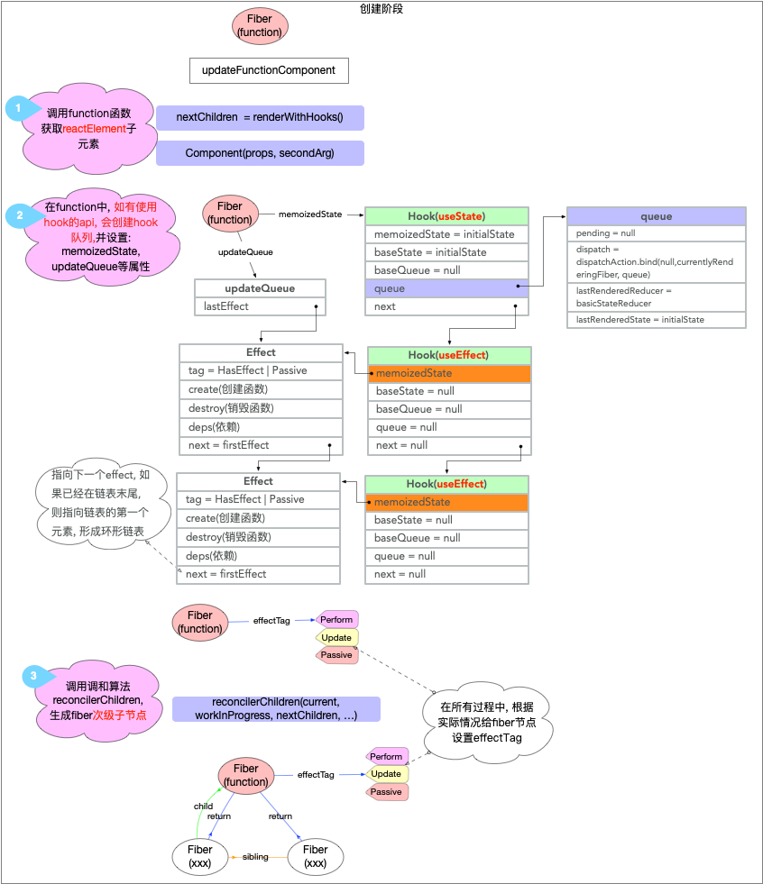
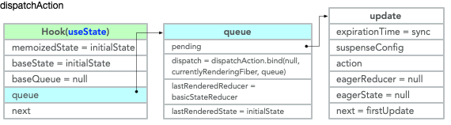
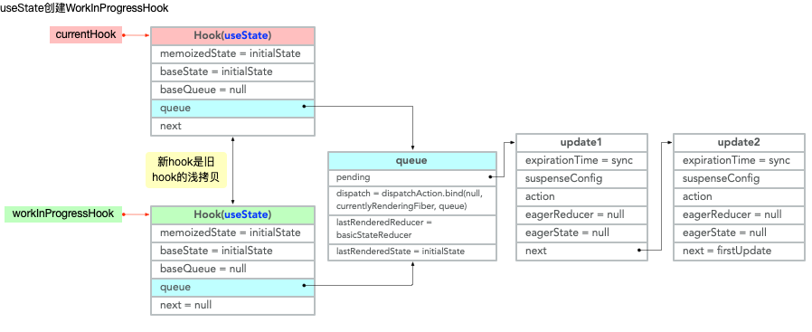
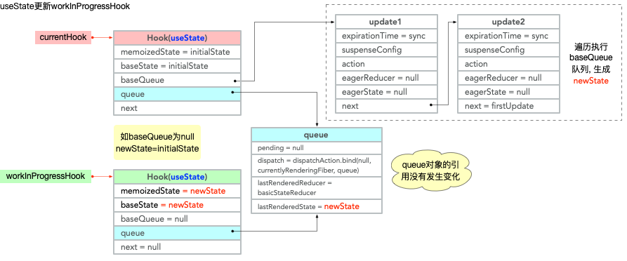
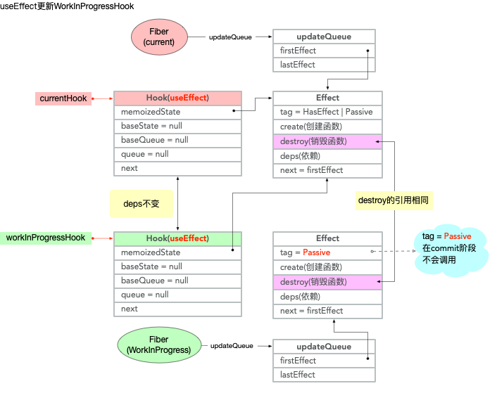
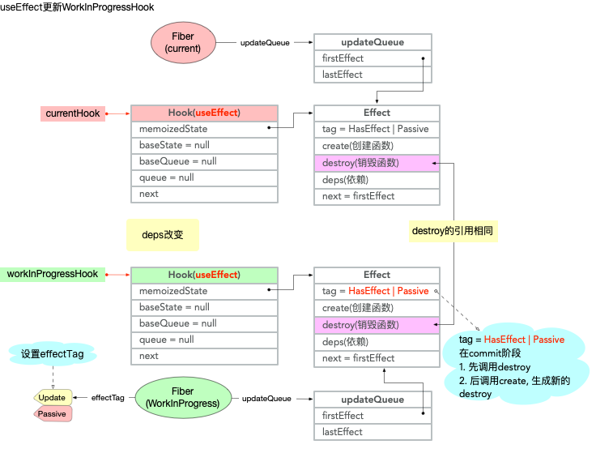
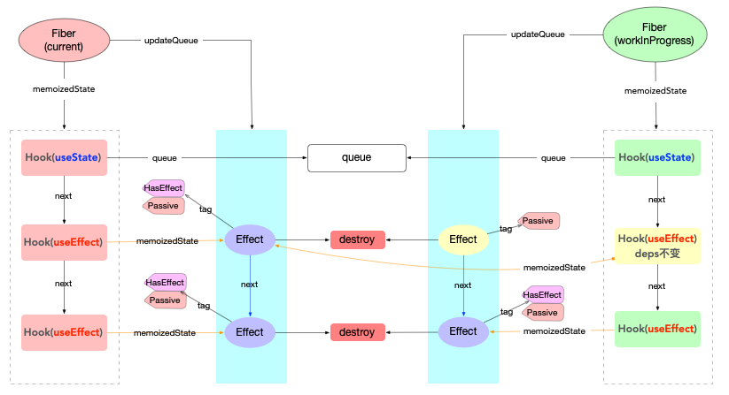

# hook 原理

首先引入官网上对[hook 的解释](https://zh-hans.reactjs.org/docs/hooks-intro.html).

1. `hook`只能用于`function`中
2. 可以使用`state`以及其他的`React`特性

演示代码：

```jsx
import React, { useState, useEffect } from 'react';
function Example() {
  Promise.resolve().then(() => {
    console.log(
      '所有的 effect.create 都是通过调度器 (scheduler) 异步 (MessageChannel) 执行的，故 effect.create 函数必然在此之后执行',
    );
  });
  // 第 1 个 hook(useState)
  const [count, setCount] = useState(0);
  // 第 2 个 hook(useEffect)
  useEffect(() => {
    console.log('第 1 个 effect.create dps: []');
    return () => {
      console.log('第 1 个 effect.destroy');
    };
  }, []);
  // 第 3 个 hook(useEffect)
  useEffect(() => {
    console.log('effect.create dps: [count]', count);
    return () => {
      console.log('第 2 个 effect.destroy dps: [count]', count);
    };
  }, [count]);
  return (
    <>
      <p>You clicked {count} times</p>
      <button onClick={() => setCount(count + 1)}>Click me</button>
    </>
  );
}
export default Example;
```

## 新增阶段

### 创建 fiber

通过[fiber 构建 (新增节点)](./render.md#beginWork)中的介绍，创建节点都是在`beginWork`阶段。

`function`类型节点在新增时调用`mountIndeterminateComponent`

```js
// 省略了与创建 fiber 无关的逻辑
function mountIndeterminateComponent(
  _current,
  workInProgress,
  Component,
  renderExpirationTime,
) {
  const props = workInProgress.pendingProps;
  let value;
  value = renderWithHooks(
    null,
    workInProgress,
    Component,
    props,
    context,
    renderExpirationTime,
  );
  // React DevTools reads this flag.
  workInProgress.effectTag |= PerformedWork;
  // Proceed under the assumption that this is a function component
  workInProgress.tag = FunctionComponent;
  reconcileChildren(null, workInProgress, value, renderExpirationTime);
  return workInProgress.child;
}
```

核心步骤：

1. 调用`renderWithHooks`(目的和调用`classInstance.render`一样),返回代表子节点的`reactElement`
2. 将步骤 1 中得到的`reactElement`传入`reconcileChildren`中去构建`fiber`次级子节点

逻辑进入`ReactFiberHooks`中，这是一个独立的工作空间，管理所有的`hook`对象。

```js
export function renderWithHooks<Props, SecondArg>(
  current: Fiber | null,
  workInProgress: Fiber,
  Component: (p: Props, arg: SecondArg) => any,
  props: Props,
  secondArg: SecondArg,
  nextRenderExpirationTime: ExpirationTime,
): any {
  renderExpirationTime = nextRenderExpirationTime;
  currentlyRenderingFiber = workInProgress;

  workInProgress.memoizedState = null;
  workInProgress.updateQueue = null;
  workInProgress.expirationTime = NoWork;

  // 1.设置全局 HooksDispatcher
  ReactCurrentDispatcher.current =
    current === null || current.memoizedState === null
      ? HooksDispatcherOnMount
      : HooksDispatcherOnUpdate;
  // 2.执行`Component`
  let children = Component(props, secondArg);

  renderExpirationTime = NoWork;
  currentlyRenderingFiber = (null: any);
  currentHook = null;
  workInProgressHook = null;
  didScheduleRenderPhaseUpdate = false;
  return children;
}
```

核心步骤：

1. 设置当前`hook`操作代理`ReactCurrentDispatcher`
   - 新增节点，设置为`HooksDispatcherOnMount`
   - 更新节点，设置为`HooksDispatcherOnUpdate`
2. 执行`Component()`

### 创建 hook

在执行`Example()`的时候，调用`useState(0)`

跟进`useState`逻辑，最终执行`ReactCurrentDispatcher.current.useState(initialState)`.

新增节点，`useState`对应`mountState`

```js
function mountState<S>(
  initialState: (() => S) | S,
): [S, Dispatch<BasicStateAction<S>>] {
  //1. 创建 hook 对象，并且挂载到当前`fiber.memoizedState`上，workInProgressHook 指向当前 hook
  const hook = mountWorkInProgressHook();
  if (typeof initialState === 'function') {
    // $FlowFixMe: Flow doesn't like mixed types
    initialState = initialState();
  }
  //2. 把 initialState 设置到`hook`对象中
  hook.memoizedState = hook.baseState = initialState;
  //3. 设置 hook.queue
  // 设置 lastRenderedReducer,lastRenderedState,dispatch
  const queue = (hook.queue = {
    pending: null,
    dispatch: null,
    lastRenderedReducer: basicStateReducer,
    lastRenderedState: (initialState: any),
  });
  // 设置 queue.dispatch, 当前 fiber 被关联到 queue.dispatch 中
  const dispatch: Dispatch<
    BasicStateAction<S>,
  > = (queue.dispatch = (dispatchAction.bind(
    null,
    currentlyRenderingFiber,
    queue,
  ): any));
  //4. 返回 dispatchAction 操作接口
  return [hook.memoizedState, dispatch];
}
```

核心步骤：

1. 创建`hook`对象，挂载到当前`fiber.memoizedState`,`workInProgressHook`指向此`hook`
2. 设置`hook.queue`, 和当前`fiber`进行关联

新增节点，`useEffect`对应`mountEffect`

```js
function mountEffect(
  create: () => (() => void) | void,
  deps: Array<mixed> | void | null,
): void {
  // 注意这里指定了两种 tag
  return mountEffectImpl(
    UpdateEffect | PassiveEffect, // fiber.effectTag 适用于 fiber 对象
    HookPassive, // effect.tag 适用于 effect 对象
    create,
    deps,
  );
}

function mountEffectImpl(fiberEffectTag, hookEffectTag, create, deps): void {
  const hook = mountWorkInProgressHook();
  const nextDeps = deps === undefined ? null : deps;
  currentlyRenderingFiber.effectTag |= fiberEffectTag;
  hook.memoizedState = pushEffect(
    HookHasEffect | hookEffectTag, //再次指定 effect.tag
    create,
    undefined,
    nextDeps,
  );
}

function pushEffect(tag, create, destroy, deps) {
  // 创建新的 effect 对象
  const effect: Effect = {
    tag,
    create,
    destroy,
    deps,
    // Circular
    next: (null: any),
  };
  // 将 effect 对象添加到 fiber.updateQueue 队列中
  let componentUpdateQueue: null | FunctionComponentUpdateQueue = (currentlyRenderingFiber.updateQueue: any);
  if (componentUpdateQueue === null) {
    componentUpdateQueue = createFunctionComponentUpdateQueue();
    currentlyRenderingFiber.updateQueue = (componentUpdateQueue: any);
    componentUpdateQueue.lastEffect = effect.next = effect;
  } else {
    const lastEffect = componentUpdateQueue.lastEffect;
    if (lastEffect === null) {
      componentUpdateQueue.lastEffect = effect.next = effect;
    } else {
      const firstEffect = lastEffect.next;
      lastEffect.next = effect;
      effect.next = firstEffect;
      componentUpdateQueue.lastEffect = effect;
    }
  }
  return effect;
}
```

核心步骤：

1. 创建`hook`对象，并且添加到`hook`队列中，`workInProgressHook`指向此`hook`
2. 设置`fiber.effectTag = UpdateEffect | PassiveEffect`
3. 创建`effect`对象 (设置`effect.tag = HookHasEffect | HookPassive`), 并将`effect`添加到`fiber.UpdateQueue`队列中

在整个创建`hook`阶段，主要流程表示如下：



### 执行 hook

从以上流程图可以看到，执行`function`的时候，只是创建了`hook`, 但是并没有执行`hook.create`.在 fiber 构建 (新增节点) 中有介绍，`commitRoot`分为[3 个阶段](./render.md#commit阶段)

第一个阶段`commitBeforeMutationEffects`对`Passive`类型的 tag 做了特殊处理。如果`function`类型的`fiber`使用了`hook`api，会设置`fiber.effectTag |= Passive`

```js
function commitBeforeMutationEffects() {
  while (nextEffect !== null) {
    if (
      !shouldFireAfterActiveInstanceBlur &&
      focusedInstanceHandle !== null &&
      isFiberHiddenOrDeletedAndContains(nextEffect, focusedInstanceHandle)
    ) {
      shouldFireAfterActiveInstanceBlur = true;
      beforeActiveInstanceBlur();
    }
    const effectTag = nextEffect.effectTag;
    // `Passive`类型的 tag 做了特殊处理。
    if ((effectTag & Passive) !== NoEffect) {
      // If there are passive effects, schedule a callback to flush at
      // the earliest opportunity.
      if (!rootDoesHavePassiveEffects) {
        rootDoesHavePassiveEffects = true;
        // 需要注意，此处的回调函数是通过调度器执行的，所以是一个异步回调

        scheduleCallback(NormalPriority, () => {
          flushPassiveEffects(); // 执行 hook 的入口
          return null;
        });
      }
    }
    nextEffect = nextEffect.nextEffect;
  }
}
```

异步回调：

`flushPassiveEffectsImpl -> commitPassiveHookEffects`

```js
export function commitPassiveHookEffects(finishedWork: Fiber): void {
  if ((finishedWork.effectTag & Passive) !== NoEffect) {
    switch (finishedWork.tag) {
      case FunctionComponent:
      case ForwardRef:
      case SimpleMemoComponent:
      case Block:
          commitHookEffectListUnmount(
            HookPassive | HookHasEffect,
            finishedWork,
          );
          commitHookEffectListMount(HookPassive | HookHasEffect, finishedWork);
        break;
      }
      default:
        break;
    }
  }
}
// 执行 destroy 方法
function commitHookEffectListUnmount(tag: number, finishedWork: Fiber) {
  const updateQueue: FunctionComponentUpdateQueue | null = (finishedWork.updateQueue: any);
  const lastEffect = updateQueue !== null ? updateQueue.lastEffect : null;
  if (lastEffect !== null) {
    const firstEffect = lastEffect.next;
    let effect = firstEffect;
    do {
      if ((effect.tag & tag) === tag) {
        // Unmount
        const destroy = effect.destroy;
        effect.destroy = undefined;
        if (destroy !== undefined) {
          destroy();
        }
      }
      effect = effect.next;
    } while (effect !== firstEffect);
  }
}
// 执行 create 方法
function commitHookEffectListMount(tag: number, finishedWork: Fiber) {
  const updateQueue: FunctionComponentUpdateQueue | null = (finishedWork.updateQueue: any);
  const lastEffect = updateQueue !== null ? updateQueue.lastEffect : null;
  if (lastEffect !== null) {
    const firstEffect = lastEffect.next;
    let effect = firstEffect;
    do {
      if ((effect.tag & tag) === tag) {
        // Mount
        const create = effect.create;
        effect.destroy = create();
      }
      effect = effect.next;
    } while (effect !== firstEffect);
  }
}
```

## 更新阶段

#### dispatchAction 触发调度

```js
function dispatchAction<S, A>(
  fiber: Fiber,
  queue: UpdateQueue<S, A>,
  action: A,
) {
  // 1. 获取 expirationTime
  const currentTime = requestCurrentTimeForUpdate();
  const suspenseConfig = requestCurrentSuspenseConfig();
  const expirationTime = computeExpirationForFiber(
    currentTime,
    fiber,
    suspenseConfig,
  );

  // 2. 创建 update 对象
  const update: Update<S, A> = {
    expirationTime,
    suspenseConfig,
    action,
    eagerReducer: null,
    eagerState: null,
    next: (null: any),
  };
  //3. 将 update 对象设置到 hook.queue 队列当中
  // Append the update to the end of the list.
  const pending = queue.pending;
  if (pending === null) {
    // This is the first update. Create a circular list.
    update.next = update;
  } else {
    update.next = pending.next;
    pending.next = update;
  }
  queue.pending = update;

  const alternate = fiber.alternate;

  //4. 请求调度
  scheduleUpdateOnFiber(fiber, expirationTime);
  }
}
```

`dispatchAction`创建了一个新的`update`对象，添加到`hook.queue.pending`队列之后。



### 更新 fiber

`scheduleUpdateOnFiber`请求调度，随后再次构建`fiber`树，`renderWithHooks`作为构建`fiber`树过程中的一环，也会再次执行。

#### 更新 hook

`renderWithHooks`调用栈中，执行`Example`函数体，调用`useState`,`useEffect`等函数重新构造`hook`对象。

> `currentHook`和`workInProgressHook`是两个指针，分别指向老`hook`和新`hook`

`updateWorkInProgressHook`维护了当前`fiber`节点`新旧hook`指针的移动，保证`currentHook`和`workInProgressHook`有正确的指向

```js
function updateWorkInProgressHook(): Hook {
  let nextCurrentHook: null | Hook;
  // 刚进入该 fiber 节点，currentHook 为 null
  if (currentHook === null) {
    // 拿到当前 fiber 节点的副本 (对应老节点)
    const current = currentlyRenderingFiber.alternate;
    if (current !== null) {
      nextCurrentHook = current.memoizedState;
    } else {
      nextCurrentHook = null;
    }
  } else {
    nextCurrentHook = currentHook.next;
  }

  let nextWorkInProgressHook: null | Hook;
  if (workInProgressHook === null) {
    nextWorkInProgressHook = currentlyRenderingFiber.memoizedState;
  } else {
    nextWorkInProgressHook = workInProgressHook.next;
  }

  if (nextWorkInProgressHook !== null) {
    // There's already a work-in-progress. Reuse it.
    workInProgressHook = nextWorkInProgressHook;
    nextWorkInProgressHook = workInProgressHook.next;

    currentHook = nextCurrentHook;
  } else {
    // Clone from the current hook.
    currentHook = nextCurrentHook;
    // 创建新的 hook 节点，最后添加到队列
    const newHook: Hook = {
      memoizedState: currentHook.memoizedState,

      baseState: currentHook.baseState,
      baseQueue: currentHook.baseQueue,
      queue: currentHook.queue,

      next: null,
    };

    if (workInProgressHook === null) {
      // This is the first hook in the list.
      currentlyRenderingFiber.memoizedState = workInProgressHook = newHook;
    } else {
      // Append to the end of the list.
      workInProgressHook = workInProgressHook.next = newHook;
    }
  }
  return workInProgressHook;
}
```

对于`useState`, 调用`updateReducer`:

1. 调用`updateWorkInProgressHook`创建新的`hook`对象
   - 注意新`hook`实际上是旧`hook`的浅拷贝



2. 如果`hook.queue.pending !=== null`
   - 遍历`hook.queue.pending`队列，提取足够优先级的`update`对象，生成`newState`
   - 更新`hook`和`queue`对象的相关属性



最后返回新的元组`[hook.memoizedState, dispatch]`

```js
function updateReducer<S, I, A>(
  reducer: (S, A) => S,
  initialArg: I,
  init?: I => S,
): [S, Dispatch<A>] {
  const hook = updateWorkInProgressHook();
  const queue = hook.queue;
  queue.lastRenderedReducer = reducer;
  const current: Hook = (currentHook: any);
  // The last rebase update that is NOT part of the base state.
  let baseQueue = current.baseQueue;
  // The last pending update that hasn't been processed yet.
  const pendingQueue = queue.pending;
  if (pendingQueue !== null) {
    // We have new updates that haven't been processed yet.
    // We'll add them to the base queue.
    if (baseQueue !== null) {
      // Merge the pending queue and the base queue.
      const baseFirst = baseQueue.next;
      const pendingFirst = pendingQueue.next;
      baseQueue.next = pendingFirst;
      pendingQueue.next = baseFirst;
    }
    current.baseQueue = baseQueue = pendingQueue;
    queue.pending = null;
  }

  if (baseQueue !== null) {
    // We have a queue to process.
    const first = baseQueue.next;
    let newState = current.baseState;

    let newBaseState = null;
    let newBaseQueueFirst = null;
    let newBaseQueueLast = null;
    let update = first;
    do {
      const updateExpirationTime = update.expirationTime;
      if (updateExpirationTime < renderExpirationTime) {
        // Priority is insufficient. Skip this update. If this is the first
        // skipped update, the previous update/state is the new base
        // update/state.
        const clone: Update<S, A> = {
          expirationTime: update.expirationTime,
          suspenseConfig: update.suspenseConfig,
          action: update.action,
          eagerReducer: update.eagerReducer,
          eagerState: update.eagerState,
          next: (null: any),
        };
        if (newBaseQueueLast === null) {
          newBaseQueueFirst = newBaseQueueLast = clone;
          newBaseState = newState;
        } else {
          newBaseQueueLast = newBaseQueueLast.next = clone;
        }
        // Update the remaining priority in the queue.
        if (updateExpirationTime > currentlyRenderingFiber.expirationTime) {
          currentlyRenderingFiber.expirationTime = updateExpirationTime;
          markUnprocessedUpdateTime(updateExpirationTime);
        }
      } else {
        // This update does have sufficient priority.

        if (newBaseQueueLast !== null) {
          const clone: Update<S, A> = {
            expirationTime: Sync, // This update is going to be committed so we never want uncommit it.
            suspenseConfig: update.suspenseConfig,
            action: update.action,
            eagerReducer: update.eagerReducer,
            eagerState: update.eagerState,
            next: (null: any),
          };
          newBaseQueueLast = newBaseQueueLast.next = clone;
        }

        // Mark the event time of this update as relevant to this render pass.
        // TODO: This should ideally use the true event time of this update rather than
        // its priority which is a derived and not reversible value.
        // TODO: We should skip this update if it was already committed but currently
        // we have no way of detecting the difference between a committed and suspended
        // update here.
        markRenderEventTimeAndConfig(
          updateExpirationTime,
          update.suspenseConfig,
        );

        // Process this update.
        if (update.eagerReducer === reducer) {
          // If this update was processed eagerly, and its reducer matches the
          // current reducer, we can use the eagerly computed state.
          newState = ((update.eagerState: any): S);
        } else {
          const action = update.action;
          newState = reducer(newState, action);
        }
      }
      update = update.next;
    } while (update !== null && update !== first);

    if (newBaseQueueLast === null) {
      newBaseState = newState;
    } else {
      newBaseQueueLast.next = (newBaseQueueFirst: any);
    }

    // Mark that the fiber performed work, but only if the new state is
    // different from the current state.
    if (!is(newState, hook.memoizedState)) {
      markWorkInProgressReceivedUpdate();
    }

    hook.memoizedState = newState;
    hook.baseState = newBaseState;
    hook.baseQueue = newBaseQueueLast;

    queue.lastRenderedState = newState;
  }

  const dispatch: Dispatch<A> = (queue.dispatch: any);
  return [hook.memoizedState, dispatch];
}
```

对于`useEffect`, 调用`updateEffectImpl`:

1. 调用`updateWorkInProgressHook`创建新的`hook`对象
   - 和`useState`中是一致的 (不同的是，通过`useEffect`创建的`hook`对象，`hook.queue = null`)


2. 生成新的`effect`对象

   - hook 更新，并且 deps 依赖不变。

     - 生成新的`effect(HookPassive)`,添加到`fiber.updateQueue`

     

   - deps 依赖改变。

     - 设置`fiber.effectTag = UpdateEffect | PassiveEffect`
     - 生成新的`effect(HookHasEffect | HookPassive)`,添加到`fiber.updateQueue`

     

```js
function updateEffectImpl(fiberEffectTag, hookEffectTag, create, deps): void {
  const hook = updateWorkInProgressHook();
  const nextDeps = deps === undefined ? null : deps;
  let destroy = undefined;
  if (currentHook !== null) {
    // hook 更新
    const prevEffect = currentHook.memoizedState;
    destroy = prevEffect.destroy;
    if (nextDeps !== null) {
      const prevDeps = prevEffect.deps;
      if (areHookInputsEqual(nextDeps, prevDeps)) {
        // deps 依赖一致
        pushEffect(hookEffectTag, create, destroy, nextDeps);
        return;
      }
    }
  }
  // 新增 hook, 或者 deps 依赖改变
  // 1. 设置 fiber.effectTag = UpdateEffect | PassiveEffect
  currentlyRenderingFiber.effectTag |= fiberEffectTag;
  // 2. 设置 hook.memoizedState
  hook.memoizedState = pushEffect(
    HookHasEffect | hookEffectTag,
    create,
    destroy,
    nextDeps,
  );
}
```

整个`hook`的更新过程可以如下表示：

左边是`current`右边是`workInProgress`



注意浅蓝色背景的`updateQueue`队列中，新`effect`会引用旧`effect`对象的`destroy`方法。
