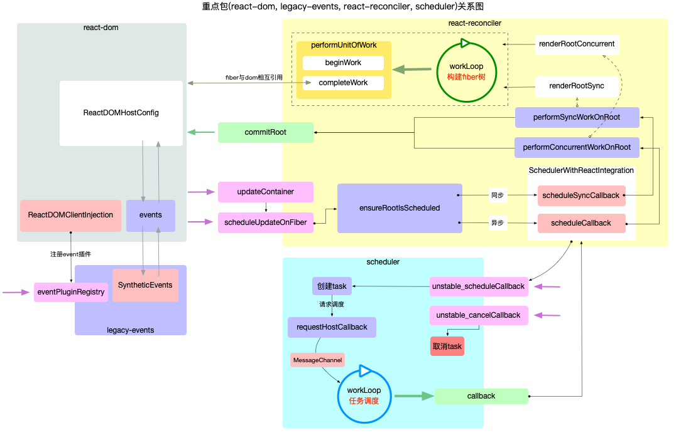

# React 应用的宏观结构(web 开发)

> React 工程目录的 packages 下包含 35 个包([`@17.0.1`版本](https://github.com/facebook/react/tree/v17.0.1)).
> 其中与`web`开发相关的核心包共有 4 个, 本系列近 20 篇文章, 以这 4 个包为线索进行展开, 深入理解 react 内部作用原理.

## 基础包结构

1. react

   > react 基础包, 只提供定义 react 组件(`ReactElement`)的必要函数, 一般来说需要和渲染器(`react-dom`,`react-native`)一同使用.

2. react-dom

   > react 渲染器之一, 是 react 与 web 平台连接的桥梁(可以在浏览器和 nodejs 环境中使用), 将`react-reconciler`中的运行结果输出到 web 界面上.

3. react-reconciler

   > react 工作空间核心包(综合协调`react-dom`,`react`,`scheduler`各包之间的调用与配合). 管理 react 的输入和输出.

   - 接受输入(`schedulerUpdateOnFiber`), 将`fiber`树生成逻辑封装到一个回调函数中(涉及`fiber`树形结构, `fiber.updateQueue`队列, 调和算法等),
   - 把此回调函数(`performSyncWorkOnRoot`或`performConcurrentWorkOnRoot`)送入`scheduler`进行调度
   - `scheduler`会控制回调函数执行的时机, 回调函数执行完成后得到全新的 fiber 树
   - 再调用渲染器(如`react-dom`, `react-native`等)将 fiber 树形结构最终反映到界面上

4. scheduler

   > 调度机制的核心实现, 控制由`react-reconciler`送入的回调函数的执行时机, 在`concurrent`模式下可以实现任务分片

   - 核心任务就是执行回调(回调函数由`react-reconciler`提供)
   - 通过控制回调函数的执行时机, 来达到任务分片的目的, 实现可中断渲染(`concurrent`模式下才有此特性)

## 功能概览

通过对以上基础板块的了解, 现将各包的主要职责, 绘制到一张概览图上:

- 每个板块代表一个核心包, 红色方块代表入口函数, 绿色方块代表出口函数.
- package 之间的调用脉络就是通过板块间的入口和出口函数连接起来的.

### 说明

通过概览图可以基本看出 react 的整体架构. 为了便于理解, 可将 react 应用整体视为一台"计算机".

- react 整体好比一台计算机
- scheduler 包视为 cpu,
