# React 首次 render

在[React 应用初始化](./02-bootstrap.md)中介绍了`react`应用启动的 3 种模式.为了简便, 本文在`legacy`模式为前提之下进行讨论. 对于`concurrent`和`blocking`的讨论, 在`任务分片机制`中详细展开.

初始化完成之后, 调用`updateContainer`之前, 先回顾一下此时主要对象的引用关系.


## 调用更新入口

在[React 应用初始化](./02-bootstrap.md#调用更新入口)中得知更新的入口是`updateContainer`函数.

```js
// ... 函数中省略了与legacy无关代码
export function updateContainer(
  element: ReactNodeList,
  container: OpaqueRoot,
  parentComponent: ?React$Component<any, any>,
  callback: ?Function,
): ExpirationTime {
  const current = container.current; // current指向的是RootFiber(Fiber树的根节点)

  //1. 计算本次更新(update)的过期时间(expirationTime)
  //1.1 获取到当前时间
  const currentTime = requestCurrentTimeForUpdate();
  //1.2 当前批量更新的配置, 是一个全局对象, 后面详细展开, 第一次执行这里返回是null
  const suspenseConfig = requestCurrentSuspenseConfig();
  //1.3. 计算本次update的expirationTime, 这个expirationTime会作用于本次更新范围内所有的Fiber对象. 是实现任务stack的核心
  const expirationTime = computeExpirationForFiber(
    currentTime,
    current,
    suspenseConfig,
  ); //legacy下, expirationTime=Sync

  // 2. 设置FiberRoot.context
  // 拿到当前的context, 首次执行返回一个emptyContext, 是一个{}
  const context = getContextForSubtree(parentComponent);
  if (container.context === null) {
    container.context = context;
  }

  //3. 初始化current(HostRootFiber)对象的updateQueue队列
  //3.1 创建一个更新(update)对象
  const update = createUpdate(currentTime, expirationTime, suspenseConfig);
  //3.2 设置update对象的payload, 这里element需要注意(是tag=HostRoot特有的设置, 指向<App/>)
  update.payload = { element };
  //3.3 将update对象加入到当前Fiber(这里是RootFiber)的更新对列当中
  enqueueUpdate(current, update);

  //4. 调度和更新current(HostRootFiber)对象
  scheduleUpdateOnFiber(current, expirationTime);
  return expirationTime;
}
```

`updateContainer()`有 4 个核心步骤:

1. 执行`computeExpirationForFiber`, 计算本次更新(`update`)的过期时间(`expirationTime`). 具体的时间计算方法, 在 react 任务调度机制中详细说明, 这里直接获取结果(`legacy`下, `expirationTime=Sync`)
2. 设置`FiberRoot.context`
3. 执行`enqueueUpdate`, 初始化`current`(`HostRootFiber`)对象的`updateQueue`队列
4. 执行`scheduleUpdateOnFiber`, 调度和更新`current`(`HostRootFiber`)对象

步骤 1,2, 创建了第一个`update`对象(用`update1`表示), 并且把`react`对象`<App/>`关联到了`update.payload`之上. 这一步的变化在图上标记出来:

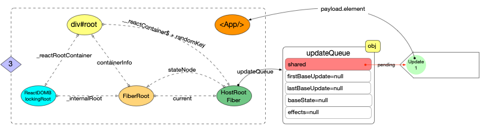

注意`update`的数据结构是一个链表, 后续在二次更新过程中(如调用`setState`或者调用 hook 对象的`dispatchAction`都会深度使用, 会在 react 更新机制中体现, 这里先了解基本结构)

### 更新 updateQueue

```js
export function createUpdate(
  eventTime: ExpirationTime,
  expirationTime: ExpirationTime,
  suspenseConfig: null | SuspenseConfig,
): Update<*> {
  // 注意update对象的数据结构
  const update: Update<*> = {
    eventTime, //创建update的当前时间
    expirationTime, // 过期时间
    suspenseConfig, // 暂停状态的配置

    tag: UpdateState, // 状态标记
    payload: null,
    callback: null,

    next: null, // next指针
  };
  return update;
}
```

对于`update1`对象,处于`HostRootFiber.updateQueue`之中, 是`react`应用中的第一个`update`对象, 比较特殊(`processUpdateQueue`过程会体现出来), 可以看到它的基本属性.

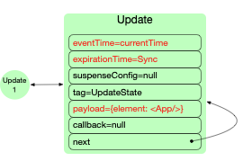

### render 过程

#### scheduleUpdateOnFiber

> 执行调度

步骤 3, 代码进入`ReactFiberWorkLoop.js`中, 逻辑正式来到了 ReactFiber 的工作循环.

```js
// ... 函数中省略了与legacy无关代码
export function scheduleUpdateOnFiber(
  fiber: Fiber,
  expirationTime: ExpirationTime,
) {
  // 1. 设置Fiber树上受影响节点的过期时间, 更新全局对象FiberRoot上的时间区间
  const root = markUpdateTimeFromFiberToRoot(fiber, expirationTime);
  if (expirationTime === Sync) {
    // legacy下, expirationTime=Sync
    if (
      // Check if we're inside unbatchedUpdates
      (executionContext & LegacyUnbatchedContext) !== NoContext &&
      // Check if we're not already rendering
      (executionContext & (RenderContext | CommitContext)) === NoContext
    ) {
      //2. 传入FiberRoot对象, 执行同步更新
      performSyncWorkOnRoot(root);
    } else {
      ensureRootIsScheduled(root);
    }
  } else {
    ensureRootIsScheduled(root);
  }
}
```

跟踪函数调用栈, 可以得到`scheduleUpdateOnFiber`的主杆逻辑(包含主杆逻辑, 省略一些和首次 render 无关的逻辑分支).在流程图中用分支 2️⃣ 表示.


`scheduleUpdateOnFiber`在第一次 render 的逻辑有 2 个核心步骤:

1. `markUpdateTimeFromFiberToRoot(fiber, expirationTime)`
   - 设置从当前`Fiber`开始一直向上直到`HostRootFiber`过程中, 所有节点的过期时间(`expirationTime`, `childExpirationTime`)
   - 更新`FiberRoot`对象, 等待中任务(`pending`)的时间区间(`firstPendingTime`, `lastPendingTime`)
   - 更新`FiberRoot`对象, 挂起任务(`suspended`)的时间区间(`firstSuspendedTime`, `lastSuspendedTime`)

`FiberRoot`的属性变化(红色字体标记):

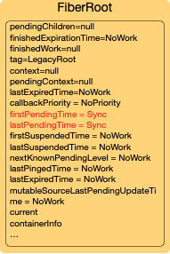

2. `performSyncWorkOnRoot(root)`, 传入`FiberRoot`对象, 执行同步更新

##### performSyncWorkOnRoot

> 从 FiberRoot 节点开始进行更新

分析`performSyncWorkOnRoot(root)`

```js
// ... 函数中省略了与legacy无关代码
function performSyncWorkOnRoot(root) {
  const lastExpiredTime = root.lastExpiredTime; // NoWork

  let expirationTime;
  if (lastExpiredTime !== NoWork) {
    //初次render, lastExpiredTime = NoWork
    // ...
  } else {
    expirationTime = Sync;
  }

  // 1. render阶段
  // 1.1 传入FiberRoot对象, 执行同步render
  let exitStatus = renderRootSync(root, expirationTime);
  // 1.2 render结束之后, 设置fiberRoot.finishedWork(指向root.current.alternate)
  const finishedWork: Fiber = (root.current.alternate: any);
  root.finishedWork = finishedWork;
  root.finishedExpirationTime = expirationTime;
  root.nextKnownPendingLevel = getRemainingExpirationTime(finishedWork);

  // 2. commit阶段
  commitRoot(root);

  // 3. 再次对fiberRoot进行调度(退出之前保证fiberRoot没有需要调度的任务)
  ensureRootIsScheduled(root);

  return null;
}
```

该函数有 3 个核心步骤:

1. `renderRootSync`(`render`阶段).
2. `commitRoot`(`commit`阶段).
3. `ensureRootIsScheduled`, 更新之后再次调度`fiberRoot`上的任务 , 直到没有新任务之后退出.

#### render 阶段

##### renderRootSync

进入`renderRootSync(root, expirationTime)`

```js
// ... 函数中省略了与legacy无关代码
function renderRootSync(root, expirationTime) {
  const prevExecutionContext = executionContext;
  // 1. 位运算, 更新executionContext
  executionContext |= RenderContext;
  if (root !== workInProgressRoot || expirationTime !== renderExpirationTime) {
    // 2. 为当前render设置全新的stack(设置公共变量workInProgress,workInProgressRoot,renderExpirationTime等)
    prepareFreshStack(root, expirationTime);
  }
  do {
    try {
      // 3. 执行工作循环
      workLoopSync();
      break;
    } catch (thrownValue) {
      handleError(root, thrownValue);
    }
  } while (true);
  executionContext = prevExecutionContext;
  // Set this to null to indicate there's no in-progress render.
  workInProgressRoot = null;

  return workInProgressRootExitStatus;
}
```

该函数有 3 个核心步骤:

1. 更新`executionContext`(`executionContext |= RenderContext`)
2. `prepareFreshStack(root, expirationTime)`.
   - 重置工作空间, 避免先前工作循环中的变量污染. 在`ReactFiberWorkLoop`中重置了一些公共变量(workInProgress,workInProgressRoot,renderExpirationTime 等), 提供给之后的整个 render 过程使用.
3. `workLoopSync()`. 正式执行工作循环

`prepareFreshStack`:

```js
// ... 函数中省略了与首次render无关代码, 先关心主流程
function prepareFreshStack(root, expirationTime) {
  root.finishedWork = null;
  root.finishedExpirationTime = NoWork;
  workInProgressRoot = root; // 将root设置成全局workInProgressRoot
  workInProgress = createWorkInProgress(root.current, null); // 给Fiber对象创建一个alternate, 并将其设置成全局workInProgress
  renderExpirationTime = expirationTime;
  workInProgressRootExitStatus = RootIncomplete;
  workInProgressRootFatalError = null;
  workInProgressRootLatestProcessedEventTime = Sync;
  workInProgressRootLatestSuspenseTimeout = Sync;
  workInProgressRootCanSuspendUsingConfig = null;
  workInProgressRootNextUnprocessedUpdateTime = NoWork;
  workInProgressRootHasPendingPing = false;
  if (enableSchedulerTracing) {
    spawnedWorkDuringRender = null;
  }
}
```

`prepareFreshStack`调用完成之后, 有 4 个注意点:

1. 公共变量`renderExpirationTime`被赋值为`expirationTime`(初次 render, 这里的`expirationTime=Sync`)
2. 公共变量`workInProgressRoot`指向`FiberRoot`对象.
3. `HostRootFiber.alternate`创建完成, 与`HostRootFiber`互为`alternate`.
4. 公共变量`workInProgress`指向`HostRootFiber.alternate`对象.

当前工作空间的主要变量的状态如下:

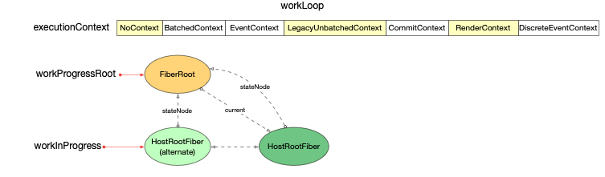

##### workLoopSync

回到`renderRootSync()`函数作用域, 继续向下执行`workLoopSync()`函数

```js
function workLoopSync() {
  while (workInProgress !== null) {
    // 第一次render, workInProgress=HostRootFiber
    // 循环执行 performUnitOfWork, 这里的workInProgress是从FiberRoot节点开始,依次遍历知道所有的Fiber都遍历完成
    performUnitOfWork(workInProgress);
  }
}
```

```js
// ... 函数中省略了与首次render无关代码, 先关心主流程
function performUnitOfWork(unitOfWork: Fiber): void {
  const current = unitOfWork.alternate; // 第一次render时, unitOfWork=HostRootFiber, alternate已经初始化

  let next;
  // 1. 创建Fiber节点
  next = beginWork(current, unitOfWork, renderExpirationTime);
  unitOfWork.memoizedProps = unitOfWork.pendingProps;
  if (next === null) {
    //2. 处理beginWork中的Fiber节点
    completeUnitOfWork(unitOfWork);
  } else {
    workInProgress = next;
  }

  ReactCurrentOwner.current = null;
}
```

`performUnitOfWork`是以对当前传入`Fiber`节点开始, 进行深度优先循环处理.

分析到这里, 可以把`workLoopSync`的主杆调用逻辑全部串联起来.


其中`workLoopSync`相关的逻辑用红色矩形块标识, 有 4 个主要函数:

1. `performUnitOfWork(unitOfWork: Fiber): void`
2. `beginWork(current: Fiber | null,workInProgress: Fiber,renderExpirationTime: ExpirationTime,): Fiber | null`
3. `completeUnitOfWork(unitOfWork: Fiber): void`
4. `completeWork(current: Fiber | null,workInProgress: Fiber,renderExpirationTime: ExpirationTime,): Fiber | null`

每个 Fiber 对象的处理过程分为 2 个步骤:

1. `beginWork(current, unitOfWork, renderExpirationTime)`, `diff`算法在这里实现(由于初次 render 没有比较对象, 都是新增, 正式的`diff`比较体现在`update`阶段, 这里先略过)

   - 根据 reactElement 对象创建所有的 Fiber 节点, 构造 Fiber 树形结构(根据当前 Fiber 的情况设置`return`和`sibling`指针)
   - 给当前 Fiber 对象设置`effectTag`标记(二进制位, 用来标记 Fiber 的增,删,改状态)
   - 给抽象类型的 Fiber(如: class )对象设置`stateNode`(此时: `fiber.stateNode=new Class()`)

2. `completeUnitOfWork(unitOfWork)`, 处理 beginWork 阶段已经创建出来的 Fiber 节点.
   - 给 Fiber 节点(tag=HostComponent, HostText)创建 DOM 实例, fiber.stateNode 指向这个 DOM 实例,
   - 为 DOM 节点设置属性, 绑定事件(这里先说明有这个步骤, 详细的事件处理流程, 在事件分发机制中详细说明).
   - 把当前 Fiber 对象的 effects 队列添加到父节点 effects 队列之后, 更新父节点的`firstEffect`, `lastEffect`指针.
   - 根据 beginWork 阶段设置的`effectTag`判断当前 Fiber 是否有副作用(增,删,改), 如果有, 需要将当前 Fiber 加入到父节点的`effects`队列, 等待 commit 阶段处理.

##### beginWork

```js
// ... 函数中省略了与首次render无关代码, 先关心主流程
function beginWork(
  current: Fiber | null,
  workInProgress: Fiber,
  renderExpirationTime: ExpirationTime,
): Fiber | null {
  const updateExpirationTime = workInProgress.expirationTime;
  workInProgress.expirationTime = NoWork;
  switch (workInProgress.tag) {
    case IndeterminateComponent: {
      return mountIndeterminateComponent(
        current,
        workInProgress,
        workInProgress.type,
        renderExpirationTime,
      );
    }
    case ClassComponent: {
      const Component = workInProgress.type;
      const unresolvedProps = workInProgress.pendingProps;
      const resolvedProps =
        workInProgress.elementType === Component
          ? unresolvedProps
          : resolveDefaultProps(Component, unresolvedProps);
      return updateClassComponent(
        current,
        workInProgress,
        Component,
        resolvedProps,
        renderExpirationTime,
      );
    }
    case HostRoot:
      return updateHostRoot(current, workInProgress, renderExpirationTime);
    case HostComponent:
      return updateHostComponent(current, workInProgress, renderExpirationTime);
    // ...
  }
}
```

这个函数是针对所有的 Fiber 类型(这里看其中的部分代码), 其中的每一个 case 处理一种 Fiber 类型.

`updateXXX`函数(如: updateHostRoot, updateClassComponent 等)的主要逻辑有 3 个步骤:

1. 收集整合当前 Fiber 节点的必要状态属性(如: state, props)
   - 更新当前 Fiber 的`effectTag`
2. 获取下级`reactElement`对象
   1. class 类型的 Fiber 节点
   - 构建`React.Component`实例,
     - 设置`fiber.stateNode`指向这个新的实例
     - 执行`render`之前的生命周期函数
     - 执行`render`方法, 获取下级`reactElement`
   - 更新当前节点的`effectTag`
   2. function 类型的 Fiber 节点
   - 执行 function, 获取下级`reactElement`
     - `Fiber.memoizedState`指向`hook`队列
     - 初始化`Fiber.memoizedState`队列中的每一个`hook`对象, 使其拥有独立的`memoizedState`
   - 更新当前节点的`effectTag`
   3. HostComponent 类型(如: div, span, button 等)的 Fiber 节点
   - `pendingProps.children`作为下级`reactElement`
     - 如果下级节点是文本节点,则设置下级节点为 null. 准备进入`completeUnitOfWork`阶段
   - 更新当前节点的`effectTag`
   4. 其他类型...
3. 生成`Fiber`子树
   - `diff`算法, 设置子树 Fiber 节点的`effectTag`

这里列出`updateHostRoot`, `updateHostComponent`的代码, 对于其他 case 的分析, 放在组件的生命周期详细说明.

```js
// ... 函数中省略了与首次render无关代码, 先关心主流程
function updateHostRoot(current, workInProgress, renderExpirationTime) {
  // 1. 收集整合当前Fiber节点的必要状态属性(如: state, props)
  const updateQueue = workInProgress.updateQueue;
  const nextProps = workInProgress.pendingProps;
  // 1.1 clone一个updateQueue, 分离current和workInProgress对updateQueue的引用.(以前是同一个引用, clone之后引用不同)方便后面processUpdateQueue
  cloneUpdateQueue(current, workInProgress);
  // 1.2 处理updateQueue,设置workInProgress的memoizedState,expirationTime等属性
  processUpdateQueue(workInProgress, nextProps, null, renderExpirationTime);
  const nextState = workInProgress.memoizedState;

  // 2. 获取下级的reactElement对象, 用于生成Fiber子树(HostRoot比较特殊, 直接拿到初始的react对象<App/>)
  const nextChildren = nextState.element; // nextState.element就是<App/>

  // 3. 生成Fiber子树
  // 3.1 diff算法, 设置子树Fiber节点的effectTag
  reconcileChildren(
    current,
    workInProgress,
    nextChildren,
    renderExpirationTime,
  );

  return workInProgress.child;
}
```

```js
// ... 函数中省略了与首次render无关代码, 先关心主流程
function updateHostComponent(current, workInProgress, renderExpirationTime) {
  //1.收集整合当前Fiber节点的必要状态属性(如: state, props)
  const type = workInProgress.type;
  const nextProps = workInProgress.pendingProps;
  const prevProps = current !== null ? current.memoizedProps : null;

  let nextChildren = nextProps.children;
  const isDirectTextChild = shouldSetTextContent(type, nextProps);
  // 如果子节点只有一个文本节点
  if (isDirectTextChild) {
    nextChildren = null;
  }
  // 1.1 更新当前Fiber的`effectTag`
  markRef(current, workInProgress); // 如果有ref属性, 更新effectTag

  // 3. 生成Fiber子树
  reconcileChildren(
    current,
    workInProgress,
    nextChildren,
    renderExpirationTime,
  );
  return workInProgress.child;
}
```

##### completeUnitOfWork

```js
// ... 函数中省略了与首次render无关代码, 先关心主流程
function completeUnitOfWork(unitOfWork: Fiber): void {
  let completedWork = unitOfWork;
  do {
    const current = completedWork.alternate;
    const returnFiber = completedWork.return;

    if ((completedWork.effectTag & Incomplete) === NoEffect) {
      // render过程如有异常, 会进入else分支. 先考虑正常情况
      let next;
      // 1. 处理Fiber节点, 会调用渲染器(调用react-dom包, 关联Fiber节点和dom对象, 绑定事件等)
      next = completeWork(current, completedWork, renderExpirationTime);
      if (next !== null) {
        // completeWork过程产生了新的Fiber节点, 退出循环, 回到performUnitOfWork阶段
        workInProgress = next;
        return;
      }
      if (
        returnFiber !== null &&
        // Do not append effects to parents if a sibling failed to complete
        (returnFiber.effectTag & Incomplete) === NoEffect
      ) {
        // 2. 收集当前Fiber节点以及其子树的副作用effects
        // 2.1 把所有子树的effects和当前Fiber的effects添加到父节点的effect队列当中去
        if (returnFiber.firstEffect === null) {
          returnFiber.firstEffect = completedWork.firstEffect;
        }
        if (completedWork.lastEffect !== null) {
          if (returnFiber.lastEffect !== null) {
            returnFiber.lastEffect.nextEffect = completedWork.firstEffect;
          }
          returnFiber.lastEffect = completedWork.lastEffect;
        }
        // 2.2 如果当前Fiber有side-effects, 将其添加到子节点的side-effects之后.
        const effectTag = completedWork.effectTag;
        if (effectTag > PerformedWork) {
          if (returnFiber.lastEffect !== null) {
            returnFiber.lastEffect.nextEffect = completedWork;
          } else {
            returnFiber.firstEffect = completedWork;
          }
          returnFiber.lastEffect = completedWork;
        }
      }
    } else {
      // ...
    }

    // 3. 切换下一个需要处理的Fiber节点
    const siblingFiber = completedWork.sibling;
    if (siblingFiber !== null) {
      workInProgress = siblingFiber;
      return;
    }
    completedWork = returnFiber;
    workInProgress = completedWork;
  } while (completedWork !== null);

  // 所有Fiber处理完成, 设置全局状态为RootCompleted, workLoopSync结束
  if (workInProgressRootExitStatus === RootIncomplete) {
    workInProgressRootExitStatus = RootCompleted;
  }
}
```

##### completeWork

这里列出`HostComponent`, `HostText`的代码, 对于其他 case 的分析, 放在组件的生命周期详细说明.

```js
// ... 函数中省略了与首次render无关代码, 先关心主流程
function completeWork(
  current: Fiber | null,
  workInProgress: Fiber,
  renderExpirationTime: ExpirationTime,
): Fiber | null {
  const newProps = workInProgress.pendingProps;
  switch (workInProgress.tag) {
    case HostComponent: {
      const rootContainerInstance = getRootHostContainer();
      const type = workInProgress.type;
      const currentHostContext = getHostContext();
      // 1.1 创建DOM对象
      const instance = createInstance(
        type,
        newProps,
        rootContainerInstance,
        currentHostContext,
        workInProgress,
      );
      // 1.2 把子树中的DOM对象append到本节点的instance之中
      appendAllChildren(instance, workInProgress, false, false);
      // 设置stateNode属性, 指向DOM对象
      workInProgress.stateNode = instance;

      if (
        //1.3 设置DOM对象的属性, 绑定事件等
        finalizeInitialChildren(
          instance,
          type,
          newProps,
          rootContainerInstance,
          currentHostContext,
        )
      ) {
        markUpdate(workInProgress);
      }
      if (workInProgress.ref !== null) {
        // If there is a ref on a host node we need to schedule a callback
        markRef(workInProgress);
      }
      return null;
    }
    case HostText: {
      const newText = newProps;
      const rootContainerInstance = getRootHostContainer();
      const currentHostContext = getHostContext();
      // 1.1 创建DOM对象
      // (这里是一个文本节点, 没有更多的处理)
      workInProgress.stateNode = createTextInstance(
        newText,
        rootContainerInstance,
        currentHostContext,
        workInProgress,
      );
      return null;
    }
  }
}
```

定义`<App/>`组件的结构如下:

```jsx
import React from 'react';

class App extends React.Component {
  componentDidMount() {
    console.log('App componentDidMount');
  }
  render() {
    return (
      <div className="wrap">
        <Box />
        <span>list组件</span>
      </div>
    );
  }
}
class Box extends React.Component {
  state = {
    count: 0,
  };
  handleClick = () => {
    this.setState(state => {
      return {
        count: ++state.count,
      };
    });
  };
  componentDidMount() {
    console.log('Box componentDidMount');
  }
  render() {
    return (
      <button onClick={this.handleClick}>点击次数({this.state.count})</button>
    );
  }
}

export default App;
```

执行`workLoopSync`过程如下:

beginWork: 第一次执行`beginWork`之前, `workInProgress`指针指向`HostRootFiber.alternate`对象:

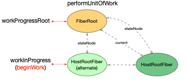

beginWork: 第一次执行`beginWork`之后, `workInProgress`指针指向`Fiber`对象(`<App/>`):

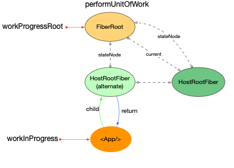

beginWork: 第二次执行`beginWork`之后, `<App/>`节点的`effectTag`已经更新, `workInProgress`指针指向`<App/>`的子节点`<div/>`:

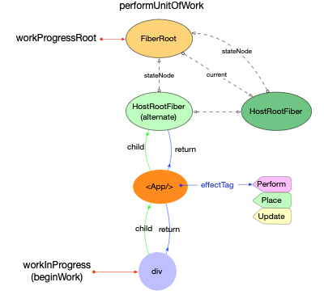

beginWork: 第三次执行`beginWork`之后, `workInProgress`指针指向`<Box/>`:

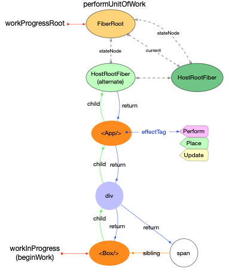

beginWork: 第四次执行`beginWork`之后, `<Box/>`节点的`effectTag`已经更新, `workInProgress`指针指向`<Box/>`的子节点`<button/>`:

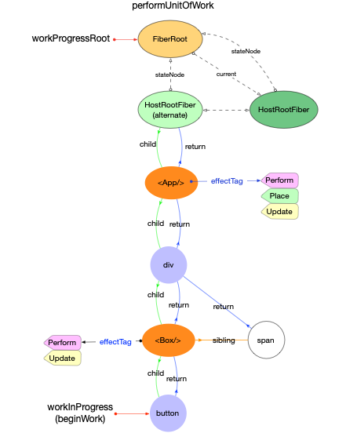

beginWork: 第五次执行`beginWork`之后, `workInProgress`指针指向一个`HostText`类型的`Fiber`节点:

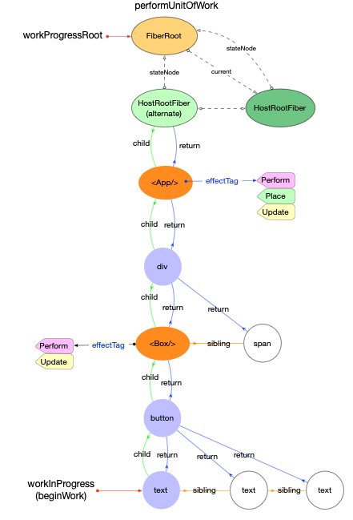

beginWork: 第六次执行`beginWork`之后, 由于`HostText`类型的节点没有`child`节点.所以后面会进入`completeUnitOfWork`.

completeWork: `workInProgress`指针指向 text 节点, 执行完`completeWork`之后, `Fiber`节点的`stateNode`属性指向该节点对应的`DOM`对象.

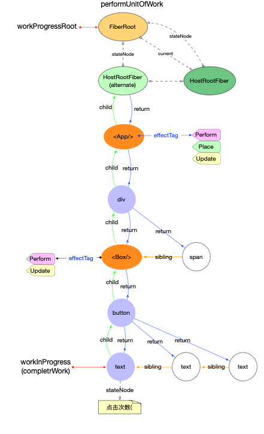

beginWork: 上一步(`completeWork`)执行完成之后, `workInProgress`指针移动指向`sibling`节点(上图中的白色圆形部分, 也是一个 HostText 类型的 Fiber 节点). 此时由于该节点还未通过`beginWork`阶段, 所以会先执行`beginWork`. 这里略过后续`sibling`文本节点的`beginWork`和`completeWork`.

completeWork: 当`Fiber(button)`节点的所有子节点都执行完`completeWork`之后, workInProgress 指针指向`Fiber(button)`节点, 更新其`stateNode`属性, 指向对应的`DOM`对象.

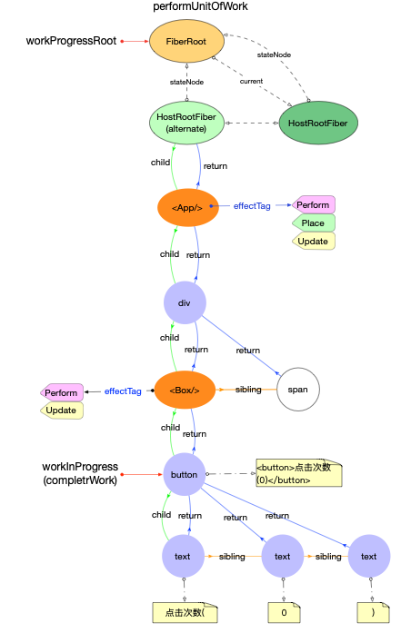

completeWork: `workInProgress`指针指向`<Box/>`节点, 更新其`stateNode`属性. 由于该节点在`beginWork`阶段被标记有副作用(`effectTag > PerformedWork`), 所以会将此节点的副作用挂载到父节点的副作用队列之后(实现副作用向上移动).此时父节点`Fiber(div)`的属性`firstEffect`和`lastEffect`属性分别指向`effects`队列的开始和末尾.如图所示,这时父节点的副作用队列里面只有一个对象`<Box/>`.

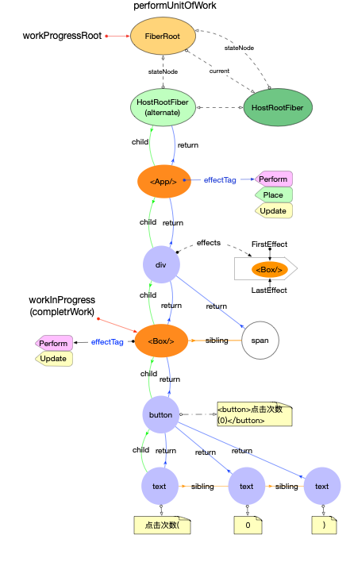

beginWork: 处理`sibling`节点, 过程通处理`button`的子节点一致, 这里略过具体的执行步骤.

completeWork: `workInProgress`指针指向`<div/>`节点, 更新其`stateNode`属性. 由于该节点的`firstEffect`和`lastEffect`属性不为`null`, 故先将`effects`队列继续上移, 挂载到父节点之后. 此时, 父节点`<App/>`的`firstEffect`和`lastEffect`属性分别指向`effects`队列的开始和末尾.如图所示,这时的父节点副作用队列里面只有一个对象`<Box/>`

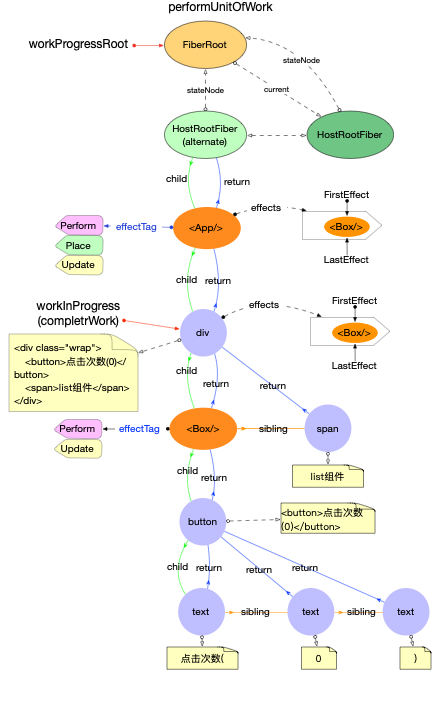

completeWork: `workInProgress`指针指向`<App/>`节点. 先将该节点的副作用队列上移, 并且由于该节点在`beginWork`阶段被标记有副作用(`effectTag > PerformedWork`), 所以还需要将该节点添加到父节点的副作用队列的末尾. 如图所示: 父节点`HostFiberRoot`的属性`firstEffect`和`lastEffect`属性分别指向`effects`队列的开始(`<Box/>`)和末尾(`<App/>`)

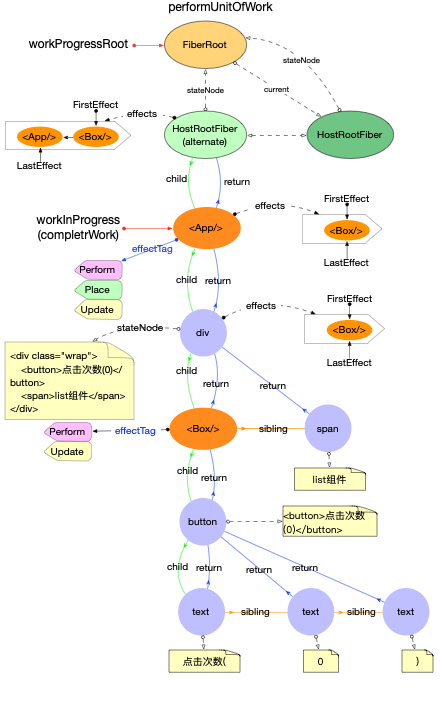

`workInProgress`继续上移, 直到退出循环, 结束`workLoopSync`, 完成`renderRootSync`.

#### commit 阶段

设置`fiberRoot.finishWork`, 指向`root.current.alternate`.

```js
const finishedWork: Fiber = (root.current.alternate: any);
root.finishedWork = finishedWork;
root.finishedExpirationTime = expirationTime;
root.nextKnownPendingLevel = getRemainingExpirationTime(finishedWork);
commitRoot(root);
```

在执行`commitRoot`之前, 当前工作空间的主要变量的状态如下:

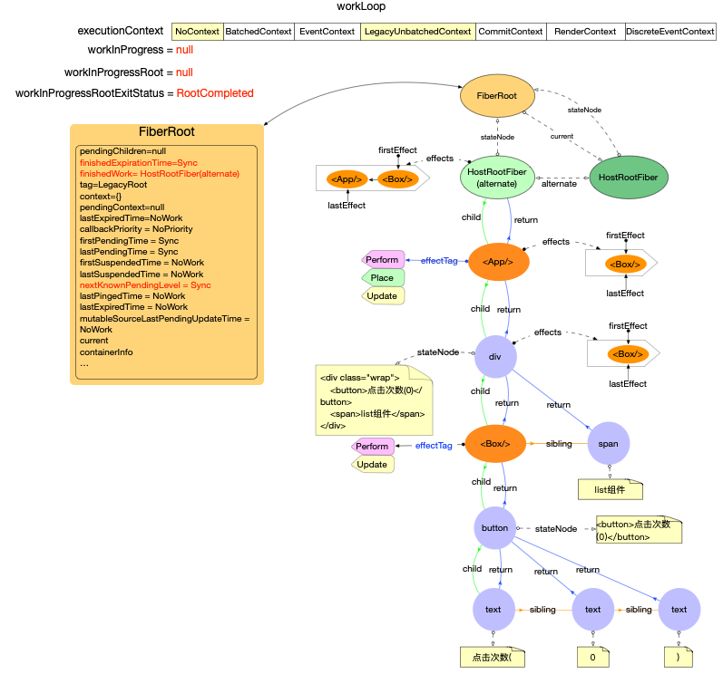

`commitRootImpl`

```js
// ... 函数中省略了与首次render无关代码, 先关心主流程
function commitRootImpl(root, renderPriorityLevel) {
  // 设置局部变量
  const finishedWork = root.finishedWork;
  const expirationTime = root.finishedExpirationTime;
  // 更新FiberRoot对象上的属性
  root.finishedWork = null;
  root.finishedExpirationTime = NoWork;
  root.callbackNode = null;
  root.callbackExpirationTime = NoWork;
  root.callbackPriority = NoPriority;

  // Get the list of effects.
  let firstEffect = finishedWork.firstEffect;

  if (firstEffect !== null) {
    // Reset this to null before calling lifecycles
    ReactCurrentOwner.current = null;

    // commit阶段分为3个阶段
    // 1. before mutaion.  调用getSnapshotBeforeUpdate
    nextEffect = firstEffect;
    do {
       commitBeforeMutationEffects();
    } while (nextEffect !== null);

    // 2. mutation. 调用渲染器, 更新到最新的Fiber状态
    nextEffect = firstEffect;
    do {
       commitMutationEffects(root, renderPriorityLevel);
    } while (nextEffect !== null
    );

    // FiberRoot的current指向finishedWork
    // 在layout阶段之前, current指向的是HostRootFiber. 影响的生命周期函数: componentWillUnmount
    // 在layout阶段, current指向的是RootFiber.alternate. 影响的生命周期函数: componentDidMount/Update
    root.current = finishedWork;

    // 3. layout
    nextEffect = firstEffect;
    do {
      commitLayoutEffects(root, expirationTime);
    } while (nextEffect !== null);

    nextEffect = null;

    executionContext = prevExecutionContext;
  }

  const rootDidHavePassiveEffects = rootDoesHavePassiveEffects;

  if (rootDoesHavePassiveEffects) {
    // ...
  } else {
    // 设置effect链表中各个对象的nextEffect指针为null. 辅助垃圾回收
    nextEffect = firstEffect;
    while (nextEffect !== null) {
      const nextNextEffect = nextEffect.nextEffect;
      nextEffect.nextEffect = null;
      nextEffect = nextNextEffect;
    }
  }

  // Always call this before exiting `commitRoot`, to ensure that any
  // additional work on this root is scheduled.
  ensureRootIsScheduled(root);// 确保任何额外的改动都会被安排调度
  // If layout work was scheduled, flush it now.
  flushSyncCallbackQueue();// 如果layout阶段有调度更新, 在这里进行刷新
```

commit 分为 3 个阶段:

1. `commitBeforeMutationEffects`

- 调用`getSnapshotBeforeUpdate`(非初次 render)

2.  `commitMutationEffects`

- 调用`componentWillUnmount`(非初次 render)
- 调用渲染器, 把`stateNode`更新到`FiberRoot.containerInfo`节点之上. 此时浏览器会渲染出页面
- 本阶段执行完成之后, `FiberRoot.current = HostRootFiber.alternate`, `FiberRoot.current`指针指向了`HostRootFiber.alternate`

3. `commitLayoutEffects`

- 调用`componentDidMount/Update`

主要流程如下图表示:

注意当 3 个阶段都执行完成之后, 为了辅助垃圾回收, 会去除`effects`队列中所有`effect`的`nextEffect`指针


相关代码如下:

`commitBeforeMutationEffects`:

```js
// ... 函数中省略了与首次render无关代码, 先关心主流程
function commitBeforeMutationEffects() {
  while (nextEffect !== null) {
    const effectTag = nextEffect.effectTag;
    if ((effectTag & Snapshot) !== NoEffect) {
      const current = nextEffect.alternate;
      commitBeforeMutationEffectOnFiber(current, nextEffect); // 如果current.effectTag中有Snapshot标记, 则执行生命周期函数getSnapshotBeforeUpdate
    }
    nextEffect = nextEffect.nextEffect;
  }
}
```

`commitMutationEffects`:

```js
// ... 函数中省略了与首次render无关代码, 先关心主流程
function commitMutationEffects(root: FiberRoot, renderPriorityLevel) {
  // TODO: Should probably move the bulk of this function to commitWork.
  while (nextEffect !== null) {
    const effectTag = nextEffect.effectTag;
    // The following switch statement is only concerned about placement,
    // updates, and deletions. To avoid needing to add a case for every possible
    // bitmap value, we remove the secondary effects from the effect tag and
    // switch on that value.
    const primaryEffectTag =
      effectTag & (Placement | Update | Deletion | Hydrating);
    switch (primaryEffectTag) {
      case Placement: {
        commitPlacement(nextEffect);
        // Clear the "placement" from effect tag so that we know that this is
        // inserted, before any life-cycles like componentDidMount gets called.
        // TODO: findDOMNode doesn't rely on this any more but isMounted does
        // and isMounted is deprecated anyway so we should be able to kill this.
        nextEffect.effectTag &= ~Placement;
        break;
      }
      case PlacementAndUpdate: {
        // Placement
        commitPlacement(nextEffect);
        // Clear the "placement" from effect tag so that we know that this is
        // inserted, before any life-cycles like componentDidMount gets called.
        nextEffect.effectTag &= ~Placement; //commitPlacement执行完成之后, 去除了Placement. 在componentDidMount之前可以判断该节点是否已经插入

        // Update
        const current = nextEffect.alternate;
        commitWork(current, nextEffect);
        break;
      }
      case Update: {
        const current = nextEffect.alternate;
        commitWork(current, nextEffect);
        break;
      }

      // ...
    }
    nextEffect = nextEffect.nextEffect;
  }
}
```

```js
// ... 函数中省略了与首次render无关代码, 先关心主流程
function commitPlacement(finishedWork: Fiber): void {
  const parentFiber = getHostParentFiber(finishedWork);

  // Note: these two variables *must* always be updated together.
  let parent;
  let isContainer;
  const parentStateNode = parentFiber.stateNode;
  switch (parentFiber.tag) {
    case HostRoot:
      parent = parentStateNode.containerInfo;
      isContainer = true;
      break;
    // ...
  }

  const before = getHostSibling(finishedWork);
  insertOrAppendPlacementNodeIntoContainer(finishedWork, before, parent);
}
```

```js
// ... 函数中省略了与首次render无关代码, 先关心主流程
function insertOrAppendPlacementNodeIntoContainer(
  node: Fiber,
  before: ?Instance,
  parent: Container,
): void {
  // ...
  appendChildToContainer(parent, stateNode);
}
```

```js
export function appendChildToContainer(
  container: Container,
  child: Instance | TextInstance,
): void {
  let parentNode;
  if (container.nodeType === COMMENT_NODE) {
    parentNode = (container.parentNode: any);
    parentNode.insertBefore(child, container);
  } else {
    parentNode = container;
    parentNode.appendChild(child);
  }
}
```

`commitLayoutEffects`:

```js
// ... 函数中省略了与首次render无关代码, 先关心主流程
function commitLayoutEffects(
  root: FiberRoot,
  committedExpirationTime: ExpirationTime,
) {
  while (nextEffect !== null) {
    const effectTag = nextEffect.effectTag;

    if (effectTag & (Update | Callback)) {
      const current = nextEffect.alternate;
      commitLayoutEffectOnFiber(
        root,
        current,
        nextEffect,
        committedExpirationTime,
      );
    }
    nextEffect = nextEffect.nextEffect;
  }
}
```

```js
function commitLifeCycles(
  finishedRoot: FiberRoot,
  current: Fiber | null,
  finishedWork: Fiber,
  committedExpirationTime: ExpirationTime,
): void {
  switch (finishedWork.tag) {
    case ClassComponent: {
      const instance = finishedWork.stateNode;
      if (finishedWork.effectTag & Update) {
        if (current === null) {
           instance.componentDidMount();
        } else {
          const prevProps =
            finishedWork.elementType === finishedWork.type
              ? current.memoizedProps
              : resolveDefaultProps(finishedWork.type, current.memoizedProps);
          const prevState = current.memoizedState;
          instance.componentDidUpdate(
              prevProps,
              prevState,
              instance.__reactInternalSnapshotBeforeUpdate,
            );
        }
      }
  }
}
```

#### ensureRootIsScheduled

在`commitRoot`的最后会执行`ensureRootIsScheduled`确保`FiberRoot`已经被调度, 由于没有新的任务, 所以会退出.执行完`commitRoot`之后, 首次 render 过程就已经全部完成了.

当前工作空间的主要变量的状态如下:


初次 render 结束之后, 除了`HostRootFiber`节点有`alternate`属性之外, 其余的`Fiber`节点均无`alternate`.

最终完成`ReactDOM.render`函数.

```js
ReactDOM.render(<App />, document.getElementById('root')); // 执行结束
```
