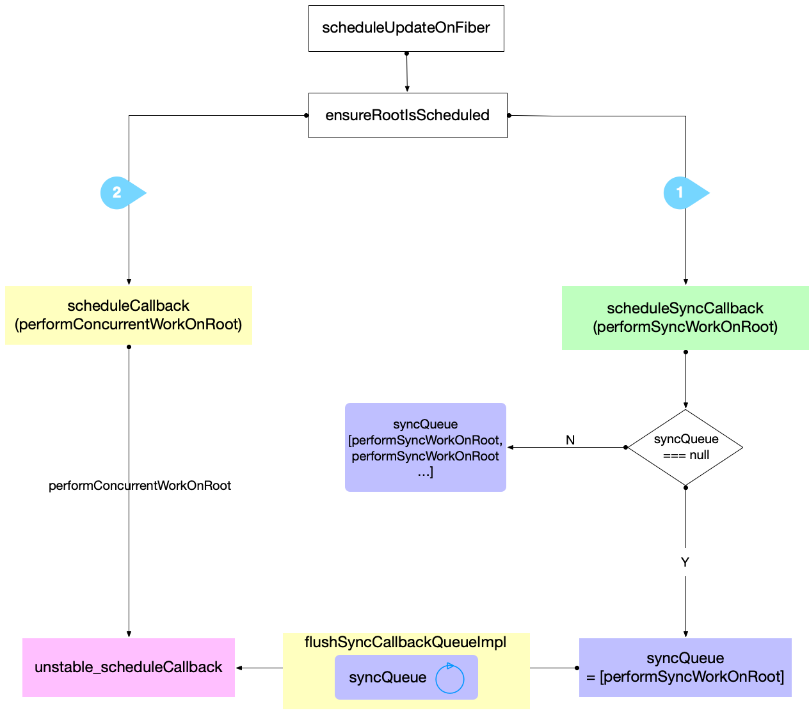
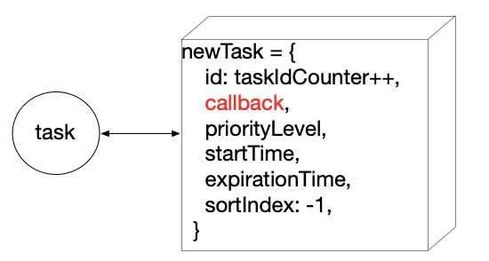
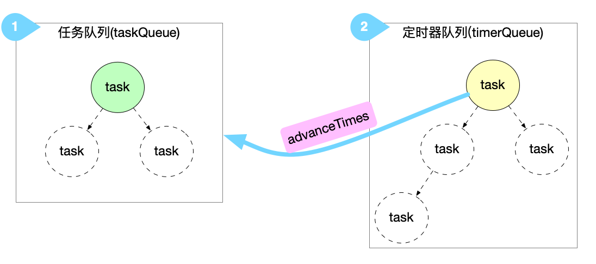
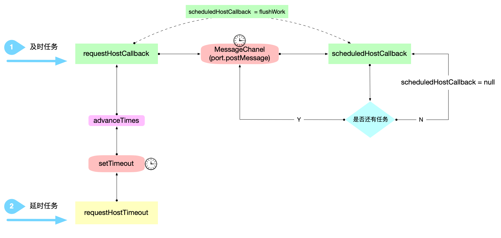
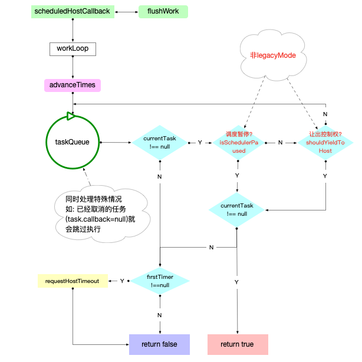

# React 调度机制

## 发起调度

1. 首次 render
   从[首次 render](./03-render-process.md#执行调度)的分析中知道, 是通过`scheduleUpdateOnFiber`执行首次 render.

2. 后续更新
   在[更新机制](./06-update-process.md#发起更新)有过讨论. 无论以哪种方式发起更新, 都会进入`scheduleUpdateOnFiber`函数.

> 无论是首次 render 还是后续更新, 都会调用`scheduleUpdateOnFiber`发起调度

### scheduleUpdateOnFiber

```js
export function scheduleUpdateOnFiber(
  fiber: Fiber,
  expirationTime: ExpirationTime,
) {
  const root = markUpdateTimeFromFiberToRoot(fiber, expirationTime);
  // onClick事件: currentPriorityLevel = UserBlockingPriority
  const priorityLevel = getCurrentPriorityLevel();

  if (expirationTime === Sync) {
    if (
      // Check if we're inside unbatchedUpdates
      (executionContext & LegacyUnbatchedContext) !== NoContext &&
      // Check if we're not already rendering
      (executionContext & (RenderContext | CommitContext)) === NoContext
    ) {
      // ... 第一次render
    } else {
      ensureRootIsScheduled(root);
      schedulePendingInteractions(root, expirationTime);
      if (executionContext === NoContext) {
        flushSyncCallbackQueue();
      }
    }
  } else {
    // Schedule a discrete update but only if it's not Sync.
    if (
      (executionContext & DiscreteEventContext) !== NoContext &&
      // Only updates at user-blocking priority or greater are considered
      // discrete, even inside a discrete event.
      (priorityLevel === UserBlockingPriority ||
        priorityLevel === ImmediatePriority)
    ) {
      // This is the result of a discrete event. Track the lowest priority
      // discrete update per root so we can flush them early, if needed.
      if (rootsWithPendingDiscreteUpdates === null) {
        rootsWithPendingDiscreteUpdates = new Map([[root, expirationTime]]);
      } else {
        const lastDiscreteTime = rootsWithPendingDiscreteUpdates.get(root);
        if (
          lastDiscreteTime === undefined ||
          lastDiscreteTime > expirationTime
        ) {
          rootsWithPendingDiscreteUpdates.set(root, expirationTime);
        }
      }
    }
    // Schedule other updates after in case the callback is sync.
    ensureRootIsScheduled(root);
    schedulePendingInteractions(root, expirationTime);
  }
}
```

`legacy`下[首次 render](./03-render-process.md#执行调度)会进入`performSyncWorkOnRoot`分支. 其它情况无论进入哪一个分支, 都会进入`ensureRootIsScheduled`.

## 调度确保

> 确保`FiberRoot`节点已经被调度

`ensureRootIsScheduled`

```js
// Use this function to schedule a task for a root. There's only one task per
// root; if a task was already scheduled, we'll check to make sure the
// expiration time of the existing task is the same as the expiration time of
// the next level that the root has work on. This function is called on every
// update, and right before exiting a task.
function ensureRootIsScheduled(root: FiberRoot) {
  const lastExpiredTime = root.lastExpiredTime;
  // 1. 如果有过期任务, 需要立即同步更新
  if (lastExpiredTime !== NoWork) {
    // Special case: Expired work should flush synchronously.
    root.callbackExpirationTime = Sync;
    root.callbackPriority_old = ImmediatePriority;
    root.callbackNode = scheduleSyncCallback(
      performSyncWorkOnRoot.bind(null, root),
    );
    return;
  }

  const expirationTime = getNextRootExpirationTimeToWorkOn(root);
  const existingCallbackNode = root.callbackNode;
  // 2. 没有新的任务, 退出调度
  if (expirationTime === NoWork) {
    // There's nothing to work on.
    if (existingCallbackNode !== null) {
      root.callbackNode = null;
      root.callbackExpirationTime = NoWork;
      root.callbackPriority_old = NoPriority;
    }
    return;
  }

  // TODO: If this is an update, we already read the current time. Pass the
  // time as an argument.
  const currentTime = requestCurrentTimeForUpdate();
  const priorityLevel = inferPriorityFromExpirationTime(
    currentTime,
    expirationTime,
  );

  // If there's an existing render task, confirm it has the correct priority and
  // expiration time. Otherwise, we'll cancel it and schedule a new one.
  if (existingCallbackNode !== null) {
    const existingCallbackPriority = root.callbackPriority_old;
    const existingCallbackExpirationTime = root.callbackExpirationTime;
    if (
      // Callback must have the exact same expiration time.
      existingCallbackExpirationTime === expirationTime &&
      // Callback must have greater or equal priority.
      existingCallbackPriority >= priorityLevel
    ) {
      // Existing callback is sufficient.
      return;
    }
    // Need to schedule a new task.
    // TODO: Instead of scheduling a new task, we should be able to change the
    // priority of the existing one.
    cancelCallback(existingCallbackNode);
  }

  root.callbackExpirationTime = expirationTime;
  root.callbackPriority_old = priorityLevel;

  let callbackNode;
  if (expirationTime === Sync) {
    // Sync React callbacks are scheduled on a special internal queue
    callbackNode = scheduleSyncCallback(performSyncWorkOnRoot.bind(null, root));
  } else if (disableSchedulerTimeoutBasedOnReactExpirationTime) {
    callbackNode = scheduleCallback(
      priorityLevel,
      performConcurrentWorkOnRoot.bind(null, root),
    );
  } else {
    callbackNode = scheduleCallback(
      priorityLevel,
      performConcurrentWorkOnRoot.bind(null, root),
      // Compute a task timeout based on the expiration time. This also affects
      // ordering because tasks are processed in timeout order.
      { timeout: expirationTimeToMs(expirationTime) - now() },
    );
  }

  root.callbackNode = callbackNode;
}
```

核心步骤:

1. 有过期任务, 把`fiberRoot.callbackNode`设置成同步回调

```js
root.callbackExpirationTime = Sync;
root.callbackPriority_old = ImmediatePriority;
root.callbackNode = scheduleSyncCallback(
  performSyncWorkOnRoot.bind(null, root),
);
```

2. 没有新的任务, 退出调度

3. 有历史任务(`fiberRoot.callbackNode !== null`)

   - 新旧任务的过期时间相等, 且旧任务的优先级 `>=` 新任务优先级, 则退出调度.(新任务会在旧任务执行完成之后的同步刷新钩子中执行)
   - 新旧任务的过期时间不同, 或者且旧任务的优先级 `<` 新任务优先级, 会取消旧任务.

4. 根据`expirationTime`调用不同的`scheduleCallback`, 最后将返回值设置到`fiberRoot.callbackNode`

### 创建调度

```js
if (expirationTime === Sync) {
  // Sync React callbacks are scheduled on a special internal queue
  callbackNode = scheduleSyncCallback(performSyncWorkOnRoot.bind(null, root));
} else if (disableSchedulerTimeoutBasedOnReactExpirationTime) {
  callbackNode = scheduleCallback(
    priorityLevel,
    performConcurrentWorkOnRoot.bind(null, root),
  );
} else {
  callbackNode = scheduleCallback(
    priorityLevel,
    performConcurrentWorkOnRoot.bind(null, root),
    // Compute a task timeout based on the expiration time. This also affects
    // ordering because tasks are processed in timeout order.
    { timeout: expirationTimeToMs(expirationTime) - now() },
  );
}
```

跟踪`scheduleSyncCallback`和`scheduleCallback`

```js
export function scheduleSyncCallback(callback: SchedulerCallback) {
  // Push this callback into an internal queue. We'll flush these either in
  // the next tick, or earlier if something calls `flushSyncCallbackQueue`.
  if (syncQueue === null) {
    syncQueue = [callback];
    // Flush the queue in the next tick, at the earliest.
    immediateQueueCallbackNode = Scheduler_scheduleCallback(
      Scheduler_ImmediatePriority,
      flushSyncCallbackQueueImpl,
    );
  } else {
    // Push onto existing queue. Don't need to schedule a callback because
    // we already scheduled one when we created the queue.
    syncQueue.push(callback);
  }
  return fakeCallbackNode;
}

export function scheduleCallback(
  reactPriorityLevel: ReactPriorityLevel,
  callback: SchedulerCallback,
  options: SchedulerCallbackOptions | void | null,
) {
  const priorityLevel = reactPriorityToSchedulerPriority(reactPriorityLevel);
  return Scheduler_scheduleCallback(priorityLevel, callback, options);
}
```

两个函数最终都调用了`Scheduler_scheduleCallback`

1. scheduleSyncCallback:

   - 把`callback`添加到`syncQueue`中
   - 如果还未发起调度, 会以`Scheduler_ImmediatePriority`执行调度`Scheduler_scheduleCallback`

2. scheduleCallback:
   - 推断当前调度的优先级(legacymode 下都是`ImmediatePriority`)
   - 执行调度`Scheduler_scheduleCallback`

附上流程图:



往下跟踪`Scheduler_scheduleCallback`来到`unstable_scheduleCallback`:

```js
/**
 * 1. 创建新的task
 * 2. 根据task.startTime和currentTime的比较
 * 3. 请求主线程回调, 或者主线程延时回调
 * @param {*} priorityLevel
 * @param {*} callback
 * @param {*} options
 */
function unstable_scheduleCallback(priorityLevel, callback, options) {
  var currentTime = getCurrentTime();

  var startTime;
  var timeout;
  if (typeof options === 'object' && options !== null) {
    var delay = options.delay;
    if (typeof delay === 'number' && delay > 0) {
      startTime = currentTime + delay;
    } else {
      startTime = currentTime;
    }
    timeout =
      typeof options.timeout === 'number'
        ? options.timeout
        : timeoutForPriorityLevel(priorityLevel);
  } else {
    timeout = timeoutForPriorityLevel(priorityLevel);
    startTime = currentTime;
  }

  var expirationTime = startTime + timeout;
  // 新建任务
  var newTask = {
    id: taskIdCounter++,
    callback,
    priorityLevel,
    startTime,
    expirationTime,
    sortIndex: -1,
  };
  if (enableProfiling) {
    newTask.isQueued = false;
  }

  if (startTime > currentTime) {
    // 延时任务
    // This is a delayed task.
    newTask.sortIndex = startTime;
    push(timerQueue, newTask);
    if (peek(taskQueue) === null && newTask === peek(timerQueue)) {
      // All tasks are delayed, and this is the task with the earliest delay.
      if (isHostTimeoutScheduled) {
        // Cancel an existing timeout.
        cancelHostTimeout();
      } else {
        isHostTimeoutScheduled = true;
      }
      // Schedule a timeout.
      requestHostTimeout(handleTimeout, startTime - currentTime);
    }
  } else {
    // 及时任务
    newTask.sortIndex = expirationTime;
    push(taskQueue, newTask);
    if (enableProfiling) {
      markTaskStart(newTask, currentTime);
      newTask.isQueued = true;
    }
    // Schedule a host callback, if needed. If we're already performing work,
    // wait until the next time we yield.
    if (!isHostCallbackScheduled && !isPerformingWork) {
      isHostCallbackScheduled = true;
      requestHostCallback(flushWork);
    }
  }

  return newTask;
}
```

核心步骤:

1. 新建`task`对象(基本属性如下图)
   - 将回调函数挂载到`task.callback`之上



2. 把`task`对象加入到一个队列中(注意: 这里的 2 个队列都是小顶堆数组, 保证优先级最高的任务排在最前面)
   - 如果是及时任务加入到`taskQueue`
   - 如果是延时任务加入到`timerQueue`
   - 只有`taskQueue`中的任务才会被调度执行
   - 通过`advanceTimers`函数可以把`timerQueue`中优先级足够的任务添加到`taskQueue`



3. 请求调度
   - 及时任务直接调用`requestHostCallback(flushWork)`
   - 定时器任务调用`requestHostTimeout`, 当定时器触发之后也会间接调用`requestHostCallback(flushWork)`
   - `requestHostCallback`通过`MessageChanel`的 api 添加一个宏任务,使得最终的回调`performWorkUntilDeadline`在下一个事件循环才会执行

在`schedulerHostConfig.default.js`有如下定义

```js
// 在超过deadline时执行任务
const performWorkUntilDeadline = () => {
  if (scheduledHostCallback !== null) {
    const currentTime = getCurrentTime();
    const hasTimeRemaining = true;
    try {
      // 执行回调, 返回是否还有更多的任务
      const hasMoreWork = scheduledHostCallback(hasTimeRemaining, currentTime);
      if (!hasMoreWork) {
        // 没有更多任务, 重置消息循环状态, 清空回调函数
        isMessageLoopRunning = false;
        scheduledHostCallback = null;
      } else {
        // 有多余的任务, 分离到下一次事件循环中再次调用performWorkUntilDeadline, 进行处理
        // If there's more work, schedule the next message event at the end
        // of the preceding one.
        port.postMessage(null);
      }
    } catch (error) {
      // If a scheduler task throws, exit the current browser task so the
      // error can be observed.
      port.postMessage(null);
      throw error;
    }
  } else {
    isMessageLoopRunning = false;
  }
  // Yielding to the browser will give it a chance to paint, so we can
  // reset this.
  needsPaint = false;
};

const channel = new MessageChannel();
const port = channel.port2;
channel.port1.onmessage = performWorkUntilDeadline;

// 请求主线程回调, 最快也要下一次事件循环才会调用callback, 所以必然是异步执行
requestHostCallback = function(callback) {
  scheduledHostCallback = callback;
  if (!isMessageLoopRunning) {
    isMessageLoopRunning = true;
    port.postMessage(null);
  }
};
```

调度循环的逻辑可以表示如下:



当执行完`scheduledHostCallback`之后, 会返回一个`boolean`值表示是否还有新的任务, 如果有新任务, 会再次执行`port.postMessage(null)`, 在下一次事件循环中继续执行回调(`flushWork`)

`scheduledHostCallback`即`flushWork`, `flushWork`核心调用`workLoop`

`flushWork`->`workLoop`

```js
/**
 * 工作循环
 * @param {boolean} hasTimeRemaining
 * @param {*} initialTime = currentTime
 */
function workLoop(hasTimeRemaining, initialTime) {
  let currentTime = initialTime;
  advanceTimers(currentTime);
  currentTask = peek(taskQueue);
  // 逐一执行taskQueue中的任务, 直到任务被暂停或全部清空
  while (
    currentTask !== null &&
    !(enableSchedulerDebugging && isSchedulerPaused) // 调度暂停判断
  ) {
    if (
      currentTask.expirationTime > currentTime &&
      (!hasTimeRemaining || shouldYieldToHost()) // 让出控制权判断
    ) {
      // 当前任务还未过期, 但是已经超过时间限制, 会退出执行
      // This currentTask hasn't expired, and we've reached the deadline.
      break;
    }
    const callback = currentTask.callback;
    if (callback !== null) {
      currentTask.callback = null;
      currentPriorityLevel = currentTask.priorityLevel;
      const didUserCallbackTimeout = currentTask.expirationTime <= currentTime;
      markTaskRun(currentTask, currentTime);
      // 执行callback
      const continuationCallback = callback(didUserCallbackTimeout);
      currentTime = getCurrentTime();
      if (typeof continuationCallback === 'function') {
        currentTask.callback = continuationCallback;
        markTaskYield(currentTask, currentTime);
      } else {
        if (enableProfiling) {
          markTaskCompleted(currentTask, currentTime);
          currentTask.isQueued = false;
        }
        if (currentTask === peek(taskQueue)) {
          pop(taskQueue);
        }
      }
      advanceTimers(currentTime);
    } else {
      pop(taskQueue);
    }
    currentTask = peek(taskQueue);
  }
  // Return whether there's additional work
  if (currentTask !== null) {
    return true;
  } else {
    const firstTimer = peek(timerQueue);
    if (firstTimer !== null) {
      requestHostTimeout(handleTimeout, firstTimer.startTime - currentTime);
    }
    return false;
  }
}
```

整个`scheduledHostCallback`回调的逻辑如下:



最后如果返回`false`退出调度, 如返回`true`,则回到`performWorkUntilDeadline`中准备下一次回调

注意: 其中用红色字体标记的逻辑判断`调度暂停(isSchedulerPaused)`和`让出控制权(shouldYieldToHost())`在`legacyMode`下都是不会成立的

## 总结

1. 调用`ensureRootIsScheduled`作为开启调度的入口
2. 根据规则准备执行调度

   1. 有过期任务, 执行同步调度(`scheduleSyncCallback`). 把返回值设置到`fiberRoot.callbackNode`
   2. 没有新的任务, 退出调度
   3. 有历史任务(`FiberRoot.callbackNode !== null`)
      - 新旧任务的过期时间相等, 且旧任务的优先级 `>=` 新任务优先级, 则退出调度.(新任务会在旧任务执行完成之后的同步刷新钩子中执行)
      - 新旧任务的过期时间不同, 或者且旧任务的优先级 `<` 新任务优先级, 会取消旧任务.
   4. 根据`expirationTime`执行不同的调度(`scheduleSyncCallback`或`scheduleCallback`), 最后将返回值设置到`fiberRoot.callbackNode`

3. 设置调度优先级和回调函数

   1. scheduleSyncCallback:

      - 把`performConcurrentWorkOnRoot`添加到`syncQueue`中
      - 如果还未发起调度, 设置当前调度的优先级`Scheduler_ImmediatePriority`
      - 发起调度`Scheduler_scheduleCallback`, 设置回调为`flushSyncCallbackQueueImpl`

   2. scheduleCallback:
      - 推断当前调度的优先级(legacymode 下都是`ImmediatePriority`)
      - 发起调度`Scheduler_scheduleCallback`, 设置回调为`performConcurrentWorkOnRoot`

4. 发起调度

   1. 新建`task`, 将 3 中的回调函数挂载到`task.callback`之上
      - 及时任务: 把`task`加入到`taskQueue`中
      - 延时任务: 把`task`加入到`timerQueue`中
   2. 请求调度
      1. 设置回调
         - 及时任务: 直接调用`requestHostCallback(flushWork)`, 设置回调为`flushWork`
         - 延时任务
           - 调用`requestHostTimeout(handleTimeout)`设置定时器回调
           - 定时器触发之后调用`requestHostCallback(flushWork)`, 设置回调为`flushWork`
         - `requestHostCallback`函数把`flushWork`设置为`scheduledHostCallback`
      2. 添加宏任务
         - `requestHostCallback`通过`MessageChanel`的 api 添加一个宏任务,使得最终的回调`performWorkUntilDeadline`在下一个事件循环才会执行

5. 执行调度

   1. 循环执行任务队列`taskQueue`中的任务
   2. 检测调度环境
      - 是否需要暂停
      - 是否需要把控制权让出给浏览器
   3. 退出循环
      - 检测当前任务是否已经执行完成(可能有暂停的任务)
      - 检测定时器队列`timerQueue`中是否有新的任务
      - 如后续还有任务, 返回`true`, 反之返回`false`

6. 结束调度
   - 判断`scheduledHostCallback`的返回值
   - 如为`true`. 会再次执行`port.postMessage`, 在下一次事件循环中继续执行回调(`flushWork`)
   - 如为`false`. 结束调度.
