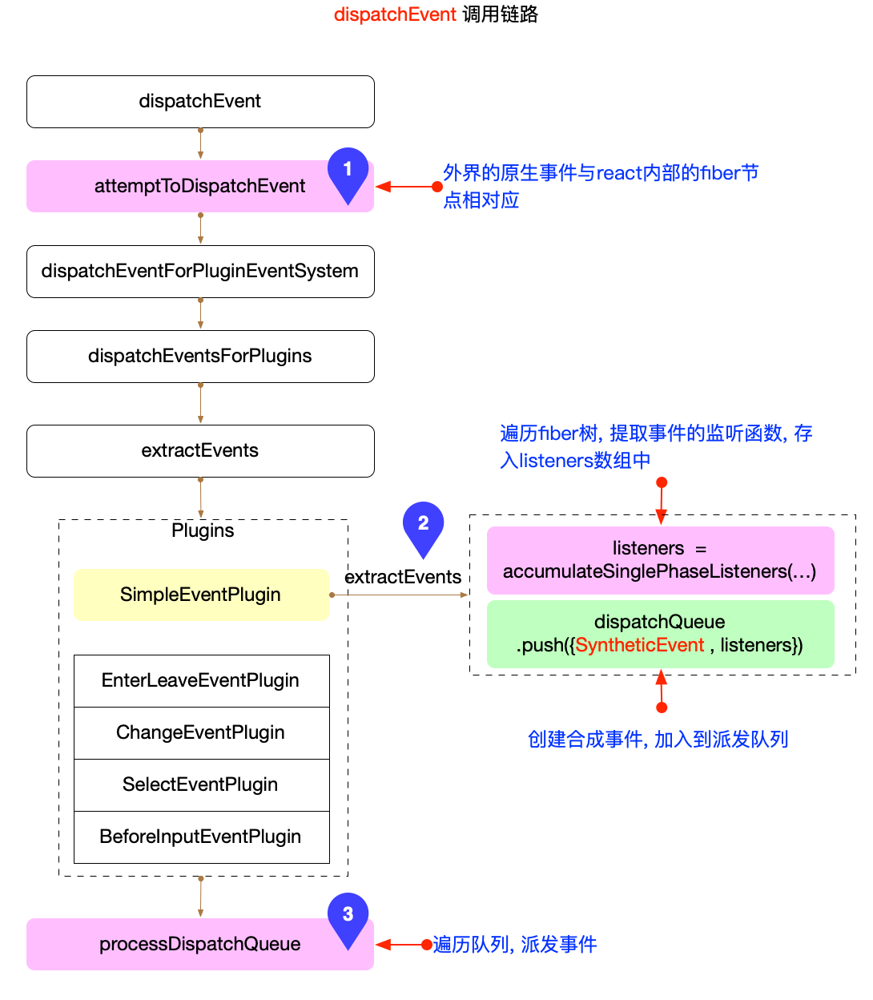

# React 合成事件

## 概览

从`v17.0.0`开始，React 不会再将事件处理添加到 `document` 上，而是将事件处理添加到渲染 React 树的根 DOM 容器中。

引入官方提供的图片：


图中清晰的展示了`v17.0.0`的改动，无论是在`document`还是`根 DOM 容器`上监听事件，都可以归为`事件委托(代理)`([mdn](https://developer.mozilla.org/zh-CN/docs/Learn/JavaScript/Building_blocks/Events)).

注意: `react`的事件体系, 不是全部都通过`事件委托`来实现的. 有一些[特殊情况](https://github.com/facebook/react/blob/v17.0.2/packages/react-dom/src/client/ReactDOMComponent.js#L530-L616), 是直接绑定到对应 DOM 元素上的(如:`scroll`, `load`), 它们都通过[listenToNonDelegatedEvent](https://github.com/facebook/react/blob/v17.0.2/packages/react-dom/src/events/DOMPluginEventSystem.js#L295-L314)函数进行绑定.

上述特殊事件最大的不同是监听的 DOM 元素不同，除此之外，其他地方的实现与正常事件大体一致。

本节讨论的是可以被`根 DOM 容器`代理的正常事件。

## 事件绑定

在前文[React 应用的启动过程](./bootstrap.md#create-global-obj)中介绍了`React`在启动时会创建全局对象，其中在创建[fiberRoot](./bootstrap.md#create-root-impl)对象时，调用[createRootImpl](https://github.com/facebook/react/blob/v17.0.2/packages/react-dom/src/client/ReactDOMRoot.js#L120-L169):

```js
function createRootImpl(
  container: Container,
  tag: RootTag,
  options: void | RootOptions,
) {
  // ... 省略无关代码
  if (enableEagerRootListeners) {
    const rootContainerElement =
      container.nodeType === COMMENT_NODE ? container.parentNode : container;
    listenToAllSupportedEvents(rootContainerElement);
  }
  // ... 省略无关代码
}
```

[listenToAllSupportedEvents](https://github.com/facebook/react/blob/v17.0.2/packages/react-dom/src/events/DOMPluginEventSystem.js#L316-L349)函数, 实际上完成了事件代理:

```js
// ... 省略无关代码
export function listenToAllSupportedEvents(rootContainerElement: EventTarget) {
  if (enableEagerRootListeners) {
    // 1. 节流优化，保证全局注册只被调用一次
    if ((rootContainerElement: any)[listeningMarker]) {
      return;
    }
    (rootContainerElement: any)[listeningMarker] = true;
    // 2. 遍历 allNativeEvents 监听冒泡和捕获阶段的事件
    allNativeEvents.forEach(domEventName => {
      if (!nonDelegatedEvents.has(domEventName)) {
        listenToNativeEvent(
          domEventName,
          false, // 冒泡阶段监听
          ((rootContainerElement: any): Element),
          null,
        );
      }
      listenToNativeEvent(
        domEventName,
        true, // 捕获阶段监听
        ((rootContainerElement: any): Element),
        null,
      );
    });
  }
}
```

核心逻辑：

1. 节流优化，保证全局注册只被调用一次。
2. 遍历`allNativeEvents`, 调用`listenToNativeEvent`监听冒泡和捕获阶段的事件。
   - `allNativeEvents`包括了大量的原生事件名称，它是在`DOMPluginEventSystem.js`中[被初始化](https://github.com/facebook/react/blob/v17.0.2/packages/react-dom/src/events/DOMPluginEventSystem.js#L89-L93)

[listenToNativeEvent](https://github.com/facebook/react/blob/v17.0.2/packages/react-dom/src/events/DOMPluginEventSystem.js#L351-L412):

```js
// ... 省略无关代码
export function listenToNativeEvent(
  domEventName: DOMEventName,
  isCapturePhaseListener: boolean,
  rootContainerElement: EventTarget,
  targetElement: Element | null,
  eventSystemFlags?: EventSystemFlags = 0,
): void {
  let target = rootContainerElement;

  const listenerSet = getEventListenerSet(target);
  const listenerSetKey = getListenerSetKey(
    domEventName,
    isCapturePhaseListener,
  );
  // 利用 set 数据结构，保证相同的事件类型只会被注册一次。
  if (!listenerSet.has(listenerSetKey)) {
    if (isCapturePhaseListener) {
      eventSystemFlags |= IS_CAPTURE_PHASE;
    }
    // 注册事件监听
    addTrappedEventListener(
      target,
      domEventName,
      eventSystemFlags,
      isCapturePhaseListener,
    );
    listenerSet.add(listenerSetKey);
  }
}
```

[addTrappedEventListener](https://github.com/facebook/react/blob/v17.0.2/packages/react-dom/src/events/DOMPluginEventSystem.js#L468-L560):

```js
// ... 省略无关代码
function addTrappedEventListener(
  targetContainer: EventTarget,
  domEventName: DOMEventName,
  eventSystemFlags: EventSystemFlags,
  isCapturePhaseListener: boolean,
  isDeferredListenerForLegacyFBSupport?: boolean,
) {
  // 1. 构造 listener
  let listener = createEventListenerWrapperWithPriority(
    targetContainer,
    domEventName,
    eventSystemFlags,
  );
  let unsubscribeListener;
  // 2. 注册事件监听
  if (isCapturePhaseListener) {
    unsubscribeListener = addEventCaptureListener(
      targetContainer,
      domEventName,
      listener,
    );
  } else {
    unsubscribeListener = addEventBubbleListener(
      targetContainer,
      domEventName,
      listener,
    );
  }
}

// 注册原生事件 冒泡
export function addEventBubbleListener(
  target: EventTarget,
  eventType: string,
  listener: Function,
): Function {
  target.addEventListener(eventType, listener, false);
  return listener;
}

// 注册原生事件 捕获
export function addEventCaptureListener(
  target: EventTarget,
  eventType: string,
  listener: Function,
): Function {
  target.addEventListener(eventType, listener, true);
  return listener;
}
```

从`listenToAllSupportedEvents`开始，调用链路比较长，最后调用`addEventBubbleListener`和`addEventCaptureListener`监听了原生事件。

### 原生 listener

在注册原生事件的过程中，需要重点关注一下监听函数，即`listener`函数。它实现了把原生事件派发到`react`体系之内，非常关键。

> 比如点击 DOM 触发原生事件，原生事件最后会被派发到`react`内部的`onClick`函数。`listener`函数就是这个`由外至内`的关键环节。

`listener`是通过`createEventListenerWrapperWithPriority`函数产生：

```js
export function createEventListenerWrapperWithPriority(
  targetContainer: EventTarget,
  domEventName: DOMEventName,
  eventSystemFlags: EventSystemFlags,
): Function {
  // 1. 根据优先级设置 listenerWrapper
  const eventPriority = getEventPriorityForPluginSystem(domEventName);
  let listenerWrapper;
  switch (eventPriority) {
    case DiscreteEvent:
      listenerWrapper = dispatchDiscreteEvent;
      break;
    case UserBlockingEvent:
      listenerWrapper = dispatchUserBlockingUpdate;
      break;
    case ContinuousEvent:
    default:
      listenerWrapper = dispatchEvent;
      break;
  }
  // 2. 返回 listenerWrapper
  return listenerWrapper.bind(
    null,
    domEventName,
    eventSystemFlags,
    targetContainer,
  );
}
```

可以看到，不同的`domEventName`调用`getEventPriorityForPluginSystem`后返回不同的优先级，最终会有 3 种情况：

1. `DiscreteEvent`: 优先级最高, 包括`click, keyDown, input`等事件, [源码](https://github.com/facebook/react/blob/v17.0.2/packages/react-dom/src/events/DOMEventProperties.js#L45-L80)
   - 对应的`listener`是[dispatchDiscreteEvent](https://github.com/facebook/react/blob/v17.0.2/packages/react-dom/src/events/ReactDOMEventListener.js#L121-L142)
2. `UserBlockingEvent`: 优先级适中，包括`drag, scroll`等事件，[源码](https://github.com/facebook/react/blob/v17.0.2/packages/react-dom/src/events/DOMEventProperties.js#L100-L116)
   - 对应的`listener`是[dispatchUserBlockingUpdate](https://github.com/facebook/react/blob/v17.0.2/packages/react-dom/src/events/ReactDOMEventListener.js#L144-L180)
3. `ContinuousEvent`: 优先级最低，包括`animation, load`等事件，[源码](https://github.com/facebook/react/blob/v17.0.2/packages/react-dom/src/events/DOMEventProperties.js#L119-L145)
   - 对应的`listener`是[dispatchEvent](https://github.com/facebook/react/blob/v17.0.2/packages/react-dom/src/events/ReactDOMEventListener.js#L182-L271)

这 3 种`listener`实际上都是对[dispatchEvent](https://github.com/facebook/react/blob/v17.0.2/packages/react-dom/src/events/ReactDOMEventListener.js#L182-L271)的包装：

```js
// ...省略无关代码
export function dispatchEvent(
  domEventName: DOMEventName,
  eventSystemFlags: EventSystemFlags,
  targetContainer: EventTarget,
  nativeEvent: AnyNativeEvent,
): void {
  if (!_enabled) {
    return;
  }
  const blockedOn = attemptToDispatchEvent(
    domEventName,
    eventSystemFlags,
    targetContainer,
    nativeEvent,
  );
}
```

## 事件触发

当原生事件触发之后，首先会进入到`dispatchEvent`这个回调函数。而`dispatchEvent`函数是`react`事件体系中最关键的函数，其调用链路较长，核心步骤如图所示：



重点关注其中 3 个核心环节：

1. `attemptToDispatchEvent`
2. `SimpleEventPlugin.extractEvents`
3. `processDispatchQueue`

### 关联 fiber

[attemptToDispatchEvent](https://github.com/facebook/react/blob/v17.0.2/packages/react-dom/src/events/ReactDOMEventListener.js#L274-L331)把原生事件和`fiber树`关联起来。

```js
export function attemptToDispatchEvent(
  domEventName: DOMEventName,
  eventSystemFlags: EventSystemFlags,
  targetContainer: EventTarget,
  nativeEvent: AnyNativeEvent,
): null | Container | SuspenseInstance {
  // ...省略无关代码

  // 1. 定位原生 DOM 节点
  const nativeEventTarget = getEventTarget(nativeEvent);
  // 2. 获取与 DOM 节点对应的 fiber 节点
  let targetInst = getClosestInstanceFromNode(nativeEventTarget);
  // 3. 通过插件系统，派发事件
  dispatchEventForPluginEventSystem(
    domEventName,
    eventSystemFlags,
    nativeEvent,
    targetInst,
    targetContainer,
  );
  return null;
}
```

核心逻辑：

1. 定位原生 DOM 节点：调用`getEventTarget`
2. 获取与 DOM 节点对应的 fiber 节点：调用`getClosestInstanceFromNode`
3. 通过插件系统，派发事件：调用 `dispatchEventForPluginEventSystem`

### 收集 fiber 上的 listener

`dispatchEvent`函数的调用链路中，通过不同的插件，处理不同的事件。其中最常见的事件都会由`SimpleEventPlugin.extractEvents`进行处理：

```js
function extractEvents(
  dispatchQueue: DispatchQueue,
  domEventName: DOMEventName,
  targetInst: null | Fiber,
  nativeEvent: AnyNativeEvent,
  nativeEventTarget: null | EventTarget,
  eventSystemFlags: EventSystemFlags,
  targetContainer: EventTarget,
): void {
  const reactName = topLevelEventsToReactNames.get(domEventName);
  if (reactName === undefined) {
    return;
  }
  let SyntheticEventCtor = SyntheticEvent;
  let reactEventType: string = domEventName;

  const inCapturePhase = (eventSystemFlags & IS_CAPTURE_PHASE) !== 0;
  const accumulateTargetOnly = !inCapturePhase && domEventName === 'scroll';
  // 1. 收集所有监听该事件的函数。
  const listeners = accumulateSinglePhaseListeners(
    targetInst,
    reactName,
    nativeEvent.type,
    inCapturePhase,
    accumulateTargetOnly,
  );
  if (listeners.length > 0) {
    // 2. 构造合成事件，添加到派发队列
    const event = new SyntheticEventCtor(
      reactName,
      reactEventType,
      null,
      nativeEvent,
      nativeEventTarget,
    );
    dispatchQueue.push({ event, listeners });
  }
}
```

核心逻辑：

1. 收集所有`listener`回调

   - 这里的是`fiber.memoizedProps.onClick/onClickCapture`等绑定在`fiber`节点上的回调函数
   - 具体逻辑在[accumulateSinglePhaseListeners](https://github.com/facebook/react/blob/v17.0.2/packages/react-dom/src/events/DOMPluginEventSystem.js#L712-L803):

     ```js
     export function accumulateSinglePhaseListeners(
       targetFiber: Fiber | null,
       reactName: string | null,
       nativeEventType: string,
       inCapturePhase: boolean,
       accumulateTargetOnly: boolean,
     ): Array<DispatchListener> {
       const captureName = reactName !== null ? reactName + 'Capture' : null;
       const reactEventName = inCapturePhase ? captureName : reactName;
       const listeners: Array<DispatchListener> = [];

       let instance = targetFiber;
       let lastHostComponent = null;

       // 从 targetFiber 开始，向上遍历，直到 root 为止
       while (instance !== null) {
         const { stateNode, tag } = instance;
         // 当节点类型是 HostComponent 时 (如：div, span, button 等类型)
         if (tag === HostComponent && stateNode !== null) {
           lastHostComponent = stateNode;
           if (reactEventName !== null) {
             // 获取标准的监听函数 (如 onClick , onClickCapture 等)
             const listener = getListener(instance, reactEventName);
             if (listener != null) {
               listeners.push(
                 createDispatchListener(instance, listener, lastHostComponent),
               );
             }
           }
         }
         // 如果只收集目标节点，则不用向上遍历，直接退出
         if (accumulateTargetOnly) {
           break;
         }
         instance = instance.return;
       }
       return listeners;
     }
     ```

2. 构造合成事件 (`SyntheticEvent`), 添加到派发队列 (`dispatchQueue`)

### 构造合成事件

[SyntheticEvent](https://github.com/facebook/react/blob/v17.0.2/packages/react-dom/src/events/SyntheticEvent.js#L152), 是`react`内部创建的一个对象, 是原生事件的跨浏览器包装器, 拥有和浏览器原生事件相同的接口(`stopPropagation`,`preventDefault`), 抹平不同浏览器 api 的差异, 兼容性好.

具体的构造过程并不复杂，可以直接[查看源码](https://github.com/facebook/react/blob/v17.0.2/packages/react-dom/src/events/SyntheticEvent.js#L28-L136).

此处我们需要知道，在`Plugin.extractEvents`过程中，遍历`fiber树`找到`listener`之后，就会创建`SyntheticEvent`, 加入到`dispatchQueue`中，等待派发。

### 执行派发

`extractEvents`完成之后, 逻辑来到[processDispatchQueue](https://github.com/facebook/react/blob/v17.0.2/packages/react-dom/src/events/DOMPluginEventSystem.js#L260-L272), 终于要真正执行派发了.

```js
export function processDispatchQueue(
  dispatchQueue: DispatchQueue,
  eventSystemFlags: EventSystemFlags,
): void {
  const inCapturePhase = (eventSystemFlags & IS_CAPTURE_PHASE) !== 0;
  for (let i = 0; i < dispatchQueue.length; i++) {
    const { event, listeners } = dispatchQueue[i];
    processDispatchQueueItemsInOrder(event, listeners, inCapturePhase);
  }
  // ...省略无关代码
}

function processDispatchQueueItemsInOrder(
  event: ReactSyntheticEvent,
  dispatchListeners: Array<DispatchListener>,
  inCapturePhase: boolean,
): void {
  let previousInstance;
  if (inCapturePhase) {
    // 1. capture 事件：倒序遍历 listeners
    for (let i = dispatchListeners.length - 1; i >= 0; i--) {
      const { instance, currentTarget, listener } = dispatchListeners[i];
      if (instance !== previousInstance && event.isPropagationStopped()) {
        return;
      }
      executeDispatch(event, listener, currentTarget);
      previousInstance = instance;
    }
  } else {
    // 2. bubble 事件：顺序遍历 listeners
    for (let i = 0; i < dispatchListeners.length; i++) {
      const { instance, currentTarget, listener } = dispatchListeners[i];
      if (instance !== previousInstance && event.isPropagationStopped()) {
        return;
      }
      executeDispatch(event, listener, currentTarget);
      previousInstance = instance;
    }
  }
}
```

在[processDispatchQueueItemsInOrder](https://github.com/facebook/react/blob/v17.0.2/packages/react-dom/src/events/DOMPluginEventSystem.js#L233-L258)遍历`dispatchListeners`数组, 执行[executeDispatch](https://github.com/facebook/react/blob/v17.0.2/packages/react-dom/src/events/DOMPluginEventSystem.js#L222-L231)派发事件, 在`fiber`节点上绑定的`listener`函数被执行.

在`processDispatchQueueItemsInOrder`函数中，根据`捕获(capture)`或`冒泡(bubble)`的不同，采取了不同的遍历方式：

1. `capture`事件: `从上至下`调用`fiber树`中绑定的回调函数, 所以`倒序`遍历`dispatchListeners`.
2. `bubble`事件: `从下至上`调用`fiber树`中绑定的回调函数, 所以`顺序`遍历`dispatchListeners`.

## 总结

从架构上来讲, [SyntheticEvent](https://github.com/facebook/react/blob/v17.0.2/packages/react-dom/src/events/SyntheticEvent.js#L152)打通了从外部`原生事件`到内部`fiber树`的交互渠道, 使得`react`能够感知到浏览器提供的`原生事件`, 进而做出不同的响应, 修改`fiber树`, 变更视图等.

从实现上讲，主要分为 3 步：

1. 监听原生事件：对齐`DOM元素`和`fiber元素`
2. 收集`listeners`: 遍历`fiber树`, 收集所有监听本事件的`listener`函数。
3. 派发合成事件：构造合成事件，遍历`listeners`进行派发。
