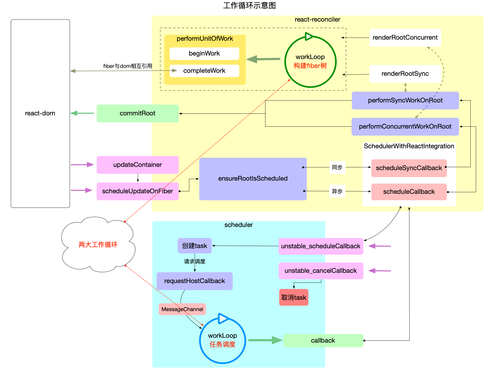

# React 工作循环 (workLoop)

在前文([React 应用的宏观包结构](./macro-structure.md))中, 介绍了`react`核心包之间的依赖和调用关系, 并绘制出了概览图. 在概览图中, 可以看到有两个大的循环, 它们分别位于`scheduler`和`react-reconciler`包中:

本文将这两个循环分别表述为`任务调度循环`和`fiber构造循环`. 接下来从宏观角度阐述这两大循环的作用, 以及它们之间的区别和联系. 更深入的源码分析分别在`scheduler 调度机制`和`fiber 树构造`章节中详细解读.

1. `任务调度循环`

源码位于[`Scheduler.js`](https://github.com/facebook/react/blob/v17.0.2/packages/scheduler/src/Scheduler.js), 它是`react`应用得以运行的保证, 它需要循环调用, 控制所有任务(`task`)的调度.

2. `fiber构造循环`

源码位于[`ReactFiberWorkLoop.js`](https://github.com/facebook/react/blob/v17.0.2/packages/react-reconciler/src/ReactFiberWorkLoop.old.js), 控制 fiber 树的构造, 整个过程是一个[深度优先遍历](../algorithm/dfs.md).

这两个循环对应的 js 源码不同于其他闭包(运行时就是闭包), 其中定义的全局变量, 不仅是该作用域的私有变量, 更用于`控制react应用的执行过程`.

## 区别与联系

1. 区别

   - `任务调度循环`是以`二叉堆`为数据结构(详见[react 算法之堆排序](../algorithm/heapsort.md)), 循环执行`堆`的顶点, 直到`堆`被清空.
   - `任务调度循环`的逻辑偏向宏观, 它调度的是每一个任务(`task`), 而不关心这个任务具体是干什么的(甚至可以将`Scheduler`包脱离`react`使用), 具体任务其实就是执行回调函数`performSyncWorkOnRoot`或`performConcurrentWorkOnRoot`.
   - `fiber构造循环`是以`树`为数据结构, 从上至下执行深度优先遍历(详见[react 算法之深度优先遍历](../algorithm/dfs.md)).
   - `fiber构造循环`的逻辑偏向具体实现, 它只是任务(`task`)的一部分(如`performSyncWorkOnRoot`包括: `fiber`树的构造, `DOM`渲染, 调度检测), 只负责`fiber`树的构造.

2. 联系
   - `fiber构造循环`是`任务调度循环`中的任务(`task`)的一部分. 它们是从属关系, 每个任务都会重新构造一个`fiber`树.

## 主干逻辑

通过上文的描述, 两大循环的分工可以总结为: 大循环(任务调度循环)负责调度`task`, 小循环(fiber 构造循环)负责实现`task` .

react 运行的主干逻辑, 即将`输入转换为输出`的核心步骤, 实际上就是围绕这两大工作循环进行展开.

结合上文的宏观概览图(展示核心包之间的调用关系), 可以将 react 运行的主干逻辑进行概括:

1. 输入: 将每一次更新(如: 新增, 删除, 修改节点之后)视为一次`更新需求`(目的是要更新`DOM`节点).
2. 注册调度任务: `react-reconciler`收到`更新需求`之后, 并不会立即构造`fiber树`, 而是去调度中心`scheduler`注册一个新任务`task`, 即把`更新需求`转换成一个`task`.
3. 执行调度任务(输出): 调度中心`scheduler`通过`任务调度循环`来执行`task`(`task`的执行过程又回到了`react-reconciler`包中).
   - `fiber构造循环`是`task`的实现环节之一, 循环完成之后会构造出最新的 fiber 树.
   - `commitRoot`是`task`的实现环节之二, 把最新的 fiber 树最终渲染到页面上, `task`完成.

主干逻辑就是`输入到输出`这一条链路, 为了更好的性能(如`批量更新`, `可中断渲染`等功能), `react`在输入到输出的链路上做了很多优化策略, 比如本文讲述的`任务调度循环`和`fiber构造循环`相互配合就可以实现`可中断渲染`.

## 总结

本节从宏观角度描述了`react`源码中的两大工作循环. 通过这两个大循环概括出`react`运行的主干逻辑. `react-reconciler`和`Scheduler`包代码量多且逻辑复杂, 但实际上大部分都是服务于这个主干. 了解这两大循环, 更容易理解`react`的整体运行链路.
